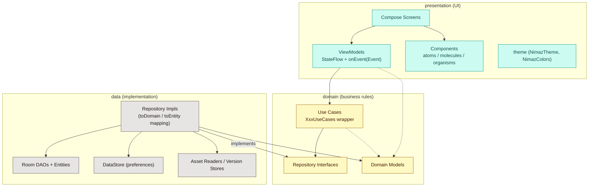
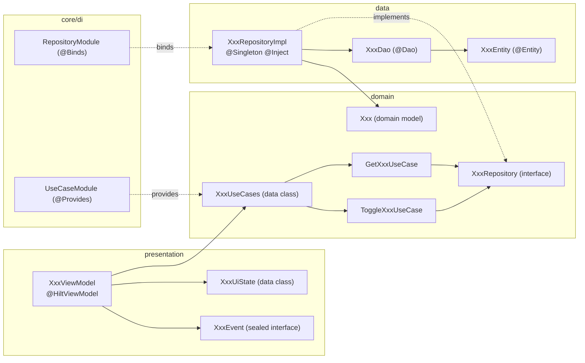
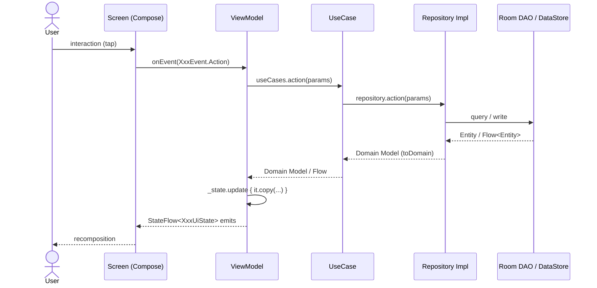
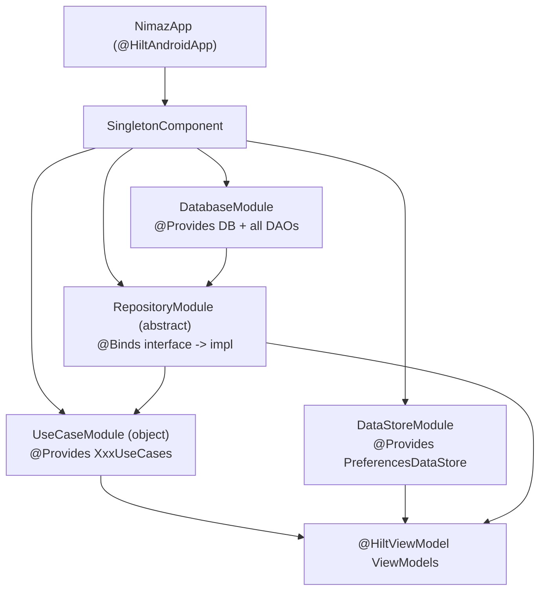

# Nimaz — Architecture Guide

> **Owns:** how the app is *structured* — the layer patterns (`presentation → domain → data`),
> MVVM/UDF conventions, DI, the navigation and theming patterns, the design system, the
> new-feature recipe, and the tech-debt registry (§9).
> **Update when:** you change or add a layer pattern, a DI convention, a navigation or theming
> rule, a design-system component contract — or when you resolve or introduce a deviation (§9).
> **Verified by:** review only — no mechanical check. The *consequences* of these patterns are
> checked by `scripts/check_docs.py` (routes, subsystems) and by
> [`CLEAN_ARCHITECTURE_CHECKLIST.md`](CLEAN_ARCHITECTURE_CHECKLIST.md)'s detection commands.
> **Related:** [`NAVIGATION.md`](NAVIGATION.md) owns the route graph itself,
> [`SUBSYSTEMS.md`](SUBSYSTEMS.md) owns the runtime machinery,
> [`DOCUMENTATION.md`](DOCUMENTATION.md) owns the update contract.

**This is the source of truth for how Nimaz is structured.** Follow the canonical patterns
described here so new code stays consistent and the architecture does not drift. When you add a
feature, copy an existing feature that follows these patterns (good references are called out
below) — do **not** invent a new shape.

App package root: `com.arshadshah.nimaz`
Source root: `app/src/main/java/com/arshadshah/nimaz/`

---

## Contents

0. [Golden rules (read first)](#0-golden-rules-read-first)
1. [High-level architecture](#1-high-level-architecture)
2. [Package structure](#2-package-structure)
3. [Anatomy of a feature (vertical slice)](#3-anatomy-of-a-feature-vertical-slice)
4. [Layer patterns & conventions](#4-layer-patterns--conventions)
5. [Unidirectional data flow (end-to-end)](#5-unidirectional-data-flow-end-to-end)
6. [Dependency injection (Hilt)](#6-dependency-injection-hilt)
7. [Navigation](#7-navigation)
8. [Theming & components](#8-theming--components)
9. [Known deviations & tech-debt registry](#9-known-deviations--tech-debt-registry)
10. [Recipe — add a new feature end-to-end](#10-recipe--add-a-new-feature-end-to-end)
11. [Build & verify](#11-build--verify)

---

## 0. Golden rules (read first)

These are the rules most often broken. Keep this checklist in mind for every change.

1. **Dependencies point inward.** `presentation → domain → data`. The **domain layer must
   never import from `data`** (no Room `*Entity`, no DAO, no DataStore). The presentation
   layer must not import Room entities or DAOs.
2. **ViewModels talk to use cases, not repositories or DAOs.** Inject `XxxUseCases`, not
   `XxxRepository` and never a `XxxDao`.
3. **One `StateFlow<XxxUiState>` per logical sub-screen, plus a single `onEvent(event)`.**
   UI state is an immutable `data class`; UI intents are a `sealed interface XxxEvent`.
   Do **not** expose `MutableStateFlow`, `LiveData`, or `mutableStateOf` from a ViewModel.
4. **Repositories return domain models, never entities.** Map at the data layer with
   `Entity.toDomain()` / `Model.toEntity()`.
5. **DI lives in `core/di`.** Bind interfaces with `@Binds`, construct wrappers with
   `@Provides`, scope app-wide singletons with `@Singleton` in `SingletonComponent`.
6. **Navigation is type-safe.** Add a `@Serializable` entry to `Route` and a matching
   `composable<Route.X>` in `NavGraph`. No raw route strings.
7. **No hardcoded colors/typography in screens.** Use `MaterialTheme.colorScheme.*` or
   `NimazColors.*`. Reuse `presentation/components` (atoms/molecules/organisms) instead of
   re-rolling generic UI. Icons are Material glyphs via `NimazIcon` — no emoji.
   - **Buttons are `NimazButton` (`components/atoms/NimazButton.kt`), never a `Text`/`Box`/
     `Surface` + `Modifier.clickable`.** Pick the emphasis with `variant` (`FILLED`/`TONAL`/
     `OUTLINED`/`TEXT`/`DESTRUCTIVE`) and `size`; icon-only actions use `NimazIconButton`.
   - **A whole card is made tappable with `NimazCard(onClick = …)`, never `Modifier.clickable`
     wrapped around the card** — the latter paints a sharp-cornered ripple that ignores the card's
     radius (see §8, the `NimazCard` bullet). `NimazMenuItem` is the ready-made clickable list row.
   - **Rows in a `NimazMenuGroup` are separated with `NimazMenuDivider()`, never a hand-measured
     `NimazDivider`** (`inset = false` between blocks that carry no icon column), and **every
     arrow/chevron comes from `NimazIcons`** — `Forward` for "this row opens something", never a
     per-call-site pick between `ArrowForward`, `ChevronRight` and `KeyboardArrowRight`. Both in §8.
   > **Exception (Location screen only):** country flags on the Location screen
   > (`LocationScreen`, curated cities in `LocationCatalog.kt`) are rendered as emoji.
   > This is the single sanctioned emoji use in the app; no other emoji are permitted.
8. **Verify before you finish.** `./gradlew :app:compileDebugKotlin` must pass (this runs
   KSP, so it validates Hilt + Room wiring too).

> **Testing:** unit/Robolectric tests live in `app/src/test{,Debug}`; the on-device
> instrumented suite (Hilt graph, Room, WorkManager, NavGraph flows) lives in
> `app/src/androidTest` and is documented in **[`docs/TESTING.md`](TESTING.md)**.

---

## 1. High-level architecture

Nimaz is an **offline-first** Android app built with **Kotlin + Jetpack Compose**,
following **Clean Architecture** with **MVVM + UDF** (unidirectional data flow).



**Why these layers exist:**

| Layer | Module | Responsibility | May depend on |
|-------|--------|----------------|---------------|
| `presentation` | `:app` | Render state, capture user intent | `domain` |
| `domain` | **`:core:domain`** | Business rules, contracts, pure models | nothing (Kotlin + coroutines only) |
| `data` | `:app` | Implement contracts, talk to Room/DataStore/assets | `domain` |

Since #556 the middle row is a **compile error** rather than a convention: `domain` lives in its
own `kotlin-jvm` module, so it cannot import `data` or `presentation` even by accident. The other
two rows are still convention, and move into modules over the rest of #551.

### Tech stack (authoritative versions live in `gradle/libs.versions.toml`)

Kotlin · Jetpack Compose (Material 3) · Hilt (DI) · Room (DB) · DataStore (prefs) ·
Navigation Compose (type-safe) · Coroutines/Flow · Media3 (audio) · Glance (widgets) ·
WorkManager (background) · Adhan2 (prayer times). Single-activity, Compose-only UI.

---

## 2. Package structure

The package tree is one thing; the **module** tree is another, and since #556 they no longer
match. `domain/` lives in `:core:domain`, everything below is still `:app`, and the rest of the
tree moves out over #551. A Gradle module boundary is not a package boundary — package names are
unchanged by a move, so the imports read the same either side of it.

```text
core/domain/src/main/kotlin/           #  ← :core:domain — pure JVM, no Android on the classpath
com.arshadshah.nimaz/
└── domain/
    ├── model/               # Domain models (e.g. QuranModels.kt, TasbihModels.kt)
    ├── repository/          # Repository INTERFACES (one per feature) + the Android-facing ports
    │                        #   (WidgetRefresher, CompassSensors, PrayerAlarmScheduler)
    ├── usecase/             # XxxUseCases.kt (wrapper data class + individual use cases)
    ├── search/              # ArabicSearchNormaliser — the folding the shipped index was built with
    ├── time/                # TodayProvider — "what day is it", fakeable
    ├── calendar/            # HijriDateCalculator
    ├── worship/             # NextWorshipResolver, WorshipReminderCalculator
    └── prayer/              # PrayerTimeCalculator (adhan2)
```

Those last four packages were `core/util` and `core/time`. They moved because **domain imports
them**, and anything domain imports has to be inside `:core:domain` or below it — parking them in
`:core:common` would have reversed the arrow.

```text
core/common/src/main/kotlin/           #  ← :core:common — an Android library, below :core:ui
com.arshadshah.nimaz/
└── core/
    ├── common/              # Formatting with no feature attached: CountdownFormatting,
    │                        #   DateTimeExtensions, TimeFormatting, NumberFormatUtils,
    │                        #   ThematicMarkup, LocaleHelper, PrayerClock
    ├── monitoring/          # Telemetry + the Firebase wrappers behind it
    └── text/                # StringProvider — a string without a Context
```

**`R` is not one class any more.** `android.nonTransitiveRClass=true` means a module's `R` holds
only its *own* resources, so once `strings.xml` moved to `:core:ui` (PR 10) the application's
`com.arshadshah.nimaz.R` stopped having `R.string.*` in it. Presentation code — in `:app` and in
`:core:ui` alike — imports **`com.arshadshah.nimaz.core.ui.R`**. What is left in `:app`'s own `R`
is the widget and notification surface: `res/xml/` (manifest-referenced app config and the six
widget-provider descriptors), `res/drawable/` and `res/layout/` (widget icons and previews, the
notification icon), `res/mipmap-*/` (launcher icons), `values/themes.xml` (it references the
splash-screen theme and the launcher foreground, so it is app startup identity, not design system)
and `values/widget_colors.xml`. Ten files need **both** and alias the application's as `AppR` —
every widget, plus `AdhanDownloadService`, `PrayerNotificationScheduler`, `AboutScreen` and
`MoreMenuScreen`.

**Nothing in `:core:common` may reference `R`.** It sits *below* `:core:ui`, which owns every
resource including the whole of `strings.xml`, so there is no app `R` on its classpath to
reference — with `nonTransitiveRClass=true` its own `R` is `…core.common.R` and nothing else is
visible. That is why `StringProvider` exists: a ViewModel that must *compare* resolved strings
(search, sorting) gets them through the seam rather than through a `Context`. This constrains
every module below `:core:ui`, not just this one.

What is left in `app/…/core/util/` is there deliberately, not by omission. Files whose real home is
a module that does not exist yet: the prayer notification files → `:feature:prayer`,
`NotificationDiagnostics` → `:feature:settings`. (`TajweedParser` was listed here for `:core:ui`
and went to **`:feature:quran`** instead — every one of its consumers is a Quran surface, and a
parser only that feature calls does not belong in the design system. `TafseerPdfExporter` went to
`:feature:quran` as predicted.) (`FlowExtensions` was listed here for `:core:data`; it went to `:core:common`
instead — `mapItems` is a generic `Flow` extension that knows nothing about data, and a module
below `:core:data` can want it.) `BootReceiver`,
`PrayerRescheduler`, `InAppUpdateManager` and `core/init` stay in `:app` permanently — a manifest
entry point and a composition root are app concerns.

```text
core/data/src/main/kotlin/             #  ← :core:data — the only module that sees both stores
com.arshadshah.nimaz/
└── data/
    ├── repository/          # Eighteen XxxRepositoryImpl — the domain interfaces, implemented
    ├── local/help/          # Help content reader + its content-version store
    ├── ai/                  # Ask-with-Proof client, dto/, IntegrityTokenProvider
    ├── announcement/        # AnnouncementRepositoryImpl (the FCM service stays in :app)
    ├── device/              # Device capability lookups behind domain ports
    ├── text/                # StringProvider's Android implementation
    ├── platform/            # AndroidAppLocale
    └── widget/              # WidgetSettingsWatcher — preference changes → WidgetRefresher
```

`IntegrityTokenProvider` is the shape to copy when a moved class wants `BuildConfig`. A library's
`BuildConfig` carries only its **own** fields, never the application's, so the two reads it made
(`PLAY_INTEGRITY_CLOUD_PROJECT_NUMBER` and `DEBUG`) could not follow it here. Rather than
duplicating the fields into this module's build file, the class takes them as constructor
parameters and `AiModule` in `:app` — which does have the app's `BuildConfig` — passes them in.
Inverting the read costs one `@Provides` and keeps the module free of app identity.

```text
app/src/main/java/                     #  ← :app — everything else, for now
com.arshadshah.nimaz/
├── NimazApp.kt              # @HiltAndroidApp, WorkManager config, AppInitializer
├── MainActivity.kt          # @AndroidEntryPoint, single activity, setContent { NimazTheme { NavGraph() } }
│
├── core/
│   ├── di/                  # Hilt modules — THE place for DI
│   │   ├── DatabaseModule.kt        # @Provides DB + every DAO
│   │   ├── DataStoreModule.kt       # @Provides PreferencesDataStore
│   │   └── RepositoryModule.kt      # @Binds repos  +  object UseCaseModule { @Provides XxxUseCases }
│   ├── navigation/          # Routes.kt (sealed Route), NavGraph.kt, deep links
│   ├── util/                # Extensions, date utils, PDF exporters
│   ├── feedback/            # In-app feedback capture
│   ├── share/               # ContentShareManager + Shareable/Shareables + branded ShareCardRenderer
│   └── init/                # AppInitializer
│
├── data/                    # What could not leave — see :core:data above for the rest
│   ├── audio/               # Media3 audio managers/services (Quran, Adhan, Qaida)
│   ├── sync/                # Nearby-connections device-to-device sync
│   ├── announcement/        # NimazMessagingService — a manifest entry point
│   ├── repository/          # LibraryRepositoryImpl only — R.raw.aboutlibraries is generated
│   │                        #   from the APPLYING project's classpath, so it must build here
│   ├── platform/            # ServiceAdhanDownloader — split out of AndroidAppLocale
│   └── widget/              # WorkManagerWidgetRefresher — the WorkManager side of the port
│
├── presentation/
│   ├── screens/<feature>/   # Composable screens grouped by feature
│   ├── viewmodel/<feature>/ # {XxxViewModel, XxxUiState, XxxEvent}.kt per feature
│   │                        #   quran/ prayer/ tracker/ worship/ calendar/
│   │                        #   settings/ help/ content/ search/ ai/
│   │                        #   location/ home/ onboarding/ tools/
│   ├── components/
│   │   ├── atoms/           # Smallest reusable UI (NimazCard, NimazBadge, ArabicText…)
│   │   ├── molecules/       # Composed (PrayerTimeCard, NimazDialog, NimazCalendar…)
│   │   └── organisms/       # Complex (TopAppBar, MushafPage, HomeHero…)
│   └── theme/               # NimazTheme, Palette.kt (NimazPalette) → Color.kt (NimazColors), Type, Shape
│
└── widget/                  # Glance home-screen widgets (nextprayer, prayertracker, hijridate)
```

> **Note on the older `docs/nimaz-pro-technical-foundation.md`:** that document uses an
> aspirational package `com.nimazpro.app`. The **real** package is `com.arshadshah.nimaz`.
> This guide reflects the code as it actually exists.

---

## 3. Anatomy of a feature (vertical slice)

Every feature is a vertical slice through the three layers. This is the shape to copy.



**Reference features to copy from:** `AsmaUlHusna`, `Prophet`, `Khatam`, `Quran`
(these go all the way through the use-case layer correctly).

---

## 4. Layer patterns & conventions

### 4.1 Presentation — ViewModels (MVVM + UDF)

Canonical reference: `presentation/viewmodel/help/HelpViewModel.kt` — a feature-sized
ViewModel in the sub-package layout, with one exhaustive `onEvent`, `Telemetry` injected, and
`catchAndReport` applied inside its `flatMapLatest` rather than outside it.

**A feature gets its own sub-package, holding three files:**

```
viewmodel/help/
  HelpViewModel.kt     # the class, and nothing else
  HelpUiState.kt       # every XxxUiState the feature exposes
  HelpEvent.kt         # the sealed XxxEvent hierarchy
```

The layer was one flat package of 32 files, each carrying its own states, events and enums —
`SettingsViewModel.kt` opened with 7 UiStates, 4 enums and a 102-line event hierarchy before
its class started at line 313, and `QuranTopicsViewModel.kt` was 39% type declarations. Both
the sub-package and the split are where the code goes, not optional tidiness.

The types stay in the **same package** as the ViewModel, so splitting them costs no imports —
which is exactly why there is no excuse for a 1,400-line file that opens with 200 lines of
`data class`.

**What does *not* belong there: anything a screen, component or widget also imports.** A type
in `viewmodel/<feature>/` is that feature's business. `PrayerTimeDisplay` lived in
`HomeViewModel.kt` and was imported by eight files — including `PrayerTimesViewModel`, which
reached into an unrelated feature's ViewModel for a type it renders. Shared display models go
to **`presentation/model/`**; anything that is a fact about the content rather than about how
it is drawn (`UnifiedBookmark`, `UnifiedSearchResult`, `DayPrayerTimes`, the city catalogue)
goes to **`domain/model/`**. `widget/` and `components/` must import from neither
`viewmodel/` — that is a layering leak, and it is currently at zero:

```bash
grep -rn "import com.arshadshah.nimaz.presentation.viewmodel" \
  app/src/main/java/com/arshadshah/nimaz/{widget,presentation/components}/   # expect none
```

Rules:
- Lives in `presentation/viewmodel/<feature>/`, with its `XxxUiState`s in `XxxUiState.kt` and
  its `XxxEvent` in `XxxEvent.kt` beside it. Pick the existing sub-package the feature belongs
  to; add one only for a genuinely new area.
- Annotated `@HiltViewModel`, constructor injection only.
- Inject the feature's **`XxxUseCases`** wrapper (not a repository, never a DAO).
- Expose immutable state as `StateFlow<XxxUiState>` via `asStateFlow()`. A ViewModel
  **may** expose more than one `StateFlow` when a feature has genuinely distinct
  sub-screens (e.g. a list state and a detail state) — that is the established house
  style. Keep each one an immutable `data class`.
- Mutate with `_state.update { it.copy(...) }`.
- All UI intents flow through a single `fun onEvent(event: XxxEvent)` that `when`-dispatches
  to private functions. `XxxEvent` is a `sealed interface`.

```kotlin
data class XxxUiState(
    val items: List<Xxx> = emptyList(),
    val isLoading: Boolean = true,
    val error: String? = null,
)

sealed interface XxxEvent {
    data class Select(val id: Int) : XxxEvent
    data object Refresh : XxxEvent
}

@HiltViewModel
class XxxViewModel @Inject constructor(
    private val xxxUseCases: XxxUseCases,
) : ViewModel() {

    private val _state = MutableStateFlow(XxxUiState())
    val state: StateFlow<XxxUiState> = _state.asStateFlow()

    init { observe() }

    fun onEvent(event: XxxEvent) = when (event) {
        is XxxEvent.Select -> select(event.id)
        XxxEvent.Refresh   -> refresh()
    }

    private fun observe() = viewModelScope.launch {
        xxxUseCases.getAll().collect { items ->
            _state.update { it.copy(items = items, isLoading = false) }
        }
    }
    // ...
}
```

#### One `when (event)` per `onEvent` — never two

`onEvent` used to be written as **two** consecutive `when (event)` blocks over the same sealed
hierarchy: the first logging analytics and ending in `else -> {}`, the second dispatching. The
`else` means the compiler only checks exhaustiveness on the *behaviour* table, so **every event
added afterwards ships with working behaviour and no telemetry, silently**. That was the measured
state of 20 of 31 ViewModels — `SettingsViewModel`'s `else` dropped 63 of its 78 events, `Zakat`
logged 3 of 24, `Tasbih` 5 of 23.

Put the analytics call **inside the branch that owns it**, in one exhaustive table:

```kotlin
fun onEvent(event: XxxEvent) = when (event) {
    is XxxEvent.Select -> {
        telemetry.featureUsed(AppAnalytics.Feature.XXX, AppAnalytics.Action.OPEN_DETAIL)
        select(event.id)
    }
    XxxEvent.Refresh -> refresh()          // deliberately not logged, and visibly so
}
```

A new event then **fails to compile** until someone decides whether it is logged — which is the
whole regression test, and cheaper than any runtime one. It also lets the log be conditional:
`QuranTopicsViewModel` logs a load only when it actually loads, and `HomeViewModel` now logs a
prayer toggle only past its Sunrise guard — before, it counted taps that toggled nothing.

A branch that deliberately does nothing gets an explicit empty body with a comment, never an
`else`.

#### A read-only ViewModel may have no `onEvent`

`TafseerChaptersViewModel` is `combine(...).launchIn` and nothing else — its screen has no
intents to send. That is sanctioned for a genuinely read-only surface, and it is the reason the
file has no analytics seam: there is no event to hang one on. If such a screen later gains a
single tappable thing, it gains an `XxxEvent` at the same time rather than a bare public method.

Screens collect with `collectAsStateWithLifecycle()` and call `viewModel.onEvent(...)`.

#### Cancellation: one handle per identity of the request

A `viewModelScope.launch { roomFlow.collect { … } }` **needs a `Job` you cancel** whenever the
function can run more than once — per navigation, per keystroke, per swipe. A Room flow never
completes, so an un-cancelled collector lives as long as the ViewModel, and Room re-emits to
*every* live collector when the table changes: an earlier request can land after a later one and
replace what is on screen.

Scope the handle to the **identity of the request**, not to the function:

| shape | handle |
|---|---|
| one thing on screen at a time (a chapter, an ayah, a query) | one `Job` per surface |
| several legitimately live at once (the Quran pager's neighbouring pages) | a `Map<key, Job>` |
| two functions writing the *same* state (`loadCategory` / `loadDuasByOccasion`) | they **share** one handle |
| a lifetime observer started once from `init` | no handle needed |

Clearing a query counts as a change of request: cancel there too, or the last collector's next
emission repopulates the results the user just cleared. See AP-7.1b in
[`CLEAN_ARCHITECTURE_CHECKLIST.md`](CLEAN_ARCHITECTURE_CHECKLIST.md).

**A one-shot suspend read is the same hazard.** It is easy to read the rule above as being about
`collect`, but nothing in it depends on the flow: two `launch`es that `await` a query and then
write the same state race exactly as two collectors do, and the slower one wins. That is how
`PrayerTrackerViewModel.loadStats` shipped — a period switch racing a stats read left week
numbers under a MONTH chip. Cancellation alone does not close it, either: a coroutine cancelled
after its **last** suspension point still runs to the end of the block, so the write needs a
guard as well as a handle.

```kotlin
statsJob?.cancel()
statsJob = launchSafely(telemetry, DOMAIN, "load_stats", …) {
    val stats = useCases.getStats(startEpoch, endEpoch)   // last suspension point
    if (_state.value.period != period) return@launchSafely // …so check before writing
    _state.update { it.copy(stats = stats) }
}
```

**Prefer removing the trigger to guarding the race.** A number derived from a Room table does not
need re-reading after a write to that table — subscribe to it instead, and Room re-emits. Calling
a loader imperatively after every write is what puts the second read in flight in the first
place, and it also freezes the value when the write comes from *another* screen.

#### Derived state is computed on the UI-state class, never stored

A filtered list, a resolved language, a total — anything that is a pure function of other state
— is a computed `val` on the `XxxUiState`:

```kotlin
data class TasbihPresetsUiState(
    val defaultPresets: List<TasbihPreset> = emptyList(),
    val customPresets: List<TasbihPreset> = emptyList(),
    val selectedCategory: TasbihCategory? = null,
) {
    val filteredPresets: List<TasbihPreset>
        get() = (defaultPresets + customPresets)
            .let { all -> selectedCategory?.let { c -> all.filter { it.category == c } } ?: all }
}
```

Stored, it has to be refreshed at every site that touches an input, and the sites that forget do
not fail loudly — they leave a filter that is on beside a list that ignores it. Both instances
the sweep found (tasbih categories, hadith chapter search) were exactly that. See AP-9.

**A subtitle that reports state is a pure function, not a `when` inside a composable.**
`presentation/screens/SubtitleSpec.kt` declares the shared contract — a `@StringRes`/`@PluralsRes`
id, typed args (`SubtitleArg.Count`/`Text`/`Resource`), and a nullable `quantity` — plus the one
`@Composable SubtitleSpec?.resolve()` that renders it. Each screen's mapper is an `object` of pure
functions from state to `SubtitleSpec?`: `NotificationHubSubtitles`, `MoreSubtitles`,
`FastingSubtitles`.

Three properties make it worth the indirection:

- **A wrong row is catchable off-device.** Once a subtitle asserts something ("4 of 5 logged
  today"), it can be false, and a screenshot review will not notice. A pure mapper is a JVM test.
- **`null` means the row renders no subtitle at all** — not a dash, not a spinner, not a zero. It
  covers both "has not loaded" and "nothing true to say", which must look identical, because a dash
  reads as a value and a spinner makes a static menu look busy.
- **`quantity` is non-null exactly when `res` is a `plurals`.** `resolve()` switches on it, and
  getting it wrong throws at render time in a locale the author may not read — so the mappers'
  tests assert the invariant rather than trusting call sites. Counts always go through `plurals`;
  Turkish and Malay do not pluralise like English.

Args are a sealed type rather than `List<Any>` because a subtitle can interpolate a *string
resource* (a worship reminder's own translated name), and an `Int` in an untyped arg list is
indistinguishable from a count — a bug that only surfaces as a resource id rendered where a name
belongs.

### 4.2 Domain — use cases

Canonical reference: `domain/usecase/AsmaUlHusnaUseCases.kt`.

- **One file per feature**, named `XxxUseCases.kt`. It contains:
  - a `data class XxxUseCases(...)` wrapper grouping the feature's use cases, and
  - one small class per operation, each `@Inject constructor(private val repository: XxxRepository)`
    with an `operator fun invoke(...)` that delegates to the repository.
- Use cases hold **business logic** (orchestration, filtering, combining). Trivial
  pass-throughs are fine and expected — the wrapper gives the ViewModel a single,
  testable dependency and keeps the repository surface out of the UI.

```kotlin
data class XxxUseCases(
    val getAll: GetAllXxxUseCase,
    val toggleFavorite: ToggleXxxFavoriteUseCase,
)

class GetAllXxxUseCase @Inject constructor(private val repo: XxxRepository) {
    operator fun invoke(): Flow<List<Xxx>> = repo.getAll()
}
```

### 4.3 Domain — repository interfaces & models

- `domain/repository/XxxRepository.kt` is a **pure Kotlin interface** that exposes only
  **domain models** and primitives. It must not import anything from `data` (no `*Entity`,
  no DAO). _(See the Zakat deviation in §9 for the one place this is currently violated.)_
- `domain/model/XxxModels.kt` holds immutable domain models (and enums/value types). These
  are what flows up to the UI.

### 4.4 Data — repository implementations & mapping

Canonical reference: `data/repository/TasbihRepositoryImpl.kt`.

- `XxxRepositoryImpl` is `@Singleton`, `@Inject constructor(private val dao: XxxDao)` (and/or
  DataStore / asset readers), and `: XxxRepository`.
- **Mapping is the impl's job.** Convert with private extension functions
  `XxxEntity.toDomain()` and `Xxx.toEntity()`. For flows of lists use the shared
  `core/util` helper `mapItems { it.toDomain() }`.

```kotlin
@Singleton
class XxxRepositoryImpl @Inject constructor(
    private val dao: XxxDao,
) : XxxRepository {
    override fun getAll(): Flow<List<Xxx>> = dao.getAll().mapItems { it.toDomain() }
    override suspend fun insert(item: Xxx): Long = dao.insert(item.toEntity())
}

private fun XxxEntity.toDomain() = Xxx(/* ... */)
private fun Xxx.toEntity() = XxxEntity(/* ... */)
```

### 4.5 Data — Room

- Single database `NimazDatabase` (`data/local/database/`, in `:core:database`), shipped **pre-populated** from
  `app/src/main/assets/database/nimaz_prepopulated.db` via `.createFromAsset(...)`.
- Entities in `entity/`, DAOs in `dao/`. **Schema changes require a migration** added to the
  `addMigrations(...)` chain in `DatabaseModule` and a bump of the single `NIMAZ_DATABASE_VERSION`
  constant (in `NimazDatabase.kt`, which drives both `@Database(version)` and `SCHEMA_VERSION`).
  Never ship a schema change without a migration (the app relies on the prepackaged DB).

---

## 5. Unidirectional data flow (end-to-end)



State flows **down** (immutable `UiState`), events flow **up** (`onEvent`). The UI is a
pure function of state.

---

## 6. Dependency injection (Hilt)



Conventions:
- **All modules live in `core/di`** and install into `SingletonComponent` with `@Singleton`.
- **`@Binds`** (in the `abstract class RepositoryModule`) for interface→impl bindings.
- **`@Provides`** (in the `object UseCaseModule` at the bottom of `RepositoryModule.kt`) to
  construct each `XxxUseCases` wrapper from its repository.
- Individual use cases use `@Inject constructor`, so they need no module entry — only the
  wrapper is `@Provides`.
- DAOs are provided one-per-method from the single `NimazDatabase` instance in `DatabaseModule`.

**Adding a use-case wrapper:** add a `provideXxxUseCases(repository: XxxRepository): XxxUseCases`
function to `UseCaseModule`, mirroring `provideAsmaUlHusnaUseCases`.

### 6.1 Monitoring — inject `Telemetry`, do not call the objects

`AppAnalytics` and `CrashReporter` are Kotlin `object`s holding a static `Context`. They no-op
safely when Firebase is absent, so they never *blocked* testing — but a test could never assert
that an action had been logged, and two live defects survived exactly that gap (a drop-off funnel
that has never fired, and a `logFeatureUsed` call on a branch no screen can reach).

**ViewModels and use cases inject `Telemetry`** (`core/monitoring/Telemetry.kt`, in `:core:common`), bound to
`FirebaseTelemetry` in `MonitoringModule`. Tests inject `RecordingTelemetry` and assert on its
`calls`.

```kotlin
@HiltViewModel
class ExampleViewModel @Inject constructor(
    private val exampleUseCases: ExampleUseCases,
    private val telemetry: Telemetry,
) : ViewModel()
```

Device feedback follows the same rule: `CounterFeedback` (`core/feedback/`) is the seam for the
tick a counter makes, so a ViewModel never holds a `Vibrator` or a `ToneGenerator`. Before it
existed, `TasbihViewModel.increment()` — the most-used action in the feature — could not run in a
JVM test at all, which is why its double-tap race shipped.

Report every failure through **`telemetry.failure(domain, type, throwable)`**, which reaches both
channels — the stack trace to Crashlytics, the frequency to analytics — and ignores
`CancellationException`, because a load cancelled by navigating away is not a failure. Calling
`AppAnalytics.*` or `CrashReporter.*` directly from a ViewModel is a deviation; the objects remain
only as the production binding and for callers with no injection point (`NimazApp`, `BootReceiver`,
workers).

#### Analytics values come from the catalog, never a string literal

`AppAnalytics` names its *events* and *parameters* in `object Event` and `object Param`. It did
not name the **values** — the feature, action, domain and setting each call site passes — and
about 120 of those were typed by hand across the ViewModel layer with no compiler check. The
drift that produced was measurable, not hypothetical: `"khatam"` beside `"khatam_save"` split one
feature's dashboards, `"prayer_times"` beside `"monthly_prayer_times"` split one screen family's,
and one prayer state arrived in `Param.STATUS` under four spellings.

Use `AppAnalytics.Feature.*` and `AppAnalytics.Action.*`:

```kotlin
telemetry.featureUsed(AppAnalytics.Feature.QURAN, AppAnalytics.Action.OPEN_DETAIL)
telemetry.failure(AppAnalytics.Feature.HADITH, "load_chapter", throwable)
```

Two rules the drift teaches:

- **A feature is a product area, not a screen.** A month view of the prayer timetable is
  `Feature.PRAYER_TIMES` with a month-shaped *action*, not a feature of its own — otherwise its
  usage never appears in the feature's funnel.
- **The `type`/`action` dimension must be bounded.** Passing `e.javaClass.simpleName` makes it
  unbounded, so those failures group with nothing and cannot be counted. The exception class
  belongs in the Crashlytics report, where cardinality is the point.

Adding a feature means adding a constant, in the same commit as the call site.

#### "Today" comes from `TodayProvider`, never `LocalDate.now()`

`LocalDate.now()` was called directly at **39 sites across 12 ViewModels**, always at `init`
or collection time, and nothing re-evaluated it. There was no seam to fake in a test and no
notion of "the day changed" anywhere in the layer, so a whole family of defects shipped
together — a Room query bound to a fixed day range forever, a "daily" hadith frozen at the
day it loaded, a month grid built at 23:59 still highlighting yesterday.

Inject **`TodayProvider`** (`domain/time/TodayProvider.kt`, in `:core:domain`) and use whichever half fits:

```kotlin
todayProvider.today()                       // what day is it — fakeable
todayProvider.todayChanges.collect { … }    // …and tell me when that changes
```

`todayChanges` emits immediately and again at each local midnight, so re-arming everything
scoped to today is an ordinary flow collection rather than a check each feature has to
remember to write. Tests use `FakeTodayProvider`, whose `now` a test can move to roll the
date over without waiting for one. The backing `java.time.Clock` is provided by `TimeModule`.

Anything scoped to a day takes the date as a **parameter** rather than reading the clock
inside itself — see `domain/usecase/calendar/`, where the grid builders take `today` — so the
same call can be re-issued for the new day.

#### A persisted preference is read from the repository, never off the UI state

A `UiState` field that mirrors a preference is a **cache of it, not the value**. It holds a
compiled-in default until the settings collector's first emission lands, and that emission is
disk-bound — so on a cold open it generally arrives *after* the screen has already asked for
content.

`QuranViewModel` read `_readerState.value.selectedTranslatorId` as the argument to its surah,
juz, page and search queries. Every user whose translation was not `sahih_international` — the
default declared on the state class — got **English first**, then a second full-surah query when
the real preference arrived. A flash and a wasted read on every reader open. Resolve it where it
lives, inside the load:

```kotlin
private suspend fun translatorId(): String = settingsRepository.quranTranslatorId.first()
```

**And then guard the settings collector's first emission**, because it is hydration, not a
change. Comparing it against the state's defaults reports a change that never happened, and the
"invalidate and reload" branch that hangs off that comparison then re-issues a load which already
used the right values. Worse for anything positional: a Mushaf edition change repaginates the
Quran, so a phantom change repaginated a page number *from* an edition the reader was never on.

The same reasoning rules out `stateIn(scope, Eagerly, <empty>)` on a flow that is only collected:
the seed publishes an empty result — with `isLoading = false` — before the database has answered,
which the screen renders as its empty state. Collect the flow.

#### CPU-bound work goes on the injected `@DefaultDispatcher`

`viewModelScope.launch` is `Dispatchers.Main`. `CalendarViewModel.navigateToYear` did ~365
Hijri conversions plus a filter per day there. Inject
`@DefaultDispatcher CoroutineDispatcher` (`core/di/TimeModule.kt`) and `withContext` it —
injected rather than `Dispatchers.Default` directly, because a test that substitutes its own
scheduler stays deterministic, and one that does not has nothing for `advanceUntilIdle()` to
wait on.

#### A throwable's `message` is a diagnostic, never UI copy

`_state.copy(error = e.message)` is the shortest thing to write and it puts SQLite's own words on
the user's screen: `DuaCategoryScreen` rendered `state.error` directly, so a fault in the content
database surfaced as `SQLiteException: no such table: duas` — in English, whatever the app's
language.

User-facing error text is a **string resource id** on the UI state, resolved by the screen:

```kotlin
data class XxxUiState(
    val isLoading: Boolean = true,
    @StringRes val error: Int? = null,
)
// screen: Text(stringResource(state.error ?: R.string.error_generic))
```

The throwable still goes to `telemetry.failure(...)`, which is the one place its wording earns
its keep. An `error` field that no screen renders is worse than none — see the several this epic
found written and never read — so add the field and the rendering together.

---

## 7. Navigation

Reference: `core/navigation/Routes.kt` and `core/navigation/NavGraph.kt`.

- Routes are a `@Serializable` `sealed interface Route`. `data object` for argument-less
  destinations, `data class` for ones with typed args (e.g.
  `data class QuranReader(val surahNumber: Int, val ayahNumber: Int = 1)`).
- Each route is wired with `composable<Route.X> { backStackEntry -> ... }`; typed args are
  read with `backStackEntry.toRoute<Route.X>()`.
- Bottom navigation is the `BottomNavDestination` enum (Home, Quran, Tasbih, Qibla, More).
- **Not every `Route` is a full-screen destination.** Some features are tabs/sections inside
  a parent screen. Example: **makeup fasts is a tab inside `FastTrackerScreen`** (driven by
  `FastingEvent.LoadMakeupFasts`), *not* a standalone screen — so `Route.MakeupFasts` is not
  wired in `NavGraph`. Validate how a feature is actually surfaced before adding/removing a
  route. (See §9.)

**Adding a screen:** add the `@Serializable` `Route` entry, add a `composable<Route.X>` in
`NavGraph`, create the screen under `presentation/screens/<feature>/`, and navigate via the
typed route object.

---

## 8. Theming & components

### 8.0 Accessibility — the obligation

Three rules, and they are obligations rather than suggestions: the app shipped **373
`contentDescription`s and zero `heading()` and zero `stateDescription`** before this section
existed, which is the difference between being *operable* with a screen reader and being
*usable* with one.

1. **A section title is a heading.** `Modifier.semantics { heading() }` is what lets TalkBack's
   heading navigation jump between sections instead of making the user swipe through every
   element in order. Declare it **on the component, not at the call site** — `NimazSectionTitle`,
   `NimazSectionHeader`, `PrayerTimesSectionHeader` and the shared top app bar already do, which
   covers 72 call sites and every screen title. A new section-heading component must do the same.
2. **A toggle says what its state means.** `Role.Checkbox` announces "checked" / "not checked",
   which is true and useless — "Fajr, prayed" is the sentence a user needs. Pass
   `stateDescription` (`NimazCheckbox` takes one) whenever the state stands for something in the
   domain rather than for a bare boolean. It is a `stringResource`, always: this text is read
   aloud, so it is translated like any other.
3. **A container that holds text is bounded by `heightIn(min = …)`, not `height(…)`.** Android 14+
   scales fonts to 200% and a fixed-height row clips its second line silently. This matters more
   here than in most apps: the Amiri and Nastaliq faces have taller line boxes than Latin ones at
   the same nominal size. A fixed `height` is still right for things that are not text — an icon
   box, a divider, a fixed-ratio piece of art.

`AccessibilityChecks.enable()` runs on every instrumented UI test (`BaseAppTest`), so a control
with no label and a touch target under 48dp fail the lane we already run. It cannot see rules 1–3
— nothing automatic can — which is why they are written down here.


- **Colors — every literal lives in the `theme/` package, never in a component/screen:**
    - **Tier 1 — `presentation/theme/Palette.kt` (`NimazPalette`):** the source of the brand/semantic
      hues. Hue ramps named `Family + shade` (e.g. `Teal500`, `Stone900`, `Amber500`). Don't
      reference `NimazPalette.*` from screens — it carries no meaning.
    - **Tier 2 — `presentation/theme/Color.kt` (`NimazColors`):** semantic tokens that *reference*
      the palette (primary teal, gold accent, per-prayer colors, semantic statuses, tajweed
      colors, feature sub-objects like `PrayerColors`/`StatusColors`/`QuranColors`/…). Screens read
      these.
    - **Bespoke art sets** (single-use decorative palettes) also live in `theme/`, not in the
      component: `SkyColors` (prayer sky scene), `BeadColors` (tasbih bead materials),
      `GlassColors` (glass-morphism auroras), and `ArtColors.kt` (`CardArtColors`,
      `CompassArtColors`, `NamesArtColors`, `OnboardingArtColors`, `MiscArtColors`, …). They
      reuse `NimazPalette` where a hue already exists.
  - Use `MaterialTheme.colorScheme.*` for themed surfaces, or `NimazColors.*` for brand/semantic
    values. **Never** write a `Color(0xFF…)` literal in a component or screen file — define it in
    the `theme/` package (a `NimazPalette`/`NimazColors` token, or the relevant art object) and
    reference the name. The only permitted `Color(0x…)` calls outside `theme/` are *computed* ARGB
    from runtime values (e.g. `Color(0xFF000000 or rgbLong)`), not static literals.
- **Tajweed rule colours & contrast (issue #294).** `NimazColors.TajweedColors` holds a
  light + dark tone for each of the 24 v3 tajweed rules (consumed by `TajweedParser`; the rule
  order/colour/code live in `TajweedParser.rules`, the single source of truth for the legend,
  while the localized display name + explanation resolve from `R.string.tajweed_rule_<code>_*`
  via `tajweedRuleName`/`tajweedRuleExplanation`, translated into the 5 shipped locales — #294).
  Every colour is held to **≥ 4.5:1 WCAG contrast** against the reader background it renders on
  (`#FAFAFA` light / `#1C1917` dark). `scripts/check_tajweed_contrast.py` reads the hex values
  straight from `Palette.kt`/`Color.kt`, verifies the ratios, and fails CI
  (`tajweed_contrast_check.yml`) on any regression — so this table cannot silently drift
  (regenerate with `--markdown`):

  | Rule | Light | vs #FAFAFA | Dark | vs #1C1917 |
  |---|---|---|---|---|
  | Ghunnah | `#047857` | 5.25:1 | `#34D399` | 9.10:1 |
  | Ikhfa | `#0F766E` | 5.24:1 | `#2DD4BF` | 9.39:1 |
  | Ikhfa Shafawi | `#0E7490` | 5.13:1 | `#22D3EE` | 9.68:1 |
  | Idgham w/ Ghunnah | `#92400E` | 6.79:1 | `#FBBF24` | 10.48:1 |
  | Idgham w/o Ghunnah | `#795548` | 6.28:1 | `#F59E0B` | 8.14:1 |
  | Idgham Shafawi | `#B45309` | 4.81:1 | `#FCD34D` | 12.13:1 |
  | Idgham Mutajanisayn | `#C2410C` | 4.96:1 | `#FB923C` | 7.73:1 |
  | Idgham Mutaqaribayn | `#9A3412` | 7.00:1 | `#FDBA74` | 10.37:1 |
  | Idgham Mutamathilayn | `#78350F` | 8.69:1 | `#FDE68A` | 14.04:1 |
  | Qalqalah Sughra | `#2563EB` | 4.95:1 | `#60A5FA` | 6.88:1 |
  | Qalqalah Kubra | `#1D4ED8` | 6.42:1 | `#93C5FD` | 9.70:1 |
  | Madd Tabee'i | `#E11D48` | 4.50:1 | `#FB7185` | 6.50:1 |
  | Madd Munfasil | `#BE185D` | 5.78:1 | `#F472B6` | 6.60:1 |
  | Madd Muttasil | `#DC2626` | 4.63:1 | `#F87171` | 6.32:1 |
  | Madd 'Aarid | `#9F1239` | 7.68:1 | `#FDA4AF` | 9.25:1 |
  | Madd Lin | `#A21CAF` | 6.06:1 | `#F9A8D4` | 9.64:1 |
  | Madd Lazim | `#B91C1C` | 6.20:1 | `#FCA5A5` | 9.21:1 |
  | Iqlab | `#7C3AED` | 5.46:1 | `#A78BFA` | 6.43:1 |
  | Lam Shamsiyyah | `#4F46E5` | 6.02:1 | `#818CF8` | 5.86:1 |
  | Silent | `#64748B` | 4.56:1 | `#94A3B8` | 6.82:1 |
  | Hamza al-Wasl | `#475569` | 7.26:1 | `#CBD5E1` | 11.78:1 |
  | Waqf sign | `#57534E` | 7.31:1 | `#A8A29E` | 6.93:1 |
  | Tafkhim | `#2E7D32` | 4.91:1 | `#22C55E` | 7.68:1 |
  | Tarqiq | `#9333EA` | 5.16:1 | `#C084FC` | 6.62:1 |  Because all 24 colours must sit in a dark band to clear 4.5:1 against a near-white background,
  same-hue **near-neighbours** (the six madd rules; the five idgham rules) have low pairwise
  contrast (~1.0:1) — they are told apart by position, the in-app legend, and (future work in
  #294) an optional decoration channel / colour-blind-safe mode rather than by hue alone.
- **Arabic-script text never uses a body style.** `OutfitFontFamily` and
  `PlusJakartaSansFontFamily` carry **no Arabic-script glyphs at all**, so a plain
  `Text(arabicString, style = MaterialTheme.typography.bodyLarge)` silently falls back to whatever
  face the device happens to have. Two rules:
    - **Arabic content** (ayah, hadith, dua, surah/juz name, prayer name, Qaida letter) is
      `ArabicText(...)` / `QuranVerseText` / `HadithArabicText` / `DuaArabicText`
      (`components/atoms/ArabicText.kt`), which supply an Arabic face + RTL.
    - **Translation prose** is styled through `TextStyle.asTranslationText(language, fontSize = …)`
      and a short **endonym label** ("اردو") through `TextStyle.asLanguageLabel(language)`, both in
      `theme/Type.kt`. These resolve three things together that call sites kept getting partly
      right: the *face* (Urdu is set in Nastaliq — a system Naskh fallback reads to an Urdu speaker
      roughly the way blackletter reads in English), the *direction* (`TextDirection.Content`, so an
      RTL translation lays out RTL whatever the UI locale is, with `TextAlign.Start` then following
      the resolved direction — no manual flip), and the *leading* (Nastaliq's steep descenders
      collide at Latin leading; the multipliers live in `Type.kt`). This must live in the **style**:
      a `lineHeight` argument on `Text` overrides the style's. The reader, the Mushaf pages, the
      ayah sheet, the Quran-settings preview and the translation picker all route through the same
      helper, so a preview cannot promise a rendering the reader then fails to deliver.
- **Theme entry:** `NimazTheme { ... }` wraps the app in `MainActivity`; it supplies the
  Material 3 color scheme, `NimazTypography`, and shapes, and honors `ThemeMode`. It also
  provides the appearance CompositionLocals (`LocalIsDarkTheme`, `LocalHapticEnabled`,
  `LocalUse24HourFormat`, `LocalShowIslamicPatterns`, and `LocalPatternStyle`). The
  app-wide **decorative ornament** is drawn once at the root by `NimazPatternBackground`
  (the single read site for those two pattern locals); screens show it through by using
  `NimazScreenScaffold` (transparent container) instead of a bare `Scaffold`. The ornament
  style is a first-class user setting — `NimazPatternStyle` (theme package) persisted as the
  `pattern_style` DataStore key, chosen on the Appearance screen via a horizontally-scrolling
  swatch picker whose `NONE` swatch doubles as the off switch. (History: the style was once a
  `compositionLocalOf` default that nothing ever provided, so every screen was stuck on one
  corner-only medallion at ~5% alpha and toggling looked dead — the picker + a raised alpha
  fixed it.)
- **Components follow Atomic Design** (`atoms` → `molecules` → `organisms`). Reuse shared
  components (e.g. `NimazCard`, `PrayerTimeCard`, `NimazBackTopAppBar`,
  `NimazEmptyState`, `NimazLoadingState`, `NimazCalendar`) rather than re-rolling generic UI.
  In particular:
    - a full-screen centred spinner is `NimazLoadingState(modifier = Modifier.padding(padding))`,
      **not** an inline `Box(fillMaxSize, Center) { CircularProgressIndicator() }`;
    - a failed load is `NimazErrorState(title = …, kind = NimazErrorKind.X, variant = …)` — **not**
      a bare red `Text` or a hand-rolled icon + `TextButton` column. It mirrors
      `NimazLoadingState`'s `FULLSCREEN`/`SECTION`/`INLINE` variants so a screen can swap
      loading → error without changing layout; the `NimazErrorKind` picks the glyph and
      `NimazTone`, the caller owns the copy, and the whole state is announced as a polite live
      region. Full-screen and section failures are anchored by the *fractured shamsa* — the
      `scallopPath` medallion drawn as a slowly turning broken ring;
    - **the four states are evaluated in one fixed order, in every screen:**
      `isLoading && empty` → `NimazLoadingState`; `error != null` → `NimazErrorState`;
      `empty` → `NimazEmptyState`; else content. Three properties follow, and each one fixes a
      defect the app shipped: **error beats empty**, so a failed load can never be reported as
      "there is nothing here" (`SurahSubjects`/`Passages`/`Background` did exactly that);
      **loading only wins when the screen is bare**, so a failed *refresh* never blanks out
      content someone is reading — that case is a `SECTION`/`INLINE` error or a `NimazBanner`;
      and **all three take the scaffold's `paddingValues`**, because they fill and centre, so
      omitting it centres them against the window and tucks them under the top bar.
      A failing `UiState` carries `error: UiError?`
      (`presentation/viewmodel/UiError.kt`) and never a raw `String`: the copy is a `@StringRes`
      so it is translated, and the exception's text goes in `details`, which the component hides
      behind a toggle. Every user-visible load path passes `onFailure` to `launchSafely` — a
      failure that reaches only telemetry leaves the state saying `isLoading = true` forever.
      `ScreenStateConventionTest` holds all of this, with a backlog that only shrinks;
    - **card separation is chosen by context, never by hand-rolled colours** — three strategies:
      a card sitting on the page background is
      `NimazCard(tone = NimazTone.NEUTRAL, style = NimazCardStyle.ELEVATED)` (the shadow reads in
      both light and dark); a surface nested inside another card or a sheet is
      `NimazCard(style = NimazCardStyle.OUTLINED, …)` with `elevation = 0.dp` (no false height, no
      stacked shadows); a selected item among peers lets the fill carry the selection state. The
      old `NimazSurfaceCard` preset (`surface` fill + 1.dp outline + 0 elevation) is **removed** —
      in light mode `surface` and `background` are near-identical luminance, so those cards barely
      read as cards;
    - a per-prayer accent colour is `prayerName.color()`
      (`presentation/theme/PrayerColorExtensions.kt`), not a local `when (prayerName) { … }`.
    - sharing content (ayah/hadith/dua/bookmark/prayer-times PDF/app-invite/feedback email) goes
      through `ContentShareManager` + `Shareables` in `core/share/` — **never** a hand-built
      `Intent(ACTION_SEND)`/`createChooser` in a screen. See §11 of
      [`SUBSYSTEMS.md`](SUBSYSTEMS.md#11-content-sharing).
    - a horizontal pager is `NimazPager(state = rememberNimazPagerState { count }) { page → … }`
      (`components/atoms/NimazPager.kt`) — a thin wrapper over `HorizontalPager` that exposes the
      reader knobs (`reverseLayout`, `beyondViewportPageCount`, `key`, `contentPadding`,
      `pageSize`) as pass-throughs — **not** a raw `HorizontalPager`/`rememberPagerState`. The
      caller still owns any page⇄ViewModel sync. Paired with it, page dots are the canonical pill
      `NimazPageIndicator(state)` (`components/atoms/NimazPageIndicator.kt`); it is a *page*
      indicator, **not** a progress tracker (for "N of M completed" use `QaidaLineProgressDots`).
    - an icon is `NimazIcon(imageVector, variant = …, size = …)` (`components/atoms/NimazIcon.kt`),
      **not** a raw Material 3 `Icon(...)`. `variant` is a semantic tint role
      (`DEFAULT`=inherits `LocalContentColor`, `MUTED`, `PRIMARY`, `ON_ACCENT`, `ERROR`, `SUCCESS`);
      pass `tint =` to escape it (brand `NimazColors.*` / per-prayer / runtime colours). `type =
      CONTAINED` draws the glyph in a tinted container — the old `ContainedIcon`/`IconBadge` (a
      rounded-square contained icon is the reusable "badge"); `size`/`iconSize`/`containerSize`/
      `cornerRadius` give granular control. Tappable icons stay `NimazIconButton`.
    - a previous/next navigation arrow (readers, the Quran Mushaf page bar, month
      steppers, the calendar header) is `NimazNavArrowButton(direction = NavArrowDirection.PREVIOUS
      | NEXT, onClick, contentDescription, enabled = …, size = …)`
      (`components/atoms/NimazNavArrowButton.kt`), **not** a hand-rolled `Surface`/`IconButton`/
      `FilledTonalIconButton` chevron. It is the single standard prev/next control (a circular
      bordered chevron, `primary` when enabled and dimmed to `outlineVariant` at range ends);
      `direction` is *visual* (which chevron is drawn, auto-mirrored) so RTL surfaces wire the
      left arrow to advance. Default `size` is 48dp; steppers use 44dp. (Issue #227.)
    - a button is `NimazButton(text, onClick, variant = …, size = …, type = …)`
      (`components/atoms/NimazButton.kt`), **not** a raw Material `Button`/`OutlinedButton`/
      `TextButton` and **never** a `Text`/`Box`/`Surface` carrying a `Modifier.clickable`. `variant`
      is the emphasis (`FILLED`/`TONAL`/`OUTLINED`/`TEXT`/`DESTRUCTIVE`), `size` is
      `SMALL`/`MEDIUM`/`LARGE`, `type` is `STANDARD` or `PILL`; `leadingIcon`/`trailingIcon`,
      `loading`, `fullWidth` and an `accent` escape-hatch (for Islamic feature-art colours the
      Material scheme has no role for) round it out. Icon-only buttons are `NimazIconButton`.
      - **Label size comes from `size`, off the `label*` type scale — never `title*`.**
        `SMALL`/`MEDIUM` render `labelLarge` (14.sp) and `LARGE` renders `titleMedium` (16.sp).
        `Type.kt` designates `label*` as the button/tab scale and `title*` as the card-heading
        scale; sizing labels off `title*` had `LARGE` drawing its text at `titleLarge` (22.sp) —
        heading-sized text inside a 56.dp button, which crowded the leading icon and ellipsised
        two-word labels ("Start Reading" on the Surah info screen) on narrow screens. `LARGE`
        stays one step up at 16.sp, which is Material 3's own label size for a 56.dp button.
        Call sites don't pass a style — pick the `size`.
    - a card is `NimazCard(style = NimazCardStyle.FILLED | ELEVATED | OUTLINED | GRADIENT, …)`
      (`components/atoms/NimazCard.kt`), **not** a raw Material 3 `Card`/`ElevatedCard`/
      `OutlinedCard`. It passes through `onClick`/`enabled`/`shape`/`colors`/`elevation`, so
      existing call sites convert by swapping the constructor and adding `style`. Don't set a
      `containerColor` of `MaterialTheme.colorScheme.surfaceContainerHigh` — omit `colors` and let
      the card default stand, picking `tone`/`style` per the separation rule above. Note the
      `OUTLINED` branch renders an `OutlinedCard`, which has no elevation slot — it **silently
      ignores** the `elevation` parameter (see §9 Open).
      - **A tappable card MUST pass its click through `NimazCard(onClick = …)`, never a
        `Modifier.clickable(...)` on the card's outer modifier.** A `.clickable` wrapping a card
        sits *outside* the Material surface, so its ripple/tap-highlight is painted on the
        un-rounded rectangle and shows **sharp corners** instead of following the card's radius.
        `NimazCard(onClick)` routes to Material's `Card(onClick=…)`/`ElevatedCard(onClick=…)`, which
        clips the ripple to the shape and adds `Role.Button`. Reuse `NimazMenuItem` for list rows.
        For the shared `EventCard`/`WorshipEventCard` organisms, pass `onClick`/`onClickLabel`
        (they forward to `NimazCard.onClick`); do not re-add a `.clickable`. `.clickable` stays fine
        on **inner** elements (a `Text`, an icon, a sub-row) — the rule is specifically about making
        a *whole card* the tap target. (Reported as the "sharp tapped-highlight" bug on the Home
        worship cards and the Night Worship hub rows.)
    - a minus/value/plus number control is `NimazNumberStepper(value, onValueChange, variant = …,
      size = …, type = …)` (`components/molecules/NimazNumberStepper.kt`), **not** a hand-rolled
      row of `IconButton`s around a `Text`. `variant` is the layout: `INLINE` (a `label` on the
      left + compact grouped controls — the settings-row look) or `SPREAD` (full-width tonal card,
      edge buttons, large centred value — the tasbih target-dial look; `label` is ignored).
      `size` (`SMALL`/`MEDIUM`/`LARGE`) scales the buttons and value typography; `type`
      (`DEFAULT`/`ACCENT`) sets the value colour (`ACCENT` = `NimazColors.TasbihColors.Milestone`).
      `minValue`/`maxValue`/`step`/`formatValue` clamp and format. It absorbed the old tasbih
      `TargetStepper`/`TargetCountStepper`.
    - a boolean check-toggle is `NimazCheckbox(checked, onCheckedChange, variant = …, size = …,
      type = …)` (`components/atoms/NimazCheckbox.kt`), **not** a hand-built `Box`/`Surface` with a
      `.border(...)` that shows an `Icon(Icons.Default.Check)` when selected. `variant` is the
      semantic colour role (`DEFAULT`/`PRIMARY` = `primary`, `SUCCESS` = `NimazColors.Success` for
      completion, `ERROR`); `size` (`SMALL`/`MEDIUM`/`LARGE`) sets the box/check/stroke/corner
      preset; `type` is `SQUARE` (rounded Material-style) or `CIRCLE` (the prayer/fast-completion
      look). Pass `onCheckedChange = null` for a **display-only indicator** (no click semantics) —
      the drop-in for selected-card/list rows where the parent owns the click; `tint =` escapes the
      variant. **Not** for `Switch` (on/off settings) or genuine single-choice `RadioButton` pickers
      — those stay as-is. It centralised the prayer/fast trackers, the settings/Quran pickers and
      the dropdown/list selection check indicators.
    - **anything you type into is `NimazTextField`** (`components/molecules/NimazTextField.kt`),
      **never** a Material `TextField`/`OutlinedTextField`/`BasicTextField`. The app had a
      dropdown field and an amount field but no *text* field, so twelve call sites reached for
      `OutlinedTextField` and each settled the same questions differently — `AddPresetScreen`
      hand-set a 14dp radius on four fields and styled the Arabic one inline with a `textStyle`
      *and* an `OutlinedTextFieldDefaults.colors` block; `KhatamFormScreen` put a notched-border
      floating-label field directly above a label-above-an-outlined-card `NimazDropdownField`;
      three sites set `isError` with no message to explain it. The whole family now shares one
      chassis, `NimazFieldShell` (`components/molecules/NimazFieldShell.kt`):
      - **Geometry** comes from the shell, never from a variant or a call site: label above at
        `bodyLarge`/Medium with an 8dp gap, an outlined `NimazCard` at 14dp with a 1.5dp border
        and 14/12 padding, one helper/error line beneath. `NimazFieldDensity.COMPACT` (12dp,
        12/10, ~42dp tall) is the single exception, for a field that sits *beside* a label
        rather than under one — the Zakat asset rows.
      - **`variant`** (`NimazFieldVariant`) chooses typeface, direction, alignment and keyboard
        only: `TEXT`, `ARABIC` (Amiri 22sp, RTL, right-aligned, `colorScheme.secondary`),
        `NUMERIC` (tabular, semi-bold, right-aligned, decimal keyboard), `NOTE` (multi-line, no
        clear button). There is **no variant per feature** — a khatam name, a preset name and a
        fasting reason are all `TEXT`.
      - **There is no `shape`, no `colors`, no `textStyle` and no `keyboardOptions` parameter**,
        and that absence is the point. If a call site needs one, the variant list is missing a
        member and the fix belongs there. `MaterialTextFieldGuardTest` fails the build both on a
        raw Material primitive outside the family and on one of those parameters reappearing.
      - **`error` is a message, not a boolean.** Errors appear on **blur or submit, never on the
        first keystroke**: pass `validator` for the per-field rule (run when focus leaves, then
        on every keystroke while an error is showing, so it clears as it is fixed) and `error`
        for a message the screen decided; `error` wins. An error *replaces* the helper on the
        same line, so nothing below the field moves.
      - **`maxLength` marks, it does not truncate** — the counter turns red and the border with
        it, and the value keeps every character. Cutting off what somebody typed is worse than
        letting them cut it.
      - **`NimazAmountField(value: Double, onValueChange: (Double) -> Unit, …)`**
        (`components/molecules/NimazAmountInput.kt`) is the money/weight member, and it owns the
        text↔`Double` binding that `ZakatCalculatorScreen` and `ZakatSettingsScreen` each kept a
        private copy of. `prefix`/`suffix` replace `currencySymbol`/`unitSuffix`, which were the
        same parameter written twice.
      - **Search is `NimazSearchBar`** (`components/organisms/NimazSearchBar.kt`) — the same
        outlined shell plus the clear button, focus border, loading slot and Ask pill. A
        screen-local "search field" built from anything else is the bug this replaced.
      - `NimazFieldLabel(text, required = …, optionalLabel = …)` is public for the one case the
        shell cannot cover: a **control that answers a form question without being a text
        input** — Khatam's deadline button, its reminder switch, the make-up-fast status chips.
        Use it rather than a screen-local `FieldLabel`, which is how those rows ended up at
        `labelMedium`/SemiBold/onSurfaceVariant above fields labelled `bodyLarge`/Medium/onSurface.
    - a **choose-one / act** surface picks by list shape, **never** a raw Material
      `DropdownMenu`/`ExposedDropdownMenuBox`/`DropdownMenuItem`. The whole anchored-dropdown system
      lives in one file, `components/molecules/NimazDropdown.kt`. The rule:
      - **short simple option list (≤ ~7)** → inline `NimazDropdownField(items, selected, onSelected,
        …)` — a filled trigger that pops an anchored menu.
      - **long / searchable / grouped list** → the modal `NimazListPicker(title, items, selected,
        onSelected, onDismiss, searchable = …)` (`components/molecules/NimazListPicker.kt`), opened
        from a `NimazSettingsItem` that shows the current value (the prayer-settings pattern).
      - **action / overflow menu** (icon-triggered commands, not a value) → `NimazDropdownMenu(expanded,
        onDismissRequest) { … }`.
      Both `NimazDropdownField` and `NimazDropdownMenu` are built from the **single**
      `NimazDropdownRow(text, onClick, selected = …, leadingIcon = …, destructive = …)` row — pass
      `selected` for a value choice (accent fill + circular check) or `destructive` for an
      irreversible command — and render on one popover surface via `NimazDropdownDefaults` (16dp
      `surface` card, tonal elevation, faint outline — **not** Material's heavy drop-shadow menu).
      `NimazDropdownField`'s trigger is drawn on the shared `NimazFieldShell` (the shell's
      geometry came from it), so it takes `label`/`required`/`helper`/`error` like every other
      field. One behaviour changed on the way in: the border used to go primary whenever a value
      was *set*, and is now primary only while the menu is open — in a form of eight completed
      fields, eight primary boxes stop the colour meaning "you are here", and a value going from
      muted placeholder to full ink already says the field is filled.
      variant. **Not** for on/off toggles (use `NimazSwitch`) or genuine single-choice `RadioButton`
      pickers (those stay as-is). It centralised the prayer/fast trackers, the settings/Quran pickers
      and the dropdown/list selection check indicators.
    - a **labelled slider inside a settings group** (title + live value + track) is
      `NimazSettingsSlider(title, valueLabel, value, onValueChange, valueRange, …)`
      (`components/molecules/NimazSettingsSlider.kt`), **not** a hand-built
      `Column { Row { Text; Text }; Slider }`. That shape had been written out five times (Quran /
      Dua / Hadith Arabic size, Dua / Hadith translation size), each carrying its own copy of the
      `SliderDefaults.colors(…)` triple, and they had already drifted on padding. Pass
      `contentDescription` — the title `Text` is a sibling node, not the slider's label, so without
      it TalkBack announces only a bare percentage.
    - a **picker row** — a list row that represents the currently-chosen value rather than a place
      to navigate to — is `NimazMenuItem(…, selected = true)`. The `selected` flag fills the row
      with the accent container, sets the title in the on-container colour, swaps the trailing
      chevron for a check, and publishes `selected` to accessibility services. Without it a picker
      list is visually identical to a navigation list: the row you are already on looks exactly like
      the twelve you are not (this is what the translation picker shipped as). `subtitleStyle`
      exists for the same rows, whose subtitle is often a **non-Latin endonym** — see the
      typography bullet below.
    - the line between two rows of a `NimazMenuGroup` is **`NimazMenuDivider()`**
      (`components/molecules/NimazMenuItem.kt`), **never** a hand-written `NimazDivider` with its
      own padding and alpha. The same hairline had been spelled out at ~55 call sites in three
      different ways — `NimazDivider(Modifier.padding(start = 56.dp), alpha = 0.5f)` in More and
      Settings, `NimazDivider(Modifier.padding(horizontal = 16.dp))` at full strength in the
      Qur'an/prayer settings, and nothing at all on the Qur'an home — so four rows that behave
      identically were separated three different ways or not separated at all. Two shapes, both
      measured from `NimazMenuDefaults`: the default `inset = true` starts the line past the 40dp
      icon well (`RowDividerInset`, 56dp) for a group of icon rows, and `inset = false` insets it
      symmetrically (`SectionDividerInset`, 16dp) between blocks that have no icon column — a
      slider, a dropdown, a section of prose. A group of one row takes none; a group of two or
      more takes one between each pair, including where a row is drawn conditionally (guard the
      divider on what precedes it, as `SurahInfoSheet` does).
    - **every directional glyph comes from `NimazIcons`** (`components/atoms/NimazIcons.kt`) —
      `Forward` (row disclosure, and the rotated expander chevron), `Back`, `Previous`/`Next`
      (stepping a sequence), `Expand`/`Collapse` — **never** a `Icons.*.ArrowForward` /
      `ChevronRight` / `ArrowForwardIos` / `KeyboardArrowRight` picked per call site. "This row
      opens something" used to be drawn four ways: `ArrowForward` on the Qur'an home rows and the
      browse jump card, `KeyboardArrowRight` on every settings row, `ChevronRight` on the prayer
      card, `ArrowForwardIos` in Help — so the same affordance on two screens did not look like
      the same affordance. All the reading-order glyphs are auto-mirrored, so an RTL locale flips
      them without a call site knowing. Prefer `NimazNavArrowButton` over drawing `Previous`/`Next`
      directly.
    - an on/off toggle is `NimazSwitch(checked, onCheckedChange, variant = …)`
      (`components/atoms/NimazSwitch.kt`), **not** a raw Material 3 `Switch`. It wraps Material's
      `Switch` (keeping the drag gesture, `Role.Switch` semantics and thumb animation) and bakes in
      the house look from the original enhanced switch: a brand-tinted checked track with a light
      thumb + check glyph, and a clearly contrasted outlined pill (raised thumb on a `surface` track)
      when off. Only the **disabled** colours are left to `SwitchDefaults` (the old hand-styled
      switch hard-coded every disabled colour to `surface`, so it vanished when disabled —
      `NimazSwitch` fixes that). `variant` is the checked-track colour role (`DEFAULT`/`PRIMARY` =
      `primary`, `SUCCESS`, `ERROR`); `trackTint =` escapes it, `thumbIcon = null` drops the glyph.
      Pass `onCheckedChange = null` when an enclosing clickable row owns the toggle (the
      `NimazSettingsItem` pattern — the row toggles, the switch just renders state). It centralised
      the settings/notification toggles, the tasbih left-handed switch and the calendar preview.
    - **any** mutually-exclusive inset row of cells — a value choice *or* a view switch — is
      `NimazSegmentedControl(options = listOf(NimazSegmentedOption(label, icon, selectedTone)),
      selectedIndex, onSelect, size = …, width = …, purpose = …)`
      (`components/atoms/NimazSegmentedControl.kt`). It is the **only** one; `NimazPillTabs` and
      the redesign's `NimazSegmentedTabs` were both folded into it (§8.3). Two axes carry the
      difference the three components used to encode by being three components: `purpose` picks the
      semantics (`VALUE` → `Role.RadioButton`, `VIEW` → `Role.Tab`), and `width` picks the layout
      (`FILL` → equal shares of the row, `WRAP` → each cell sized to its label, for a control
      sharing a row or scrolling horizontally). Each cell owns the tone it takes when selected (a
      fasting day wants green for "fasted" and amber for "exempt"); plain labels go through
      `listOf("A", "B").asSegments()`. `selectedIndex` is **nullable** — "nothing chosen yet" is a
      real state that a `NimazSwitch` cannot express, which is why it replaced one on the fasting
      screen — and an index outside the list selects nothing too, rather than crashing. `onSelect`
      fires even for the already-selected cell so a caller can implement tap-to-clear; a control
      cannot know whether clearing is legal, so it does not decide.
    - a **determinate progress bar** is `NimazProgressTrack(progress, tone = …, size = …,
      gradient = …)` (`components/atoms/NimazProgressTrack.kt`), **not** a raw
      `LinearProgressIndicator`. `progress` is coerced inside the atom (`NaN` → `0f`, clamped to
      `0f..1f`) so a zero denominator upstream cannot take a screen down. `gradient = true` ramps
      the fill into gold and is reserved for celebratory progress (the Ramadan strip);
      `fillColor` / `trackColor` escape the tone for a bar on a coloured backdrop, which is what
      the white-on-gradient Ramadan banner needs. Seven files still hand-roll
      `LinearProgressIndicator` — see §9 Open; do not add an eighth.
    - a **labelled span with a "now" marker** — two named, differently-tinted ends and a position
      between them — is `NimazWindowTrack(startLabel, startValue, endLabel, endValue,
      progress = …)` (`components/atoms/NimazWindowTrack.kt`). Deliberately not `NimazProgressTrack`
      with extra parameters: a progress bar has one meaningful end. `progress = null` lights the
      whole band and draws no marker, which is the rendering for any day that is not today. Pass
      `contentDescription` to make it speak as one sentence — four unlabelled text nodes read as
      noise.
    - a **week strip** is `NimazDayRail(days = listOf(NimazDayRailItem(weekdayLabel, dayLabel,
      marker, isToday, enabled, contentDescription)), selectedIndex, onSelect)`
      (`components/atoms/NimazDayRail.kt`). Labels arrive pre-formatted — the rail knows nothing
      about dates or locales. A `Row`, not a `LazyRow`; the marker slot is always occupied so the
      rail does not reflow as records load. `contentDescription` is **required** per item: a rail
      of seven bare numbers is unusable with a screen reader.
    - a **status dot** is `NimazStatusDot(spec = NimazStatusDotSpec(tone, style), size = …)`, or the
      `color =` overload for callers already holding a resolved `Color`
      (`components/atoms/NimazStatusDot.kt`). `NimazStatusDotStyle.OUTLINED` draws a ring, which is
      how "recorded as not happening" is told apart from "no record at all" — an absent dot cannot
      make that distinction. `NimazLegendItem` and `NimazCalendar`'s day indicators both draw
      through it; `CalendarDayState.indicatorStyle` / `CalendarLegendItem.indicatorStyle` carry the
      choice and default to `FILLED`.
    - a **saved-item row** (a stored ayah/hadith/dua reference shown with a kind spine, relative
      timestamp, Arabic preview and overflow menu) is
      `SwipeableSavedCard(title, timestamp, menuActions, onClick, onDelete, enableSwipeToDelete = …,
      subtitle = …, arabicText = …, note = …, accent = …, kindLabel = …) { leading }`
      (`components/organisms/SwipeableSavedCard.kt`), **not** a hand-rolled `SwipeToDismissBox` +
      `NimazCard` per screen. The same file owns the two pieces it is built from, reusable on their
      own: `SwipeToDeleteBox(onDelete) { … }` (the end→start swipe gesture + error-tinted backdrop,
      enabled only where the screen opts in) and `NimazOverflowMenu(actions = listOf(NimazMenuAction(text,
      icon, onClick, destructive = …)))` (the `⋮` button + anchored action menu over `NimazDropdownMenu`).
      It centralised the **Bookmarks** screen and the **Quran Favourites** tab so both render
      identically while keeping delete in the overflow menu. `accent` draws a 3dp spine down the
      card's left edge in the save's kind colour — gold bookmark, red favourite, violet note, the
      same three the ayah sheet uses — and tints `kindLabel`, so a list of saves is scannable by
      colour before it is read. It replaced a filled corpus badge leading the card: the corpus is
      the axis you *filter* by, the kind is the one you are looking at. There is no ornamental
      divider above the Arabic — a gold floret rule on every row turned a list into a page of
      ornament, and Arabic is already set apart by being Arabic.
    - the **Quran "manuscript" ornaments** share one geometry and one set of atoms so the surah
      header, surah list, Juz/Page grids and mushaf page frame read as a single system. The surah
      header is `SurahHeaderCartouche(surah, showBismillah = …)`
      (`components/molecules/SurahHeaderCartouche.kt`) — an ogee *unwan* panel with a 12-lobe shamsa
      number medallion and a gold bud finial, with the Basmala rendered below as a gold line flanked
      by diamond florets — and is the **single** surah header (the old `MushafSurahHeader` /
      `MushafSurahSeparator` / `SurahBanner` were removed). Its number ornament is the reusable
      `ShamsaMedallion(number, size = …)` atom and the finial/Basmala mark is `DiamondFloret(color)`;
      both draw from the shared `internal` path builders in
      `components/atoms/QuranOrnamentGeometry.kt` (`scallopPath` / `cartouchePath` / `diamondPath` /
      `circlePath`) — **never** re-hand-roll these `Path`s in a component. The **single**
      illuminated frame for every Quran reading surface is
      `QuranFrame(variant = QuranFrameVariant.READER | STUDY)`
      (`components/molecules/QuranFrame.kt`) — it replaced the mushaf's private `MushafFrame` and
      the tafseer's `TafseerBookFrame`; the variant changes only padding/height behaviour, never
      colours or ornament. It reuses the same medallion for its page number and the shared
      `QuranOrnamentalDivider` atom (a gold hairline + central `DiamondFloret`) above and below its
      content. All Quran-surface colours (`frameGold`, `frameTeal`, `pageSurface`, `ayahInk`,
      `medallionInk`) resolve per theme from `presentation/theme/QuranSurfaceColors.kt` — these
      surfaces are no longer dark-only; the Juz and Page tab tiles share
      `quranTileSurfaceColor` / `quranTileBorder` / `quranTileNumberColor` (`QuranPageGrid.kt`). The
      ayah end-marker is coloured (gold brackets + teal number) through
      `appendAyahEndMarker(number, bracketColor, numberColor)`
      (`components/atoms/QuranTextFormat.kt`), used in every reader path and paired with the
      `ArabicText(AnnotatedString)` overload — **not** a plain single-colour marker string.
  Screen-local private composables are fine for **feature-specific** layout that isn't reused
  elsewhere; promote anything reused across screens into `components/`.

### 8.1 Semantic tone (`NimazTone`) — the shared surface vocabulary

`NimazTone` (declared in `components/atoms/NimazCard.kt`) is the **one** vocabulary for what a
surface *signifies*. It is shared across primitives: `NimazCard` and `NimazBadge` both take a
`tone`, and each resolves it to colours appropriate to its own scale.

**The scheme defines every surface role it uses — including the ones Material 3 would otherwise
invent.** `Theme.kt` sets `surfaceTint` and the whole `surfaceContainer*` ladder explicitly
(`surfaceContainerLowest` → `surfaceContainerHighest`, plus `surfaceBright`/`surfaceDim`), from the
neutral ramp in `NimazColors`. Both were previously left out, and Material 3 fills a gap by
generating from the **primary hue**:

- `surfaceTint` defaulted to `primary` (teal), and M3 paints it over any surface carrying a tonal
  elevation — so every bottom sheet, dialog, dropdown and top app bar came out mint-tinted while
  `surface` itself was plain white. It is now `surface`, which makes the overlay a no-op at any
  elevation; components may keep passing `tonalElevation` and it simply costs nothing.
- the `surfaceContainer*` roles fell back to M3's lavender-ish baseline, which is where the
  purple cast on segmented-control tracks, calendar headers and chip beds came from.

**Do not "fix" a tinted surface at the call site.** Before this was found, thirteen call sites
faked a container with `surfaceVariant.copy(alpha = …)`; they now use the real roles. If a surface
looks wrong, the scheme is the place to look.

`outlineVariant`, `inverseSurface`, `inverseOnSurface` and `inversePrimary` are defined for the
same reason — `outlineVariant` alone is read at 49 call sites, so every divider and chip border in
the app was drawing a generated colour nobody chose. **The only role deliberately left to Material
is `scrim`**, which nothing reads and whose default (black) is correct.

> **A theme value that nothing consumes is the same bug wearing different clothes.** Three
> instances have been found and fixed, and they rhyme:
> - the `surfaceContainer*` roles were *never defined*, so Material generated them;
> - both variable font families were *declared without `variationSettings`*, so every weight
>   resolved to the file's default instance and **no text in the app rendered bold** — see §8.3;
> - `LocalHapticEnabled` was *provided and never read*, so the haptics preference did nothing
>   while two components buzzed unconditionally. Haptics now go through
>   `rememberNimazHaptics()` (`theme/NimazHaptics.kt`), **not** `LocalHapticFeedback` — it
>   returns a silent no-op when the user has switched them off, so no call site has to remember.
>
> When adding a theme value, check the other end: something must read it, and reading it must
> change what is drawn.

The atom layer resolves tone through **`NimazToneColors`** (`components/atoms/NimazToneColors.kt`),
an `internal object` with `foreground(tone)` / `container(tone)` / `outline(tone)`. Use it in any
new atom rather than writing another `when (tone)` block: `NimazBadgeDefaults` kept its copies
private, and the failure mode of a second private copy is a `WARNING` that is amber in a badge and
orange in a dot on the same screen, with neither file admitting the other exists.

| Tone | Means | Card container | Badge `FILLED` / `SOFT` |
|------|-------|----------------|-------------------------|
| `NEUTRAL` | the default surface | `surface` / `surfaceContainer` / `surfaceContainerHigh` (by `level`) | `surfaceContainerHighest` |
| `MUTED` | quiet, recessed (inset notes, secondary detail) | `surfaceContainer` | `surfaceContainer` |
| `ACCENT` | brand-tinted, draws the eye | `primaryContainer` | `primary` / `primaryContainer` |
| `PROMINENT` | high-emphasis filled brand CTA | `primary` | `primary` / `primaryContainer` |
| `SUCCESS` | completed / achieved (streaks, finished khatam) | `tertiaryContainer` | `tertiary` / `tertiaryContainer` |
| `WARNING` | needs attention, not an error (missed prayer, qada due) | `secondaryContainer` | `secondary` / `secondaryContainer` |
| `ERROR` | destructive or failed | `errorContainer` | `error` / `errorContainer` |
| `TRANSPARENT` | no container; the backdrop shows through (cards over art) | `Color.Transparent` | `Color.Transparent` |

**Call sites pick a tone by meaning and never pass raw colours.** Before/after:

```kotlin
// Before — every screen invented its own muted tint
NimazCard(
    colors = NimazCardDefaults.colors(
        container = MaterialTheme.colorScheme.surfaceVariant.copy(alpha = 0.4f)
    )
) { … }

// After
NimazCard(tone = NimazTone.MUTED) { … }
```

The two resolvers are the **only** places the app decides what a tone looks like:
`NimazCardDefaults.tone(tone, level)` and `NimazBadgeDefaults.colors(tone, emphasis)`. Change a
tone there and the whole app restyles.

- **Cards use tonal container roles; badges reach for the solid role at `FILLED` emphasis.** A
  card is a large surface where a tonal container reads clearly; a badge is 18–26.dp tall with
  `labelSmall`/`labelMedium` text, where the same container reads too faint.
- **Every tone resolves to an opaque Material role, never a `.copy(alpha = …)` tint.** Opaque
  roles are contrast-checked in both themes, and `contentColorFor` resolves a real `onXxx` for
  them, so `LocalContentColor` propagates the correct content colour to children instead of
  falling back to `onSurface` the way an alpha-tinted colour does. (`NimazCardDefaults.onColorFor`
  is the `contentColorFor` wrapper that applies that `onSurface` fallback.)
- **`NimazCardLevel` (`BASE`/`RAISED`/`NESTED`)** names the Material `surface` →
  `surfaceContainer` → `surfaceContainerHigh` ladder so a nested neutral card steps up a rung
  instead of dissolving. Only `NEUTRAL` varies by level; every other tone already owns a
  dedicated container role and ignores it.

**Card separation — three strategies, by context** (the same rule stated in the bullet list
above, with the reasoning):

```kotlin
// Page-level card, sitting on the screen background
NimazCard(tone = NimazTone.NEUTRAL, style = NimazCardStyle.ELEVATED) { … }

// A surface nested inside a card or a bottom sheet
NimazCard(style = NimazCardStyle.OUTLINED, elevation = 0.dp) { … }

// A selected item among peers — the fill carries the selection state
NimazCard(selected = isSelected, colors = NimazCardDefaults.selectable()) { … }
```

In light mode `surface`, `surfaceContainer*` and `background` sit within a few percent luminance
of one another, so fill-only separation is nearly invisible. Elevation reads in both themes — but
stacks shadows when cards nest, so nesting uses an outline instead.

### 8.2 Badges (`NimazBadge`)

`NimazBadge` (`components/atoms/NimazBadge.kt`) is the **single** badge/pill/status-label
primitive — status pills, tab pills, filter pills, grade chips and cutout page markers all build
from it, never a hand-rolled `Surface`/`Box`. Four orthogonal axes:

- **`tone: NimazTone`** — what it means (§8.1).
- **`emphasis: NimazBadgeEmphasis`** — how much weight it carries: `FILLED` (the tone's solid
  role + its on-colour), `SOFT` (the tonal container — the quiet default), `OUTLINED` (no fill,
  tone-coloured text and border), `CUTOUT` (a translucent "well" — semi-opaque `surface` with a
  tone-tinted border, for badges sitting over art such as the gradient juz tiles).
- **`shape: NimazBadgeShape`** — `PILL` (default) or `ROUNDED` (flush inside tighter art).
- **`size: NimazBadgeSize`** — `SMALL`/`MEDIUM`/`LARGE`; typography tracks the size
  (`labelSmall`/`labelMedium`/`labelLarge`) so migrating a large pill onto the atom doesn't
  silently shrink its text.

`selected` + `selectedTone` collapse the tab-pill pattern: the resting look comes from
`tone`/`emphasis`, the selected look from `selectedTone` at `FILLED`. The defaults match every
tab pill in the app, so a tab needs no colour arguments at all:

```kotlin
// Before — a private TabPill per screen, with hand-picked colours
Surface(
    color = if (selected) MaterialTheme.colorScheme.primary
            else MaterialTheme.colorScheme.surfaceVariant,
    shape = RoundedCornerShape(50)
) { Text(text, color = if (selected) …) }

// After
NimazBadge(text = text, selected = selected, onClick = onClick)
```

`BadgeType` + `StatusBadge` remain for **Islamic domain semantics** (Sahih/Hasan/Da'if/Mawdu',
Meccan/Medinan, Prayed/Missed/Pending/Qada/Jama'ah, Fasted/Not Fasted/Makeup/Exempted). These are
feature *art*, not tones — the Material scheme has no role for "Meccan" — so they resolve through
`NimazBadgeDefaults.feature(color, emphasis)` instead. `SurahNumberBadge` is the separate
fixed-size circular numeral.

**Not consolidated, on purpose:** `NimazChip` (Material interactive filter/assist chips) and
`NimazActionPill` (a button) do different jobs and were left untouched.

**Sanctioned raw-colour exceptions** — these are the only places colours are still passed
explicitly, and they are deliberate:

1. `NimazCardDefaults.selectable(…)` — distinct active/inactive container/content/border.
2. `NimazBadgeDefaults.feature(…)` — the Islamic palette behind `BadgeType`.
3. `GradientCard` / `PrayerCard` presets — feature gradients (`CardArtColors`, per-prayer hues).
4. A small number of cards that need a **border**, since a tone carries container + content but
   not a stroke (see §9 Open).

**One gradient per screen.** A gradient card is a priority signal, so it only works if it is
unique on the surface. On the Quran home tab that budget is spent on **continue-reading** (or,
when there is no reading progress, the "Start Reading" hero that takes its slot) — every other
card there, including Verse-of-the-Day and the Khatam row, uses the normal `NimazCard`
treatment. Verse-of-the-Day and continue-reading previously both carried
`QuranColors.BannerGradient` and consumed the whole first screenful between them.

### 8.3a The reader's ayah surfaces (`AyahActionSheet`, `ReaderAnchorBar`)

- **`AyahActionSheet`** (molecule, `components/molecules/AyahActionSheet.kt`) is where every
  per-verse action lives. It replaces the permanent five-icon `NimazActionPill` that used to sit
  on every ayah — five icons per verse, thirty on a screenful, for actions a reader wants on one
  verse at a time. The sheet holds **ten**, including the note editor and the subject index that
  had no home in the verse list at all, and costs nothing until it is asked for. `AyahSheetActions`
  bundles the callbacks so a host wires them once. Bookmark and favourite are **toggles** whose
  labels state which way they go, so a reader can undo from where they did it. "Mark read for
  khatam" renders **only while a khatam is active**, matching the gate `QuranMushafPageBar`
  already applies to the page-level mark: most reading is not part of a plan and should carry no
  tracking chrome.
- **`ReaderAnchorBar`** (molecule, `components/molecules/ReaderAnchorBar.kt`) says where you are
  **once**. `Juz 15 · Page 293` used to be a badge on every ayah — the same sentence repeated six
  times a screen about a fact that changes about once a page — and it is one bar under the app bar
  now, where it is true of everything below it. It renders the **coordinate only**: the surah's
  name is already in the app bar one line above, and printing it twice is the repetition the bar
  exists to end. It carries the "Go to…" affordance too, so the place you are is also the control
  for changing it.
- **`ReaderGoToSheet`** (molecule, `components/molecules/ReaderGoToSheet.kt`) is what "Go to…"
  opens: a `NimazSegmentedControl` over Verse / Juz / Page, a bounded numeric field, and a jump.
  The affordance used to open the *passage outline*, which answers "what is this surah about" — a
  good question, and not the one a control called "Go to" is asking. The host scrolls when the
  target is already loaded and re-targets the reader (`LoadJuz` / `LoadPage`) when it is not, so
  "page 300" works from anywhere. Verse is offered only in surah mode; juz and page span several.
- The ayah sheet is **actions only**, laid out as a `NimazSheetActionGrid` — two columns of wide
  pills, icon beside label. It used to reprint the verse and its translation above the actions;
  the reader tapped that verse to open the sheet and it is still on the screen behind it, so the
  copy pushed the actions down (off the first screenful entirely on a long verse with a
  translation) to confirm what the header's reference already states. Five icon-pills to a row
  also left roughly 64dp per label, which is where "Unbookmark" started ellipsising.
  `NimazSheetActionRow` (icon above label, up to five across) stays for the sheets that carry
  three or four actions.
- **`NoteEditorSheet`** (molecule, `components/molecules/NoteEditorSheet.kt`) is the **one** note
  editor, shared by the Saved screen's bookmark menu and the reader's ayah sheet. The ayah sheet's
  Note action used to open **Tafseer** — the scholars' commentary, which is the neighbouring
  action — so the app had no way to write a note about a verse at all. A note lives on the verse's
  bookmark row (`QuranEvent.SetAyahNote` creates the mark if there isn't one), and the annotated
  subset is carried on `QuranReaderUiState.ayahNotes` so the editor opens on what is already
  written rather than on a blank field that would overwrite it.
- The reader's **reading-mode control** is an app-bar icon showing the current mode, not a row in
  the overflow next to Passages and Settings. **Two** modes, Translation and Mushaf — the 16-line
  and 15-line IndoPak editions are a *script* (`MushafScript`, a persisted `SettingsQuran`
  preference that also changes the page count), not a view of the same page, so script stays in
  reader settings. Offering it here as a third "mode" would mean two places writing one
  preference. `ScreenTags.QuranReaderModeMenu` tags the control.

### 8.3 Segmented control (`NimazSegmentedControl`) and tree rows (`NimazTreeRow`)

- **`NimazSegmentedControl`** (atom, `components/atoms/NimazSegmentedControl.kt`) is the house
  segmented control, and the app now has exactly one. It is a recessed `surfaceContainer` tray with
  the selected cell **lifted** out of it as a raised `surface` pill. Deliberately not a
  filled-primary pill: several of these can appear on one screen, so spending the brand colour on
  every one of them leaves nothing left to mark the actual accent. The lift, not the hue, carries
  the selection. Labels ellipsise rather than wrap, keeping the tray one row high whatever a
  translation does to them, and `selectedIndex` is matched by equality rather than a bounds check,
  so an out-of-range (or null) index selects none of the cells — the deliberate way to express
  "nothing chosen yet" instead of crashing on it.

  It absorbed the two components that used to overlap it, which closes deviation 15 in §9. The
  Qur'an redesign's phase 1 added a third, `NimazSegmentedTabs` (the lifted tray), before
  `NimazSegmentedControl` had grown a view-switching mode; `NimazPillTabs` was the filled-primary
  view switcher on Tasbih, Names, Bookmarks, Khatam, Qibla, Themes, Tafseer and Tafseer chapters.
  Both are deleted. What each contributed survives as a parameter — `purpose` (`VALUE` /`VIEW`) for
  the semantics `NimazPillTabs` got wrong by announcing every choice as a tab, `width`
  (`FILL` / `WRAP`) for the intrinsic sizing its call sites in a shared row depended on, and the
  lift from `NimazSegmentedTabs`. Migrating the eight `NimazPillTabs` call sites is what makes the
  Qur'an redesign's "one control for all of them" true rather than aspirational.
- **`NimazTreeRow`** (molecule, `components/molecules/NimazTreeRow.kt`) is the tree component for
  the subject browser: a row with depth-based indent ruling, RTL handling, an optional `NimazBadge`
  count, secondary/supporting text, trailing content, and a 48dp `NimazIconButton` chevron for
  expand/collapse. It already existed before this redesign and is already the tree row consumed by
  `QuranTopicsScreen`, `QuranTopicDetailScreen` and `SurahSubjectsScreen` — the three screens later
  phases of this redesign rewrite — so it is the tree component to build on, not to duplicate.
- **`QuranFrame`'s two variants have parted company.** `READER` — the mushaf page — takes the
  paper register: a `paper` ground inside a 16dp rounded card, a second `paperLine` keyline drawn
  **inside** it at 12dp, and the page number as a small `paper`-filled pill straddling that
  keyline's bottom edge in `frameGold`. Two nested rounded rectangles is how a printed mushaf
  frames its text block, and what the design prototype
  (`docs/superpowers/prototypes/2026-08-13-quran-mushaf-and-player.html`) draws; the earlier
  hairline-rule-plus-shamsa version put a rosette at the foot of every page, competing with the ۞
  and ع markers inside it that are actually carrying meaning. `STUDY` — Tafseer — keeps the
  illuminated gold-over-teal double border, the floret divider and the shamsa. Both mushaf
  renderers draw their Arabic in `paperInk` rather than `onBackground`, which is mixed for a card
  and not for cream. Two ornamental registers in one app is a deliberate cost (spec §5.9's "noted
  tension"), taken because the mushaf's job is to disappear behind the text and Tafseer's is to
  frame it.
- **`RuledSurahHeading`** (molecule, `components/molecules/RuledSurahHeading.kt`) opens a surah
  **on the paper page**: a `paperLine`-bordered box washed with 7% `frameGold`, holding
  hairline / Arabic surah name in gold / hairline, with the Basmala on its own line beneath in
  `paperInk`. Both mushaf renderers (`MushafPage`, `MushafLineLayout`) use it. They used to render
  `SurahHeaderCartouche`, which pins the brand ramps regardless of theme and so landed on a cream
  page as a dark teal plaque carrying the surah's *English* name and a "Meccan" badge — card
  furniture, in the middle of the text block. The cartouche is **not** retired: it still opens the
  translation reader, where the surface genuinely is a card.
- `QuranSurfaceColors` (`presentation/theme/QuranSurfaceColors.kt`) now also carries a **`paper`**
  register — `paper` / `paperLine` / `paperInk` — used **only** by the mushaf and 16-line reading
  modes. It is held apart from `pageSurface` and the rest of the app's `surface` tokens because
  the mushaf imitates a printed page while the rest of the Qur'an section moves to a flatter,
  cooler language; reusing `surface` there would make the page indistinguishable from an ordinary
  card. Light is a warm cream with a soft brown rule; dark keeps the app's existing deep teal
  ground so the page doesn't glare at night.

---

### 8.3 Typography (`NimazTypography`)

Two Latin faces, split by what the text *does* — not by size:

| Scales | Face | Why |
|---|---|---|
| `display*`, `headline*`, `title*`, `label*` | **Outfit** | Geometric and tight. Carries anything read as structure or as a value: screen and card titles, section headings, prayer times, day numbers, button and chip labels. |
| `body*` | **Plus Jakarta Sans** | Wider apertures, easier in continuous prose. |

Arabic keeps its own families (`AmiriFontFamily`, `ScheherazadeFontFamily`, `IndoPakFontFamily`,
`NotoNastaliqUrduFontFamily`) — see `ArabicTextStyles`.

**Both Latin faces are variable fonts, and a variable font does not respond to `FontWeight` on its
own.** Declaring the same file once per weight registers entries that all resolve to the file's
*default instance*; for Outfit that default is the thin end of the axis, so for a long time
**nothing in the app rendered bold**, however loudly a call site asked. `variableFontFamily()` in
`theme/Type.kt` builds each family by mapping every weight to an explicit
`FontVariation.Settings(FontVariation.weight(…))`. Add a weight there, not by re-declaring the font.

## 9. Known deviations & tech-debt registry

This registry tracks divergences from the canonical patterns. Most have now been resolved
during the architecture-consistency pass; the **Resolved** table is kept as a record so the
fixes aren't accidentally reverted, and the **Open** table lists what remains. Agents must not
copy anything listed as Open.

> For a categorised, tick-box backlog of clean-architecture anti-patterns (with detection
> commands to re-scan for new instances), see
> [`CLEAN_ARCHITECTURE_CHECKLIST.md`](CLEAN_ARCHITECTURE_CHECKLIST.md).

### Resolved (do not regress)

| Area | What was fixed |
|------|----------------|
| Layer boundary (`domain` ⇸ everything else) | **The inward-pointing rule was enforced by review alone; it is now a compile error.** `presentation → domain → data` was true in the code and checked by nothing, because a single module cannot check it. `domain/` moved to **`:core:domain`**, a `kotlin-jvm` module: `data`, `presentation` and the Android SDK are simply not on its classpath. Two things that had to be inverted first, both in PR #577: the five `core.navigation.Route` imports, and `RescheduleNotificationsUseCase`'s constructor-injected `PrayerNotificationScheduler` — 910 LOC of `AlarmManager`/`NotificationCompat` behind what looked like a pure use case, which made the "zero Android imports" census true of *direct* edges only. Purity is held after the fact by `androidFreeClasspath` (§11), not by the one-off demonstration the issue originally asked for. `AP-1`, `AP-3`. |
| Screen states | **Loading, empty and error were improvised per screen.** 25 hand-rolled spinners across 19 screens, 9 hand-rolled error blocks, 11 `UiState`s carrying an error no screen read, and three Qur'an screens that reported a failed load as an empty one. Resolved by the screen-states epic: the four states are now evaluated in one fixed order (§8), a failing `UiState` carries `UiError` (`@StringRes` copy, exception text in `details`), and `ScreenStateConventionTest` holds all three lines with empty backlogs. `AP-7.16`. |
| Use-case layer | `Hadith`, `Dua`, `Fasting`, `Prayer`, `Tasbih`, `Tafseer`, `Zakat` now have `XxxUseCases` wrappers; `PrayerTimes/PrayerTracker/Home/Settings/Location`, `Search`, `Bookmarks` ViewModels inject use cases instead of repositories. |
| Coroutine failure paths | **No ViewModel launches a bare coroutine any more.** All 229 raw `viewModelScope.launch` calls are `launchSafely(telemetry, feature, "label")` — `viewModelScope`'s `SupervisorJob` isolates siblings but does not contain a throw inside a child `launch`, so each of those was a potential crash that reported nothing. `KhatamViewModel` and `OnboardingViewModel` were still on the static `AppAnalytics`/`CrashReporter`; both now inject `Telemetry`. Sites that set `isLoading = true` clear it in `onFailure`; the rest are deliberately telemetry-only — see `CLEAN_ARCHITECTURE_CHECKLIST.md` AP-7.12 for the per-site test, which turns on whether a screen renders the error at all. |
| Home daily content | **Stale entry removed from Open.** §9 row 1 still claimed `HomeViewModel` injects `FastingDao`/`HadithDao`/`DuaDao`. It does not: it takes `FastingUseCases`/`HadithUseCases`/`DuaUseCases`, and the daily rotation goes through `GetDailyHadithUseCase`/`GetDailyDuaUseCase`. The fix landed with AP-4; only the registry was not updated. |
| Settings seams | **`SettingsRepository` is no longer injected into feature ViewModels.** It is a flat preference store — 179 members, a `Flow` plus a setter per preference — so wrapping it in per-operation use cases the way `ZakatUseCases` wraps `ZakatRepository` would have meant ~179 one-line classes, the "use case that adds no value" the checklist warns about. Instead `domain/repository/settings/SettingsSeams.kt` declares eleven feature-scoped slices — `QuranPreferences`, `HadithDisplaySettings`, `DuaDisplaySettings`, `TasbihSettings`, `ZakatSettings`, `HijriSettings`, `SearchSettings`, `AiSettings`, `LocationSettings`, `MoreSettings`, `AppSettings` — and `SettingsRepository` **extends all eleven**. The DataStore implementation is untouched and `RepositoryModule` binds every seam to the same `PreferencesDataStore` singleton; what changes is reach. 13 ViewModels now declare the one feature's preferences they consume, `OnboardingViewModel` takes two, and `PrayerTimesViewModel`/`FastingViewModel` injected `SettingsRepository` without ever reading it — those params are gone. `SettingsViewModel` keeps the full repository: it *is* the settings feature and edits nearly every preference. **When adding a preference, put it on the seam its feature reads, not on `SettingsRepository` directly.** |
| ViewModel package layout | The layer was one flat package of 32 files, documented as deliberate. It is now `viewmodel/<feature>/` across 14 sub-packages, and §2/§4.1 **prescribe** that shape for new features rather than describing a move. The `HighLatitudeRule` enum that `SettingsViewModel` declared — shadowing the domain one, with different member spellings — is deleted; the domain type and its alias-tolerant `fromString` are used everywhere. |
| Zakat clean-arch leak | `ZakatRepository` now exposes the `ZakatHistoryEntry` domain model (promoted to `domain/model`); entity↔domain mapping lives in `ZakatRepositoryImpl`. |
| Calendar layer bypass | New `IslamicEventRepository` (+ impl mapping) and `IslamicEventUseCases`; `CalendarViewModel` no longer touches `IslamicEventDao`. |
| QaidaReader UDF | `QaidaReaderViewModel` now has a sealed `QaidaReaderEvent` + single `onEvent`; action methods are private; Qaida screens dispatch events. |
| Dead route | The orphaned `Route.MakeupFasts` declaration was removed (makeup fasts is a tab inside `FastTrackerScreen`). |
| Theming (Zakat) | Zakat screens use `NimazColors.Neutral900` / `NimazColors.ZakatColors.GoldAccent`; no raw color literals remain there. |
| Qur'an ayah projection duplicated eight times | **The reader's projection is one `@DatabaseView`, `ayah_with_text`** (schemaVersion 25), and it stopped computing what it now reads. It was written out eight times in `QuranDao`, differing only in the `WHERE`, and each copy carried two *range* joins (`a.id BETWEEN hq.start_ayah_id AND hq.end_ayah_id`, and the same for `rukus`) that SQLite cannot serve from an index, plus a `(SELECT surah_id, MIN(number) … GROUP BY surah_id)` subquery that re-grouped the whole `rukus` table on every call — including the single-verse lookup. Those four values are build-time columns on `ayahs` now, derived by nimaz-data (`data-v9`) and cross-checked there against the range tables; three equality joins remain and the eight queries are one-liners. First `@DatabaseView` in the project — note that a view is schema Room validates **verbatim** on open, so its SQL is assembled from one `const` and asserted by `AyahWithTextViewTest`. See `SUBSYSTEMS.md` §5. |
| Copy-pasted screens and widget scaffolding | **Four clones extracted, and each one had already drifted.** (1) The two Mushaf renderers shared a 93-line per-verse action host — tooltip, seven actions, translation sheet — now `MushafAyahActions` + `MushafAyahActionsState`; they keep only their layouts, which is all they ever really differed in. (2) Three catalog list screens and two detail screens became `CatalogList` and `CatalogDetailScreen`; the *ViewModel* layer was already generic (`CatalogViewModel<T>`), only the screens had been copied. The three destinations they framed have since become one — `Route.Names`, three tabs, one search box and one favourites area — so `CatalogList` is now a tab body rather than a whole screen. (3) The make-up-prayer list, reachable as a screen and as a tab, is one `QadaPrayerList`. (4) All six widget workers share `refreshWidget`. Registry Open #14 closes by recording that `AyahActionsBottomSheet`'s **retirement stands** — the audit proposed wiring it back in, but the shared host is extracted from the two renderers instead. See `SUBSYSTEMS.md` §0/§2 and `CLEAN_ARCHITECTURE_CHECKLIST.md`. |
| `FastTrackerScreen` at 1,779 lines, and the last two unseamed calculators | **A 340-line tab moved out, a calculation moved down, and the last `PrayerTimeCalculator()` removed.** `MakeupFastsContent` and its four helpers were a whole second screen living as private functions; they are `MakeupFastsTab.kt` now (the file drops to 1,434 lines). `calculateAyyamAlBeedDays` was business logic about the Hijri calendar inside a screen, calling `LocalDate.now()` at one of its two call sites and ignoring the user's `hijriDayOffset`; it is `GetDaysUntilAyyamAlBeedUseCase`, reads the clock through `TodayProvider`, takes the offset, and has tests — which is how registry Open #10 stops being true of one more helper. The offset arrives through a new narrow `HijriSettings` seam rather than the whole `SettingsRepository`, following `ZakatSettings` (#436). `WidgetsScreen` constructed a `PrayerTimeCalculator()` directly — the last such site anywhere; it is injected now. |
| Widgets computed with the calculation defaults | **Both prayer widgets went through `PrayerRepository` instead of `PrayerTimeCalculator`.** `NextPrayerWidgetDataSource` and `PrayerTimesWidgetDataSource` each called `getPrayerTimes(latitude, longitude)` and took all four defaults — Muslim World League, Shafi asr, no high-latitude rule, no per-prayer adjustments — the same shape of bug the five ViewModels above had, in the one place a user cannot see the settings that produced it. So the home screen showed one set of times and the app showed another, and nothing in either said why. They now take `PrayerRepository` and use `observeCalculationSettings()` + `getDaySchedule(date, settings)`, the same path `PrayerUseCases` wraps for the ViewModels; the widget layer takes the repository directly, as the data layer does, because a widget worker is not a ViewModel and has no `XxxUseCases`. Pinned by the two widget data-source tests, which assert the resolved settings reach the repository. |
| Domain→data leak (`PageAyahRange`) | Added a `PageAyahRange` domain model; the Room projection is `PageAyahRangeRow` (mapped in `QuranRepositoryImpl`). `domain/` no longer imports anything from `data/`. |
| Home daily-content DAO coupling | `HomeViewModel` no longer injects `FastingDao`/`HadithDao`/`DuaDao`. Daily hadith/dua logic extracted to `GetDailyHadithUseCase`/`GetDailyDuaUseCase`; seeding moved into the repositories. No presentation ViewModel injects a DAO or `RepositoryImpl` anymore. |
| Theming (screens) | Raw `Color(0xFF…)` literals removed from ~20 feature screens into `NimazColors` tokens (exact hex; added `Success`/`Warning`/`Info`/etc. and `HadithCollectionColors`). Only bespoke design-token files remain (`tasbih/BeadDesign.kt`, `TasbihBeads.kt`, `onboarding/OnboardingArt.kt`). |
| Colour system (two-tier + centralised art) | Split colour into **Tier 1 `Palette.kt` (`NimazPalette`)** — the brand/semantic hue ramps (`Family+shade`) — and **Tier 2 `Color.kt` (`NimazColors`)** — semantic tokens that *reference* the palette. Removed 11 dead props (6 prayer `*GradientEnd`, `SajdaAyah`, `BookmarkSecondary`, `Voluntary`, `Late`, `Counter`); collapsed ~20 duplicate-hex groups to one palette entry each; migrated ~29 duplicate inline literals to pixel-exact tokens. Then **centralised ALL remaining art literals** out of component/screen files into the `theme/` package: `SkyColors.kt` (sky scene), `BeadColors.kt` (tasbih beads), `GlassColors.kt` (glass auroras), and `ArtColors.kt` (card/compass/names/onboarding/misc). **Zero static `Color(0xFF…)` literals remain outside `theme/`** (grep-verified; only computed-ARGB `Color(0x… or rgbLong)` forms remain). **No pixel changed** — structure/naming/dedup only; hues preserved verbatim. |
| Khatam realtime + duplication | Two nested-`collect` leaks removed: `QuranViewModel` nested `observeReadAyahIds(...).collect` **inside** `observeActiveKhatam().collect`, and since `collect` on a Room Flow never returns, the outer flow could never process a second emission — Home and the reader stayed pinned to the first active khatam until process death. `KhatamViewModel.loadKhatamDetail` likewise stacked a new, never-cancelled collector per call and left `isLoading` stuck true for a deleted khatam. Both now use `flatMapLatest`. The all-zeros `getKhatamStats()` stub became a real Flow. `observeJuzProgress` was added so `QuranJuzGrid` no longer recomputes juz progress client-side (two implementations that could drift). One-shot `Get*` use cases that had `Observe*` equivalents were **deleted rather than documented** — leaving both available is what let call sites silently opt into stale data. 14 inline private composables across the Khatam screens collapsed into 4 shared components (`KhatamProgressRing`/`KhatamProgressBar` atoms, `KhatamHeroCard`/`KhatamRowCard` molecules, `KhatamJourneyTrail` organism) plus a `KhatamAccent` in the shape of `NamesAccent`. Create and Edit share one `KhatamFormScreen(mode)`. |
| Design system — semantic tones | Card surfaces no longer carry hand-rolled colours. `NimazCardTone` was renamed **`NimazTone`** and promoted to a vocabulary shared by `NimazCard` *and* `NimazBadge` (NEUTRAL/MUTED/ACCENT/PROMINENT/SUCCESS/WARNING/ERROR/TRANSPARENT), resolved in exactly two places — `NimazCardDefaults.tone()` and `NimazBadgeDefaults.colors()`. Every tone maps to an **opaque** Material role rather than a `surfaceVariant.copy(alpha = 0.4/0.5/0.6)` tint, so contrast is checked in both themes and `contentColorFor` yields a real `onXxx` for `LocalContentColor`. A `NimazCardLevel` (BASE/RAISED/NESTED) axis names the `surface`→`surfaceContainer`→`surfaceContainerHigh` ladder for NEUTRAL cards. ~14 feature areas (quran, khatam, prayer, fasting, settings, dua, hadith, tasbih, zakat, qaida, qibla, banners, about, search) were swept onto tones. See §8.1. |
| Design system — card separation | Separation is now chosen by **context**, not by fill: page-level `NEUTRAL` + `ELEVATED`; nested-in-a-card/sheet `OUTLINED` + `elevation = 0.dp`; selected-among-peers lets the fill carry state. `NimazSurfaceCard` (`surface` fill + 1.dp outline + 0 elevation) was **deleted** — in light mode `surface` and `background` are within a few percent luminance, so those cards barely read as cards. See §8.1. |
| Design system — one segmented control | **Three components drew the same inset pill row.** `NimazPillTabs` (organism, filled-primary, `Modifier.clickable`, `Role`-less) switched views on eight screens; `NimazSegmentedControl` (atom, icon per cell, per-cell tone, nullable selection, `Role.RadioButton`) chose a value on two; and the Qur'an redesign's phase 1 added a third, `NimazSegmentedTabs`, for the lifted-pill treatment the redesign wanted. Registry Open #15 had flagged the first two as a real risk of a caller reaching for the wrong one; the third made it worse. All three are now `NimazSegmentedControl`, with the differences that were real expressed as parameters — `purpose` (`VALUE` → `Role.RadioButton`, `VIEW` → `Role.Tab`) and `width` (`FILL` → equal shares, `WRAP` → sized to each label, which is what the Qibla, Tasbih, Themes and Bookmarks call sites needed) — plus the lift the redesign specified. `NimazPillTabs` and `NimazSegmentedTabs` are deleted along with their tests, and all eight call sites migrated. See §8.3. |
| Design system — badges/pills | `NimazBadge` absorbed the badge/pill/status-label family: `tone` × `NimazBadgeEmphasis` (FILLED/SOFT/OUTLINED/CUTOUT) × `NimazBadgeShape` (PILL/ROUNDED) × `NimazBadgeSize`, with `selected`/`selectedTone` collapsing the tab-pill pattern. `NimazLabelChip` (and its test) was deleted, as were the private duplicates `TabPill`, `CategoryTab`, `ExampleQuestionChip`, `CitedChip` and `CutoutBadge`. `BadgeType`/`StatusBadge` keep the Islamic domain palette as feature art via `NimazBadgeDefaults.feature()`. `NimazChip` and `NimazActionPill` were intentionally left alone — different jobs. See §8.2. |
| `PrayerTimeCalculator` injected into five ViewModels | `FastingViewModel`, `HomeViewModel`, `MonthlyPrayerTimesViewModel`, `NightWorshipViewModel` and `PrayerTimesViewModel` each injected the concrete `PrayerTimeCalculator` (then `core/util`, now `domain/prayer` in `:core:domain`). It is not a use case and not an interface, so it **cannot be faked** — every prayer-time path in five ViewModels was untestable without the real astronomical library, and the untestability was not theoretical: `FastingViewModel` called `getPrayerTimes(lat, lng)` and took **all four** calculation defaults, so Fast Tracker's suhoor and iftar ignored the user's method, school, high-latitude rule and per-prayer adjustments while Home honoured all four. Every one of those arguments has a default, so forgetting them compiled and produced plausible times for the wrong configuration. The seam is `PrayerRepository.observeCalculationSettings()` + `getDaySchedule(date[, settings])` + `getSunnahNightTimes(date[, settings])`, wrapped as `ObservePrayerCalculationSettingsUseCase`/`GetDayPrayerScheduleUseCase`/`GetSunnahNightTimesUseCase` in `PrayerUseCases`. `PrayerCalculationSettings` carries a **already-resolved** `ResolvedLocation`, so no caller can compute against the unset (0, 0). The four near-identical `combine` towers over six preference flows — and the three copies of `try { CalculationMethod.valueOf(s) } catch { MWL }` that came with them — collapse to one flow parsed once in the data layer. Pinned by `FastingPrayerSettingsTest`, which could not have been written before the seam existed. |
| Device seams — `Geocoder`, `FusedLocationProviderClient`, permissions, battery optimisation | `LocationViewModel` and `OnboardingViewModel` each built a `Geocoder` and a `FusedLocationProviderClient` from an injected `@ApplicationContext`, wrapped both in their own `suspendCancellableCoroutine`, branched on API 33 twice each, and flattened an `Address` into a display name with their own copy of the same four-way fallback. Neither ViewModel could be **constructed** on the JVM as a result — which is why both had zero tests, and why the location-search debounce shipped untested. `domain/repository/DeviceLocationRepository` (`currentCoordinates`/`search`/`reverseGeocode`), `PermissionChecker` and `PowerSettings` are the seams; `data/device/AndroidDeviceLocationRepository` is the single Android implementation, dispatching on the new `@IoDispatcher` so the knowledge that a geocode blocks lives where the geocode does. `LocationViewModel` is now Context-free and pinned by `LocationSearchDebounceTest`. `PowerSettings` also replaces the unchecked `getSystemService(POWER_SERVICE) as PowerManager` cast that both ViewModels ran from `init`. |
| Preferences abstraction | ViewModels no longer inject the `PreferencesDataStore` data class — they depend on the `domain/repository/SettingsRepository` interface (implemented by `PreferencesDataStore`, bound via `@Binds`). `UserPreferences` moved to `domain/model`. |
| 16-line Mushaf — dropped basmalah (7/7, #271) | The fidelity pass found `MushafLayoutMapper` collapsed a `line_number` group to its first row's type, so the **81 surahs** whose `surah_header` and `basmalah` ship on one `line_number` rendered header-only — the basmalah vanished. The mapper now emits each structural row as its own `MushafLine` (header then basmalah); ayah segments still concatenate. Pinned by `MushafLayoutFidelityTest` (real-data round-trip = 112 basmalah lines), `MushafLayoutMapperTest`, and `MushafLinePageTest`. |
| Mushaf pagination not script-aware (#325) | `MushafScript` supplied only a page *count*; every page→content mapping (the Page tab's juz table ending in a literal `604`, `ayahs.page`, `surahs.start_page`, a third copy of the Madani juz table in `QuranSurahListItem`) stayed Madani-only, so the 16-line layout still listed 604 tiles and khatam page progress/marking hit the wrong ayahs. The pure domain model `MushafPagination` is now the single source of truth for `totalPages`, page↔ayah lookups and juz page spans; it is derived per edition (`ayahs.page` vs `mushaf_layout_lines`) and re-derived reactively when the setting changes. The duplicate juz page tables were deleted. Pinned by `MushafPaginationTest`, `QuranPageGridTest`, `QuranJuzGridTest`. |
| Mushaf storage hardcoded to one edition | The line-accurate storage could only ever hold the 16-line IndoPak: the table was named `mushaf_layout_indopak16`, the glyph text lived in an `ayahs.text_indopak` **column**, and the layers tested for the edition by identity (`use16LineLayout = mushafScript == INDOPAK_16`, `when (script) { MADANI -> …; INDOPAK_16 -> … }`, `getIndopak16PageAyahRanges()`). Adding an edition therefore meant a schema change plus an edit at every branch site. Now `MushafScript` carries its own data (`totalPages`, `linesPerPage`, `textSource`, `isLineAccurate`) and storage is script-keyed — `mushaf_layout_lines(script, …)` + `mushaf_ayah_texts(text_source, ayah_id, text)` — so **an edition is data, not schema**: one enum entry plus its generated assets. Editions with identical glyphs share a text source (verified, not assumed). Migration `19_20`; pinned by `MushafScriptTest`, `MushafLayoutFidelityTest` (which iterates `MushafScript.entries`, so a new edition is covered automatically) and `MigrationTest.migrate18To20_…`. |
| Translation picker hardcoded to one entry | `QuranSettingsScreen` held a literal `listOf("Sahih International" to "sahih_international")` with a comment explaining how to hand-add more, while `QuranRepository.getAvailableTranslators()` — which had **no consumers** — derived a display name by `substringBefore(".")` on the id. The catalogue now lives in `domain/model/QuranTranslation.kt` (id, translator, language, RTL) in the shape of `QuranArabicFont`; the picker and `getAvailableTranslators()` both derive from it, and `nz import --check` in the data repo fails if the Kotlin and corpus catalogues drift. 15 translations across 11 languages, all shipped in the content artifact since the lazy seeder retired at versionCode 385. |
| Arabic search matched nothing (#330) | `LIKE '%الله%'` returned **0 rows** for every Arabic query the app has ever run, and الله is in 1,746 verses. The corpus is fully vocalised (twelve codepoints where a keyboard gives six) and 77% of ayahs start with U+0671 ALEF WASLA — a different *letter* from U+0627, so stripping marks was never enough. It was invisible because an empty result list reads as "no results". Fixed by a folded FTS4 index **compiled into the content artifact** (`nimaz-data`#7) rather than built on-device, read by `data/local/search/ContentSearchIndex` through `@RawQuery` — the three tables are deliberately not Room entities, so they cost no identity hash and no migration. The folding is `domain/search/ArabicSearchNormaliser`, held to a generated fixture file shared with the data repository, because two implementations of one folding drift silently into "fewer results". FTS4 rather than FTS5: AOSP has never enabled the FTS5 module. See `SUBSYSTEMS.md` §5. |
| Four definitions of "no location set", one of them mixing coordinates | Onboarding has a Skip button and the location permission can be denied, so `(0, 0)` is reached in normal use — and twenty sites decided what that meant four different ways: `lat == 0 && lng == 0` (schedulers, bail), `lat != 0 && lng != 0` (Home, treat as unset), `lat != 0 \|\| lng != 0` (Qibla, treat as set), and **per-axis substitution** in both prayer-times ViewModels, `FastingViewModel` and three widget paths. The last is the outright defect: `latitude = if (lat != 0.0) lat else 53.3498` tests each axis alone, so a reader on the **equator** (Pontianak, Kismayo, Quito) kept their longitude and got Dublin's latitude, and one on the **prime meridian** (Accra, Greenwich, much of Algeria) kept their latitude and got Dublin's longitude — prayer times for a place nobody is. The disagreement mattered too: at `(0, 0)` the header asserted the hardcoded English string "Dublin, Ireland" over Dublin's times while the scheduler quietly declined to fire a single notification. `domain/model/PrayerModels.kt` now holds `FallbackLocation`, `isLocationSet` and `resolveLocation`, which falls back **whole** or not at all and rejects out-of-range/non-finite coordinates. The bail-out sites keep bailing — an adhan for a city the reader is not in is worse than no adhan — and `PrayerTimesUiState.isUsingFallbackLocation` lets the header show `location_using_default` instead of naming a city. Pinned by `ResolvedLocationTest`, whose last case scans the sources so the coordinate pair cannot be written out by hand again. |
| Qibla compass ignored magnetic declination | `QiblaCalculator.calculateQiblaDirection` returns a great-circle bearing from **true** north; `SensorManager.getOrientation` returns an azimuth from **magnetic** north. `QiblaViewModel` subtracted one from the other directly, so the needle was off by the local declination — near zero across western Europe (where it was invisible), but roughly -13° in New York, +15° in Seattle and Anchorage, +20° in Auckland and -25° in Cape Town. The "facing the qibla" confirmation has a **5°** threshold, so it fired while the reader was up to 25° off and refused to fire when they were correct. A `trueNorthMode` flag sat on `QiblaSettingsUiState`, defaulted to `true` and settable via `QiblaEvent.SetTrueNorthMode`, but **nothing read it**: the correction was designed and never wired. `QiblaCalculator.trueAzimuth`/`rotationToQibla` (pure, declination passed in) now do the reconciliation, fed by `android.hardware.GeomagneticField` at the resolved location and published as `QiblaUiState.magneticDeclination`. The correction is applied to the *azimuth*, not only to `rotationToQibla`, because `QiblaCompassWidget` derives both needles' screen angles straight from `animatedAzimuth`. Pinned by `QiblaCalculatorTest` — the feature previously had no tests at all. |
| Dates written in English order in every translation | Fifteen call sites each built their own `DateTimeFormatter.ofPattern("EEEE, MMMM d, yyyy")` (and a dozen variants). A pattern fixes the **field order**, not only the words, so all five shipped translations got English order with translated month names — German showed "Montag, Januar 5, 2026" where it writes "Montag, 5. Januar 2026", and Turkish put the weekday first where it writes it last. The two shared ones (`FULL_DATE_FORMATTER`, `MONTH_YEAR_FORMATTER`) were also top-level `val`s, so the formatter captured `Locale.getDefault()` at class-load; changing language in Settings recreates the activity but not the process, so those headers kept the *previous* language until the app was killed. `DateTimeExtensions.kt` now exposes `formatFullDate`/`formatLongDate`/`formatMediumDate`/`formatMonthYear`/`formatDayMonth`/`formatWeekdayDayMonth`/`formatWeekday`, each taking `locale: Locale = Locale.getDefault()` (read per call, formatter memoised per locale) and deriving its pattern from CLDR via `getLocalizedDateTimePattern`. Pinned by `DateTimeFormattingTest`, which asserts the ordering in German and Turkish and re-reads `res/values-*` so a new translation cannot ship uncovered. |
| Khatam streak always 0 | `khatam_daily_log` had exactly one writer, `logDailyProgress`, whose only reference anywhere was its own DI construction — nothing called it, so the table was empty on every install and both `currentStreak` and `longestStreak` were permanently 0 on the detail screen and in `KhatamStats`. The reading history was already on disk in the indexed `khatam_ayahs.read_at`, which **no query read**. `KhatamProgressCalculator.dailyLogsFrom` now buckets those stamps by local day and unions them with the table (`maxOf` per day, so a day in both sources doesn't double), fed by the new `KhatamDao.observeReadTimestamps`/`observeAllReadTimestamps`. Deriving rather than back-filling makes the streak correct for history, not just for reading done after the fix. Pinned by `KhatamProgressCalculatorTest`. |
| Settings screens showed a stale reciter / translation | `hiltViewModel()` scopes a ViewModel to the **nav back-stack entry**, so `QuranSettingsScreen` and the `SelectReciter`/`SelectTranslation` pickers it opens each ran their own `SettingsViewModel`. `loadSettings()` read every preference with a one-shot `.first()`, so the picker wrote DataStore and updated **its own** `_quranState` while the screen behind it kept the snapshot it took at construction — coming back showed the old reciter and the old translator until the screen was destroyed and rebuilt. `SettingsViewModel.observeQuranSettings()` now *collects* all twelve Quran preferences (three grouped `combine`s, because `combine` takes at most five typed flows) for the ViewModel's lifetime, the way `notificationSummary` already did for the notification rollup; DataStore is a singleton, so every instance sees the same live value whichever screen changed it. The optimistic `_quranState.update` in `onEvent` stays — it paints on the frame of the tap and the observer reconciles behind it. `loadSettings()` no longer reads the Quran block at all. See `SUBSYSTEMS.md` §6. |
| Arabic font size did nothing on the IndoPak editions | `MushafLineLayout` auto-fitted **each line independently**, shrinking from the requested size until it fit the width. The densest line of a 16-line page fits at none of the 18–42sp the slider offers, so every value collapsed onto the same width-determined size: the preference moved the Madani reader (`MushafContinuousText` uses it raw) and did nothing at all on the three IndoPak editions. It also meant lines on one page rendered at different sizes, which no printed Mushaf does. The page's densest line is now measured **once** at a reference size and `pageFitFontSize` (pure, `internal`, `MushafLinePageFitTest`) derives one size for the whole page — the fit-to-width size at the default preference, scaled proportionally from there. Above the default the page pans horizontally rather than shrinking back, because line accuracy is what the renderer exists for. See `SUBSYSTEMS.md` §5. |
| Hizb quarter marker on every verse, labelling four of them | `QuranAyahItem` rendered its quarter badge for every verse with a `rubNumber` — which is every verse, since `hizb_quarters` tiles 1..6236 — and then `when`-matched `rubNumber` against 1..4 as though it were the position within a hizb. It is the **global** quarter (1..240), so the four quarters at the very start of the Quran produced a label and the other 236 produced an empty string: no marker anywhere else in the book. `Ayah.quarterInHizb`/`hizbOfQuarter` derive the position and its hizb from the one counter (`AyahDivisionsTest`), and the `AyahWithText` projection now also carries each division's `start_ayah_id`, so a division a verse *begins* is distinguishable from one it merely falls inside — which is what a printed Mushaf marks. The `rukus` and `surah_structure` tables, shipped but read by nothing, drive a matching rukūʿ badge in the reader and a rukūʿ-count badge on `SurahListItem`. See `SUBSYSTEMS.md` §5. |
| Juz ayah boundaries wrong (#325) | `KhatamConstants.JUZ_AYAH_RANGES` had drifted — juz 7 off by one, juz 15-30 wrong by hundreds of ayahs (juz 30 started at 4090 instead of 5673) — so the Juz tab's khatam rings disagreed with the Khatam detail screen, which groups by the DB's `ayahs.juz`. Corrected and pinned by `KhatamJuzBoundariesTest`, which re-derives every boundary from the 114 surah ayah counts rather than restating the constant. |
| "Today" read straight from the clock in ten ViewModels | `TodayProvider` landed with the calendar/home rollover work, and twenty `LocalDate.now()` calls stayed behind it — six in ViewModel bodies (`Dua`, `Tasbih`, `Quran`, `PrayerTimes`, `PrayerTracker`, `Fasting`) and, worse, **nine as data-class defaults on UiState types**, which are evaluated once when the state object is constructed and never again. A `FastingCalendarUiState` built at 23:59 on 31 March stayed on March. Those defaults are now **required constructor parameters** — the compiler makes the ViewModel anchor the date through `TodayProvider`, which a test can fake and a midnight can move. `LocalDate.now()` appears nowhere in `presentation/viewmodel/` except in prose. |
| `AsrJuristicMethod` shadowing `AsrCalculation` | The presentation layer declared its own two-member Asr enum beside the domain's, with a hand-written `when` mapping between them — the same shape as the `HighLatitudeRule` shadow deleted above, and it survived that sweep. Deleted; `SettingsUiState`, `SettingsEvent` and `PrayerSettingsScreen` use `domain.model.AsrCalculation` directly, so the mapping table is gone rather than maintained. |
| The audio engines were handed to screens whole | `QuranViewModel.audioManager` and `SettingsViewModel.adhanAudioManager` were public `val`s. The accepted pattern below permits a playback ViewModel forwarding the engine's `StateFlow` for live highlight and progress; it does not permit giving the screen `play`, `stop`, `setReciter` and `downloadAdhan` too — and `SelectReciterScreen` was calling `quranViewModel.audioManager.setReciter(...)` to preview a reciter, which no ViewModel test could reach. Both managers are `private`; the reciter preview is `QuranEvent.PreviewReciter`, and `NotificationSoundScreen` reads three named `StateFlow`s (`adhanDownloadState`, `isAdhanPlaying`, `currentlyPlayingAdhan`) instead of the manager. |
| A calculation method the user did not choose, chosen silently | `SettingsViewModel` read the persisted method with `CalculationMethod.valueOf(...)` inside `catch (_: Exception)`, falling back to Muslim World League. `valueOf` is stricter than what the app persists — `fromString` accepts `"MWL"` and `"ISNA"` aliases — so a legitimately stored value could reset the user's method, and the exception carrying the only evidence was dropped. Now `CalculationMethod.parseOrNull` (which `fromString` delegates to) plus a `telemetry.error`, so the fallback still happens and is no longer silent. Same treatment for the high-latitude rule. |
| The longest form in the app lost on process death | `ZakatViewModel` held up to thirteen typed monetary figures in a `MutableStateFlow` and nothing else — no ViewModel in the app used `SavedStateHandle` — so a phone call during data entry returned the user to a blank form. The typed figures are mirrored into `SavedStateHandle` field by field (the state types are domain models; making them `Parcelable` to fit a `Bundle` would push a presentation storage concern into `domain/model`). Only input is saved — the result is recomputed on restore. |
| A ruling remembered only until the app was killed | The nisab basis rode in that same `SavedStateHandle`, which is a bundle, not storage: it survives process death and not a cold start. So the choice between the gold and silver nisab — thresholds roughly an order of magnitude apart, deciding whether zakat is owed at all — silently reverted to gold every time the app was fully closed. It is a `ZakatSettings` preference now (`zakat_nisab_type`), edited on `ZakatSettingsScreen` alongside the metal prices and the currency it belongs with, and observed by the calculator like the other three. |
| Four preferences rendered as if they were form fields | The nisab basis, both metal prices and the display currency sat in an accordion in the middle of `ZakatCalculatorScreen`, between the assets being typed and the liabilities about to be. Three of the four were already persisted preferences — looking up a gold rate is not part of calculating this year's zakat. They moved to `ZakatSettingsScreen` / `ZakatSettingsViewModel` (injecting the `ZakatSettings` seam, in the shape of `SearchSettingsScreen`), reachable from the calculator's top bar and the Settings hub. The calculator keeps a read-only row reporting the basis and its threshold — a reader who cannot see it cannot tell why the total says zero — and observes all four, so a settings change recalculates an open calculator through DataStore with no shared state between the ViewModels. |
| Search result counts that disagreed with the results | `SearchStatsUiState` carried `quranCount`/`hadithCount`/`duaCount`/`surahCount` beside `totalResults`. `totalResults` counted `filteredResults`; the four counted the **unfiltered** per-corpus lists, so a HADITH filter over 3 hadith and 40 Qur'an matches reported `totalResults = 3` next to `quranCount = 40`. No screen read them, which is the only reason it never showed. Deleted rather than corrected — the filter chips already say which corpus is on screen. |

### Open (still to do — do not copy)

| # | Area | Deviation | Canonical fix |
|---|------|-----------|---------------|
| 2 | Design system | `EventCard` (organism) and `IslamicEventCard` (molecule) both render occasion cards. `IslamicEventCard` migration onto `EventCard` and reconciling `HijriDateCalculator.EventType` with `EventOccasion` is deferred. | See `docs/superpowers/specs/2026-07-24-event-cards-and-celebration-routing-design.md` §8 for the spec. Migrate `IslamicEventCard` onto `EventCard` and unify event-type enums. |
| 3 | Theming | Bespoke per-item gradient palettes still hold raw `Color(0xFF…)` literals: `hadith/HadithCollectionScreen.kt` (`getBookGradient`, per-collection pairs) and `tasbih/BeadDesign.kt` (bead style gradients). These are centralized design tokens, not scattered ad-hoc colors. | Relocate into `NimazColors` (e.g. `HadithCollectionColors`, `TasbihBeadStyles`) preserving exact hex; do under visual review. |
| 4 | Design system | **A tone carries container + content, but not a border.** A card that needs a stroke therefore falls back to an explicit `colors = NimazCardDefaults.colors(container = …, border = …)` — 10 files do this today. This is the most likely re-entry point for colour drift. | Add a border to the tone resolver (e.g. a `bordered: Boolean` / `outline` argument on `NimazCardDefaults.tone()`), then convert those call sites back onto `tone`. |
| 5 | Design system | **`BadgeType` hardcodes English labels** (`BadgeType("Sahih", …)`, `"Not Fasted"`, …) as a plain `String` on the sealed class. That blocks `StatusBadge` adoption anywhere localized strings are required, so those places still hand-roll a badge. | Change `BadgeType.label` to a `@StringRes Int` resolved at the composable, add the strings to `strings.xml` (plus translations), and migrate the remaining hand-rolled status labels onto `StatusBadge`. |
| 6 | Design system | **`NimazCard`'s `OUTLINED` branch silently ignores `elevation`.** It renders Material's `OutlinedCard`, which has no elevation slot, so `NimazCard(style = OUTLINED, elevation = 0.dp)` compiles and does nothing (harmless today because 0.dp is what OutlinedCard already does — but `elevation = 4.dp` would also be a no-op). | Either honour `elevation` by routing OUTLINED through `Card(border = …)`, or make the parameter unrepresentable for that style. |
| 7 | Design system | **~47 call sites still pass `style = NimazCardStyle.FILLED` explicitly** and have not been triaged against the light-mode visibility problem (§8.1) — some are deliberate flat cards, some are probably page-level cards that should be `ELEVATED`. | Triage per screen under visual review; convert the page-level ones to `NEUTRAL` + `ELEVATED` and drop the redundant `style =` from the rest (FILLED is already the default). |
| 8 | Design system | **The tone/badge migration is verified by the Kotlin compiler and unit tests only.** No visual or on-device verification has been done, so a tone that resolves to the wrong role on a particular screen would not have been caught. | Walk the migrated screens in light *and* dark on a device (or drive the `NimazCard`/`NimazBadge` `@Preview` showcases, which render both themes) before this reaches a release branch. |
| 9 | Announcements | **Dismissed announcement IDs are never pruned.** `dismissed_announcement_ids` is a bare `Set<String>` with no expiry metadata, so the set grows unbounded. Expired announcements can theoretically resurface if re-sent after the expiry window passes and the app was never re-downloaded. | Add expiry timestamps to dismissed IDs (e.g. `Map<String, Long>` where value is the expiry epoch ms); prune entries past the threshold on `ObserveActiveAnnouncementUseCase` observes / app startup. |
| 10 | Prayers / calendar | **Hijri date offset inconsistency.** Only `HijriDateCalculator.today(offsetDays)` supports the user's `hijriDayOffset` preference; other helpers like `isTodayRamadan()`, `daysUntilNextRamadan()`, etc. ignore it. **Narrowed:** the Ayyam al-Beed countdown honours it as of `GetDaysUntilAyyamAlBeedUseCase`, and `HijriSettings` is the narrow seam that makes passing it to the next helper cheap. The `Ramadan` helpers are what remain. This can cause the offset to apply to event matching but not to other Hijri date displays. | Audit `HijriDateCalculator.*` methods that should accept the offset parameter (any that read "today" or compute relative dates); add `offsetDays` parameter to `Ramadan` helpers and pass it through call sites. |
| 11 | Quran / 16-line Mushaf | **Sajda & rukūʿ markers are not shown in the line-accurate views.** The shipped glyph text and layouts carry no sajda (۩) or rukūʿ (۞) glyphs or line types (verified in 7/7, #271), so `MushafLineLayout` renders the printed word glyphs faithfully but overlays no sajda/rukūʿ medallions. The metadata itself is no longer missing — sajda lives in `sajdas`, the sections in `rukus`, and the ayah-keyed reader (`QuranAyahItem`) now badges both, plus the hizb quarter, on the verse that opens each. The gap is the line-accurate renderer, which is keyed by printed line rather than by verse and so has nowhere to hang a per-verse badge. | Regenerate the IndoPak assets with sajda/rukūʿ spans (or a `sajda`/`ruku` `line_type`), map them in `MushafLayoutMapper`, and draw a marker in `MushafLineLayout`; extend `MushafLayoutFidelityTest` to pin the known sajda ayahs. Needs asset regeneration + visual review. |
| 12 | Quran / 16-line Mushaf | **A raw page number is not equivalent across Mushaf editions.** A page `Int` means a different slice of the Quran in the 604-page Madani scheme vs. the 548-page IndoPak-16 scheme (unrelated pagination). In-app navigation is safe as of #325: "Continue reading" resolves by surah/ayah (`ContinueReadingCard.onClick` → `onNavigateToQuranAyah(lastSurah, lastAyah)`, `lastReadPage` is display-only), and every in-app page surface — the Page tab grid, its juz sections, the surah page ranges, the jump-to-page field and the reader's page content — now resolves through the active edition's `MushafPagination` rather than the Madani tables. The one real gap is `AnnouncementRoutes.parameterisedAnnouncementRoute`'s `quran/page/N` deep link: it validates against `MushafScript.MAX_TOTAL_PAGES` (now 847, the largest edition) and the reader then clamps to the active edition's count, so it can't crash, but a server-sent page deep link can land the reader on unrelated content if the user's active script differs from the one the link was authored against. Accepted as v1 scope — announcement payloads are first-party/curated, not user input. | If this becomes user-facing (e.g. shared deep links), anchor `quran/page/N` by surah/ayah instead of raw page, or tag the page number with its edition in the route. |

| 13 | Quran / search | **An install made before the index shipped never gets one.** `createFromAsset` copies the artifact exactly once, and neither a Room migration nor a content patch can add a table — so the folded search index reaches fresh installs only. Those installs fall back to the `LIKE` queries, which is the search they already had: working for Latin scripts, empty for Arabic. The repositories ask `ContentSearchIndex.isAvailable()` rather than assuming, so nothing crashes and nothing lies. | Either build the index once in a background `WorkManager` job when it is missing (the folding is already in Kotlin; the cost is ~150k documents written off the critical path, and the reason the *previous* attempt failed was doing it synchronously at first launch), or accept that it lands with the next reinstall. Needs a decision, not just code. |
| 14 | Design system | **Five files still hand-roll `LinearProgressIndicator`** — `QaidaCourseHeader`, `QuranSurahInfoComponents`, `search/AskComponents`, `settings/SyncScreen`, `settings/WidgetsScreen`. `QuranSurahListItem` and `QuranAudioBottomBar` moved onto the atom with the Qur'an redesign, which was already rewriting both — each with its own height, shape and colours. `NimazProgressTrack` (§8) now exists and coerces its input; these predate it. `RamadanCards` was the eighth and moved onto the atom with the fasting redesign, which is what proved the atom's `fillColor` escape hatch was needed at all. The rest were deliberately left so an app-wide sweep did not ride along inside one screen's change. | Convert each to `NimazProgressTrack(progress, tone = …, size = …)`, dropping the local height/shape/colour constants; verify under visual review since several sit on tinted surfaces. |
| 16 | Design system | **The app disagrees with itself about what `SUCCESS` and `WARNING` look like.** `NimazBadgeDefaults` maps them onto `colorScheme.tertiary` / `secondary`, which in this theme are **deep purple** and **brand gold**. `NimazSwitch` maps `SUCCESS` onto the green `NimazColors.Success`. `NimazToneColors` (the atom-layer resolver) takes the green/amber side, so the fasting screen's "Fasted" control matches its calendar legend. This was caught on an emulator after every gate passed green — a purple "Fasted" pill beside a green "Fasted" legend dot, which no test asserts about. | Decide which side is canonical and converge, most likely by pointing `NimazBadgeDefaults` at `NimazToneColors` and deleting its private copies. Needs visual review of every badge, so it is not a mechanical change. |

> **Accepted patterns (NOT deviations):**
> - **Mushaf editions and Quran translations shipped as seeded JSON assets, not in the prepackaged DB** (sub-task 2/7 of #263, extended when the catalogue grew to 4 editions + 15 translations) — **resolved at versionCode 385**. Each edition's glyph text + layout, and each translation's verses, were populated at runtime by `MushafLayoutSeeder` / `QuranTranslationSeeder` from `assets/quran/`, with the migrations creating only the empty tables. The alternative — regenerating `assets/database/nimaz_prepopulated.db` — was rejected at the time because it was a ~147 MB Git-LFS blob that `createFromAsset` copies **only on fresh install**, so baking the data in would (a) never reach existing installs and (b) grow the LFS asset by tens of MB. What dissolved the trade-off was the prepackaged DB ceasing to be a tracked blob: it is now a hash-pinned artifact fetched from **arshad-shah/nimaz-data**, regenerated per release, and `ContentPatchSeeder` carries corrections to existing installs. Both seeders and their ~30 MB of assets were retired (`docs/retirement.yaml`); `QuranRepositoryImpl` no longer seeds on read, and `seededTranslationId(...)` survives as `translationId(...)` for its catalogue normalisation alone. The line-accurate read path (`getMushafLayoutByPage` → `MushafLayoutMapper` → `MushafPageLayout` domain model → `GetMushafPageLayoutUseCase`) is unchanged and still keeps the layers clean. See `SUBSYSTEMS.md` §5/§7 and `DATA_RETIREMENT.md`.
> - **16-line renderer, now user-selectable & persisted** (sub-tasks 5/7 + 6/7 of #263, #270). The line-accurate renderer (`MushafLineLayout` + `MushafLinePage`) is integrated into the reader pager via the `ReaderMushafPage` helper, gated on `QuranReaderUiState.use16LineLayout`. As of 6/7 that gate is driven by a persisted preference: `SettingsRepository.quranMushafScript` (DataStore key `quran_mushaf_script`, a `MushafScript` enum-name string, default `MADANI`) is folded into `QuranViewModel` state, where `use16LineLayout` and `totalPages` are **computed from** `mushafScript` (single seam — no drift between "which renderer" and "how many pages"). The "Mushaf Script" dropdown in `QuranSettingsScreen` (`SettingsEvent.SetMushafScript`) writes it; the reader's pager count, dual-page spread count, and the Quran-home jump-to-page all read `state.mushafScript.totalPages` (604 vs 548), and deep-link page bounds validate against `MushafScript.MAX_TOTAL_PAGES`. It stays **off by default**, so the Uthmani/604 view is unchanged unless the user opts in. The renderer is covered by Compose previews and, as of 7/7 (#271), Robolectric render tests (`MushafLinePageTest`), a data-fidelity suite over the shipped assets (`MushafLayoutFidelityTest`), and a generated per-page pass/fail sheet (`docs/quran/16-line-fidelity-sheet.md`). See `SUBSYSTEMS.md` §5/§6.
> - **`LocalInAppUpdateManager` stays a CompositionLocal** — the Play in-app update flow needs an
>   `Activity` to start, so routing the manager through a ViewModel would put an Activity
>   reference in one, which is worse than the coupling it removes. The *decision* the About screen
>   makes from `UpdateState` is not exempt: which label, which icon, whether a tap does anything
>   used to be four parallel `when` expressions inside `UpdateStatusItem`, next to the lambda that
>   performed the click, so none of it could be asserted — including whether a **failed** check
>   was still tappable. That moved to `updatePrompt()`
>   (`presentation/viewmodel/about/UpdatePrompt.kt`) and is unit-tested. Only the manager handle
>   itself is reached through the composition.
> - **Flag emoji on the Location screen** — the Location screen renders country flags as emoji,
>   the one sanctioned exception to the "Material icons via `NimazIcon`, no emoji" rule (§7).
>   Bounded to curated cities in `LocationCatalog.kt` / `LocationScreen.kt`; do not generalise.
> - Exposing multiple `StateFlow`s from one ViewModel for distinct sub-screens (list/detail) is
>   the house style (see `AsmaUlHusnaViewModel`). Do **not** "consolidate" them into one mega-state.
> - Audio-playback ViewModels (`QaidaReaderViewModel`, `QuranViewModel`, `SettingsViewModel`)
>   forward the audio engine's `StateFlow` (`audioManager.state`, `adhanAudioManager.downloadState`)
>   to the UI for live highlight/progress/download state. This is an intentional, consistent
>   pattern for playback features — not a leak to "fix". **What is forwarded is the flow, never
>   the manager:** the manager itself is `private` in every one of them, and a screen that needs
>   to *drive* playback dispatches an event (see the §9 row on the audio engines above).
> - **`SyncViewModel` imports `data.sync.*`** — `ConnectionState`, `SyncSignal`, `SyncPayload`,
>   `SyncCategory`, `NearbyConnectionsManager` and the two transfer helpers. Accepted, for the
>   same reason as the audio engines: peer-to-peer transfer is a stateful transport session, not
>   a query, and `ConnectionState` is a sealed value type the screen renders directly. It is
>   deliberately the *only* such ViewModel; a new feature does not get one by pointing at this.
> - **Domain→`core.navigation.Route` coupling — RESOLVED.** `AnnouncementAction.NavigateToFeature` carried a `Route`, `ResolveAnnouncementRouteUseCase` took a `(String) -> Route?` resolver, `Proof` carried a `Route`, and `UnifiedBookmark` imported one it never used. Domain no longer names `Route` at all. `NavigateToFeature(routeKey: String)` carries the raw key and the use case takes an `isKnownFeatureKey: (String) -> Boolean` predicate, wired in `AnnouncementModule` as `{ announcementRoute(it) != null }` — nothing outside domain ever read the resolved value, so validating the key was the only real requirement. `Proof.target: ContentTarget` (`domain/model/ContentTarget.kt`) names the *content* — an ayah or a hadith id — and `ContentTarget.toRoute()` (`core/navigation/ContentTargetRoutes.kt`) maps it at the presentation edge, in `NavGraph`, so screens are free of the route graph too. The arrow now points inward: navigation depends on domain, never the reverse.
> - **Domain→Android via `PrayerNotificationScheduler` — RESOLVED.** `RescheduleNotificationsUseCase` constructor-injected `core.util.PrayerNotificationScheduler`, which pulls in `AlarmManager`, `Context`, `NotificationCompat`, `R` and `@ApplicationContext`. An import census of `domain/` never showed it, but the domain layer depended on Android **transitively**. It is now behind the `PrayerAlarmScheduler` port (`domain/repository/PrayerAlarmScheduler.kt`), a sibling of `WidgetRefresher` and `CompassSensors`; `PrayerNotificationScheduler` implements it and is bound in `RepositoryModule`. The default argument values live on the interface — Kotlin forbids an override from restating them — so callers holding the concrete type are unaffected. `preReminderMinutesByPrayer` / `enabledPrayerTypes` moved with it, from `core/util/PrayerNotificationPrefs.kt` to `domain/repository/PrayerNotificationPrefs.kt`: they were always pure `SettingsRepository` extensions over domain types, only misplaced.
> - **`announcement_route_rejected` fired from presentation, not domain** — the `announcement_route_rejected` analytics event is logged from `HomeViewModel`, not from `ResolveAnnouncementRouteUseCase`, to keep the domain layer free of `AppAnalytics` dependencies. HomeViewModel fires it when a non-empty announcement route resolves to `null` (unparseable or out-of-range).

---

## 10. Recipe — add a new feature end-to-end

1. **Domain models** — `domain/model/XxxModels.kt` (immutable data classes/enums).
2. **Repository interface** — `domain/repository/XxxRepository.kt` (domain types only).
3. **Room** — add `XxxEntity` (`entity/`) and `XxxDao` (`dao/`); register the DAO in
   `NimazDatabase` and provide it in `DatabaseModule`. Add a migration if the schema changes.
4. **Repository impl** — `data/repository/XxxRepositoryImpl.kt` with `toDomain()/toEntity()`
   mapping. Bind it with `@Binds` in `RepositoryModule`.
5. **Use cases** — `domain/usecase/XxxUseCases.kt` (wrapper + per-operation classes). Provide
   the wrapper with `@Provides` in `UseCaseModule`.
6. **ViewModel** — `presentation/viewmodel/XxxViewModel.kt` (`@HiltViewModel`, inject
   `XxxUseCases`, `StateFlow<XxxUiState>` + sealed `XxxEvent` + `onEvent`).
7. **Screen** — `presentation/screens/xxx/XxxScreen.kt`, collecting state with
   `collectAsStateWithLifecycle()` and reusing shared components + theme.
8. **Navigation** — add `Route.Xxx` and a `composable<Route.Xxx>` in `NavGraph`.
9. **Tests** — unit-test the ViewModel (fake use cases) and use cases (fake repository);
   DAO/repository tests where logic warrants. See `app/src/test/...`.
10. **Verify** — `./gradlew :app:compileDebugKotlin` then `./gradlew :app:testDebugUnitTest`.

---

## 11. Build & verify

```bash
# Compile (runs KSP → validates Hilt + Room wiring). Fastest correctness gate.
./gradlew :app:compileDebugKotlin

# Unit tests
./gradlew :app:testDebugUnitTest      # or: ./gradlew test

# Lint — CI-blocking, and slow (~10 min). A lint *error* fails the PR check.
# It is the only gate that catches LocalContextGetResourceValueCall (a context.getString
# inside a composable, which will not re-resolve across a configuration change) and
# MissingTranslation (a new string missing from a shipped locale). A pass-through string
# with genuinely nothing to localise declares translatable="false" rather than shipping
# identical copies to five locales.
./gradlew :app:lintDebug

# Convention-plugin tests (Gradle TestKit). An included build's tasks only run when asked
# for by name, so this is NOT covered by :app:testDebugUnitTest.
./gradlew :build-logic:convention:test

# Full CI lane (convention-plugin tests + Gradle tests + lint), as run on PRs
bundle exec fastlane android test

# Debug APK
./gradlew assembleDebug
```

Requires JDK 21 and an Android SDK (compileSdk 37). Set `sdk.dir` in `local.properties` or
`ANDROID_HOME`.

### Modules

Seven `:core:*` modules so far, mid-migration (#551):

| Module | Plugin | What it holds |
|---|---|---|
| **`:core:domain`** | `nimaz.jvm.library` | The whole domain layer — models, repository *interfaces*, use cases, `domain/search`, and the four pure calculators domain depends on (`domain/time`, `domain/calendar`, `domain/worship`, `domain/prayer`). **Pure JVM: no AGP, no Android SDK on the classpath.** |
| **`:core:common`** | `nimaz.android.library` | `core/common` (formatting helpers with no feature attached), `core/monitoring` (the `Telemetry` seam and its Firebase wrappers) and `core/text` (`StringProvider`). Depends on `:core:domain` and Android. **Below `:core:ui`, so no `R`.** |
| **`:core:database`** | `nimaz.android.library` + `nimaz.android.hilt` | Both Room `@Database` classes, every entity and DAO, the migrations, the user-data slice, the content-artifact installer, and the exported `schemas/` with the `room.schemaLocation` arg that writes them. |
| **`:core:datastore`** | `nimaz.android.library` + `nimaz.android.hilt` | All three DataStore files — `PreferencesDataStore` and its `PreferenceCodec` registry, the announcement store, and `DeviceIdProvider`. Implements the eleven `SettingsSeams` interfaces, which live in `:core:domain`, so a feature depends on the seam it needs rather than on this. |
| **`:core:data`** | `nimaz.android.library` + `nimaz.android.hilt` | Eighteen of the nineteen repository implementations, the `data/device`, `data/text` and `data/ai` slices, and the announcement store's repository. It is the only module that sees both `:core:database` and `:core:datastore`, which is what lets every other module depend on a `:core:domain` interface instead of on a DAO. |
| **`:core:ui`** | `nimaz.android.library` + `nimaz.android.compose` | The design system — 52 atoms, the generic `Nimaz*` molecules, `theme/`, `foundation/`, `presentation/model` and `core/share` — plus **`strings.xml` and its five translations, `colors.xml` and the eight fonts**. The first module to own `res/`, which is why every other module now spells resources `com.arshadshah.nimaz.core.ui.R`. |
| **`:core:navigation`** | `nimaz.android.library` + `nimaz.android.compose` | The route vocabulary — `Routes.kt`, `ScreenTags`, `taggedComposable`, `ContentTargetRoutes`, and the announcement and help deep-link grammars. Every feature module needs it to declare its destinations. **It may not import `presentation.screens`, `presentation.viewmodel` or `:core:ui`** — a `Route` carries a destination's identity, never its label. `NavGraph.kt` itself is still in `:app`; it is decomposed in PR 12. |
| **`:feature:widget`** | `nimaz.android.library` + `nimaz.android.hilt` + `nimaz.android.compose` | The six Glance widgets, their receivers, the tick receiver and six Workers — plus their manifest entries, `widget_colors.xml`, the `ic_widget_*` drawables, the preview layouts, the provider descriptors and the seventeen strings nothing else uses. **The first feature module**, chosen because it has zero `presentation/` imports. |
| **`:feature:onboarding`** | `nimaz.android.feature` | The first-run flow — `screens/onboarding` and `viewmodel/onboarding`. **Extracted with nothing to unpick**, because `OnboardingViewModel` already took two settings *seams* and three domain ports rather than `SettingsRepository` and the Android APIs behind it. The reference shape for the modules still to come. |
| **`:feature:about`** | `nimaz.android.feature` | About, Help and More — one module, because they are one destination: `AdaptiveMoreScreen` puts all three in a single list-detail scaffold and `aboutGraph` registers every route for all three. Six couplings to `:app` had to be unpicked; its build file lists them. **AboutLibraries stays in `:app`** — the plugin reads the applying project's runtime classpath, so applying it here would silently shorten the licence list. |
| **`:feature:tools`** | `nimaz.android.feature` | The zakat calculator and its history — `screens/zakat`, `screens/tools` and `viewmodel/tools`. Nothing to unpick: `ZakatViewModel` reads the `ZakatSettings` seam, and its screens draw on `:core:common` and `:core:ui` only. At 1,324 lines it is larger than `:feature:about`'s screens, which needed six couplings resolved — size is not what decides this. |
| **`:feature:calendar`** | `nimaz.android.feature` | The Islamic calendar — one screen, one ViewModel, plus `IslamicEventCard`, which nothing else names. Small enough to question and it still earns a module: folding it into a neighbour would create the coupling the split exists to remove. `IslamicEvent` is a `:core:domain` model, so sharing it with `fasting`/`prayer`/`settings` is not a feature-to-feature edge. |
| **`:feature:search`** | `nimaz.android.feature` | Local library search and the opt-in Ask-with-Proof screen. **The only feature with a network dependency, and none of it is in the module** — the Worker client, its DTOs and `IntegrityTokenProvider` are `:core:data`, reached through `AiRepository`. Proof resolution reads Quran and Hadith content owned by other features, through repositories; `moduleBoundary` makes the alternative impossible. |
| **`:feature:content`** | `nimaz.android.feature` | The library — duas, hadith, qaida, the ninety-nine names, the names of the Prophet, the prophets, and the catalog shell they share. **Eight `screens/` packages in one module, because `viewmodel/content` is one package they all drive.** The concrete case behind "the module boundary follows the ViewModel axis, not the `screens/` axis". `QaidaAudioManager` came with it. |
| **`:feature:tracker`** | `nimaz.android.feature` | What the user *did*: prayer tracking, fasting and the tasbih counter, behind one `viewmodel/tracker`. **Six of `screens/prayer`'s nine files are here** — the ones driving `viewmodel/tracker` — while prayer *times* wait for PR 20; `PrayerGraph.kt` split accordingly. |
| **`:feature:quran`** | `nimaz.android.feature` | The reader, khatam and bookmarks, plus the whole Mushaf rendering stack and `TajweedParser`. The largest feature. **`QuranDao` stays in `:core:database`** — four repositories use it. **`QuranAudioManager` stays in `:app`**, behind the `QuranPlayback` port, because `MainActivity` holds one too. |
| **`:app`** | `nimaz.android.application` | Everything else, for now — screens, ViewModels, feature components, audio, sync, `NavGraph.kt`, and the rest of `core/`. It shrinks with each milestone of #551. |
| **`:baselineprofile`** | `com.android.test` | Generates `app/src/main/baseline-prof.txt`. Nothing depends on it at runtime and no product code lives there. |

Plus one **included build**, `build-logic`, which is not a module of the app — it produces the
convention plugins the modules are built with. See below.

**`:core:domain` is enforced, not merely intended.** Two things keep it pure:

1. **The compiler.** `kotlin-jvm` puts no Android SDK on the classpath, so
   `import android.content.Context` in a use case does not compile. That is the point of the
   module rather than a side effect of it.
2. **`androidFreeClasspath`**, registered by `nimaz.jvm.library` and wired into `check`. The
   compiler only rejects Android *types*; it says nothing about a future
   `implementation(libs.androidx.…)` line pulling in a JAR-packaged `androidx` artifact, which
   would resolve and compile perfectly well. The task walks every resolvable `*Classpath`
   configuration — including the test and test-fixture ones, so Robolectric cannot appear either
   — and fails on any component under `com.android`, `androidx` or `com.google.android`.

When domain needs something Android can do, invert it behind a domain port rather than reaching
for the platform: `WidgetRefresher`, `CompassSensors` and `PrayerAlarmScheduler` are the
existing shapes to copy (§2).

**`moduleBoundary` does the same job for the Android modules,** and is registered by
`nimaz.android.library` on every one of them. An Android library has Android on its classpath by
definition, so the rule worth enforcing there is the *direction* one from `SPEC.md` §4 —
**`:core:*` never depends on `:feature:*` or `:app`, and no `:feature:*` depends on another
`:feature:*`**. Nothing in the compiler objects to a sideways
`implementation(project(":feature:quran"))`; it just quietly rebuilds the mesh the epic exists to
remove. The task reads *declared* project dependencies across every configuration and fails on
one that points the wrong way.

**Shared test fakes cross the boundary through `testFixtures`,** not by duplication.
`:core:domain` publishes `src/testFixtures` — `FakeTodayProvider`, `FakeSearchSettings`,
`FakeStringProvider` and `RecordingWidgetRefresher` — and the consuming modules take
`testImplementation(testFixtures(project(":core:domain")))`. Both sides of a seam get one
definition of the fake for it, and the pattern is now regular enough to expect rather than
discover: **a fake of a `:core:domain` port is wanted by whichever module implements the port and
by whichever module drives it**, so it belongs beside the port rather than in either.

**A feature module talks to repositories, never to DAOs — and the boundary is what proves it.**
`:feature:widget` was the first one extracted, and the move found a widget injecting `PrayerDao`
and another constructing a `PrayerRecordEntity` to write a prayer record. Nothing objected while
both lived in `:app`; `:core:database` simply is not on a feature module's classpath, so the
compiler turned two silent layering violations into unresolved references. Both now use
`PrayerRepository`, which `:core:domain` already declared with exactly the operations needed — and
the rewrite narrowed the types as a side effect, replacing the string literals `"prayed"` /
`"not_prayed"` with `PrayerStatus`. **Expect one of these per feature module**, and route it
through the existing domain seam rather than adding `:core:database` as a dependency.

A feature must also not name a type in `:app`. The widgets opened the app with
`actionStartActivity<MainActivity>()`; they now resolve the launcher component from the package
manager, the same inversion `NavGraph`'s `restartApp` uses.

**A feature module's tests move with it, and a file-scanning test needs two things checked when
they do.** `:feature:widget` took all 59 of its unit tests out of `app/src/test`. Two of them
would have gone quietly wrong:

- `PrayerTrackerWidgetDataSourceTest` mocked `PrayerDao`, so it stopped compiling the moment its
  subject took `PrayerRepository`. Rewriting it against the repository made two assertions
  stronger for free — `PrayerStatus.entries` now enumerates the five non-prayed statuses the
  stringly-typed version had listed by hand (and got wrong: `LATE` and `NOT_PRAYED` were missing),
  and the "unknown prayer name" case became `SUNRISE`, a real sixth `PrayerName` that a careless
  `PrayerName.entries` in the data source would let the widget count.
- `WidgetGlyphGuardTest` scanned `src/main/java/com/arshadshah/nimaz/widget` **relative to the
  module directory**, a path that ceased to exist in `:app`. Its only floor was
  `dir.isDirectory` — a check that passes on the day the directory is empty and fails only on the
  day it is gone. It now asserts on files actually read (`MINIMUM_FILES`), which is the rule §9
  already carries: **assert on what the scan found, not on where it looked.**

**A `:app` test that reads another module's sources must be declared as an input of the test
task.** `AnalyticsReachabilityTest` scans four modules' UI roots; Gradle cannot infer that from a
file walk, so `app/build.gradle.kts` names `core/ui`, `core/navigation` and `feature/widget` via
`inputs.dir(...)`. Without it `testDebugUnitTest` stays `UP-TO-DATE` when the scanned sources
change and the assertion simply does not run — the failure that hid a broken `:core:common`
assertion through two full local sweeps.

**Cross-module source scans share one root list.** Four `:app` tests walk presentation sources
looking for something — a `NavController` outside a graph, a route declared but never registered,
an unreachable analytics branch, a cross-module `hiltViewModel()` — and each kept its own
hand-maintained list of roots. PR 14 moved four screen packages into two feature modules and
**three of the four failed at once**, every one reporting a shrunken scan rather than a real
problem. They now read `PresentationSourceRoots`, so **extracting a feature module means adding one
line**. They failed loudly only because each carries a floor; without one, three scans would have
quietly stopped covering the code they exist to cover.

**What a feature module needs from `:app`, and how to invert it.** Four shapes have now recurred,
and the answer differs by shape:

| Shape | Example | Resolution |
|---|---|---|
| App identity | `BuildConfig.VERSION_NAME`, `R.mipmap.ic_launcher_foreground` | The composition root states it once — `LocalAppIdentity`. A library's `BuildConfig` holds only its own fields and `nonTransitiveRClass` keeps the app's `R` off its classpath, so neither can travel. |
| An implementation that must stay in `:app` | `InAppUpdateManager` (holds an `Activity`) | Move the **port**, not the class: `AppUpdateController` in `:core:ui`, three of the class's seven members, implementation left behind. The same split as `WidgetRefresher` and `CompassSensors`, on the UI side. |
| A shared presentation helper | `SubtitleSpec`, `WorshipReminderContent` | Move it **down** to `:core:ui`, not across. Both were used by `:app` screens too. |
| Another feature's ViewModel | `SettingsViewModel` in `AdaptiveMoreScreen` | Delete it. `hiltViewModel()` scopes to the destination's `NavBackStackEntry`, so this never read the other feature's instance in the first place — see `CrossFeatureViewModelGuardTest`. |

**A shared `internal` test helper is duplicated per module *and* per package, and the count is
now eight.** `setThemedContent` / `createComponentComposeRule` are ten lines that exist five times
in `:core:ui`, once in `:app`, once in `:feature:calendar` and twice in `:feature:tracker` — the
helpers are `internal`, so a module cannot see another's, and they are imported by package, so one
module needs one per test package. `:feature:quran` and `:feature:prayer` will each add more.
**Publishing one from `core/ui/src/testFixtures/` collapses all of them**, the way
`:core:domain`'s fakes already have; it is a guardrail change rather than a feature move, which is
why it is deferred to the last milestone rather than done in passing.

**A screen belongs to the module that owns the ViewModel it drives, not the one its directory
name suggests.** `DuaSettingsScreen` and `HadithSettingsScreen` sit in `screens/dua` and
`screens/hadith`, and both dispatch `SettingsEvent` on `SettingsViewModel` — so they stayed in
`:app` when the rest of those directories became `:feature:content`, and they register in
`settingsGraph` rather than `contentGraph`. They go to `:feature:settings` with their ViewModel.
The same axis rule that keeps eight screen packages together in `:feature:content` splits two
files out of it.

**`data/audio` is three features' audio in one directory, and they end up in three places.**
`QaidaAudioManager` moved into `:feature:content` — only `QaidaReaderViewModel` uses it, and
qaida audio does not belong in `:feature:prayer`. **Quran audio could not follow it into
`:feature:quran`**: `QuranAudioService` builds its media notification from
`R.drawable.ic_stat_nimaz` and a content intent aimed at `MainActivity`, and `MainActivity` holds
a `QuranAudioManager` of its own — one consumer above the feature and one inside it. The class
stays in `:app` behind the `QuranPlayback` port (13 of its 39 members), the same split
`AppUpdateController` and `CounterFeedback` use. Only the adhan players remain for PR 20.

**A public signature must not name a type the module keeps to itself.** `:core:ui` declares
`currentWindowSizeClass()` public, returning `androidx.window.core.layout.WindowSizeClass`, while
holding the artifact that supplies it as `implementation`. Every caller in a module that did not
separately declare the adaptive artifacts failed with *"Cannot access class WindowSizeClass"*.
`:feature:about` masked it by declaring them for its own list-detail scaffold; `:feature:tools` and
`:feature:calendar` do not, and found it. **A dependency whose types appear in this module's public
API is `api`, not `implementation`** — and a module that happens to redeclare the dependency will
hide the mistake, so the absence of complaints is not evidence.

**`@HiltWorker` needs its processor in the module that declares it, and forgetting it fails at
runtime.** `nimaz.android.hilt` supplies Dagger's compiler and deliberately leaves
`hilt-work-compiler` to the module that needs it. Without it the module compiles, its `check` is
green, and then `HiltWorkerFactory` has no entry for the class, so WorkManager reflects a
`(Context, WorkerParameters)` constructor an `@AssistedInject` worker does not have.
`HiltWorkerProcessorTest` fails the build for any module that gets this wrong.

**The nav graph is per-feature, and `NavGraph.kt` registers nothing.** Since PR 12 of #551 the 94
destinations live in eleven `NavGraphBuilder.<feature>Graph(navController)` extensions beside their
screens; `:app` keeps only the `NavHost` and the shell. A new destination goes in its feature's
graph. Two tests hold the line: `NavControllerConfinementTest` (a **screen** may not name a
`NavController` — `*Graph.kt` is the sole exemption, since a graph function *is* the wiring) and
`EveryRouteIsRegisteredTest` (the registered set equals the declared set, both directions, no
duplicates). The second exists because NAV-03 compares *totals*: a route dropped in one graph while
another is duplicated leaves the count at 94 and surfaces as a blank screen at runtime.

**A route names a destination; it must never reach for what draws it.** `:core:navigation`
depends on `:core:domain` and nothing above it — deliberately **not** on `:core:ui`. The test case
is `NamesTab`, which lived inside `NamesScreen.kt` and looked like presentation but whose own KDoc
says the ordinal *is* the deep-link contract: reorder it and every saved link and announcement
silently repoints. Its identity moved to `:core:navigation`; the `@StringRes label` each constant
carried stayed behind as a `when` in the screen, because keeping it would have bought a
navigation → ui edge for three strings — and that edge is very hard to remove once eleven feature
modules depend on both. `NavigationHasNoPresentationImportsTest` enforces all three exclusions.

**A symbol read across a module boundary is public API, and that is not the same as widening for
convenience.** `internal` in a single-module app meant "not part of the app's public surface",
which said nothing, because the app was the top. Splitting turns each such symbol into a compile
error that names a coupling nobody had written down — 30 of them in PR 10 alone. Where the
consumer legitimately lives in another module (`NimazToneColors` read by feature molecules, the
`QuranOrnamentGeometry` path builders drawn with by `SurahHeaderCartouche`, `PageSurahSeparator`
rendered by `QuranReaderScreen`), the fix is to make the declaration public and say why at the
declaration. Where the consumer is a **test**, the fix is to move the test to the module that owns
its subject — never to widen production visibility so a test in the wrong module keeps compiling.
PR 10 moved 62 component tests and `UiError` itself on that rule.

**What `:core:data` may hand out is checked.** The obvious rule — *repositories return domain
models* — needs no test: they implement interfaces declared in `:core:domain`, a `kotlin-jvm`
module, so an entity in one of those signatures does not compile. The rule that does need a test
is the quiet one, a *helper* whose signature carries a Room type: nothing in `:core:domain` is
involved, so nothing objects, and the leak only bites later when a feature module reaches for the
helper and drags a database type into presentation with it.
`PublicApiHasNoPersistenceTypesTest` walks `:core:data`'s sources, applies enclosing-container
visibility, and fails on a public `fun`/`val`/`var` whose signature names a `*Entity`, `*Row` or
`*Dao`. `MushafLayoutMapper` was such a leak and is now `internal`.

**Coverage is merged, and the merge is asserted.** `:app:jacocoTestReport` aggregates each
module's classes, sources and `test.exec`; `assertEveryModuleIsMeasured` in
`app/build.gradle.kts` fails the report if a listed module contributed no classes. Without that
floor, an extraction that forgot its jacoco wiring would make the reported percentage *rise*
while measuring less of the app — the exact failure mode #553 guards the doc scans against.
**Every module extracted from here on adds itself to `coverageModules`.**

### Convention plugins (`build-logic`)

`build-logic` is an included build (wired via `includeBuild("build-logic")` inside
`settings.gradle.kts`'s `pluginManagement` block) holding a single project, `:convention`. It
exists so that the build configuration every module shares is stated **once**:

| Plugin id | Applies | Carries |
|---|---|---|
| `nimaz.android.application` | `com.android.application` | compileSdk 37, minSdk 29, Java 21, the `-Xannotation-default-target=param-property` compiler arg |
| `nimaz.android.library` | `com.android.library` | the same shared config, plus the `moduleBoundary` guard wired into `check` |
| `nimaz.jvm.library` | `org.jetbrains.kotlin.jvm` | Java 21 + the JVM toolchain, no Android, and the `androidFreeClasspath` guard wired into `check` — applied by `:core:domain` |
| `nimaz.android.compose` | `org.jetbrains.kotlin.plugin.compose` | `buildFeatures.compose = true`; reacts to whichever of `AppPlugin`/`LibraryPlugin` the module has |
| `nimaz.android.hilt` | `com.google.devtools.ksp`, `com.google.dagger.hilt.android` | `hilt-android` on `implementation`, `hilt-compiler` on `ksp` |
| `nimaz.android.feature` | the three above (library + compose + hilt) | the standard shape of a feature module |

`:app` applies `nimaz.android.application` + `.compose` + `.hilt`, so the plugins are exercised
by the real build rather than only by their tests.

Two rules that are easy to break and expensive to debug:

1. **No convention plugin may apply `org.jetbrains.kotlin.android`.** AGP 9 compiles Kotlin
   through its built-in Kotlin support; applying the standalone plugin alongside it fails the
   build. `AndroidLibraryConventionPluginTest` asserts this as a negative.
2. **A convention plugin never depends on a task in another project.** Both halves of
   `fetchNimazData` live here — the task type `FetchNimazDataTask` and the lint/asset ordering
   (`GeneratedAssetOrdering` / `Project.orderAssetConsumersAfter(...)`) — but the task is
   *registered* in `app/build.gradle.kts`, because it belongs to the project that consumes the
   generated assets. A library reaching for `:app:fetchNimazData` would invert the dependency
   graph.

The plugins are covered by Gradle TestKit tests in
`build-logic/convention/src/test/kotlin/`, run with `./gradlew :build-logic:convention:test`
(also wired into the `fastlane android test` lane). They assert *effects* — the resolved
`compileSdk`, `minSdk`, Java level, compiler args, applied plugin set and task graph — rather
than the plugins' source.

### The configuration cache

`org.gradle.configuration-cache=true`, with `org.gradle.configuration-cache.problems=fail`.
Enabling it was #503; the numbers, the protocol they were measured under, and the before/after
comparison are in
[`specs/multi-module-migration/BASELINE.md`](specs/multi-module-migration/BASELINE.md).

`problems=fail` is the part worth keeping. A configuration-cache problem downgraded to a warning
is invisible in a green build: the build still works, it is merely slower, and nobody finds out
until someone wonders why. Failing means the PR that introduces the regression is the PR that
fixes it.

What that costs you when writing build logic — the four rules that broke it before:

1. **No `project` at execution time.** Inside a `@TaskAction` or a `doLast`, `Task.project` is
   not available. Use the task's own `logger`, and injected services
   (`ProviderFactory`, `ExecOperations`, `FileSystemOperations`) for the rest.
2. **No ad-hoc `doLast` that calls script-level helpers.** The closure captures the script
   object, which cannot be serialised — *"cannot serialize Gradle script object references"*.
   That single block is why the cache was off for a year. Write a typed task class.
3. **Read the outside world through providers**: `providers.gradleProperty(...)`,
   `providers.environmentVariable(...)`, `providers.fileContents(...)`. Two different reasons,
   worth keeping apart.
   *Correctness*, for **file contents**: a raw `File.readText()` or `JsonSlurper().parse(File)`
   at configuration time is **not** tracked, so a changed file does not invalidate the cached
   configuration and a stale value is used silently. `:app` reads `data.lock.json` this way for
   `CONTENT_ARTIFACT_SHA256`, and probes for `google-services.json` this way before applying the
   Firebase plugins — both decide what ends up in the shipped APK, so both had to move.
   *Consistency*, for **properties and environment variables**: Gradle already instruments
   `project.findProperty` and `System.getenv` at configuration time, so those were never broken.
   The provider form is the house style anyway, so that no reader has to work out which category
   a given read falls into. There are no remaining `findProperty` calls in `app/build.gradle.kts`.
   A `ProcessBuilder` is a third case — see the `ValueSource` note below.
4. **A secret is `@Internal`, never `@Input`.** Input values are written into the cache entry on
   disk. `FetchNimazDataTask.dataToken` is `@Internal` for this reason.

An external process that build logic genuinely needs — `gh auth token`, here — goes through a
`ValueSource` (`GhAuthTokenValueSource`), which is the sanctioned form: Gradle re-obtains it when
deciding whether a cached entry is still usable.

One landmine the provider rewrite very nearly stepped on, kept here because the next such
rewrite will meet it too. `Provider.orElse` falls through on **absence**, not on emptiness. The
credential chain (`NimazDataCredentials`) must therefore `filter { it.isNotBlank() }` **each**
source, not the combined result — a pull request from a fork cannot read repository secrets, so
`NIMAZ_DATA_TOKEN` there is *set and empty*, and a single trailing `isNotBlank` would
short-circuit the chain and fail the build with "no credential" without ever trying the other two
sources. `NimazDataCredentialsTest` holds that behaviour.

Two known non-participants, both deliberate. `signingConfigs` reads `System.getenv` — tracked, so
rotating a CI secret invalidates the entry, which is correct. And the fastlane deploy lane
rewrites `versionCode`/`versionName` in `app/build.gradle.kts` during the build, so that lane
invalidates the configuration cache by construction and never reuses it; there is nothing to fix
there.

### The baseline profile

```bash
./gradlew :app:generateBaselineProfile
```

Boots the `pixel6Api34` managed device (no emulator needs to be open, but it downloads a
system image the first time), runs `BaselineProfileGenerator` over cold start → Home →
Quran → surah list scroll → reader scroll, and writes the profile the release build then
compiles ahead of time.

Two things about it are deliberate:

- The generation variants (`nonMinifiedRelease`, `benchmarkRelease`) are re-signed with the
  **debug** key in an `androidComponents.finalizeDsl` block. The plugin copies them from
  `release`, whose keystore comes from the environment and exists only on CI, so without
  this the task fails for everyone running it locally — which is where it is most likely to
  be run. It must be `finalizeDsl`: the plugin assigns the signing config after the
  `buildTypes` DSL block, so a `configureEach` there is overwritten.
- Regenerating is **maintenance, not a gate.** A stale profile is less useful, never wrong.
  Regenerate after a change that moves the startup path or the reader.

### Compose compiler reports

`composeCompiler` writes metrics and reports to `app/build/compose_compiler/`. They are
diagnostics, not a gate — read `app-composables.csv` for restartable-but-not-skippable
functions before doing any recomposition work. As of 2026-08-10 there are **none**: 1,234
composables, 1,120 restartable, 0 non-skippable. Strong skipping (Kotlin 2.3) covers the
unstable-parameter case, so measure before assuming there is something to fix.

---

*Keep this document in sync with reality.* When you intentionally change a pattern, update
the relevant section here and the deviation registry in §9 — that is how we prevent drift.
</content>
</invoke>
