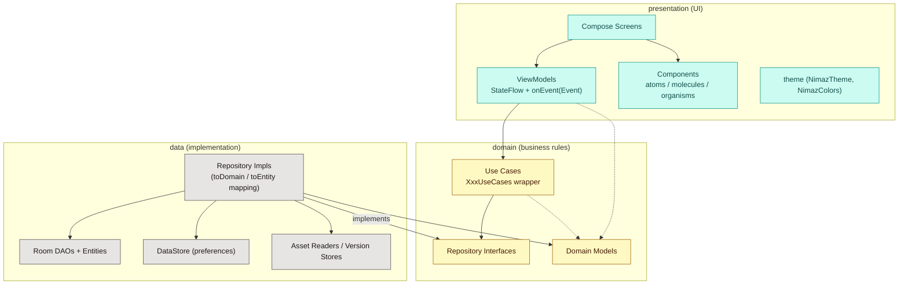
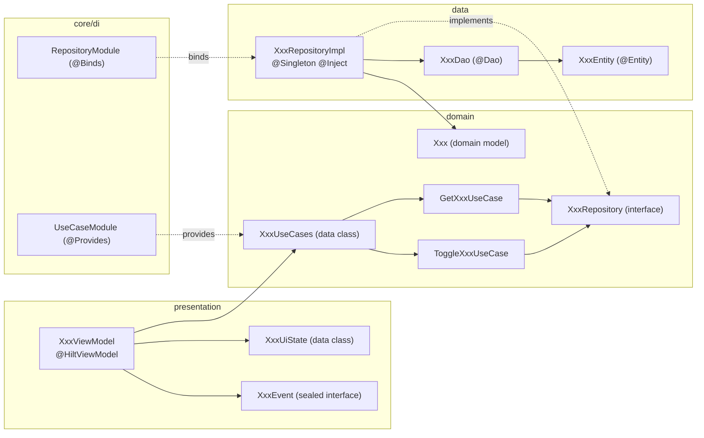
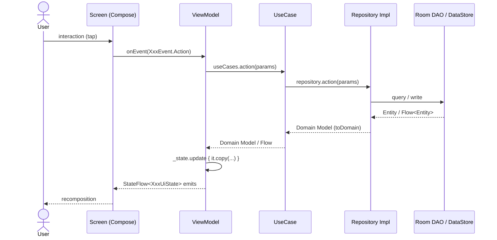
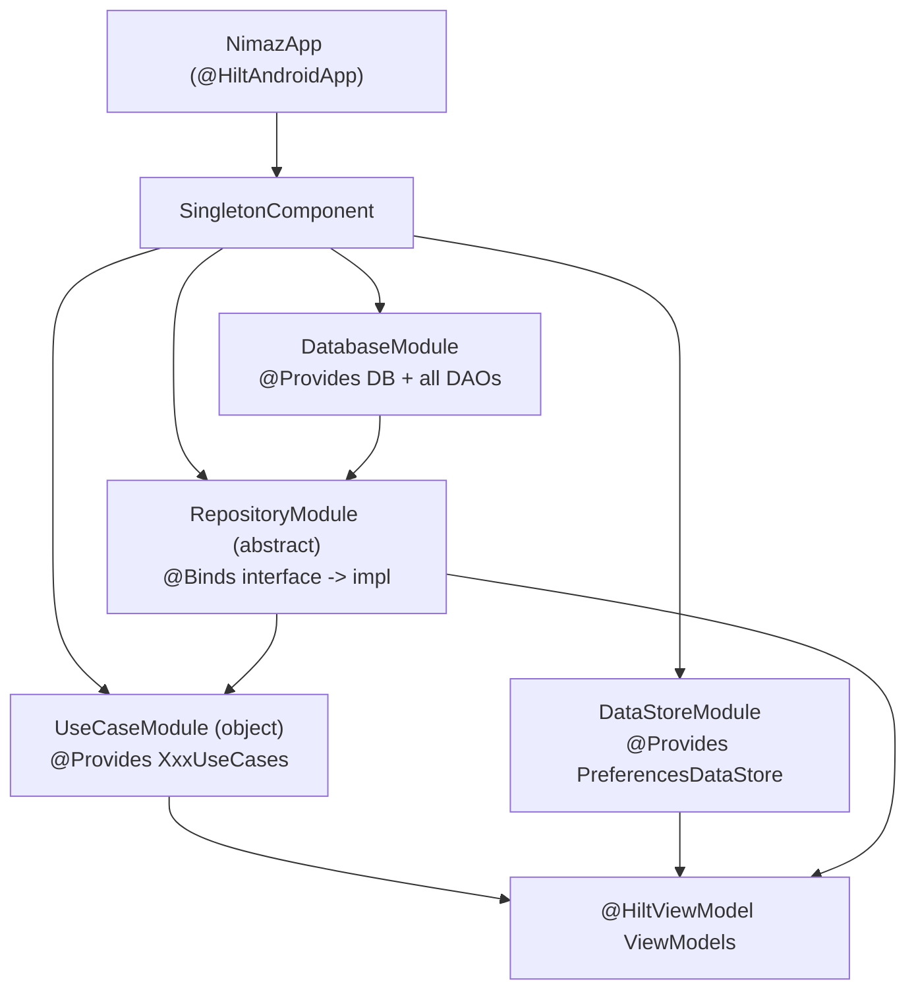

# Nimaz — Architecture Guide

> **Audience:** developers and AI agents working on this codebase.
> **Purpose:** this is the *source of truth* for how Nimaz is structured. Follow the
> canonical patterns described here so that new code stays consistent and the
> architecture does not drift. When you add a feature, copy an existing feature that
> follows these patterns (good references are called out below) — do **not** invent a
> new shape.

App package root: `com.arshadshah.nimaz`
Source root: `app/src/main/java/com/arshadshah/nimaz/`

---

## 0. Golden rules (read first)

These are the rules most often broken. Keep this checklist in mind for every change.

1. **Dependencies point inward.** `presentation → domain → data`. The **domain layer must
   never import from `data`** (no Room `*Entity`, no DAO, no DataStore). The presentation
   layer must not import Room entities or DAOs.
2. **ViewModels talk to use cases, not repositories or DAOs.** Inject `XxxUseCases`, not
   `XxxRepository` and never a `XxxDao`.
3. **One `StateFlow<XxxUiState>` per logical sub-screen, plus a single `onEvent(event)`.**
   UI state is an immutable `data class`; UI intents are a `sealed interface XxxEvent`.
   Do **not** expose `MutableStateFlow`, `LiveData`, or `mutableStateOf` from a ViewModel.
4. **Repositories return domain models, never entities.** Map at the data layer with
   `Entity.toDomain()` / `Model.toEntity()`.
5. **DI lives in `core/di`.** Bind interfaces with `@Binds`, construct wrappers with
   `@Provides`, scope app-wide singletons with `@Singleton` in `SingletonComponent`.
6. **Navigation is type-safe.** Add a `@Serializable` entry to `Route` and a matching
   `composable<Route.X>` in `NavGraph`. No raw route strings.
7. **No hardcoded colors/typography in screens.** Use `MaterialTheme.colorScheme.*` or
   `NimazColors.*`. Reuse `presentation/components` (atoms/molecules/organisms) instead of
   re-rolling generic UI.
8. **Verify before you finish.** `./gradlew :app:compileDebugKotlin` must pass (this runs
   KSP, so it validates Hilt + Room wiring too).

> **Testing:** unit/Robolectric tests live in `app/src/test{,Debug}`; the on-device
> instrumented suite (Hilt graph, Room, WorkManager, NavGraph flows) lives in
> `app/src/androidTest` and is documented in **[`docs/TESTING.md`](TESTING.md)**.

---

## 1. High-level architecture

Nimaz is an **offline-first** Android app built with **Kotlin + Jetpack Compose**,
following **Clean Architecture** with **MVVM + UDF** (unidirectional data flow).



**Why these layers exist:**

| Layer | Responsibility | May depend on |
|-------|----------------|---------------|
| `presentation` | Render state, capture user intent | `domain` |
| `domain` | Business rules, contracts, pure models | nothing (Kotlin + coroutines only) |
| `data` | Implement contracts, talk to Room/DataStore/assets | `domain` |

### Tech stack (authoritative versions live in `gradle/libs.versions.toml`)

Kotlin · Jetpack Compose (Material 3) · Hilt (DI) · Room (DB) · DataStore (prefs) ·
Navigation Compose (type-safe) · Coroutines/Flow · Media3 (audio) · Glance (widgets) ·
WorkManager (background) · Adhan2 (prayer times). Single-activity, Compose-only UI.

---

## 2. Package structure

```text
com.arshadshah.nimaz/
├── NimazApp.kt              # @HiltAndroidApp, WorkManager config, AppInitializer
├── MainActivity.kt          # @AndroidEntryPoint, single activity, setContent { NimazTheme { NavGraph() } }
│
├── core/
│   ├── di/                  # Hilt modules — THE place for DI
│   │   ├── DatabaseModule.kt        # @Provides DB + every DAO
│   │   ├── DataStoreModule.kt       # @Provides PreferencesDataStore
│   │   └── RepositoryModule.kt      # @Binds repos  +  object UseCaseModule { @Provides XxxUseCases }
│   ├── navigation/          # Routes.kt (sealed Route), NavGraph.kt, deep links
│   ├── util/                # Extensions, mappers (e.g. mapItems), date utils
│   ├── init/                # AppInitializer
│   └── monitoring/          # AppAnalytics, CrashReporter
│
├── domain/
│   ├── model/               # Domain models (e.g. QuranModels.kt, TasbihModels.kt)
│   ├── repository/          # Repository INTERFACES (one per feature)
│   └── usecase/             # XxxUseCases.kt (wrapper data class + individual use cases)
│
├── data/
│   ├── local/
│   │   ├── database/        # NimazDatabase.kt, dao/, entity/
│   │   ├── datastore/       # PreferencesDataStore
│   │   └── {dua,hadith,help,qaida}/  # Asset readers + content-version stores
│   ├── repository/          # Repository IMPLEMENTATIONS (XxxRepositoryImpl)
│   ├── audio/               # Media3 audio managers/services (Quran, Adhan, Qaida)
│   └── sync/                # Nearby-connections device-to-device sync
│
├── presentation/
│   ├── screens/<feature>/   # Composable screens grouped by feature
│   ├── viewmodel/           # All ViewModels (flat package)
│   ├── components/
│   │   ├── atoms/           # Smallest reusable UI (NimazCard, NimazBadge, ArabicText…)
│   │   ├── molecules/       # Composed (PrayerTimeCard, NimazDialog, NimazCalendar…)
│   │   └── organisms/       # Complex (TopAppBar, MushafPage, HomeHero…)
│   └── theme/               # NimazTheme, Palette.kt (NimazPalette) → Color.kt (NimazColors), Type, Shape
│
└── widget/                  # Glance home-screen widgets (nextprayer, prayertracker, hijridate)
```

> **Note on the older `docs/nimaz-pro-technical-foundation.md`:** that document uses an
> aspirational package `com.nimazpro.app`. The **real** package is `com.arshadshah.nimaz`.
> This guide reflects the code as it actually exists.

---

## 3. Anatomy of a feature (vertical slice)

Every feature is a vertical slice through the three layers. This is the shape to copy.



**Reference features to copy from:** `AsmaUlHusna`, `Prophet`, `Khatam`, `Quran`
(these go all the way through the use-case layer correctly).

---

## 4. Layer patterns & conventions

### 4.1 Presentation — ViewModels (MVVM + UDF)

Canonical reference: `presentation/viewmodel/AsmaUlHusnaViewModel.kt`.

Rules:
- Annotated `@HiltViewModel`, constructor injection only.
- Inject the feature's **`XxxUseCases`** wrapper (not a repository, never a DAO).
- Expose immutable state as `StateFlow<XxxUiState>` via `asStateFlow()`. A ViewModel
  **may** expose more than one `StateFlow` when a feature has genuinely distinct
  sub-screens (e.g. a list state and a detail state) — that is the established house
  style. Keep each one an immutable `data class`.
- Mutate with `_state.update { it.copy(...) }`.
- All UI intents flow through a single `fun onEvent(event: XxxEvent)` that `when`-dispatches
  to private functions. `XxxEvent` is a `sealed interface`.

```kotlin
data class XxxUiState(
    val items: List<Xxx> = emptyList(),
    val isLoading: Boolean = true,
    val error: String? = null,
)

sealed interface XxxEvent {
    data class Select(val id: Int) : XxxEvent
    data object Refresh : XxxEvent
}

@HiltViewModel
class XxxViewModel @Inject constructor(
    private val xxxUseCases: XxxUseCases,
) : ViewModel() {

    private val _state = MutableStateFlow(XxxUiState())
    val state: StateFlow<XxxUiState> = _state.asStateFlow()

    init { observe() }

    fun onEvent(event: XxxEvent) = when (event) {
        is XxxEvent.Select -> select(event.id)
        XxxEvent.Refresh   -> refresh()
    }

    private fun observe() = viewModelScope.launch {
        xxxUseCases.getAll().collect { items ->
            _state.update { it.copy(items = items, isLoading = false) }
        }
    }
    // ...
}
```

Screens collect with `collectAsStateWithLifecycle()` and call `viewModel.onEvent(...)`.

### 4.2 Domain — use cases

Canonical reference: `domain/usecase/AsmaUlHusnaUseCases.kt`.

- **One file per feature**, named `XxxUseCases.kt`. It contains:
  - a `data class XxxUseCases(...)` wrapper grouping the feature's use cases, and
  - one small class per operation, each `@Inject constructor(private val repository: XxxRepository)`
    with an `operator fun invoke(...)` that delegates to the repository.
- Use cases hold **business logic** (orchestration, filtering, combining). Trivial
  pass-throughs are fine and expected — the wrapper gives the ViewModel a single,
  testable dependency and keeps the repository surface out of the UI.

```kotlin
data class XxxUseCases(
    val getAll: GetAllXxxUseCase,
    val toggleFavorite: ToggleXxxFavoriteUseCase,
)

class GetAllXxxUseCase @Inject constructor(private val repo: XxxRepository) {
    operator fun invoke(): Flow<List<Xxx>> = repo.getAll()
}
```

### 4.3 Domain — repository interfaces & models

- `domain/repository/XxxRepository.kt` is a **pure Kotlin interface** that exposes only
  **domain models** and primitives. It must not import anything from `data` (no `*Entity`,
  no DAO). _(See the Zakat deviation in §9 for the one place this is currently violated.)_
- `domain/model/XxxModels.kt` holds immutable domain models (and enums/value types). These
  are what flows up to the UI.

### 4.4 Data — repository implementations & mapping

Canonical reference: `data/repository/TasbihRepositoryImpl.kt`.

- `XxxRepositoryImpl` is `@Singleton`, `@Inject constructor(private val dao: XxxDao)` (and/or
  DataStore / asset readers), and `: XxxRepository`.
- **Mapping is the impl's job.** Convert with private extension functions
  `XxxEntity.toDomain()` and `Xxx.toEntity()`. For flows of lists use the shared
  `core/util` helper `mapItems { it.toDomain() }`.

```kotlin
@Singleton
class XxxRepositoryImpl @Inject constructor(
    private val dao: XxxDao,
) : XxxRepository {
    override fun getAll(): Flow<List<Xxx>> = dao.getAll().mapItems { it.toDomain() }
    override suspend fun insert(item: Xxx): Long = dao.insert(item.toEntity())
}

private fun XxxEntity.toDomain() = Xxx(/* ... */)
private fun Xxx.toEntity() = XxxEntity(/* ... */)
```

### 4.5 Data — Room

- Single database `NimazDatabase` (`data/local/database/`), shipped **pre-populated** from
  `app/src/main/assets/database/nimaz_prepopulated.db` via `.createFromAsset(...)`.
- Entities in `entity/`, DAOs in `dao/`. **Schema changes require a migration** added to the
  `addMigrations(...)` chain in `DatabaseModule` and a bump of the single `NIMAZ_DATABASE_VERSION`
  constant (in `NimazDatabase.kt`, which drives both `@Database(version)` and `SCHEMA_VERSION`).
  Never ship a schema change without a migration (the app relies on the prepackaged DB).

---

## 5. Unidirectional data flow (end-to-end)



State flows **down** (immutable `UiState`), events flow **up** (`onEvent`). The UI is a
pure function of state.

---

## 6. Dependency injection (Hilt)



Conventions:
- **All modules live in `core/di`** and install into `SingletonComponent` with `@Singleton`.
- **`@Binds`** (in the `abstract class RepositoryModule`) for interface→impl bindings.
- **`@Provides`** (in the `object UseCaseModule` at the bottom of `RepositoryModule.kt`) to
  construct each `XxxUseCases` wrapper from its repository.
- Individual use cases use `@Inject constructor`, so they need no module entry — only the
  wrapper is `@Provides`.
- DAOs are provided one-per-method from the single `NimazDatabase` instance in `DatabaseModule`.

**Adding a use-case wrapper:** add a `provideXxxUseCases(repository: XxxRepository): XxxUseCases`
function to `UseCaseModule`, mirroring `provideAsmaUlHusnaUseCases`.

---

## 7. Navigation

Reference: `core/navigation/Routes.kt` and `core/navigation/NavGraph.kt`.

- Routes are a `@Serializable` `sealed interface Route`. `data object` for argument-less
  destinations, `data class` for ones with typed args (e.g.
  `data class QuranReader(val surahNumber: Int, val ayahNumber: Int = 1)`).
- Each route is wired with `composable<Route.X> { backStackEntry -> ... }`; typed args are
  read with `backStackEntry.toRoute<Route.X>()`.
- Bottom navigation is the `BottomNavDestination` enum (Home, Quran, Tasbih, Qibla, More).
- **Not every `Route` is a full-screen destination.** Some features are tabs/sections inside
  a parent screen. Example: **makeup fasts is a tab inside `FastTrackerScreen`** (driven by
  `FastingEvent.LoadMakeupFasts`), *not* a standalone screen — so `Route.MakeupFasts` is not
  wired in `NavGraph`. Validate how a feature is actually surfaced before adding/removing a
  route. (See §9.)

**Adding a screen:** add the `@Serializable` `Route` entry, add a `composable<Route.X>` in
`NavGraph`, create the screen under `presentation/screens/<feature>/`, and navigate via the
typed route object.

---

## 8. Theming & components

- **Colors — every literal lives in the `theme/` package, never in a component/screen:**
    - **Tier 1 — `presentation/theme/Palette.kt` (`NimazPalette`):** the source of the brand/semantic
      hues. Hue ramps named `Family + shade` (e.g. `Teal500`, `Stone900`, `Amber500`). Don't
      reference `NimazPalette.*` from screens — it carries no meaning.
    - **Tier 2 — `presentation/theme/Color.kt` (`NimazColors`):** semantic tokens that *reference*
      the palette (primary teal, gold accent, per-prayer colors, semantic statuses, tajweed
      colors, feature sub-objects like `PrayerColors`/`StatusColors`/`QuranColors`/…). Screens read
      these.
    - **Bespoke art sets** (single-use decorative palettes) also live in `theme/`, not in the
      component: `SkyColors` (prayer sky scene), `BeadColors` (tasbih bead materials),
      `GlassColors` (glass-morphism auroras), and `ArtColors.kt` (`CardArtColors`,
      `CompassArtColors`, `NamesArtColors`, `OnboardingArtColors`, `MiscArtColors`, …). They
      reuse `NimazPalette` where a hue already exists.
  - Use `MaterialTheme.colorScheme.*` for themed surfaces, or `NimazColors.*` for brand/semantic
    values. **Never** write a `Color(0xFF…)` literal in a component or screen file — define it in
    the `theme/` package (a `NimazPalette`/`NimazColors` token, or the relevant art object) and
    reference the name. The only permitted `Color(0x…)` calls outside `theme/` are *computed* ARGB
    from runtime values (e.g. `Color(0xFF000000 or rgbLong)`), not static literals.
- **Theme entry:** `NimazTheme { ... }` wraps the app in `MainActivity`; it supplies the
  Material 3 color scheme, `NimazTypography`, and shapes, and honors `ThemeMode`.
- **Components follow Atomic Design** (`atoms` → `molecules` → `organisms`). Reuse shared
  components (e.g. `NimazCard`, `NimazSurfaceCard`, `PrayerTimeCard`, `NimazBackTopAppBar`,
  `NimazEmptyState`, `NimazLoadingState`, `NimazCalendar`) rather than re-rolling generic UI.
  In particular:
    - a full-screen centred spinner is `NimazLoadingState(modifier = Modifier.padding(padding))`,
      **not** an inline `Box(fillMaxSize, Center) { CircularProgressIndicator() }`;
    - a flat, outlined "content card" (surface container + 0 elevation + 1.dp `outline`
      border + 16.dp corners) is `NimazSurfaceCard { … }`, not a hand-rolled `Card(...)` with
      those four params repeated;
    - a per-prayer accent colour is `prayerName.color()`
      (`presentation/theme/PrayerColorExtensions.kt`), not a local `when (prayerName) { … }`.
    - a horizontal pager is `NimazPager(state = rememberNimazPagerState { count }) { page → … }`
      (`components/atoms/NimazPager.kt`) — a thin wrapper over `HorizontalPager` that exposes the
      reader knobs (`reverseLayout`, `beyondViewportPageCount`, `key`, `contentPadding`,
      `pageSize`) as pass-throughs — **not** a raw `HorizontalPager`/`rememberPagerState`. The
      caller still owns any page⇄ViewModel sync. Paired with it, page dots are the canonical pill
      `NimazPageIndicator(state)` (`components/atoms/NimazPageIndicator.kt`); it is a *page*
      indicator, **not** a progress tracker (for "N of M completed" use `QaidaLineProgressDots`).
    - an icon is `NimazIcon(imageVector, variant = …, size = …)` (`components/atoms/NimazIcon.kt`),
      **not** a raw Material 3 `Icon(...)`. `variant` is a semantic tint role
      (`DEFAULT`=inherits `LocalContentColor`, `MUTED`, `PRIMARY`, `ON_ACCENT`, `ERROR`, `SUCCESS`);
      pass `tint =` to escape it (brand `NimazColors.*` / per-prayer / runtime colours). `type =
      CONTAINED` draws the glyph in a tinted container — the old `ContainedIcon`/`IconBadge` (a
      rounded-square contained icon is the reusable "badge"); `size`/`iconSize`/`containerSize`/
      `cornerRadius` give granular control. Tappable icons stay `NimazIconButton`.
    - a card is `NimazCard(style = NimazCardStyle.FILLED | ELEVATED | OUTLINED | GRADIENT, …)`
      (`components/atoms/NimazCard.kt`), **not** a raw Material 3 `Card`/`ElevatedCard`/
      `OutlinedCard`. It passes through `onClick`/`enabled`/`shape`/`colors`/`elevation`/`border`,
      so existing call sites convert by swapping the constructor and adding `style`. Don't set a
      `containerColor` of `MaterialTheme.colorScheme.surfaceContainerHigh` — omit `colors` and let
      the card default stand (use `NimazSurfaceCard` for the flat outlined content-card look).
    - a minus/value/plus number control is `NimazNumberStepper(value, onValueChange, variant = …,
      size = …, type = …)` (`components/molecules/NimazNumberStepper.kt`), **not** a hand-rolled
      row of `IconButton`s around a `Text`. `variant` is the layout: `INLINE` (a `label` on the
      left + compact grouped controls — the settings-row look) or `SPREAD` (full-width tonal card,
      edge buttons, large centred value — the tasbih target-dial look; `label` is ignored).
      `size` (`SMALL`/`MEDIUM`/`LARGE`) scales the buttons and value typography; `type`
      (`DEFAULT`/`ACCENT`) sets the value colour (`ACCENT` = `NimazColors.TasbihColors.Milestone`).
      `minValue`/`maxValue`/`step`/`formatValue` clamp and format. It absorbed the old tasbih
      `TargetStepper`/`TargetCountStepper`.
    - a boolean check-toggle is `NimazCheckbox(checked, onCheckedChange, variant = …, size = …,
      type = …)` (`components/atoms/NimazCheckbox.kt`), **not** a hand-built `Box`/`Surface` with a
      `.border(...)` that shows an `Icon(Icons.Default.Check)` when selected. `variant` is the
      semantic colour role (`DEFAULT`/`PRIMARY` = `primary`, `SUCCESS` = `NimazColors.Success` for
      completion, `ERROR`); `size` (`SMALL`/`MEDIUM`/`LARGE`) sets the box/check/stroke/corner
      preset; `type` is `SQUARE` (rounded Material-style) or `CIRCLE` (the prayer/fast-completion
      look). Pass `onCheckedChange = null` for a **display-only indicator** (no click semantics) —
      the drop-in for selected-card/list rows where the parent owns the click; `tint =` escapes the
      variant. **Not** for on/off toggles (use `NimazSwitch`) or genuine single-choice `RadioButton`
      pickers (those stay as-is). It centralised the prayer/fast trackers, the settings/Quran pickers
      and the dropdown/list selection check indicators.
    - an on/off toggle is `NimazSwitch(checked, onCheckedChange, variant = …)`
      (`components/atoms/NimazSwitch.kt`), **not** a raw Material 3 `Switch`. It wraps Material's
      `Switch` (keeping the drag gesture, `Role.Switch` semantics and thumb animation) and bakes in
      the house look from the original enhanced switch: a brand-tinted checked track with a light
      thumb + check glyph, and a clearly contrasted outlined pill (raised thumb on a `surface` track)
      when off. Only the **disabled** colours are left to `SwitchDefaults` (the old hand-styled
      switch hard-coded every disabled colour to `surface`, so it vanished when disabled —
      `NimazSwitch` fixes that). `variant` is the checked-track colour role (`DEFAULT`/`PRIMARY` =
      `primary`, `SUCCESS`, `ERROR`); `trackTint =` escapes it, `thumbIcon = null` drops the glyph.
      Pass `onCheckedChange = null` when an enclosing clickable row owns the toggle (the
      `NimazSettingsItem` pattern — the row toggles, the switch just renders state). It centralised
      the settings/notification toggles, the tasbih left-handed switch and the calendar preview.
  Screen-local private composables are fine for **feature-specific** layout that isn't reused
  elsewhere; promote anything reused across screens into `components/`.

---

## 9. Known deviations & tech-debt registry

This registry tracks divergences from the canonical patterns. Most have now been resolved
during the architecture-consistency pass; the **Resolved** table is kept as a record so the
fixes aren't accidentally reverted, and the **Open** table lists what remains. Agents must not
copy anything listed as Open.

> For a categorised, tick-box backlog of clean-architecture anti-patterns (with detection
> commands to re-scan for new instances), see
> [`CLEAN_ARCHITECTURE_CHECKLIST.md`](CLEAN_ARCHITECTURE_CHECKLIST.md).

### Resolved (do not regress)

| Area | What was fixed |
|------|----------------|
| Use-case layer | `Hadith`, `Dua`, `Fasting`, `Prayer`, `Tasbih`, `Tafseer`, `Zakat` now have `XxxUseCases` wrappers; `PrayerTimes/PrayerTracker/Home/Settings/Location`, `Search`, `Bookmarks` ViewModels inject use cases instead of repositories. |
| Zakat clean-arch leak | `ZakatRepository` now exposes the `ZakatHistoryEntry` domain model (promoted to `domain/model`); entity↔domain mapping lives in `ZakatRepositoryImpl`. |
| Calendar layer bypass | New `IslamicEventRepository` (+ impl mapping) and `IslamicEventUseCases`; `CalendarViewModel` no longer touches `IslamicEventDao`. |
| QaidaReader UDF | `QaidaReaderViewModel` now has a sealed `QaidaReaderEvent` + single `onEvent`; action methods are private; Qaida screens dispatch events. |
| Dead route | The orphaned `Route.MakeupFasts` declaration was removed (makeup fasts is a tab inside `FastTrackerScreen`). |
| Theming (Zakat) | Zakat screens use `NimazColors.Neutral900` / `NimazColors.ZakatColors.GoldAccent`; no raw color literals remain there. |
| Domain→data leak (`PageAyahRange`) | Added a `PageAyahRange` domain model; the Room projection is `PageAyahRangeRow` (mapped in `QuranRepositoryImpl`). `domain/` no longer imports anything from `data/`. |
| Home daily-content DAO coupling | `HomeViewModel` no longer injects `FastingDao`/`HadithDao`/`DuaDao`. Daily hadith/dua logic extracted to `GetDailyHadithUseCase`/`GetDailyDuaUseCase`; seeding moved into the repositories. No presentation ViewModel injects a DAO or `RepositoryImpl` anymore. |
| Theming (screens) | Raw `Color(0xFF…)` literals removed from ~20 feature screens into `NimazColors` tokens (exact hex; added `Success`/`Warning`/`Info`/etc. and `HadithCollectionColors`). Only bespoke design-token files remain (`tasbih/BeadDesign.kt`, `TasbihBeads.kt`, `onboarding/OnboardingArt.kt`). |
| Colour system (two-tier + centralised art) | Split colour into **Tier 1 `Palette.kt` (`NimazPalette`)** — the brand/semantic hue ramps (`Family+shade`) — and **Tier 2 `Color.kt` (`NimazColors`)** — semantic tokens that *reference* the palette. Removed 11 dead props (6 prayer `*GradientEnd`, `SajdaAyah`, `BookmarkSecondary`, `Voluntary`, `Late`, `Counter`); collapsed ~20 duplicate-hex groups to one palette entry each; migrated ~29 duplicate inline literals to pixel-exact tokens. Then **centralised ALL remaining art literals** out of component/screen files into the `theme/` package: `SkyColors.kt` (sky scene), `BeadColors.kt` (tasbih beads), `GlassColors.kt` (glass auroras), and `ArtColors.kt` (card/compass/names/onboarding/misc). **Zero static `Color(0xFF…)` literals remain outside `theme/`** (grep-verified; only computed-ARGB `Color(0x… or rgbLong)` forms remain). **No pixel changed** — structure/naming/dedup only; hues preserved verbatim. |
| Preferences abstraction | ViewModels no longer inject the `PreferencesDataStore` data class — they depend on the `domain/repository/SettingsRepository` interface (implemented by `PreferencesDataStore`, bound via `@Binds`). `UserPreferences` moved to `domain/model`. |

### Open (still to do — do not copy)

| # | Area | Deviation | Canonical fix |
|---|------|-----------|---------------|
| 1 | Layer bypass | `HomeViewModel` injects `FastingDao`, `HadithDao`, `DuaDao` directly for its "daily hadith / daily dua of the day" features. This logic reads entity-level fields and uses prepopulated-DB integer ids + seeders, so it is **not** a mechanical swap — the domain models differ (`Hadith.grade` is an enum, `DuaCategory.iconName` vs `icon`, String vs Int ids). | Extract `GetDailyHadithUseCase` / `GetDailyDuaUseCase` that own the daily-rotation business logic (and the seeders), returning domain models. Needs runtime/visual validation. |
| 2 | Theming | Bespoke per-item gradient palettes still hold raw `Color(0xFF…)` literals: `hadith/HadithCollectionScreen.kt` (`getBookGradient`, per-collection pairs) and `tasbih/BeadDesign.kt` (bead style gradients). These are centralized design tokens, not scattered ad-hoc colors. | Relocate into `NimazColors` (e.g. `HadithCollectionColors`, `TasbihBeadStyles`) preserving exact hex; do under visual review. |

> **Accepted patterns (NOT deviations):**
> - Exposing multiple `StateFlow`s from one ViewModel for distinct sub-screens (list/detail) is
>   the house style (see `AsmaUlHusnaViewModel`). Do **not** "consolidate" them into one mega-state.
> - Audio-playback ViewModels (`QaidaReaderViewModel`, `QuranViewModel`) expose the audio engine's
>   `StateFlow` (`audioManager.state`) directly to the UI for live highlight/progress. This is an
>   intentional, consistent pattern for playback features — not a leak to "fix".

---

## 10. Recipe — add a new feature end-to-end

1. **Domain models** — `domain/model/XxxModels.kt` (immutable data classes/enums).
2. **Repository interface** — `domain/repository/XxxRepository.kt` (domain types only).
3. **Room** — add `XxxEntity` (`entity/`) and `XxxDao` (`dao/`); register the DAO in
   `NimazDatabase` and provide it in `DatabaseModule`. Add a migration if the schema changes.
4. **Repository impl** — `data/repository/XxxRepositoryImpl.kt` with `toDomain()/toEntity()`
   mapping. Bind it with `@Binds` in `RepositoryModule`.
5. **Use cases** — `domain/usecase/XxxUseCases.kt` (wrapper + per-operation classes). Provide
   the wrapper with `@Provides` in `UseCaseModule`.
6. **ViewModel** — `presentation/viewmodel/XxxViewModel.kt` (`@HiltViewModel`, inject
   `XxxUseCases`, `StateFlow<XxxUiState>` + sealed `XxxEvent` + `onEvent`).
7. **Screen** — `presentation/screens/xxx/XxxScreen.kt`, collecting state with
   `collectAsStateWithLifecycle()` and reusing shared components + theme.
8. **Navigation** — add `Route.Xxx` and a `composable<Route.Xxx>` in `NavGraph`.
9. **Tests** — unit-test the ViewModel (fake use cases) and use cases (fake repository);
   DAO/repository tests where logic warrants. See `app/src/test/...`.
10. **Verify** — `./gradlew :app:compileDebugKotlin` then `./gradlew :app:testDebugUnitTest`.

---

## 11. Build & verify

```bash
# Compile (runs KSP → validates Hilt + Room wiring). Fastest correctness gate.
./gradlew :app:compileDebugKotlin

# Unit tests
./gradlew :app:testDebugUnitTest      # or: ./gradlew test

# Lint
./gradlew lint

# Full CI lane (Gradle tests + lint), as run on PRs
bundle exec fastlane android test

# Debug APK
./gradlew assembleDebug
```

Requires JDK 21 and an Android SDK (compileSdk 36). Set `sdk.dir` in `local.properties` or
`ANDROID_HOME`.

---

*Keep this document in sync with reality.* When you intentionally change a pattern, update
the relevant section here and the deviation registry in §9 — that is how we prevent drift.
</content>
</invoke>
