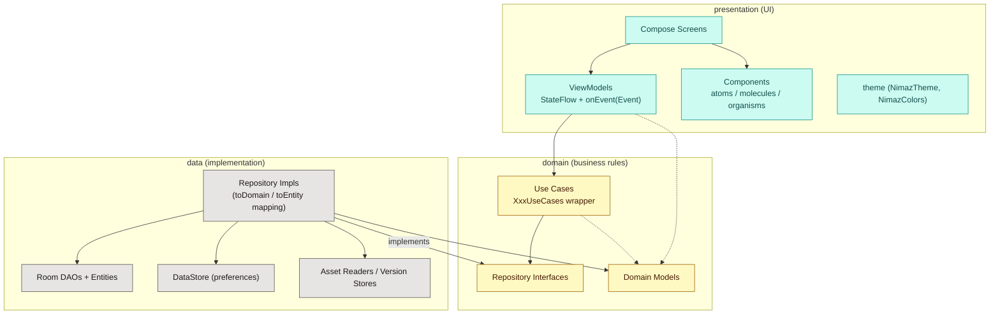
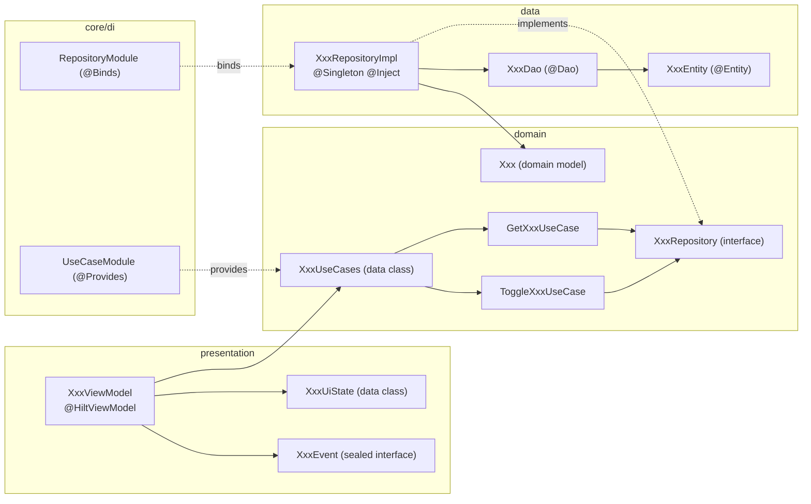
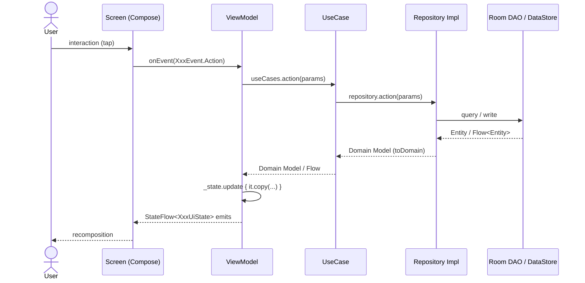
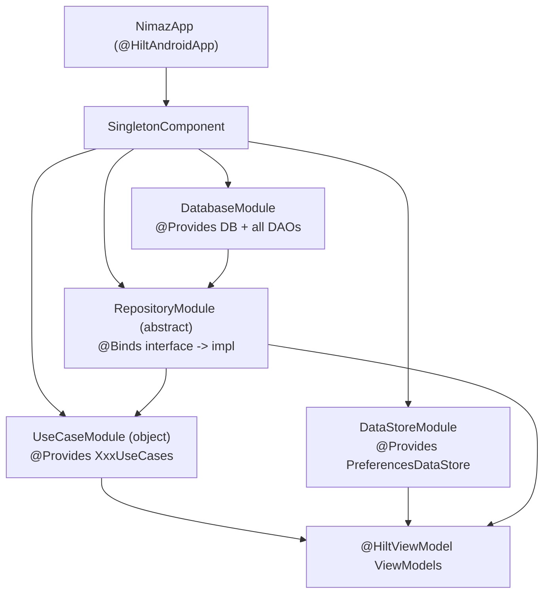

# Nimaz — Architecture Guide

> **Audience:** developers and AI agents working on this codebase.
> **Purpose:** this is the *source of truth* for how Nimaz is structured. Follow the
> canonical patterns described here so that new code stays consistent and the
> architecture does not drift. When you add a feature, copy an existing feature that
> follows these patterns (good references are called out below) — do **not** invent a
> new shape.

App package root: `com.arshadshah.nimaz`
Source root: `app/src/main/java/com/arshadshah/nimaz/`

---

## 0. Golden rules (read first)

These are the rules most often broken. Keep this checklist in mind for every change.

1. **Dependencies point inward.** `presentation → domain → data`. The **domain layer must
   never import from `data`** (no Room `*Entity`, no DAO, no DataStore). The presentation
   layer must not import Room entities or DAOs.
2. **ViewModels talk to use cases, not repositories or DAOs.** Inject `XxxUseCases`, not
   `XxxRepository` and never a `XxxDao`.
3. **One `StateFlow<XxxUiState>` per logical sub-screen, plus a single `onEvent(event)`.**
   UI state is an immutable `data class`; UI intents are a `sealed interface XxxEvent`.
   Do **not** expose `MutableStateFlow`, `LiveData`, or `mutableStateOf` from a ViewModel.
4. **Repositories return domain models, never entities.** Map at the data layer with
   `Entity.toDomain()` / `Model.toEntity()`.
5. **DI lives in `core/di`.** Bind interfaces with `@Binds`, construct wrappers with
   `@Provides`, scope app-wide singletons with `@Singleton` in `SingletonComponent`.
6. **Navigation is type-safe.** Add a `@Serializable` entry to `Route` and a matching
   `composable<Route.X>` in `NavGraph`. No raw route strings.
7. **No hardcoded colors/typography in screens.** Use `MaterialTheme.colorScheme.*` or
   `NimazColors.*`. Reuse `presentation/components` (atoms/molecules/organisms) instead of
   re-rolling generic UI. Icons are Material glyphs via `NimazIcon` — no emoji.
   - **Buttons are `NimazButton` (`components/atoms/NimazButton.kt`), never a `Text`/`Box`/
     `Surface` + `Modifier.clickable`.** Pick the emphasis with `variant` (`FILLED`/`TONAL`/
     `OUTLINED`/`TEXT`/`DESTRUCTIVE`) and `size`; icon-only actions use `NimazIconButton`.
   - **A whole card is made tappable with `NimazCard(onClick = …)`, never `Modifier.clickable`
     wrapped around the card** — the latter paints a sharp-cornered ripple that ignores the card's
     radius (see §8, the `NimazCard` bullet). `NimazMenuItem` is the ready-made clickable list row.
   > **Exception (Location screen only):** country flags on the Location screen
   > (`LocationScreen`, curated cities in `LocationCatalog.kt`) are rendered as emoji.
   > This is the single sanctioned emoji use in the app; no other emoji are permitted.
8. **Verify before you finish.** `./gradlew :app:compileDebugKotlin` must pass (this runs
   KSP, so it validates Hilt + Room wiring too).

> **Testing:** unit/Robolectric tests live in `app/src/test{,Debug}`; the on-device
> instrumented suite (Hilt graph, Room, WorkManager, NavGraph flows) lives in
> `app/src/androidTest` and is documented in **[`docs/TESTING.md`](TESTING.md)**.

---

## 1. High-level architecture

Nimaz is an **offline-first** Android app built with **Kotlin + Jetpack Compose**,
following **Clean Architecture** with **MVVM + UDF** (unidirectional data flow).



**Why these layers exist:**

| Layer | Responsibility | May depend on |
|-------|----------------|---------------|
| `presentation` | Render state, capture user intent | `domain` |
| `domain` | Business rules, contracts, pure models | nothing (Kotlin + coroutines only) |
| `data` | Implement contracts, talk to Room/DataStore/assets | `domain` |

### Tech stack (authoritative versions live in `gradle/libs.versions.toml`)

Kotlin · Jetpack Compose (Material 3) · Hilt (DI) · Room (DB) · DataStore (prefs) ·
Navigation Compose (type-safe) · Coroutines/Flow · Media3 (audio) · Glance (widgets) ·
WorkManager (background) · Adhan2 (prayer times). Single-activity, Compose-only UI.

---

## 2. Package structure

```text
com.arshadshah.nimaz/
├── NimazApp.kt              # @HiltAndroidApp, WorkManager config, AppInitializer
├── MainActivity.kt          # @AndroidEntryPoint, single activity, setContent { NimazTheme { NavGraph() } }
│
├── core/
│   ├── di/                  # Hilt modules — THE place for DI
│   │   ├── DatabaseModule.kt        # @Provides DB + every DAO
│   │   ├── DataStoreModule.kt       # @Provides PreferencesDataStore
│   │   └── RepositoryModule.kt      # @Binds repos  +  object UseCaseModule { @Provides XxxUseCases }
│   ├── navigation/          # Routes.kt (sealed Route), NavGraph.kt, deep links
│   ├── util/                # Extensions, mappers (e.g. mapItems), date utils, PDF exporters
│   ├── share/               # ContentShareManager + Shareable/Shareables + branded ShareCardRenderer
│   ├── init/                # AppInitializer
│   └── monitoring/          # AppAnalytics, CrashReporter
│
├── domain/
│   ├── model/               # Domain models (e.g. QuranModels.kt, TasbihModels.kt)
│   ├── repository/          # Repository INTERFACES (one per feature)
│   └── usecase/             # XxxUseCases.kt (wrapper data class + individual use cases)
│
├── data/
│   ├── local/
│   │   ├── database/        # NimazDatabase.kt, dao/, entity/
│   │   ├── datastore/       # PreferencesDataStore
│   │   └── {dua,hadith,help,qaida}/  # Asset readers + content-version stores
│   ├── repository/          # Repository IMPLEMENTATIONS (XxxRepositoryImpl)
│   ├── audio/               # Media3 audio managers/services (Quran, Adhan, Qaida)
│   └── sync/                # Nearby-connections device-to-device sync
│
├── presentation/
│   ├── screens/<feature>/   # Composable screens grouped by feature
│   ├── viewmodel/           # All ViewModels (flat package)
│   ├── components/
│   │   ├── atoms/           # Smallest reusable UI (NimazCard, NimazBadge, ArabicText…)
│   │   ├── molecules/       # Composed (PrayerTimeCard, NimazDialog, NimazCalendar…)
│   │   └── organisms/       # Complex (TopAppBar, MushafPage, HomeHero…)
│   └── theme/               # NimazTheme, Palette.kt (NimazPalette) → Color.kt (NimazColors), Type, Shape
│
└── widget/                  # Glance home-screen widgets (nextprayer, prayertracker, hijridate)
```

> **Note on the older `docs/nimaz-pro-technical-foundation.md`:** that document uses an
> aspirational package `com.nimazpro.app`. The **real** package is `com.arshadshah.nimaz`.
> This guide reflects the code as it actually exists.

---

## 3. Anatomy of a feature (vertical slice)

Every feature is a vertical slice through the three layers. This is the shape to copy.



**Reference features to copy from:** `AsmaUlHusna`, `Prophet`, `Khatam`, `Quran`
(these go all the way through the use-case layer correctly).

---

## 4. Layer patterns & conventions

### 4.1 Presentation — ViewModels (MVVM + UDF)

Canonical reference: `presentation/viewmodel/AsmaUlHusnaViewModel.kt`.

Rules:
- Annotated `@HiltViewModel`, constructor injection only.
- Inject the feature's **`XxxUseCases`** wrapper (not a repository, never a DAO).
- Expose immutable state as `StateFlow<XxxUiState>` via `asStateFlow()`. A ViewModel
  **may** expose more than one `StateFlow` when a feature has genuinely distinct
  sub-screens (e.g. a list state and a detail state) — that is the established house
  style. Keep each one an immutable `data class`.
- Mutate with `_state.update { it.copy(...) }`.
- All UI intents flow through a single `fun onEvent(event: XxxEvent)` that `when`-dispatches
  to private functions. `XxxEvent` is a `sealed interface`.

```kotlin
data class XxxUiState(
    val items: List<Xxx> = emptyList(),
    val isLoading: Boolean = true,
    val error: String? = null,
)

sealed interface XxxEvent {
    data class Select(val id: Int) : XxxEvent
    data object Refresh : XxxEvent
}

@HiltViewModel
class XxxViewModel @Inject constructor(
    private val xxxUseCases: XxxUseCases,
) : ViewModel() {

    private val _state = MutableStateFlow(XxxUiState())
    val state: StateFlow<XxxUiState> = _state.asStateFlow()

    init { observe() }

    fun onEvent(event: XxxEvent) = when (event) {
        is XxxEvent.Select -> select(event.id)
        XxxEvent.Refresh   -> refresh()
    }

    private fun observe() = viewModelScope.launch {
        xxxUseCases.getAll().collect { items ->
            _state.update { it.copy(items = items, isLoading = false) }
        }
    }
    // ...
}
```

Screens collect with `collectAsStateWithLifecycle()` and call `viewModel.onEvent(...)`.

#### Cancellation: one handle per identity of the request

A `viewModelScope.launch { roomFlow.collect { … } }` **needs a `Job` you cancel** whenever the
function can run more than once — per navigation, per keystroke, per swipe. A Room flow never
completes, so an un-cancelled collector lives as long as the ViewModel, and Room re-emits to
*every* live collector when the table changes: an earlier request can land after a later one and
replace what is on screen.

Scope the handle to the **identity of the request**, not to the function:

| shape | handle |
|---|---|
| one thing on screen at a time (a chapter, an ayah, a query) | one `Job` per surface |
| several legitimately live at once (the Quran pager's neighbouring pages) | a `Map<key, Job>` |
| two functions writing the *same* state (`loadCategory` / `loadDuasByOccasion`) | they **share** one handle |
| a lifetime observer started once from `init` | no handle needed |

Clearing a query counts as a change of request: cancel there too, or the last collector's next
emission repopulates the results the user just cleared. See AP-7.1b in
[`CLEAN_ARCHITECTURE_CHECKLIST.md`](CLEAN_ARCHITECTURE_CHECKLIST.md).

#### Derived state is computed on the UI-state class, never stored

A filtered list, a resolved language, a total — anything that is a pure function of other state
— is a computed `val` on the `XxxUiState`:

```kotlin
data class TasbihPresetsUiState(
    val defaultPresets: List<TasbihPreset> = emptyList(),
    val customPresets: List<TasbihPreset> = emptyList(),
    val selectedCategory: TasbihCategory? = null,
) {
    val filteredPresets: List<TasbihPreset>
        get() = (defaultPresets + customPresets)
            .let { all -> selectedCategory?.let { c -> all.filter { it.category == c } } ?: all }
}
```

Stored, it has to be refreshed at every site that touches an input, and the sites that forget do
not fail loudly — they leave a filter that is on beside a list that ignores it. Both instances
the sweep found (tasbih categories, hadith chapter search) were exactly that. See AP-9.

### 4.2 Domain — use cases

Canonical reference: `domain/usecase/AsmaUlHusnaUseCases.kt`.

- **One file per feature**, named `XxxUseCases.kt`. It contains:
  - a `data class XxxUseCases(...)` wrapper grouping the feature's use cases, and
  - one small class per operation, each `@Inject constructor(private val repository: XxxRepository)`
    with an `operator fun invoke(...)` that delegates to the repository.
- Use cases hold **business logic** (orchestration, filtering, combining). Trivial
  pass-throughs are fine and expected — the wrapper gives the ViewModel a single,
  testable dependency and keeps the repository surface out of the UI.

```kotlin
data class XxxUseCases(
    val getAll: GetAllXxxUseCase,
    val toggleFavorite: ToggleXxxFavoriteUseCase,
)

class GetAllXxxUseCase @Inject constructor(private val repo: XxxRepository) {
    operator fun invoke(): Flow<List<Xxx>> = repo.getAll()
}
```

### 4.3 Domain — repository interfaces & models

- `domain/repository/XxxRepository.kt` is a **pure Kotlin interface** that exposes only
  **domain models** and primitives. It must not import anything from `data` (no `*Entity`,
  no DAO). _(See the Zakat deviation in §9 for the one place this is currently violated.)_
- `domain/model/XxxModels.kt` holds immutable domain models (and enums/value types). These
  are what flows up to the UI.

### 4.4 Data — repository implementations & mapping

Canonical reference: `data/repository/TasbihRepositoryImpl.kt`.

- `XxxRepositoryImpl` is `@Singleton`, `@Inject constructor(private val dao: XxxDao)` (and/or
  DataStore / asset readers), and `: XxxRepository`.
- **Mapping is the impl's job.** Convert with private extension functions
  `XxxEntity.toDomain()` and `Xxx.toEntity()`. For flows of lists use the shared
  `core/util` helper `mapItems { it.toDomain() }`.

```kotlin
@Singleton
class XxxRepositoryImpl @Inject constructor(
    private val dao: XxxDao,
) : XxxRepository {
    override fun getAll(): Flow<List<Xxx>> = dao.getAll().mapItems { it.toDomain() }
    override suspend fun insert(item: Xxx): Long = dao.insert(item.toEntity())
}

private fun XxxEntity.toDomain() = Xxx(/* ... */)
private fun Xxx.toEntity() = XxxEntity(/* ... */)
```

### 4.5 Data — Room

- Single database `NimazDatabase` (`data/local/database/`), shipped **pre-populated** from
  `app/src/main/assets/database/nimaz_prepopulated.db` via `.createFromAsset(...)`.
- Entities in `entity/`, DAOs in `dao/`. **Schema changes require a migration** added to the
  `addMigrations(...)` chain in `DatabaseModule` and a bump of the single `NIMAZ_DATABASE_VERSION`
  constant (in `NimazDatabase.kt`, which drives both `@Database(version)` and `SCHEMA_VERSION`).
  Never ship a schema change without a migration (the app relies on the prepackaged DB).

---

## 5. Unidirectional data flow (end-to-end)



State flows **down** (immutable `UiState`), events flow **up** (`onEvent`). The UI is a
pure function of state.

---

## 6. Dependency injection (Hilt)



Conventions:
- **All modules live in `core/di`** and install into `SingletonComponent` with `@Singleton`.
- **`@Binds`** (in the `abstract class RepositoryModule`) for interface→impl bindings.
- **`@Provides`** (in the `object UseCaseModule` at the bottom of `RepositoryModule.kt`) to
  construct each `XxxUseCases` wrapper from its repository.
- Individual use cases use `@Inject constructor`, so they need no module entry — only the
  wrapper is `@Provides`.
- DAOs are provided one-per-method from the single `NimazDatabase` instance in `DatabaseModule`.

**Adding a use-case wrapper:** add a `provideXxxUseCases(repository: XxxRepository): XxxUseCases`
function to `UseCaseModule`, mirroring `provideAsmaUlHusnaUseCases`.

---

## 7. Navigation

Reference: `core/navigation/Routes.kt` and `core/navigation/NavGraph.kt`.

- Routes are a `@Serializable` `sealed interface Route`. `data object` for argument-less
  destinations, `data class` for ones with typed args (e.g.
  `data class QuranReader(val surahNumber: Int, val ayahNumber: Int = 1)`).
- Each route is wired with `composable<Route.X> { backStackEntry -> ... }`; typed args are
  read with `backStackEntry.toRoute<Route.X>()`.
- Bottom navigation is the `BottomNavDestination` enum (Home, Quran, Tasbih, Qibla, More).
- **Not every `Route` is a full-screen destination.** Some features are tabs/sections inside
  a parent screen. Example: **makeup fasts is a tab inside `FastTrackerScreen`** (driven by
  `FastingEvent.LoadMakeupFasts`), *not* a standalone screen — so `Route.MakeupFasts` is not
  wired in `NavGraph`. Validate how a feature is actually surfaced before adding/removing a
  route. (See §9.)

**Adding a screen:** add the `@Serializable` `Route` entry, add a `composable<Route.X>` in
`NavGraph`, create the screen under `presentation/screens/<feature>/`, and navigate via the
typed route object.

---

## 8. Theming & components

- **Colors — every literal lives in the `theme/` package, never in a component/screen:**
    - **Tier 1 — `presentation/theme/Palette.kt` (`NimazPalette`):** the source of the brand/semantic
      hues. Hue ramps named `Family + shade` (e.g. `Teal500`, `Stone900`, `Amber500`). Don't
      reference `NimazPalette.*` from screens — it carries no meaning.
    - **Tier 2 — `presentation/theme/Color.kt` (`NimazColors`):** semantic tokens that *reference*
      the palette (primary teal, gold accent, per-prayer colors, semantic statuses, tajweed
      colors, feature sub-objects like `PrayerColors`/`StatusColors`/`QuranColors`/…). Screens read
      these.
    - **Bespoke art sets** (single-use decorative palettes) also live in `theme/`, not in the
      component: `SkyColors` (prayer sky scene), `BeadColors` (tasbih bead materials),
      `GlassColors` (glass-morphism auroras), and `ArtColors.kt` (`CardArtColors`,
      `CompassArtColors`, `NamesArtColors`, `OnboardingArtColors`, `MiscArtColors`, …). They
      reuse `NimazPalette` where a hue already exists.
  - Use `MaterialTheme.colorScheme.*` for themed surfaces, or `NimazColors.*` for brand/semantic
    values. **Never** write a `Color(0xFF…)` literal in a component or screen file — define it in
    the `theme/` package (a `NimazPalette`/`NimazColors` token, or the relevant art object) and
    reference the name. The only permitted `Color(0x…)` calls outside `theme/` are *computed* ARGB
    from runtime values (e.g. `Color(0xFF000000 or rgbLong)`), not static literals.
- **Tajweed rule colours & contrast (issue #294).** `NimazColors.TajweedColors` holds a
  light + dark tone for each of the 24 v3 tajweed rules (consumed by `TajweedParser`; the rule
  order/colour/code live in `TajweedParser.rules`, the single source of truth for the legend,
  while the localized display name + explanation resolve from `R.string.tajweed_rule_<code>_*`
  via `tajweedRuleName`/`tajweedRuleExplanation`, translated into the 5 shipped locales — #294).
  Every colour is held to **≥ 4.5:1 WCAG contrast** against the reader background it renders on
  (`#FAFAFA` light / `#1C1917` dark). `scripts/check_tajweed_contrast.py` reads the hex values
  straight from `Palette.kt`/`Color.kt`, verifies the ratios, and fails CI
  (`tajweed_contrast_check.yml`) on any regression — so this table cannot silently drift
  (regenerate with `--markdown`):

  | Rule | Light | vs #FAFAFA | Dark | vs #1C1917 |
  |---|---|---|---|---|
  | Ghunnah | `#047857` | 5.25:1 | `#34D399` | 9.10:1 |
  | Ikhfa | `#0F766E` | 5.24:1 | `#2DD4BF` | 9.39:1 |
  | Ikhfa Shafawi | `#0E7490` | 5.13:1 | `#22D3EE` | 9.68:1 |
  | Idgham w/ Ghunnah | `#92400E` | 6.79:1 | `#FBBF24` | 10.48:1 |
  | Idgham w/o Ghunnah | `#795548` | 6.28:1 | `#F59E0B` | 8.14:1 |
  | Idgham Shafawi | `#B45309` | 4.81:1 | `#FCD34D` | 12.13:1 |
  | Idgham Mutajanisayn | `#C2410C` | 4.96:1 | `#FB923C` | 7.73:1 |
  | Idgham Mutaqaribayn | `#9A3412` | 7.00:1 | `#FDBA74` | 10.37:1 |
  | Idgham Mutamathilayn | `#78350F` | 8.69:1 | `#FDE68A` | 14.04:1 |
  | Qalqalah Sughra | `#2563EB` | 4.95:1 | `#60A5FA` | 6.88:1 |
  | Qalqalah Kubra | `#1D4ED8` | 6.42:1 | `#93C5FD` | 9.70:1 |
  | Madd Tabee'i | `#E11D48` | 4.50:1 | `#FB7185` | 6.50:1 |
  | Madd Munfasil | `#BE185D` | 5.78:1 | `#F472B6` | 6.60:1 |
  | Madd Muttasil | `#DC2626` | 4.63:1 | `#F87171` | 6.32:1 |
  | Madd 'Aarid | `#9F1239` | 7.68:1 | `#FDA4AF` | 9.25:1 |
  | Madd Lin | `#A21CAF` | 6.06:1 | `#F9A8D4` | 9.64:1 |
  | Madd Lazim | `#B91C1C` | 6.20:1 | `#FCA5A5` | 9.21:1 |
  | Iqlab | `#7C3AED` | 5.46:1 | `#A78BFA` | 6.43:1 |
  | Lam Shamsiyyah | `#4F46E5` | 6.02:1 | `#818CF8` | 5.86:1 |
  | Silent | `#64748B` | 4.56:1 | `#94A3B8` | 6.82:1 |
  | Hamza al-Wasl | `#475569` | 7.26:1 | `#CBD5E1` | 11.78:1 |
  | Waqf sign | `#57534E` | 7.31:1 | `#A8A29E` | 6.93:1 |
  | Tafkhim | `#2E7D32` | 4.91:1 | `#22C55E` | 7.68:1 |
  | Tarqiq | `#9333EA` | 5.16:1 | `#C084FC` | 6.62:1 |  Because all 24 colours must sit in a dark band to clear 4.5:1 against a near-white background,
  same-hue **near-neighbours** (the six madd rules; the five idgham rules) have low pairwise
  contrast (~1.0:1) — they are told apart by position, the in-app legend, and (future work in
  #294) an optional decoration channel / colour-blind-safe mode rather than by hue alone.
- **Arabic-script text never uses a body style.** `OutfitFontFamily` and
  `PlusJakartaSansFontFamily` carry **no Arabic-script glyphs at all**, so a plain
  `Text(arabicString, style = MaterialTheme.typography.bodyLarge)` silently falls back to whatever
  face the device happens to have. Two rules:
    - **Arabic content** (ayah, hadith, dua, surah/juz name, prayer name, Qaida letter) is
      `ArabicText(...)` / `QuranVerseText` / `HadithArabicText` / `DuaArabicText`
      (`components/atoms/ArabicText.kt`), which supply an Arabic face + RTL.
    - **Translation prose** is styled through `TextStyle.asTranslationText(language, fontSize = …)`
      and a short **endonym label** ("اردو") through `TextStyle.asLanguageLabel(language)`, both in
      `theme/Type.kt`. These resolve three things together that call sites kept getting partly
      right: the *face* (Urdu is set in Nastaliq — a system Naskh fallback reads to an Urdu speaker
      roughly the way blackletter reads in English), the *direction* (`TextDirection.Content`, so an
      RTL translation lays out RTL whatever the UI locale is, with `TextAlign.Start` then following
      the resolved direction — no manual flip), and the *leading* (Nastaliq's steep descenders
      collide at Latin leading; the multipliers live in `Type.kt`). This must live in the **style**:
      a `lineHeight` argument on `Text` overrides the style's. The reader, the Mushaf pages, the
      ayah sheet, the Quran-settings preview and the translation picker all route through the same
      helper, so a preview cannot promise a rendering the reader then fails to deliver.
- **Theme entry:** `NimazTheme { ... }` wraps the app in `MainActivity`; it supplies the
  Material 3 color scheme, `NimazTypography`, and shapes, and honors `ThemeMode`. It also
  provides the appearance CompositionLocals (`LocalIsDarkTheme`, `LocalHapticEnabled`,
  `LocalUse24HourFormat`, `LocalShowIslamicPatterns`, and `LocalPatternStyle`). The
  app-wide **decorative ornament** is drawn once at the root by `NimazPatternBackground`
  (the single read site for those two pattern locals); screens show it through by using
  `NimazScreenScaffold` (transparent container) instead of a bare `Scaffold`. The ornament
  style is a first-class user setting — `NimazPatternStyle` (theme package) persisted as the
  `pattern_style` DataStore key, chosen on the Appearance screen via a horizontally-scrolling
  swatch picker whose `NONE` swatch doubles as the off switch. (History: the style was once a
  `compositionLocalOf` default that nothing ever provided, so every screen was stuck on one
  corner-only medallion at ~5% alpha and toggling looked dead — the picker + a raised alpha
  fixed it.)
- **Components follow Atomic Design** (`atoms` → `molecules` → `organisms`). Reuse shared
  components (e.g. `NimazCard`, `PrayerTimeCard`, `NimazBackTopAppBar`,
  `NimazEmptyState`, `NimazLoadingState`, `NimazCalendar`) rather than re-rolling generic UI.
  In particular:
    - a full-screen centred spinner is `NimazLoadingState(modifier = Modifier.padding(padding))`,
      **not** an inline `Box(fillMaxSize, Center) { CircularProgressIndicator() }`;
    - **card separation is chosen by context, never by hand-rolled colours** — three strategies:
      a card sitting on the page background is
      `NimazCard(tone = NimazTone.NEUTRAL, style = NimazCardStyle.ELEVATED)` (the shadow reads in
      both light and dark); a surface nested inside another card or a sheet is
      `NimazCard(style = NimazCardStyle.OUTLINED, …)` with `elevation = 0.dp` (no false height, no
      stacked shadows); a selected item among peers lets the fill carry the selection state. The
      old `NimazSurfaceCard` preset (`surface` fill + 1.dp outline + 0 elevation) is **removed** —
      in light mode `surface` and `background` are near-identical luminance, so those cards barely
      read as cards;
    - a per-prayer accent colour is `prayerName.color()`
      (`presentation/theme/PrayerColorExtensions.kt`), not a local `when (prayerName) { … }`.
    - sharing content (ayah/hadith/dua/bookmark/prayer-times PDF/app-invite/feedback email) goes
      through `ContentShareManager` + `Shareables` in `core/share/` — **never** a hand-built
      `Intent(ACTION_SEND)`/`createChooser` in a screen. See §11 of
      [`SUBSYSTEMS.md`](SUBSYSTEMS.md#11-content-sharing).
    - a horizontal pager is `NimazPager(state = rememberNimazPagerState { count }) { page → … }`
      (`components/atoms/NimazPager.kt`) — a thin wrapper over `HorizontalPager` that exposes the
      reader knobs (`reverseLayout`, `beyondViewportPageCount`, `key`, `contentPadding`,
      `pageSize`) as pass-throughs — **not** a raw `HorizontalPager`/`rememberPagerState`. The
      caller still owns any page⇄ViewModel sync. Paired with it, page dots are the canonical pill
      `NimazPageIndicator(state)` (`components/atoms/NimazPageIndicator.kt`); it is a *page*
      indicator, **not** a progress tracker (for "N of M completed" use `QaidaLineProgressDots`).
    - an icon is `NimazIcon(imageVector, variant = …, size = …)` (`components/atoms/NimazIcon.kt`),
      **not** a raw Material 3 `Icon(...)`. `variant` is a semantic tint role
      (`DEFAULT`=inherits `LocalContentColor`, `MUTED`, `PRIMARY`, `ON_ACCENT`, `ERROR`, `SUCCESS`);
      pass `tint =` to escape it (brand `NimazColors.*` / per-prayer / runtime colours). `type =
      CONTAINED` draws the glyph in a tinted container — the old `ContainedIcon`/`IconBadge` (a
      rounded-square contained icon is the reusable "badge"); `size`/`iconSize`/`containerSize`/
      `cornerRadius` give granular control. Tappable icons stay `NimazIconButton`.
    - a previous/next navigation arrow (readers, the Quran Mushaf page bar, month
      steppers, the calendar header) is `NimazNavArrowButton(direction = NavArrowDirection.PREVIOUS
      | NEXT, onClick, contentDescription, enabled = …, size = …)`
      (`components/atoms/NimazNavArrowButton.kt`), **not** a hand-rolled `Surface`/`IconButton`/
      `FilledTonalIconButton` chevron. It is the single standard prev/next control (a circular
      bordered chevron, `primary` when enabled and dimmed to `outlineVariant` at range ends);
      `direction` is *visual* (which chevron is drawn, auto-mirrored) so RTL surfaces wire the
      left arrow to advance. Default `size` is 48dp; steppers use 44dp. (Issue #227.)
    - a button is `NimazButton(text, onClick, variant = …, size = …, type = …)`
      (`components/atoms/NimazButton.kt`), **not** a raw Material `Button`/`OutlinedButton`/
      `TextButton` and **never** a `Text`/`Box`/`Surface` carrying a `Modifier.clickable`. `variant`
      is the emphasis (`FILLED`/`TONAL`/`OUTLINED`/`TEXT`/`DESTRUCTIVE`), `size` is
      `SMALL`/`MEDIUM`/`LARGE`, `type` is `STANDARD` or `PILL`; `leadingIcon`/`trailingIcon`,
      `loading`, `fullWidth` and an `accent` escape-hatch (for Islamic feature-art colours the
      Material scheme has no role for) round it out. Icon-only buttons are `NimazIconButton`.
      - **Label size comes from `size`, off the `label*` type scale — never `title*`.**
        `SMALL`/`MEDIUM` render `labelLarge` (14.sp) and `LARGE` renders `titleMedium` (16.sp).
        `Type.kt` designates `label*` as the button/tab scale and `title*` as the card-heading
        scale; sizing labels off `title*` had `LARGE` drawing its text at `titleLarge` (22.sp) —
        heading-sized text inside a 56.dp button, which crowded the leading icon and ellipsised
        two-word labels ("Start Reading" on the Surah info screen) on narrow screens. `LARGE`
        stays one step up at 16.sp, which is Material 3's own label size for a 56.dp button.
        Call sites don't pass a style — pick the `size`.
    - a card is `NimazCard(style = NimazCardStyle.FILLED | ELEVATED | OUTLINED | GRADIENT, …)`
      (`components/atoms/NimazCard.kt`), **not** a raw Material 3 `Card`/`ElevatedCard`/
      `OutlinedCard`. It passes through `onClick`/`enabled`/`shape`/`colors`/`elevation`, so
      existing call sites convert by swapping the constructor and adding `style`. Don't set a
      `containerColor` of `MaterialTheme.colorScheme.surfaceContainerHigh` — omit `colors` and let
      the card default stand, picking `tone`/`style` per the separation rule above. Note the
      `OUTLINED` branch renders an `OutlinedCard`, which has no elevation slot — it **silently
      ignores** the `elevation` parameter (see §9 Open).
      - **A tappable card MUST pass its click through `NimazCard(onClick = …)`, never a
        `Modifier.clickable(...)` on the card's outer modifier.** A `.clickable` wrapping a card
        sits *outside* the Material surface, so its ripple/tap-highlight is painted on the
        un-rounded rectangle and shows **sharp corners** instead of following the card's radius.
        `NimazCard(onClick)` routes to Material's `Card(onClick=…)`/`ElevatedCard(onClick=…)`, which
        clips the ripple to the shape and adds `Role.Button`. Reuse `NimazMenuItem` for list rows.
        For the shared `EventCard`/`WorshipEventCard` organisms, pass `onClick`/`onClickLabel`
        (they forward to `NimazCard.onClick`); do not re-add a `.clickable`. `.clickable` stays fine
        on **inner** elements (a `Text`, an icon, a sub-row) — the rule is specifically about making
        a *whole card* the tap target. (Reported as the "sharp tapped-highlight" bug on the Home
        worship cards and the Night Worship hub rows.)
    - a minus/value/plus number control is `NimazNumberStepper(value, onValueChange, variant = …,
      size = …, type = …)` (`components/molecules/NimazNumberStepper.kt`), **not** a hand-rolled
      row of `IconButton`s around a `Text`. `variant` is the layout: `INLINE` (a `label` on the
      left + compact grouped controls — the settings-row look) or `SPREAD` (full-width tonal card,
      edge buttons, large centred value — the tasbih target-dial look; `label` is ignored).
      `size` (`SMALL`/`MEDIUM`/`LARGE`) scales the buttons and value typography; `type`
      (`DEFAULT`/`ACCENT`) sets the value colour (`ACCENT` = `NimazColors.TasbihColors.Milestone`).
      `minValue`/`maxValue`/`step`/`formatValue` clamp and format. It absorbed the old tasbih
      `TargetStepper`/`TargetCountStepper`.
    - a boolean check-toggle is `NimazCheckbox(checked, onCheckedChange, variant = …, size = …,
      type = …)` (`components/atoms/NimazCheckbox.kt`), **not** a hand-built `Box`/`Surface` with a
      `.border(...)` that shows an `Icon(Icons.Default.Check)` when selected. `variant` is the
      semantic colour role (`DEFAULT`/`PRIMARY` = `primary`, `SUCCESS` = `NimazColors.Success` for
      completion, `ERROR`); `size` (`SMALL`/`MEDIUM`/`LARGE`) sets the box/check/stroke/corner
      preset; `type` is `SQUARE` (rounded Material-style) or `CIRCLE` (the prayer/fast-completion
      look). Pass `onCheckedChange = null` for a **display-only indicator** (no click semantics) —
      the drop-in for selected-card/list rows where the parent owns the click; `tint =` escapes the
      variant. **Not** for `Switch` (on/off settings) or genuine single-choice `RadioButton` pickers
      — those stay as-is. It centralised the prayer/fast trackers, the settings/Quran pickers and
      the dropdown/list selection check indicators.
    - a **choose-one / act** surface picks by list shape, **never** a raw Material
      `DropdownMenu`/`ExposedDropdownMenuBox`/`DropdownMenuItem`. The whole anchored-dropdown system
      lives in one file, `components/molecules/NimazDropdown.kt`. The rule:
      - **short simple option list (≤ ~7)** → inline `NimazDropdownField(items, selected, onSelected,
        …)` — a filled trigger that pops an anchored menu.
      - **long / searchable / grouped list** → the modal `NimazListPicker(title, items, selected,
        onSelected, onDismiss, searchable = …)` (`components/molecules/NimazListPicker.kt`), opened
        from a `NimazSettingsItem` that shows the current value (the prayer-settings pattern).
      - **action / overflow menu** (icon-triggered commands, not a value) → `NimazDropdownMenu(expanded,
        onDismissRequest) { … }`.
      Both `NimazDropdownField` and `NimazDropdownMenu` are built from the **single**
      `NimazDropdownRow(text, onClick, selected = …, leadingIcon = …, destructive = …)` row — pass
      `selected` for a value choice (accent fill + circular check) or `destructive` for an
      irreversible command — and render on one popover surface via `NimazDropdownDefaults` (16dp
      `surface` card, tonal elevation, faint outline — **not** Material's heavy drop-shadow menu).
      variant. **Not** for on/off toggles (use `NimazSwitch`) or genuine single-choice `RadioButton`
      pickers (those stay as-is). It centralised the prayer/fast trackers, the settings/Quran pickers
      and the dropdown/list selection check indicators.
    - a **labelled slider inside a settings group** (title + live value + track) is
      `NimazSettingsSlider(title, valueLabel, value, onValueChange, valueRange, …)`
      (`components/molecules/NimazSettingsSlider.kt`), **not** a hand-built
      `Column { Row { Text; Text }; Slider }`. That shape had been written out five times (Quran /
      Dua / Hadith Arabic size, Dua / Hadith translation size), each carrying its own copy of the
      `SliderDefaults.colors(…)` triple, and they had already drifted on padding. Pass
      `contentDescription` — the title `Text` is a sibling node, not the slider's label, so without
      it TalkBack announces only a bare percentage.
    - a **picker row** — a list row that represents the currently-chosen value rather than a place
      to navigate to — is `NimazMenuItem(…, selected = true)`. The `selected` flag fills the row
      with the accent container, sets the title in the on-container colour, swaps the trailing
      chevron for a check, and publishes `selected` to accessibility services. Without it a picker
      list is visually identical to a navigation list: the row you are already on looks exactly like
      the twelve you are not (this is what the translation picker shipped as). `subtitleStyle`
      exists for the same rows, whose subtitle is often a **non-Latin endonym** — see the
      typography bullet below.
    - an on/off toggle is `NimazSwitch(checked, onCheckedChange, variant = …)`
      (`components/atoms/NimazSwitch.kt`), **not** a raw Material 3 `Switch`. It wraps Material's
      `Switch` (keeping the drag gesture, `Role.Switch` semantics and thumb animation) and bakes in
      the house look from the original enhanced switch: a brand-tinted checked track with a light
      thumb + check glyph, and a clearly contrasted outlined pill (raised thumb on a `surface` track)
      when off. Only the **disabled** colours are left to `SwitchDefaults` (the old hand-styled
      switch hard-coded every disabled colour to `surface`, so it vanished when disabled —
      `NimazSwitch` fixes that). `variant` is the checked-track colour role (`DEFAULT`/`PRIMARY` =
      `primary`, `SUCCESS`, `ERROR`); `trackTint =` escapes it, `thumbIcon = null` drops the glyph.
      Pass `onCheckedChange = null` when an enclosing clickable row owns the toggle (the
      `NimazSettingsItem` pattern — the row toggles, the switch just renders state). It centralised
      the settings/notification toggles, the tasbih left-handed switch and the calendar preview.
    - a **saved-item row** (a stored ayah/hadith/dua reference shown with a badge, relative
      timestamp, Arabic preview and overflow menu) is
      `SwipeableSavedCard(title, timestamp, menuActions, onClick, onDelete, enableSwipeToDelete = …,
      subtitle = …, arabicText = …, note = …) { leading }`
      (`components/organisms/SwipeableSavedCard.kt`), **not** a hand-rolled `SwipeToDismissBox` +
      `NimazCard` per screen. The same file owns the two pieces it is built from, reusable on their
      own: `SwipeToDeleteBox(onDelete) { … }` (the end→start swipe gesture + error-tinted backdrop,
      enabled only where the screen opts in) and `NimazOverflowMenu(actions = listOf(NimazMenuAction(text,
      icon, onClick, destructive = …)))` (the `⋮` button + anchored action menu over `NimazDropdownMenu`).
      It centralised the **Bookmarks** screen and the **Quran Favourites** tab so both render
      identically while keeping delete in the overflow menu.
    - the **Quran "manuscript" ornaments** share one geometry and one set of atoms so the surah
      header, surah list, Juz/Page grids and mushaf page frame read as a single system. The surah
      header is `SurahHeaderCartouche(surah, showBismillah = …)`
      (`components/molecules/SurahHeaderCartouche.kt`) — an ogee *unwan* panel with a 12-lobe shamsa
      number medallion and a gold bud finial, with the Basmala rendered below as a gold line flanked
      by diamond florets — and is the **single** surah header (the old `MushafSurahHeader` /
      `MushafSurahSeparator` / `SurahBanner` were removed). Its number ornament is the reusable
      `ShamsaMedallion(number, size = …)` atom and the finial/Basmala mark is `DiamondFloret(color)`;
      both draw from the shared `internal` path builders in
      `components/atoms/QuranOrnamentGeometry.kt` (`scallopPath` / `cartouchePath` / `diamondPath` /
      `circlePath`) — **never** re-hand-roll these `Path`s in a component. The **single**
      illuminated frame for every Quran reading surface is
      `QuranFrame(variant = QuranFrameVariant.READER | STUDY)`
      (`components/molecules/QuranFrame.kt`) — it replaced the mushaf's private `MushafFrame` and
      the tafseer's `TafseerBookFrame`; the variant changes only padding/height behaviour, never
      colours or ornament. It reuses the same medallion for its page number and the shared
      `QuranOrnamentalDivider` atom (a gold hairline + central `DiamondFloret`) above and below its
      content. All Quran-surface colours (`frameGold`, `frameTeal`, `pageSurface`, `ayahInk`,
      `medallionInk`) resolve per theme from `presentation/theme/QuranSurfaceColors.kt` — these
      surfaces are no longer dark-only; the Juz and Page tab tiles share
      `quranTileSurfaceColor` / `quranTileBorder` / `quranTileNumberColor` (`QuranPageGrid.kt`). The
      ayah end-marker is coloured (gold brackets + teal number) through
      `appendAyahEndMarker(number, bracketColor, numberColor)`
      (`components/atoms/QuranTextFormat.kt`), used in every reader path and paired with the
      `ArabicText(AnnotatedString)` overload — **not** a plain single-colour marker string.
  Screen-local private composables are fine for **feature-specific** layout that isn't reused
  elsewhere; promote anything reused across screens into `components/`.

### 8.1 Semantic tone (`NimazTone`) — the shared surface vocabulary

`NimazTone` (declared in `components/atoms/NimazCard.kt`) is the **one** vocabulary for what a
surface *signifies*. It is shared across primitives: `NimazCard` and `NimazBadge` both take a
`tone`, and each resolves it to colours appropriate to its own scale.

| Tone | Means | Card container | Badge `FILLED` / `SOFT` |
|------|-------|----------------|-------------------------|
| `NEUTRAL` | the default surface | `surface` / `surfaceContainer` / `surfaceContainerHigh` (by `level`) | `surfaceContainerHighest` |
| `MUTED` | quiet, recessed (inset notes, secondary detail) | `surfaceContainer` | `surfaceContainer` |
| `ACCENT` | brand-tinted, draws the eye | `primaryContainer` | `primary` / `primaryContainer` |
| `PROMINENT` | high-emphasis filled brand CTA | `primary` | `primary` / `primaryContainer` |
| `SUCCESS` | completed / achieved (streaks, finished khatam) | `tertiaryContainer` | `tertiary` / `tertiaryContainer` |
| `WARNING` | needs attention, not an error (missed prayer, qada due) | `secondaryContainer` | `secondary` / `secondaryContainer` |
| `ERROR` | destructive or failed | `errorContainer` | `error` / `errorContainer` |
| `TRANSPARENT` | no container; the backdrop shows through (cards over art) | `Color.Transparent` | `Color.Transparent` |

**Call sites pick a tone by meaning and never pass raw colours.** Before/after:

```kotlin
// Before — every screen invented its own muted tint
NimazCard(
    colors = NimazCardDefaults.colors(
        container = MaterialTheme.colorScheme.surfaceVariant.copy(alpha = 0.4f)
    )
) { … }

// After
NimazCard(tone = NimazTone.MUTED) { … }
```

The two resolvers are the **only** places the app decides what a tone looks like:
`NimazCardDefaults.tone(tone, level)` and `NimazBadgeDefaults.colors(tone, emphasis)`. Change a
tone there and the whole app restyles.

- **Cards use tonal container roles; badges reach for the solid role at `FILLED` emphasis.** A
  card is a large surface where a tonal container reads clearly; a badge is 18–26.dp tall with
  `labelSmall`/`labelMedium` text, where the same container reads too faint.
- **Every tone resolves to an opaque Material role, never a `.copy(alpha = …)` tint.** Opaque
  roles are contrast-checked in both themes, and `contentColorFor` resolves a real `onXxx` for
  them, so `LocalContentColor` propagates the correct content colour to children instead of
  falling back to `onSurface` the way an alpha-tinted colour does. (`NimazCardDefaults.onColorFor`
  is the `contentColorFor` wrapper that applies that `onSurface` fallback.)
- **`NimazCardLevel` (`BASE`/`RAISED`/`NESTED`)** names the Material `surface` →
  `surfaceContainer` → `surfaceContainerHigh` ladder so a nested neutral card steps up a rung
  instead of dissolving. Only `NEUTRAL` varies by level; every other tone already owns a
  dedicated container role and ignores it.

**Card separation — three strategies, by context** (the same rule stated in the bullet list
above, with the reasoning):

```kotlin
// Page-level card, sitting on the screen background
NimazCard(tone = NimazTone.NEUTRAL, style = NimazCardStyle.ELEVATED) { … }

// A surface nested inside a card or a bottom sheet
NimazCard(style = NimazCardStyle.OUTLINED, elevation = 0.dp) { … }

// A selected item among peers — the fill carries the selection state
NimazCard(selected = isSelected, colors = NimazCardDefaults.selectable()) { … }
```

In light mode `surface`, `surfaceContainer*` and `background` sit within a few percent luminance
of one another, so fill-only separation is nearly invisible. Elevation reads in both themes — but
stacks shadows when cards nest, so nesting uses an outline instead.

### 8.2 Badges (`NimazBadge`)

`NimazBadge` (`components/atoms/NimazBadge.kt`) is the **single** badge/pill/status-label
primitive — status pills, tab pills, filter pills, grade chips and cutout page markers all build
from it, never a hand-rolled `Surface`/`Box`. Four orthogonal axes:

- **`tone: NimazTone`** — what it means (§8.1).
- **`emphasis: NimazBadgeEmphasis`** — how much weight it carries: `FILLED` (the tone's solid
  role + its on-colour), `SOFT` (the tonal container — the quiet default), `OUTLINED` (no fill,
  tone-coloured text and border), `CUTOUT` (a translucent "well" — semi-opaque `surface` with a
  tone-tinted border, for badges sitting over art such as the gradient juz tiles).
- **`shape: NimazBadgeShape`** — `PILL` (default) or `ROUNDED` (flush inside tighter art).
- **`size: NimazBadgeSize`** — `SMALL`/`MEDIUM`/`LARGE`; typography tracks the size
  (`labelSmall`/`labelMedium`/`labelLarge`) so migrating a large pill onto the atom doesn't
  silently shrink its text.

`selected` + `selectedTone` collapse the tab-pill pattern: the resting look comes from
`tone`/`emphasis`, the selected look from `selectedTone` at `FILLED`. The defaults match every
tab pill in the app, so a tab needs no colour arguments at all:

```kotlin
// Before — a private TabPill per screen, with hand-picked colours
Surface(
    color = if (selected) MaterialTheme.colorScheme.primary
            else MaterialTheme.colorScheme.surfaceVariant,
    shape = RoundedCornerShape(50)
) { Text(text, color = if (selected) …) }

// After
NimazBadge(text = text, selected = selected, onClick = onClick)
```

`BadgeType` + `StatusBadge` remain for **Islamic domain semantics** (Sahih/Hasan/Da'if/Mawdu',
Meccan/Medinan, Prayed/Missed/Pending/Qada/Jama'ah, Fasted/Not Fasted/Makeup/Exempted). These are
feature *art*, not tones — the Material scheme has no role for "Meccan" — so they resolve through
`NimazBadgeDefaults.feature(color, emphasis)` instead. `SurahNumberBadge` is the separate
fixed-size circular numeral.

**Not consolidated, on purpose:** `NimazChip` (Material interactive filter/assist chips) and
`NimazActionPill` (a button) do different jobs and were left untouched.

**Sanctioned raw-colour exceptions** — these are the only places colours are still passed
explicitly, and they are deliberate:

1. `NimazCardDefaults.selectable(…)` — distinct active/inactive container/content/border.
2. `NimazBadgeDefaults.feature(…)` — the Islamic palette behind `BadgeType`.
3. `GradientCard` / `PrayerCard` presets — feature gradients (`CardArtColors`, per-prayer hues).
4. A small number of cards that need a **border**, since a tone carries container + content but
   not a stroke (see §9 Open).

**One gradient per screen.** A gradient card is a priority signal, so it only works if it is
unique on the surface. On the Quran home tab that budget is spent on **continue-reading** (or,
when there is no reading progress, the "Start Reading" hero that takes its slot) — every other
card there, including Verse-of-the-Day and the Khatam row, uses the normal `NimazCard`
treatment. Verse-of-the-Day and continue-reading previously both carried
`QuranColors.BannerGradient` and consumed the whole first screenful between them.

---

## 9. Known deviations & tech-debt registry

This registry tracks divergences from the canonical patterns. Most have now been resolved
during the architecture-consistency pass; the **Resolved** table is kept as a record so the
fixes aren't accidentally reverted, and the **Open** table lists what remains. Agents must not
copy anything listed as Open.

> For a categorised, tick-box backlog of clean-architecture anti-patterns (with detection
> commands to re-scan for new instances), see
> [`CLEAN_ARCHITECTURE_CHECKLIST.md`](CLEAN_ARCHITECTURE_CHECKLIST.md).

### Resolved (do not regress)

| Area | What was fixed |
|------|----------------|
| Use-case layer | `Hadith`, `Dua`, `Fasting`, `Prayer`, `Tasbih`, `Tafseer`, `Zakat` now have `XxxUseCases` wrappers; `PrayerTimes/PrayerTracker/Home/Settings/Location`, `Search`, `Bookmarks` ViewModels inject use cases instead of repositories. |
| Zakat clean-arch leak | `ZakatRepository` now exposes the `ZakatHistoryEntry` domain model (promoted to `domain/model`); entity↔domain mapping lives in `ZakatRepositoryImpl`. |
| Calendar layer bypass | New `IslamicEventRepository` (+ impl mapping) and `IslamicEventUseCases`; `CalendarViewModel` no longer touches `IslamicEventDao`. |
| QaidaReader UDF | `QaidaReaderViewModel` now has a sealed `QaidaReaderEvent` + single `onEvent`; action methods are private; Qaida screens dispatch events. |
| Dead route | The orphaned `Route.MakeupFasts` declaration was removed (makeup fasts is a tab inside `FastTrackerScreen`). |
| Theming (Zakat) | Zakat screens use `NimazColors.Neutral900` / `NimazColors.ZakatColors.GoldAccent`; no raw color literals remain there. |
| Domain→data leak (`PageAyahRange`) | Added a `PageAyahRange` domain model; the Room projection is `PageAyahRangeRow` (mapped in `QuranRepositoryImpl`). `domain/` no longer imports anything from `data/`. |
| Home daily-content DAO coupling | `HomeViewModel` no longer injects `FastingDao`/`HadithDao`/`DuaDao`. Daily hadith/dua logic extracted to `GetDailyHadithUseCase`/`GetDailyDuaUseCase`; seeding moved into the repositories. No presentation ViewModel injects a DAO or `RepositoryImpl` anymore. |
| Theming (screens) | Raw `Color(0xFF…)` literals removed from ~20 feature screens into `NimazColors` tokens (exact hex; added `Success`/`Warning`/`Info`/etc. and `HadithCollectionColors`). Only bespoke design-token files remain (`tasbih/BeadDesign.kt`, `TasbihBeads.kt`, `onboarding/OnboardingArt.kt`). |
| Colour system (two-tier + centralised art) | Split colour into **Tier 1 `Palette.kt` (`NimazPalette`)** — the brand/semantic hue ramps (`Family+shade`) — and **Tier 2 `Color.kt` (`NimazColors`)** — semantic tokens that *reference* the palette. Removed 11 dead props (6 prayer `*GradientEnd`, `SajdaAyah`, `BookmarkSecondary`, `Voluntary`, `Late`, `Counter`); collapsed ~20 duplicate-hex groups to one palette entry each; migrated ~29 duplicate inline literals to pixel-exact tokens. Then **centralised ALL remaining art literals** out of component/screen files into the `theme/` package: `SkyColors.kt` (sky scene), `BeadColors.kt` (tasbih beads), `GlassColors.kt` (glass auroras), and `ArtColors.kt` (card/compass/names/onboarding/misc). **Zero static `Color(0xFF…)` literals remain outside `theme/`** (grep-verified; only computed-ARGB `Color(0x… or rgbLong)` forms remain). **No pixel changed** — structure/naming/dedup only; hues preserved verbatim. |
| Khatam realtime + duplication | Two nested-`collect` leaks removed: `QuranViewModel` nested `observeReadAyahIds(...).collect` **inside** `observeActiveKhatam().collect`, and since `collect` on a Room Flow never returns, the outer flow could never process a second emission — Home and the reader stayed pinned to the first active khatam until process death. `KhatamViewModel.loadKhatamDetail` likewise stacked a new, never-cancelled collector per call and left `isLoading` stuck true for a deleted khatam. Both now use `flatMapLatest`. The all-zeros `getKhatamStats()` stub became a real Flow. `observeJuzProgress` was added so `QuranJuzGrid` no longer recomputes juz progress client-side (two implementations that could drift). One-shot `Get*` use cases that had `Observe*` equivalents were **deleted rather than documented** — leaving both available is what let call sites silently opt into stale data. 14 inline private composables across the Khatam screens collapsed into 4 shared components (`KhatamProgressRing`/`KhatamProgressBar` atoms, `KhatamHeroCard`/`KhatamRowCard` molecules, `KhatamJourneyTrail` organism) plus a `KhatamAccent` in the shape of `NamesAccent`. Create and Edit share one `KhatamFormScreen(mode)`. |
| Design system — semantic tones | Card surfaces no longer carry hand-rolled colours. `NimazCardTone` was renamed **`NimazTone`** and promoted to a vocabulary shared by `NimazCard` *and* `NimazBadge` (NEUTRAL/MUTED/ACCENT/PROMINENT/SUCCESS/WARNING/ERROR/TRANSPARENT), resolved in exactly two places — `NimazCardDefaults.tone()` and `NimazBadgeDefaults.colors()`. Every tone maps to an **opaque** Material role rather than a `surfaceVariant.copy(alpha = 0.4/0.5/0.6)` tint, so contrast is checked in both themes and `contentColorFor` yields a real `onXxx` for `LocalContentColor`. A `NimazCardLevel` (BASE/RAISED/NESTED) axis names the `surface`→`surfaceContainer`→`surfaceContainerHigh` ladder for NEUTRAL cards. ~14 feature areas (quran, khatam, prayer, fasting, settings, dua, hadith, tasbih, zakat, qaida, qibla, banners, about, search) were swept onto tones. See §8.1. |
| Design system — card separation | Separation is now chosen by **context**, not by fill: page-level `NEUTRAL` + `ELEVATED`; nested-in-a-card/sheet `OUTLINED` + `elevation = 0.dp`; selected-among-peers lets the fill carry state. `NimazSurfaceCard` (`surface` fill + 1.dp outline + 0 elevation) was **deleted** — in light mode `surface` and `background` are within a few percent luminance, so those cards barely read as cards. See §8.1. |
| Design system — badges/pills | `NimazBadge` absorbed the badge/pill/status-label family: `tone` × `NimazBadgeEmphasis` (FILLED/SOFT/OUTLINED/CUTOUT) × `NimazBadgeShape` (PILL/ROUNDED) × `NimazBadgeSize`, with `selected`/`selectedTone` collapsing the tab-pill pattern. `NimazLabelChip` (and its test) was deleted, as were the private duplicates `TabPill`, `CategoryTab`, `ExampleQuestionChip`, `CitedChip` and `CutoutBadge`. `BadgeType`/`StatusBadge` keep the Islamic domain palette as feature art via `NimazBadgeDefaults.feature()`. `NimazChip` and `NimazActionPill` were intentionally left alone — different jobs. See §8.2. |
| Preferences abstraction | ViewModels no longer inject the `PreferencesDataStore` data class — they depend on the `domain/repository/SettingsRepository` interface (implemented by `PreferencesDataStore`, bound via `@Binds`). `UserPreferences` moved to `domain/model`. |
| 16-line Mushaf — dropped basmalah (7/7, #271) | The fidelity pass found `MushafLayoutMapper` collapsed a `line_number` group to its first row's type, so the **81 surahs** whose `surah_header` and `basmalah` ship on one `line_number` rendered header-only — the basmalah vanished. The mapper now emits each structural row as its own `MushafLine` (header then basmalah); ayah segments still concatenate. Pinned by `MushafLayoutFidelityTest` (real-data round-trip = 112 basmalah lines), `MushafLayoutMapperTest`, and `MushafLinePageTest`. |
| Mushaf pagination not script-aware (#325) | `MushafScript` supplied only a page *count*; every page→content mapping (the Page tab's juz table ending in a literal `604`, `ayahs.page`, `surahs.start_page`, a third copy of the Madani juz table in `QuranSurahListItem`) stayed Madani-only, so the 16-line layout still listed 604 tiles and khatam page progress/marking hit the wrong ayahs. The pure domain model `MushafPagination` is now the single source of truth for `totalPages`, page↔ayah lookups and juz page spans; it is derived per edition (`ayahs.page` vs `mushaf_layout_lines`) and re-derived reactively when the setting changes. The duplicate juz page tables were deleted. Pinned by `MushafPaginationTest`, `QuranPageGridTest`, `QuranJuzGridTest`. |
| Mushaf storage hardcoded to one edition | The line-accurate storage could only ever hold the 16-line IndoPak: the table was named `mushaf_layout_indopak16`, the glyph text lived in an `ayahs.text_indopak` **column**, and the layers tested for the edition by identity (`use16LineLayout = mushafScript == INDOPAK_16`, `when (script) { MADANI -> …; INDOPAK_16 -> … }`, `getIndopak16PageAyahRanges()`). Adding an edition therefore meant a schema change plus an edit at every branch site. Now `MushafScript` carries its own data (`totalPages`, `linesPerPage`, `textSource`, `isLineAccurate`) and storage is script-keyed — `mushaf_layout_lines(script, …)` + `mushaf_ayah_texts(text_source, ayah_id, text)` — so **an edition is data, not schema**: one enum entry plus its generated assets. Editions with identical glyphs share a text source (verified, not assumed). Migration `19_20`; pinned by `MushafScriptTest`, `MushafLayoutFidelityTest` (which iterates `MushafScript.entries`, so a new edition is covered automatically) and `MigrationTest.migrate18To20_…`. |
| Translation picker hardcoded to one entry | `QuranSettingsScreen` held a literal `listOf("Sahih International" to "sahih_international")` with a comment explaining how to hand-add more, while `QuranRepository.getAvailableTranslators()` — which had **no consumers** — derived a display name by `substringBefore(".")` on the id. The catalogue now lives in `domain/model/QuranTranslation.kt` (id, translator, language, RTL) in the shape of `QuranArabicFont`; the picker and `getAvailableTranslators()` both derive from it, and `nz import --check` in the data repo fails if the Kotlin and corpus catalogues drift. 15 translations across 11 languages, all shipped in the content artifact since the lazy seeder retired at versionCode 385. |
| Arabic search matched nothing (#330) | `LIKE '%الله%'` returned **0 rows** for every Arabic query the app has ever run, and الله is in 1,746 verses. The corpus is fully vocalised (twelve codepoints where a keyboard gives six) and 77% of ayahs start with U+0671 ALEF WASLA — a different *letter* from U+0627, so stripping marks was never enough. It was invisible because an empty result list reads as "no results". Fixed by a folded FTS4 index **compiled into the content artifact** (`nimaz-data`#7) rather than built on-device, read by `data/local/search/ContentSearchIndex` through `@RawQuery` — the three tables are deliberately not Room entities, so they cost no identity hash and no migration. The folding is `domain/search/ArabicSearchNormaliser`, held to a generated fixture file shared with the data repository, because two implementations of one folding drift silently into "fewer results". FTS4 rather than FTS5: AOSP has never enabled the FTS5 module. See `SUBSYSTEMS.md` §5. |
| Four definitions of "no location set", one of them mixing coordinates | Onboarding has a Skip button and the location permission can be denied, so `(0, 0)` is reached in normal use — and twenty sites decided what that meant four different ways: `lat == 0 && lng == 0` (schedulers, bail), `lat != 0 && lng != 0` (Home, treat as unset), `lat != 0 \|\| lng != 0` (Qibla, treat as set), and **per-axis substitution** in both prayer-times ViewModels, `FastingViewModel` and three widget paths. The last is the outright defect: `latitude = if (lat != 0.0) lat else 53.3498` tests each axis alone, so a reader on the **equator** (Pontianak, Kismayo, Quito) kept their longitude and got Dublin's latitude, and one on the **prime meridian** (Accra, Greenwich, much of Algeria) kept their latitude and got Dublin's longitude — prayer times for a place nobody is. The disagreement mattered too: at `(0, 0)` the header asserted the hardcoded English string "Dublin, Ireland" over Dublin's times while the scheduler quietly declined to fire a single notification. `domain/model/PrayerModels.kt` now holds `FallbackLocation`, `isLocationSet` and `resolveLocation`, which falls back **whole** or not at all and rejects out-of-range/non-finite coordinates. The bail-out sites keep bailing — an adhan for a city the reader is not in is worse than no adhan — and `PrayerTimesUiState.isUsingFallbackLocation` lets the header show `location_using_default` instead of naming a city. Pinned by `ResolvedLocationTest`, whose last case scans the sources so the coordinate pair cannot be written out by hand again. |
| Qibla compass ignored magnetic declination | `QiblaCalculator.calculateQiblaDirection` returns a great-circle bearing from **true** north; `SensorManager.getOrientation` returns an azimuth from **magnetic** north. `QiblaViewModel` subtracted one from the other directly, so the needle was off by the local declination — near zero across western Europe (where it was invisible), but roughly -13° in New York, +15° in Seattle and Anchorage, +20° in Auckland and -25° in Cape Town. The "facing the qibla" confirmation has a **5°** threshold, so it fired while the reader was up to 25° off and refused to fire when they were correct. A `trueNorthMode` flag sat on `QiblaSettingsUiState`, defaulted to `true` and settable via `QiblaEvent.SetTrueNorthMode`, but **nothing read it**: the correction was designed and never wired. `QiblaCalculator.trueAzimuth`/`rotationToQibla` (pure, declination passed in) now do the reconciliation, fed by `android.hardware.GeomagneticField` at the resolved location and published as `QiblaUiState.magneticDeclination`. The correction is applied to the *azimuth*, not only to `rotationToQibla`, because `QiblaCompassWidget` derives both needles' screen angles straight from `animatedAzimuth`. Pinned by `QiblaCalculatorTest` — the feature previously had no tests at all. |
| Dates written in English order in every translation | Fifteen call sites each built their own `DateTimeFormatter.ofPattern("EEEE, MMMM d, yyyy")` (and a dozen variants). A pattern fixes the **field order**, not only the words, so all five shipped translations got English order with translated month names — German showed "Montag, Januar 5, 2026" where it writes "Montag, 5. Januar 2026", and Turkish put the weekday first where it writes it last. The two shared ones (`FULL_DATE_FORMATTER`, `MONTH_YEAR_FORMATTER`) were also top-level `val`s, so the formatter captured `Locale.getDefault()` at class-load; changing language in Settings recreates the activity but not the process, so those headers kept the *previous* language until the app was killed. `DateTimeExtensions.kt` now exposes `formatFullDate`/`formatLongDate`/`formatMediumDate`/`formatMonthYear`/`formatDayMonth`/`formatWeekdayDayMonth`/`formatWeekday`, each taking `locale: Locale = Locale.getDefault()` (read per call, formatter memoised per locale) and deriving its pattern from CLDR via `getLocalizedDateTimePattern`. Pinned by `DateTimeFormattingTest`, which asserts the ordering in German and Turkish and re-reads `res/values-*` so a new translation cannot ship uncovered. |
| Khatam streak always 0 | `khatam_daily_log` had exactly one writer, `logDailyProgress`, whose only reference anywhere was its own DI construction — nothing called it, so the table was empty on every install and both `currentStreak` and `longestStreak` were permanently 0 on the detail screen and in `KhatamStats`. The reading history was already on disk in the indexed `khatam_ayahs.read_at`, which **no query read**. `KhatamProgressCalculator.dailyLogsFrom` now buckets those stamps by local day and unions them with the table (`maxOf` per day, so a day in both sources doesn't double), fed by the new `KhatamDao.observeReadTimestamps`/`observeAllReadTimestamps`. Deriving rather than back-filling makes the streak correct for history, not just for reading done after the fix. Pinned by `KhatamProgressCalculatorTest`. |
| Settings screens showed a stale reciter / translation | `hiltViewModel()` scopes a ViewModel to the **nav back-stack entry**, so `QuranSettingsScreen` and the `SelectReciter`/`SelectTranslation` pickers it opens each ran their own `SettingsViewModel`. `loadSettings()` read every preference with a one-shot `.first()`, so the picker wrote DataStore and updated **its own** `_quranState` while the screen behind it kept the snapshot it took at construction — coming back showed the old reciter and the old translator until the screen was destroyed and rebuilt. `SettingsViewModel.observeQuranSettings()` now *collects* all twelve Quran preferences (three grouped `combine`s, because `combine` takes at most five typed flows) for the ViewModel's lifetime, the way `notificationSummary` already did for the notification rollup; DataStore is a singleton, so every instance sees the same live value whichever screen changed it. The optimistic `_quranState.update` in `onEvent` stays — it paints on the frame of the tap and the observer reconciles behind it. `loadSettings()` no longer reads the Quran block at all. See `SUBSYSTEMS.md` §6. |
| Arabic font size did nothing on the IndoPak editions | `MushafLineLayout` auto-fitted **each line independently**, shrinking from the requested size until it fit the width. The densest line of a 16-line page fits at none of the 18–42sp the slider offers, so every value collapsed onto the same width-determined size: the preference moved the Madani reader (`MushafContinuousText` uses it raw) and did nothing at all on the three IndoPak editions. It also meant lines on one page rendered at different sizes, which no printed Mushaf does. The page's densest line is now measured **once** at a reference size and `pageFitFontSize` (pure, `internal`, `MushafLinePageFitTest`) derives one size for the whole page — the fit-to-width size at the default preference, scaled proportionally from there. Above the default the page pans horizontally rather than shrinking back, because line accuracy is what the renderer exists for. See `SUBSYSTEMS.md` §5. |
| Hizb quarter marker on every verse, labelling four of them | `QuranAyahItem` rendered its quarter badge for every verse with a `rubNumber` — which is every verse, since `hizb_quarters` tiles 1..6236 — and then `when`-matched `rubNumber` against 1..4 as though it were the position within a hizb. It is the **global** quarter (1..240), so the four quarters at the very start of the Quran produced a label and the other 236 produced an empty string: no marker anywhere else in the book. `Ayah.quarterInHizb`/`hizbOfQuarter` derive the position and its hizb from the one counter (`AyahDivisionsTest`), and the `AyahWithText` projection now also carries each division's `start_ayah_id`, so a division a verse *begins* is distinguishable from one it merely falls inside — which is what a printed Mushaf marks. The `rukus` and `surah_structure` tables, shipped but read by nothing, drive a matching rukūʿ badge in the reader and a rukūʿ-count badge on `SurahListItem`. See `SUBSYSTEMS.md` §5. |
| Juz ayah boundaries wrong (#325) | `KhatamConstants.JUZ_AYAH_RANGES` had drifted — juz 7 off by one, juz 15-30 wrong by hundreds of ayahs (juz 30 started at 4090 instead of 5673) — so the Juz tab's khatam rings disagreed with the Khatam detail screen, which groups by the DB's `ayahs.juz`. Corrected and pinned by `KhatamJuzBoundariesTest`, which re-derives every boundary from the 114 surah ayah counts rather than restating the constant. |

### Open (still to do — do not copy)

| # | Area | Deviation | Canonical fix |
|---|------|-----------|---------------|
| 1 | Layer bypass | `HomeViewModel` injects `FastingDao`, `HadithDao`, `DuaDao` directly for its "daily hadith / daily dua of the day" features. This logic reads entity-level fields and uses prepopulated-DB integer ids + seeders, so it is **not** a mechanical swap — the domain models differ (`Hadith.grade` is an enum, `DuaCategory.iconName` vs `icon`, String vs Int ids). | Extract `GetDailyHadithUseCase` / `GetDailyDuaUseCase` that own the daily-rotation business logic, returning domain models. Needs runtime/visual validation. |
| 2 | Design system | `EventCard` (organism) and `IslamicEventCard` (molecule) both render occasion cards. `IslamicEventCard` migration onto `EventCard` and reconciling `HijriDateCalculator.EventType` with `EventOccasion` is deferred. | See `docs/superpowers/specs/2026-07-24-event-cards-and-celebration-routing-design.md` §8 for the spec. Migrate `IslamicEventCard` onto `EventCard` and unify event-type enums. |
| 3 | Theming | Bespoke per-item gradient palettes still hold raw `Color(0xFF…)` literals: `hadith/HadithCollectionScreen.kt` (`getBookGradient`, per-collection pairs) and `tasbih/BeadDesign.kt` (bead style gradients). These are centralized design tokens, not scattered ad-hoc colors. | Relocate into `NimazColors` (e.g. `HadithCollectionColors`, `TasbihBeadStyles`) preserving exact hex; do under visual review. |
| 4 | Design system | **A tone carries container + content, but not a border.** A card that needs a stroke therefore falls back to an explicit `colors = NimazCardDefaults.colors(container = …, border = …)` — 10 files do this today. This is the most likely re-entry point for colour drift. | Add a border to the tone resolver (e.g. a `bordered: Boolean` / `outline` argument on `NimazCardDefaults.tone()`), then convert those call sites back onto `tone`. |
| 5 | Design system | **`BadgeType` hardcodes English labels** (`BadgeType("Sahih", …)`, `"Not Fasted"`, …) as a plain `String` on the sealed class. That blocks `StatusBadge` adoption anywhere localized strings are required, so those places still hand-roll a badge. | Change `BadgeType.label` to a `@StringRes Int` resolved at the composable, add the strings to `strings.xml` (plus translations), and migrate the remaining hand-rolled status labels onto `StatusBadge`. |
| 6 | Design system | **`NimazCard`'s `OUTLINED` branch silently ignores `elevation`.** It renders Material's `OutlinedCard`, which has no elevation slot, so `NimazCard(style = OUTLINED, elevation = 0.dp)` compiles and does nothing (harmless today because 0.dp is what OutlinedCard already does — but `elevation = 4.dp` would also be a no-op). | Either honour `elevation` by routing OUTLINED through `Card(border = …)`, or make the parameter unrepresentable for that style. |
| 7 | Design system | **~47 call sites still pass `style = NimazCardStyle.FILLED` explicitly** and have not been triaged against the light-mode visibility problem (§8.1) — some are deliberate flat cards, some are probably page-level cards that should be `ELEVATED`. | Triage per screen under visual review; convert the page-level ones to `NEUTRAL` + `ELEVATED` and drop the redundant `style =` from the rest (FILLED is already the default). |
| 8 | Design system | **The tone/badge migration is verified by the Kotlin compiler and unit tests only.** No visual or on-device verification has been done, so a tone that resolves to the wrong role on a particular screen would not have been caught. | Walk the migrated screens in light *and* dark on a device (or drive the `NimazCard`/`NimazBadge` `@Preview` showcases, which render both themes) before this reaches a release branch. |
| 9 | Announcements | **Dismissed announcement IDs are never pruned.** `dismissed_announcement_ids` is a bare `Set<String>` with no expiry metadata, so the set grows unbounded. Expired announcements can theoretically resurface if re-sent after the expiry window passes and the app was never re-downloaded. | Add expiry timestamps to dismissed IDs (e.g. `Map<String, Long>` where value is the expiry epoch ms); prune entries past the threshold on `ObserveActiveAnnouncementUseCase` observes / app startup. |
| 10 | Prayers / calendar | **Hijri date offset inconsistency.** Only `HijriDateCalculator.today(offsetDays)` supports the user's `hijriDayOffset` preference; other helpers like `isTodayRamadan()`, `daysUntilNextRamadan()`, etc. ignore it. This can cause the offset to apply to event matching but not to other Hijri date displays. | Audit `HijriDateCalculator.*` methods that should accept the offset parameter (any that read "today" or compute relative dates); add `offsetDays` parameter to `Ramadan` helpers and pass it through call sites. |
| 11 | Quran / 16-line Mushaf | **Sajda & rukūʿ markers are not shown in the line-accurate views.** The shipped glyph text and layouts carry no sajda (۩) or rukūʿ (۞) glyphs or line types (verified in 7/7, #271), so `MushafLineLayout` renders the printed word glyphs faithfully but overlays no sajda/rukūʿ medallions. The metadata itself is no longer missing — sajda lives in `sajdas`, the sections in `rukus`, and the ayah-keyed reader (`QuranAyahItem`) now badges both, plus the hizb quarter, on the verse that opens each. The gap is the line-accurate renderer, which is keyed by printed line rather than by verse and so has nowhere to hang a per-verse badge. | Regenerate the IndoPak assets with sajda/rukūʿ spans (or a `sajda`/`ruku` `line_type`), map them in `MushafLayoutMapper`, and draw a marker in `MushafLineLayout`; extend `MushafLayoutFidelityTest` to pin the known sajda ayahs. Needs asset regeneration + visual review. |
| 12 | Quran / 16-line Mushaf | **A raw page number is not equivalent across Mushaf editions.** A page `Int` means a different slice of the Quran in the 604-page Madani scheme vs. the 548-page IndoPak-16 scheme (unrelated pagination). In-app navigation is safe as of #325: "Continue reading" resolves by surah/ayah (`ContinueReadingCard.onClick` → `onNavigateToQuranAyah(lastSurah, lastAyah)`, `lastReadPage` is display-only), and every in-app page surface — the Page tab grid, its juz sections, the surah page ranges, the jump-to-page field and the reader's page content — now resolves through the active edition's `MushafPagination` rather than the Madani tables. The one real gap is `AnnouncementRoutes.parameterisedAnnouncementRoute`'s `quran/page/N` deep link: it validates against `MushafScript.MAX_TOTAL_PAGES` (now 847, the largest edition) and the reader then clamps to the active edition's count, so it can't crash, but a server-sent page deep link can land the reader on unrelated content if the user's active script differs from the one the link was authored against. Accepted as v1 scope — announcement payloads are first-party/curated, not user input. | If this becomes user-facing (e.g. shared deep links), anchor `quran/page/N` by surah/ayah instead of raw page, or tag the page number with its edition in the route. |

| 13 | Quran / search | **An install made before the index shipped never gets one.** `createFromAsset` copies the artifact exactly once, and neither a Room migration nor a content patch can add a table — so the folded search index reaches fresh installs only. Those installs fall back to the `LIKE` queries, which is the search they already had: working for Latin scripts, empty for Arabic. The repositories ask `ContentSearchIndex.isAvailable()` rather than assuming, so nothing crashes and nothing lies. | Either build the index once in a background `WorkManager` job when it is missing (the folding is already in Kotlin; the cost is ~150k documents written off the critical path, and the reason the *previous* attempt failed was doing it synchronously at first launch), or accept that it lands with the next reinstall. Needs a decision, not just code. |

> **Accepted patterns (NOT deviations):**
> - **Mushaf editions and Quran translations shipped as seeded JSON assets, not in the prepackaged DB** (sub-task 2/7 of #263, extended when the catalogue grew to 4 editions + 15 translations) — **resolved at versionCode 385**. Each edition's glyph text + layout, and each translation's verses, were populated at runtime by `MushafLayoutSeeder` / `QuranTranslationSeeder` from `assets/quran/`, with the migrations creating only the empty tables. The alternative — regenerating `assets/database/nimaz_prepopulated.db` — was rejected at the time because it was a ~147 MB Git-LFS blob that `createFromAsset` copies **only on fresh install**, so baking the data in would (a) never reach existing installs and (b) grow the LFS asset by tens of MB. What dissolved the trade-off was the prepackaged DB ceasing to be a tracked blob: it is now a hash-pinned artifact fetched from **arshad-shah/nimaz-data**, regenerated per release, and `ContentPatchSeeder` carries corrections to existing installs. Both seeders and their ~30 MB of assets were retired (`docs/retirement.yaml`); `QuranRepositoryImpl` no longer seeds on read, and `seededTranslationId(...)` survives as `translationId(...)` for its catalogue normalisation alone. The line-accurate read path (`getMushafLayoutByPage` → `MushafLayoutMapper` → `MushafPageLayout` domain model → `GetMushafPageLayoutUseCase`) is unchanged and still keeps the layers clean. See `SUBSYSTEMS.md` §5/§7 and `DATA_RETIREMENT.md`.
> - **16-line renderer, now user-selectable & persisted** (sub-tasks 5/7 + 6/7 of #263, #270). The line-accurate renderer (`MushafLineLayout` + `MushafLinePage`) is integrated into the reader pager via the `ReaderMushafPage` helper, gated on `QuranReaderUiState.use16LineLayout`. As of 6/7 that gate is driven by a persisted preference: `SettingsRepository.quranMushafScript` (DataStore key `quran_mushaf_script`, a `MushafScript` enum-name string, default `MADANI`) is folded into `QuranViewModel` state, where `use16LineLayout` and `totalPages` are **computed from** `mushafScript` (single seam — no drift between "which renderer" and "how many pages"). The "Mushaf Script" dropdown in `QuranSettingsScreen` (`SettingsEvent.SetMushafScript`) writes it; the reader's pager count, dual-page spread count, and the Quran-home jump-to-page all read `state.mushafScript.totalPages` (604 vs 548), and deep-link page bounds validate against `MushafScript.MAX_TOTAL_PAGES`. It stays **off by default**, so the Uthmani/604 view is unchanged unless the user opts in. The renderer is covered by Compose previews and, as of 7/7 (#271), Robolectric render tests (`MushafLinePageTest`), a data-fidelity suite over the shipped assets (`MushafLayoutFidelityTest`), and a generated per-page pass/fail sheet (`docs/quran/16-line-fidelity-sheet.md`). See `SUBSYSTEMS.md` §5/§6.
> - **Flag emoji on the Location screen** — the Location screen renders country flags as emoji,
>   the one sanctioned exception to the "Material icons via `NimazIcon`, no emoji" rule (§7).
>   Bounded to curated cities in `LocationCatalog.kt` / `LocationScreen.kt`; do not generalise.
> - Exposing multiple `StateFlow`s from one ViewModel for distinct sub-screens (list/detail) is
>   the house style (see `AsmaUlHusnaViewModel`). Do **not** "consolidate" them into one mega-state.
> - Audio-playback ViewModels (`QaidaReaderViewModel`, `QuranViewModel`) expose the audio engine's
>   `StateFlow` (`audioManager.state`) directly to the UI for live highlight/progress. This is an
>   intentional, consistent pattern for playback features — not a leak to "fix".
> - **Domain→`core.navigation.Route` coupling (announcement routing)** — `AnnouncementAction.NavigateToFeature(route: Route)` and `ResolveAnnouncementRouteUseCase(resolveFeatureKey: (String) -> Route?)` introduce a domain-layer dependency on `core.navigation.Route`. This is **permitted** because `Route` is a core/navigation type, not a data-layer entity or DAO; it is a **pure Kotlin value type** (serializable). The coupling is intentional: the domain use case resolves the abstract grammar into a typed navigation target; DI passes `::announcementRoute` as the resolver function.
> - **`announcement_route_rejected` fired from presentation, not domain** — the `announcement_route_rejected` analytics event is logged from `HomeViewModel`, not from `ResolveAnnouncementRouteUseCase`, to keep the domain layer free of `AppAnalytics` dependencies. HomeViewModel fires it when a non-empty announcement route resolves to `null` (unparseable or out-of-range).

---

## 10. Recipe — add a new feature end-to-end

1. **Domain models** — `domain/model/XxxModels.kt` (immutable data classes/enums).
2. **Repository interface** — `domain/repository/XxxRepository.kt` (domain types only).
3. **Room** — add `XxxEntity` (`entity/`) and `XxxDao` (`dao/`); register the DAO in
   `NimazDatabase` and provide it in `DatabaseModule`. Add a migration if the schema changes.
4. **Repository impl** — `data/repository/XxxRepositoryImpl.kt` with `toDomain()/toEntity()`
   mapping. Bind it with `@Binds` in `RepositoryModule`.
5. **Use cases** — `domain/usecase/XxxUseCases.kt` (wrapper + per-operation classes). Provide
   the wrapper with `@Provides` in `UseCaseModule`.
6. **ViewModel** — `presentation/viewmodel/XxxViewModel.kt` (`@HiltViewModel`, inject
   `XxxUseCases`, `StateFlow<XxxUiState>` + sealed `XxxEvent` + `onEvent`).
7. **Screen** — `presentation/screens/xxx/XxxScreen.kt`, collecting state with
   `collectAsStateWithLifecycle()` and reusing shared components + theme.
8. **Navigation** — add `Route.Xxx` and a `composable<Route.Xxx>` in `NavGraph`.
9. **Tests** — unit-test the ViewModel (fake use cases) and use cases (fake repository);
   DAO/repository tests where logic warrants. See `app/src/test/...`.
10. **Verify** — `./gradlew :app:compileDebugKotlin` then `./gradlew :app:testDebugUnitTest`.

---

## 11. Build & verify

```bash
# Compile (runs KSP → validates Hilt + Room wiring). Fastest correctness gate.
./gradlew :app:compileDebugKotlin

# Unit tests
./gradlew :app:testDebugUnitTest      # or: ./gradlew test

# Lint
./gradlew lint

# Full CI lane (Gradle tests + lint), as run on PRs
bundle exec fastlane android test

# Debug APK
./gradlew assembleDebug
```

Requires JDK 21 and an Android SDK (compileSdk 36). Set `sdk.dir` in `local.properties` or
`ANDROID_HOME`.

---

*Keep this document in sync with reality.* When you intentionally change a pattern, update
the relevant section here and the deviation registry in §9 — that is how we prevent drift.
</content>
</invoke>
