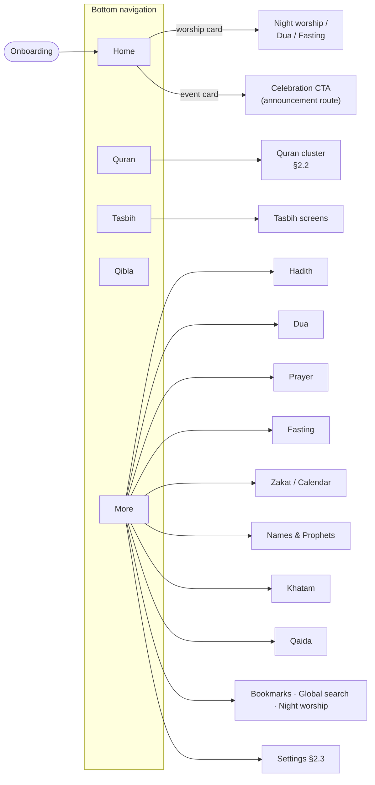
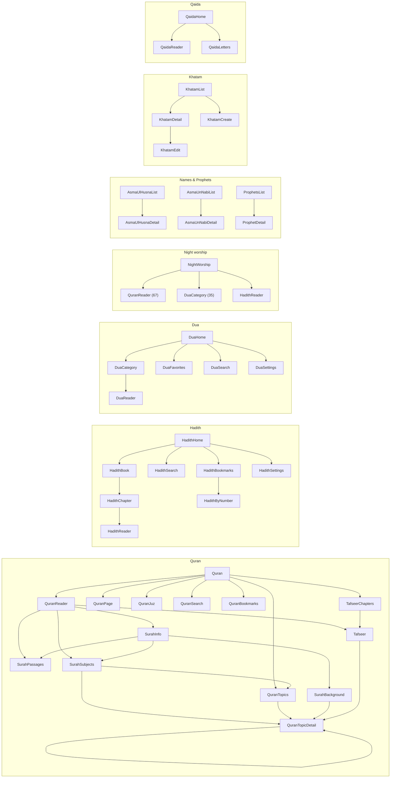
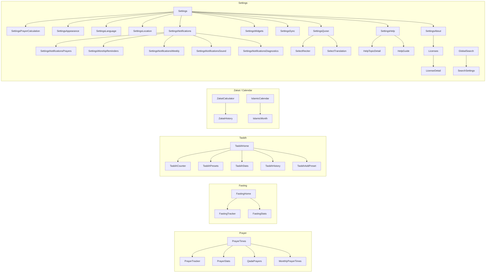
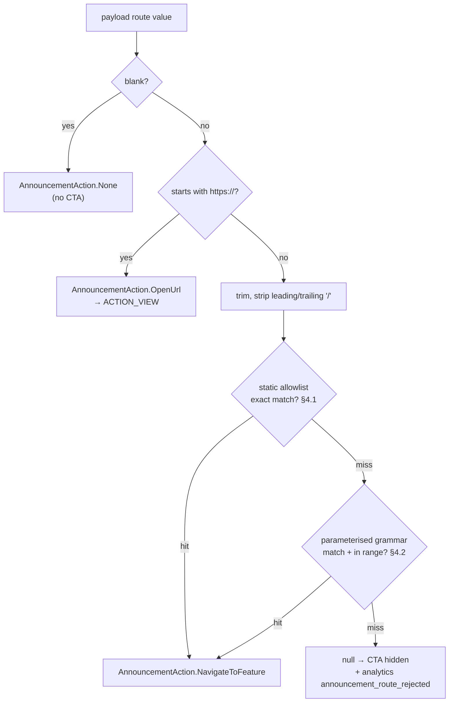

# Nimaz — Navigation Map

> **Owns:** the route graph, the full route reference, the announcement route grammar, the help
> deep-link grammar, and the screen-tag contract.
> **Update when:** you add, rename or remove a `Route`; wire or unwire a destination in
> `NavGraph.kt`; add a `ScreenTags` entry; or change an announcement route key or a help
> deep-link key.
> **Verified by:** `python3 scripts/check_docs.py --only NAV` (checks `NAV-01` … `NAV-10`).
> **Related:** [`ARCHITECTURE.md` §7](ARCHITECTURE.md#7-navigation) for the patterns,
> [`SUBSYSTEMS.md` §12](SUBSYSTEMS.md#12-engagement-announcements-fcm) for where announcement
> keys come from, [`DOCUMENTATION.md`](DOCUMENTATION.md) for the update contract.

---

## Contents

1. [How navigation works](#1-how-navigation-works)
2. [Graph](#2-graph)
3. [Route reference](#3-route-reference)
4. [Announcement route grammar](#4-announcement-route-grammar)
5. [Help deep-link grammar](#5-help-deep-link-grammar)
6. [Worship reminder destinations](#6-worship-reminder-destinations)
7. [Adding / changing a route — checklist](#7-adding--changing-a-route--checklist)

---

## 1. How navigation works

Navigation is **type-safe**: a `@Serializable sealed interface Route`
(`core/navigation/Routes.kt`) plus `taggedComposable<Route.X>` wiring in
`core/navigation/NavGraph.kt`. Typed arguments are read with
`backStackEntry.toRoute<Route.X>()`; you never build or parse a string path.
Bottom navigation is the `BottomNavDestination` enum.

**Four files own the whole surface**, and they move together:

| File | Owns | Cross-check |
|---|---|---|
| `core/navigation/Routes.kt` | the `Route` sealed interface — every destination that exists | `NAV-01`, `NAV-02` |
| `core/navigation/NavGraph.kt` | the `NavHost` — which routes are actually reachable | `NAV-03`, `NAV-04` |
| `core/navigation/ScreenTags.kt` | the stable test tag per destination | `NAV-05` |
| `core/navigation/AnnouncementRoutes.kt` + `HelpDeepLink.kt` | the two **external** entry grammars | `NAV-06` … `NAV-10` |

**Test hooks.** Every destination is wired via the local `taggedComposable<Route.X>` helper,
which wraps the screen in a full-size container carrying a stable `ScreenTags.X` tag; bottom-nav
items carry `ScreenTags.bottomNav(label)`. Instrumented UI tests assert *which screen is shown*
by these tags rather than by on-screen text, so they survive copy and locale changes. A bare
`composable<Route.X>` is a bug — `NAV-04` fails the build for it.

---

## 2. Graph

### 2.1 Top-level map

The five bottom-nav roots and what hangs off each. `More` is the hub for everything that is not
one of the four primary surfaces.

### 2.2 Content clusters

### 2.3 Practice & settings clusters

> These graphs show **primary reachability**, not every edge — most screens can also be reached
> via announcement routes, help deep links and cross-feature actions. The complete, authoritative
> list of destinations is §3; the complete list of external entry points is §4 and §5.

---

## 3. Route reference

All routes live in `core/navigation/Routes.kt` and are wired in `core/navigation/NavGraph.kt`
(91 `composable<Route.X>` destinations). `data object` = no args; `data class` = typed args.
Every route below also has a `ScreenTags` entry of the same name.

### 3.1 Bottom navigation (`BottomNavDestination`)
| Route | Args | Screen |
|-------|------|--------|
| `Home` | — | HomeScreen |
| `Quran` | — | QuranHomeScreen |
| `Tasbih` | — | TasbihHomeScreen |
| `QiblaNav` → `Qibla` | — | QiblaScreen |
| `More` | — | MoreScreen (hub) |

### 3.2 Quran
| Route | Args | Screen |
|-------|------|--------|
| `QuranReader` | `surahNumber: Int, ayahNumber: Int = 1` | QuranReaderScreen |
| `QuranPage` | `pageNumber: Int` | QuranPageScreen (mushaf) |
| `QuranJuz` | `juzNumber: Int` | QuranJuzScreen |
| `QuranSearch` | — | QuranSearchScreen |
| `QuranBookmarks` | — | QuranBookmarksScreen |
| `SurahInfo` | `surahNumber: Int` | SurahInfoScreen — a **hub**, not a document: identity, the numbers, `overview.summary`, and three counted ways into the long content |
| `SurahBackground` | `surahNumber: Int` | SurahBackgroundScreen — the surah's long-form background, read continuously under a sticky index of `SurahOverviewGroup` pills. Its own destination because the longest is 47 KB of prose |
| `SurahPassages` | `surahNumber: Int, currentAyah: Int? = null` | SurahPassagesScreen — the passage outline, up to 282 rows. `currentAyah` is supplied when it is opened **from the reader**, so the passage containing that verse is marked and scrolled to; null from surah info, where there is no such place to be |
| `TafseerChapters` | — | TafseerChaptersScreen — the surah picker that fronts the commentary; the `tafseer` announcement key and the `tafseer` help deep link both land here |
| `Tafseer` | `surahNumber: Int, ayahNumber: Int = 1` | TafseerScreen |
| `SurahSubjects` | `surahNumber: Int` | SurahSubjectsScreen — **the surah-scoped subject list**, ordered by how many of *this* surah's verses each subject takes. Its own destination rather than `QuranTopics` with an argument, because it answers a different question: the browser walks a hierarchy from its roots, this is a flat list of what these verses are cited under. Reached from surah info's "Subjects in this surah" and from the reader's overflow whenever a surah is on screen — both of which used to open `QuranTopics` at the top of the thematic tree, the same twenty roots whichever surah you came from. Offers `QuranTopics` at the bottom for the general question |
| `QuranTopics` | — | QuranTopicsScreen — the subject browser. **One route for the whole tree:** it expands in place and `QuranTopicsViewModel` holds the expanded set and the focus, so opening four levels and closing them again is one back-stack entry, not four. Reachable from the Qur'an home's browse card, from `SurahSubjects`, and from the reader's overflow in page/juz mode before a surah has resolved |
| `QuranTopicDetail` | `topicId: Int, tree: String = "thematic", fromSurah: Int? = null` | QuranTopicDetailScreen. `tree` is a `TopicTree.wire` value rather than the enum, because a route argument needs a `NavType`; an unrecognised value falls back to the thematic tree. `fromSurah` is the surah the reader arrived from: it filters nothing, but that surah's citations are pinned to the top of the list and badged, and it **travels with every lateral move** — subtopic, related subject, `topic:` cross-link — so the surah is not dropped one hop in. Reachable from `SurahSubjects`, from the browser, from a `topic:` link in a surah's background, from the Tafseer screen's topic chips, and **from itself** |
| `SelectReciter` | — | SelectReciterScreen |
| `SelectTranslation` | — | SelectTranslationScreen |

### 3.3 Hadith
| Route | Args | Screen |
|-------|------|--------|
| `HadithHome` | — | HadithCollectionScreen |
| `HadithBook` | `bookId: String` | HadithBookScreen |
| `HadithChapter` | `bookId: String, chapterId: String` | HadithChapterScreen |
| `HadithReader` | `hadithId: String` | HadithReaderScreen |
| `HadithByNumber` | `bookId: String, hadithNumber: Int` | HadithReaderScreen |
| `HadithSearch` | — | HadithSearchScreen |
| `HadithBookmarks` | — | HadithBookmarksScreen |
| `HadithSettings` | — | HadithSettingsScreen |

### 3.4 Dua
| Route | Args | Screen |
|-------|------|--------|
| `DuaHome` | — | DuasCollectionScreen |
| `DuaCategory` | `categoryId: String` | DuaCategoryScreen |
| `DuaReader` | `duaId: String` | DuaReaderScreen |
| `DuaFavorites` | — | DuaFavoritesScreen |
| `DuaSearch` | — | DuaSearchScreen |
| `DuaSettings` | — | DuaSettingsScreen |

### 3.5 Prayer
| Route | Args | Screen |
|-------|------|--------|
| `PrayerTimes` | — | PrayerTimesScreen |
| `PrayerTracker` | `initialTab: Int = 0` | PrayerTrackerScreen |
| `PrayerStats` | — | PrayerStatsScreen |
| `QadaPrayers` | — | QadaPrayersScreen |
| `MonthlyPrayerTimes` | — | MonthlyPrayerTimesScreen |

### 3.6 Fasting
| Route | Args | Screen |
|-------|------|--------|
| `FastingHome` | — | FastTrackerScreen |
| `FastingTracker` | — | FastTrackerScreen |
| `FastingStats` | — | (fasting stats) |

> **Makeup fasts is a tab inside `FastTrackerScreen`** (driven by `FastingEvent.LoadMakeupFasts`),
> not a standalone route. There is intentionally **no** `Route.MakeupFasts`.

### 3.7 Night worship
| Route | Args | Screen |
|-------|------|--------|
| `NightWorship` | — | NightWorshipScreen |

> **Reached from the Home worship card** (Tahajjud / Witr) **and from More → Daily Practice →
> Night Worship**, so the hub is usable outside the reminder window too. The other nine reminder
> types route to screens that already existed — see §6.
>
> The hub itself deep-links onward to `QuranReader(67)` (Al-Mulk), `DuaCategory(35)` (Witr & night
> prayer duas) and `HadithReader` (Bukhari 1145). It holds an **in-memory** rakah tally only:
> nothing is persisted, so there is no new entity, DAO or migration.

### 3.8 Tasbih
| Route | Args | Screen |
|-------|------|--------|
| `TasbihHome` | — | TasbihHomeScreen |
| `TasbihCounter` | `presetId: Long? = null` | TasbihCounterScreen |
| `TasbihPresets` | — | TasbihPresetsScreen |
| `TasbihStats` | — | TasbihStatsScreen |
| `TasbihHistory` | — | TasbihHistoryScreen |
| `TasbihAddPreset` | — | TasbihAddPresetScreen |

### 3.9 Zakat, Qibla, Calendar
| Route | Args | Screen |
|-------|------|--------|
| `ZakatCalculator` | — | ZakatCalculatorScreen |
| `ZakatHistory` | — | ZakatHistoryScreen |
| `Qibla` | — | QiblaScreen |
| `IslamicCalendar` | — | IslamicCalendarScreen |
| `IslamicMonth` | `month: Int, year: Int` | IslamicMonthScreen |

### 3.10 Qaida (children's Arabic reader)
| Route | Args | Screen |
|-------|------|--------|
| `QaidaHome` | — | QaidaHomeScreen |
| `QaidaReader` | `lessonId: Int` | QaidaReaderScreen |
| `QaidaLetters` | — | QaidaLettersScreen |

### 3.11 Names & Prophets
| Route | Args | Screen |
|-------|------|--------|
| `AsmaUlHusnaList` | — | AsmaUlHusnaListScreen |
| `AsmaUlHusnaDetail` | `nameId: Int` | AsmaUlHusnaDetailScreen |
| `AsmaUnNabiList` | — | AsmaUnNabiListScreen |
| `AsmaUnNabiDetail` | `nameId: Int` | AsmaUnNabiDetailScreen |
| `ProphetsList` | — | ProphetsListScreen |
| `ProphetDetail` | `prophetId: Int` | ProphetDetailScreen |

### 3.12 Khatam
| Route | Args | Screen |
|-------|------|--------|
| `KhatamList` | — | KhatamListScreen |
| `KhatamDetail` | `khatamId: Long` | KhatamDetailScreen |
| `KhatamCreate` | — | KhatamFormScreen (`khatamId = null`) |
| `KhatamEdit` | `khatamId: Long` | KhatamFormScreen (`khatamId = id`) |

`KhatamCreate` and `KhatamEdit` render the same `KhatamFormScreen`; a null id means create.
`KhatamEdit` is reached from the edit action in the detail screen's top bar, and also hosts
archive/delete, which previously lived behind an undiscoverable long-press on the list.

### 3.13 Settings
| Route | Args | Screen |
|-------|------|--------|
| `Settings` | — | SettingsScreen |
| `SettingsPrayerCalculation` | — | PrayerCalculationSettingsScreen |
| `SettingsNotifications` | — | NotificationSettingsScreen (hub → subscreens; #301) |
| `SettingsNotificationsPrayers` | — | PrayerNotificationsScreen (5 prayers · pre-adhan · sunrise; #301) |
| `SettingsWorshipReminders` | — | WorshipRemindersScreen (extended worship reminders: Tahajjud, Suhoor, Iftar, adhkar …; #300) |
| `SettingsNotificationsWeekly` | — | NotificationWeeklyScreen (Jumu'ah · Khatam; #301) |
| `SettingsNotificationsSound` | — | NotificationSoundScreen (adhan · muezzin · vibration · DND; #301) |
| `SettingsNotificationsDiagnostics` | — | NotificationDiagnosticsScreen (device checks · test · reset; #301) |
| `SettingsAppearance` | — | AppearanceSettingsScreen |
| `SettingsLanguage` | — | LanguageSettingsScreen |
| `SettingsLocation` | — | LocationSettingsScreen |
| `SettingsQuran` | — | QuranSettingsScreen |
| `SettingsWidgets` | — | WidgetsScreen |
| `SettingsSync` | — | SyncScreen |
| `SettingsAbout` | — | AboutScreen |
| `SettingsHelp` | — | HelpScreen |
| `HelpTopicDetail` | `topicId: String` | HelpTopicDetailScreen |
| `HelpGuide` | `guideId: String` | HelpGuideScreen |
| `Licenses` | — | LicensesScreen |
| `LicenseDetail` | `libraryHashCode: Int` | LicenseDetailScreen |

### 3.14 Search, bookmarks & onboarding
| Route | Args | Screen |
|-------|------|--------|
| `GlobalSearch` | — | SearchScreen — the unified library search, and the entry point for "Ask with Proof" |
| `SearchSettings` | — | SearchSettingsScreen — consent + configuration for the opt-in AI search (see [`ai-ask-with-proof.md`](ai-ask-with-proof.md)) |
| `AllBookmarks` | — | BookmarksScreen |
| `Onboarding` | — | OnboardingScreen |

---

## 4. Announcement route grammar

`core/navigation/AnnouncementRoutes.kt` turns the `route` (and `route2`) value of an FCM
announcement payload into a `Route`. It is **allowlist-only**: the Firebase console never sends a
serialized `Route`, so an old app version safely ignores a key it does not recognise — the banner
hides its CTA instead of navigating somewhere unexpected. See
[`SUBSYSTEMS.md` §12](SUBSYSTEMS.md#12-engagement-announcements-fcm) for the payload itself.

**Normalisation.** The key is trimmed and stripped of leading/trailing `/`, then matched
**case-sensitively**. An empty key, a malformed key, or an integer outside its documented range
all resolve to `null`: `announcementRoute(key)` never throws, and the announcement still renders —
only its CTA disappears.

### 4.1 Static allowlist (exact matches, checked first)

| Key | Route |
|---|---|
| `home` | `Home` |
| `quran` | `Quran` |
| `quran/search` | `QuranSearch` |
| `quran/bookmarks` | `QuranBookmarks` |
| `tafseer` | `TafseerChapters` |
| `hadith` | `HadithHome` |
| `hadith/search` | `HadithSearch` |
| `hadith/bookmarks` | `HadithBookmarks` |
| `dua` | `DuaHome` |
| `dua/favorites` | `DuaFavorites` |
| `dua/search` | `DuaSearch` |
| `tasbih` | `TasbihHome` |
| `tasbih/presets` | `TasbihPresets` |
| `tasbih/stats` | `TasbihStats` |
| `tasbih/history` | `TasbihHistory` |
| `qibla` | `Qibla` |
| `prayer/times` | `PrayerTimes` |
| `prayer/tracker` | `PrayerTracker` (default tab) |
| `prayer/stats` | `PrayerStats` |
| `prayer/qada` | `QadaPrayers` |
| `prayer/monthly` | `MonthlyPrayerTimes` |
| `fasting` | `FastingHome` |
| `fasting/tracker` | `FastingTracker` |
| `fasting/stats` | `FastingStats` |
| `zakat` | `ZakatCalculator` |
| `zakat/history` | `ZakatHistory` |
| `calendar` | `IslamicCalendar` |
| `qaida` | `QaidaHome` |
| `qaida/letters` | `QaidaLetters` |
| `khatam` | `KhatamList` |
| `names/allah` | `AsmaUlHusnaList` |
| `names/prophet` | `AsmaUnNabiList` |
| `prophets` | `ProphetsList` |
| `bookmarks` | `AllBookmarks` |
| `search` / `search/ask` | `GlobalSearch` |
| `search/settings` | `SearchSettings` |
| `settings` | `Settings` |
| `settings/appearance` | `SettingsAppearance` |
| `settings/language` | `SettingsLanguage` |
| `settings/location` | `SettingsLocation` |
| `settings/prayer-calculation` | `SettingsPrayerCalculation` |
| `settings/widgets` | `SettingsWidgets` |
| `settings/sync` | `SettingsSync` |
| `settings/about` | `SettingsAbout` |
| `settings/help` | `SettingsHelp` |
| `settings/notifications` | `SettingsNotifications` |
| `settings/notifications/worship` / `settings/worship` | `SettingsWorshipReminders` (#300) |
| `settings/notifications/prayers` | `SettingsNotificationsPrayers` (#301) |
| `settings/notifications/weekly` | `SettingsNotificationsWeekly` (#301) |
| `settings/notifications/sound` | `SettingsNotificationsSound` (#301) |
| `settings/notifications/diagnostics` | `SettingsNotificationsDiagnostics` (#301) |
| `settings/notifications/troubleshooting` | `SettingsNotificationsDiagnostics` — retained alias; the screen was renamed and this key is already published (#301) |

### 4.2 Parameterised grammar (pattern-matched after the allowlist)

| Key pattern | Route | Accepted values |
|---|---|---|
| `quran/surah/{n}` | `QuranReader` | `n` 1–114 |
| `quran/surah/{n}/ayah/{m}` | `QuranReader` | `n` 1–114, `m` 1–300 (a permissive upper bound — the reader clamps to the surah's real ayah count) |
| `quran/surah/{n}/info` | `SurahInfo` | `n` 1–114 |
| `quran/page/{n}` | `QuranPage` | `n` 1–`MushafScript.MAX_TOTAL_PAGES` (847). Validated against the **largest** edition so a page link resolves regardless of the reader's active script; the reader then clamps to that script's count — 604 Madani, 548 IndoPak-16, 610 IndoPak-15, 847 IndoPak-13 (#270) |
| `quran/juz/{n}` | `QuranJuz` | `n` 1–30 |
| `tafseer/{n}` | `Tafseer` | `n` 1–114 (surah) |
| `tafseer/{n}/ayah/{m}` | `Tafseer` | `n` 1–114, `m` 1–300 |
| `dua/category/{id}` | `DuaCategory` | non-blank category id (string) |
| `dua/reader/{id}` | `DuaReader` | non-blank dua id (string) |
| `hadith/book/{id}` | `HadithBook` | non-blank book id (string) |
| `hadith/book/{id}/chapter/{cid}` | `HadithChapter` | non-blank book + chapter id (string) |
| `hadith/{id}` | `HadithReader` | non-blank hadith id, **excluding** the reserved segments `book`, `search`, `bookmarks` (which belong to the rules above and to the allowlist) |
| `tasbih/counter` | `TasbihCounter` | no preset (starts a free count) |
| `tasbih/counter/{presetId}` | `TasbihCounter` | preset id (Long) |
| `prayer/tracker/{tab}` | `PrayerTracker` | tab index 0–10 (deliberately wider than today's tab count so adding a tab is not a breaking payload change) |
| `qaida/lesson/{n}` | `QaidaReader` | lesson number ≥ 1 |
| `calendar/{month}/{year}` | `IslamicMonth` | month 1–12, Hijri year (any Int) |
| `names/allah/{n}` | `AsmaUlHusnaDetail` | name id 1–99 |
| `names/prophet/{n}` | `AsmaUnNabiDetail` | name id 1–99 |
| `prophets/{id}` | `ProphetDetail` | prophet id 1–99 |
| `khatam/{id}` | `KhatamDetail` | khatam id (Long) — note this is a **local** row id, so it only resolves on the device that created that khatam |

**Rules for extending this grammar.**

1. Add the key to `staticAnnouncementRoute` (preferred — cheapest and least ambiguous) or to
   `parameterisedAnnouncementRoute`, and add its row above **in the same change**. `NAV-06` and
   `NAV-07` fail the build otherwise, in both directions.
2. Range-check every integer parameter. An unbounded `toIntOrNull()` lets a console typo push a
   user into a screen that then has to defend itself.
3. Never remove or repurpose a shipped key. Old announcements can still be sitting in a user's
   DataStore; a repurposed key silently sends them somewhere else. Add a new key instead.
4. If a new segment would collide with a free-form id (as `hadith/{id}` does), add it to the
   relevant reserved-segment set — `RESERVED_HADITH_SEGMENTS` is the worked example.
5. Add a case to `AnnouncementRoutesTest` covering both the happy path and one rejected value.

---

## 5. Help deep-link grammar

`core/navigation/HelpDeepLink.kt` maps a `deeplink` key in the bundled `help.json` content onto a
`Route`, so a help step can say "open this screen for me". It is the same allowlist shape as §4 —
exact match only, no parameters, unknown keys resolve to `null` and the step simply renders
without its jump button.

| Key | Route |
|---|---|
| `home` | `Home` |
| `settings` | `Settings` |
| `prayer_settings` | `SettingsPrayerCalculation` |
| `notifications` | `SettingsNotifications` |
| `worship_reminders` | `SettingsWorshipReminders` |
| `location` | `SettingsLocation` |
| `language` | `SettingsLanguage` |
| `appearance` | `SettingsAppearance` |
| `quran_settings` | `SettingsQuran` |
| `widgets` | `SettingsWidgets` |
| `qibla` | `Qibla` |
| `calendar` | `IslamicCalendar` |
| `fasting` | `FastingTracker` |
| `tasbih` | `TasbihHome` |
| `hadith` | `HadithHome` |
| `dua` | `DuaHome` |
| `tafseer` | `TafseerChapters` |
| `khatam` | `KhatamList` |
| `zakat` | `ZakatCalculator` |
| `prayer_tracker` | `PrayerTracker` (default tab) |
| `qada` | `QadaPrayers` |
| `qaida` | `QaidaHome` |

> The two grammars are deliberately **separate namespaces**: help keys are snake_case and
> authored alongside the help content, announcement keys are path-shaped and typed into the
> Firebase console. Do not alias one to the other — a shared table would mean a console typo
> could reach a help-only screen and vice versa.

---

## 6. Worship reminder destinations

`core/navigation/WorshipDestinations.kt` is the single source of truth mapping each
`WorshipReminderType` onto the screen its Home card and its notification open, and is asserted
exhaustively by `WorshipDestinationsTest` — so a new reminder type cannot ship without a
destination. Only `NightWorship` was added for it (§3.7); the other types route to screens that
already existed. See [`SUBSYSTEMS.md` §4](SUBSYSTEMS.md#4-prayer-time--adhan-notifications) for
how the reminders themselves are scheduled.

---

## 7. Adding / changing a route — checklist

1. Add a `@Serializable` entry to `Route` in `core/navigation/Routes.kt` (`data object` for
   no-arg, `data class` for typed args; give args sensible defaults).
2. Add a `const val X = "screen_x"` to `core/navigation/ScreenTags.kt`.
3. Wire it with `taggedComposable<Route.X>(ScreenTags.X) { backStackEntry -> … }` in
   `core/navigation/NavGraph.kt`; read typed args with `backStackEntry.toRoute<Route.X>()`.
   **Never** a bare `composable<Route.X>` — the screen would be untestable.
4. Put the screen under `presentation/screens/<feature>/`.
5. Navigate via the typed route object (`navController.navigate(Route.X(...))`).
6. If it should be reachable from a help step, add a key to `core/navigation/HelpDeepLink.kt`
   **and** to §5.
7. If it should be reachable from a pushed announcement, add a key to
   `core/navigation/AnnouncementRoutes.kt` **and** to §4, following the five rules there.
8. **Update this file** — add the route to the right table in §3, and to the §2 diagram if the
   high-level map changed. Validate the Mermaid.
9. Remember: **not every `Route` is a full screen** — some features are tabs/sections inside a
   parent screen (e.g. makeup fasts inside `FastTrackerScreen`). Don't add a `composable` for
   those, and don't leave an orphaned `Route` declaration either.
10. Run `python3 scripts/check_docs.py --only NAV`. It fails on an undocumented route, a
    documented route that no longer exists, a stale destination count, an untagged destination, a
    missing `ScreenTags` entry, and an undocumented announcement or help key — in both directions.

*Keep this file honest — a route that isn't in §3 is a documentation bug, and CI treats it as one.*
