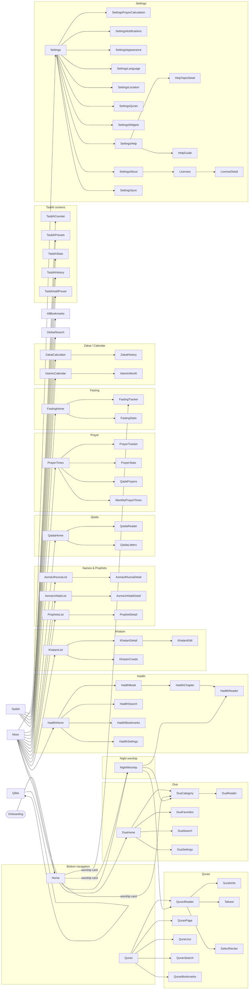

# Nimaz — Navigation Map

> **Single source of truth for the app's navigation graph.** Whenever you add, remove, or
> rename a `Route`, **update this file in the same change** (the diagram *and* the route table).
> See [`ARCHITECTURE.md` §7](ARCHITECTURE.md) for the navigation patterns and conventions.

Navigation is **type-safe**: a `@Serializable sealed interface Route`
(`core/navigation/Routes.kt`) plus `composable<Route.X>` wiring in
`core/navigation/NavGraph.kt`. Typed arguments are read with
`backStackEntry.toRoute<Route.X>()`. Bottom navigation is the `BottomNavDestination` enum.

> **Test hooks:** each destination is wired via the local `taggedComposable<Route.X>`
> helper, which wraps the screen in a container carrying a stable
> `ScreenTags.X` tag (`core/navigation/ScreenTags.kt`); bottom-nav items carry
> `ScreenTags.bottomNav(label)`. Instrumented UI tests assert navigation by these tags
> rather than on-screen text. Keep `ScreenTags` in sync when adding a `Route`.

## Graph

> The graph shows the primary reachability, not every edge (most screens can also be reached
> via deep links and cross-feature actions). `Home`, `Quran`, `Tasbih`, `Qibla`, and `More` are
> the five bottom-nav roots; `More` is the hub for everything else.

## Announcement route grammar

The announcement system (`core/navigation/AnnouncementRoutes.kt`) resolves feature keys into
`Route` objects in two tiers:

**Static allowlist** (exact matches, checked first): `bookmarks`, `fasting/tracker`,
`fasting/stats`, `prayer/monthly`, `zakat/history`, `tasbih/presets`, `tasbih/stats`,
`tasbih/history`, `hadith/search`, `hadith/bookmarks`, `dua/favorites`, `dua/search`,
`settings/appearance`, `settings/location`, `settings/language`, `settings/prayer-calculation`,
`settings/widgets`, `settings/sync`, `qaida/letters`,
`settings/notifications/worship` (and alias `settings/worship`) → the worship-reminders subscreen,
and the notification hub subscreens `settings/notifications/{prayers,weekly,sound,troubleshooting}` (#301).

**Parameterised grammar** (pattern-matched after static allowlist):
| Key pattern | Route | Range/format |
|---|---|---|
| `quran/surah/{n}` | `QuranReader` | 1–114 (surah number) |
| `quran/surah/{n}/ayah/{m}` | `QuranReader` | 1–114 surah; 1–286 ayah per surah |
| `quran/page/{n}` | `QuranPage` | 1–`QuranEditions.maxTotalPages` (604; largest edition — the reader clamps to the active edition's count, 548 for IndoPak-16) |
| `quran/juz/{n}` | `QuranJuz` | 1–30 (juz/part number) |
| `tafseer/{n}` | `Tafseer` | 1–114 (surah number) |
| `dua/category/{slug}` | `DuaCategory` | category id (string) |
| `dua/reader/{slug}` | `DuaReader` | dua id (string) |
| `hadith/book/{id}` | `HadithBook` | book id (string) |
| `hadith/book/{id}/chapter/{cid}` | `HadithChapter` | book id + chapter id (string) |
| `hadith/{id}` | `HadithReader` | hadith id (string) |
| `tasbih/counter[/{presetId}]` | `TasbihCounter` | optional preset id (long) |
| `prayer/tracker/{tab}` | `PrayerTracker` | tab index (0–3) |
| `qaida/lesson/{n}` | `QaidaReader` | lesson number (int) |
| `calendar/{month}/{year}` | `IslamicMonth` | month 1–12, year (int) |
| `names/allah/{n}` | `AsmaUlHusnaDetail` | name id 1–99 |
| `names/prophet/{n}` | `AsmaUnNabiDetail` | name id 1–99 |
| `prophets/{id}` | `ProphetDetail` | prophet id (int) |
| `khatam/{id}` | `KhatamDetail` | khatam id (long) |

Malformed keys or out-of-range integers resolve to `null`; the CTA is hidden (announcement
remains visible but cannot navigate). Keys not matching the allowlist or grammar are never
assumed — `announcementRoute(key)` always succeeds in parsing but safely returns `null` on
semantic failure.

## Route reference

All routes live in `core/navigation/Routes.kt` and are wired in `core/navigation/NavGraph.kt`
(75 `composable<Route.X>` destinations). `data object` = no args; `data class` = typed args.

### Bottom navigation (`BottomNavDestination`)
| Route | Screen |
|-------|--------|
| `Home` | HomeScreen |
| `Quran` | QuranHomeScreen |
| `Tasbih` | TasbihHomeScreen |
| `QiblaNav` → `Qibla` | QiblaScreen |
| `More` | MoreScreen (hub) |

### Quran
| Route | Args | Screen |
|-------|------|--------|
| `QuranReader` | `surahNumber: Int, ayahNumber: Int = 1` | QuranReaderScreen |
| `QuranPage` | `pageNumber: Int` | QuranPageScreen (mushaf) |
| `QuranJuz` | `juzNumber: Int` | QuranJuzScreen |
| `QuranSearch` | — | QuranSearchScreen |
| `QuranBookmarks` | — | QuranBookmarksScreen |
| `SurahInfo` | `surahNumber: Int` | SurahInfoScreen |
| `Tafseer` | `surahNumber: Int, ayahNumber: Int = 1` | TafseerScreen |
| `SelectReciter` | — | SelectReciterScreen |

### Hadith
| Route | Args | Screen |
|-------|------|--------|
| `HadithHome` | — | HadithCollectionScreen |
| `HadithBook` | `bookId: String` | HadithBookScreen |
| `HadithChapter` | `bookId: String, chapterId: String` | HadithChapterScreen |
| `HadithReader` | `hadithId: String` | HadithReaderScreen |
| `HadithSearch` | — | HadithSearchScreen |
| `HadithBookmarks` | — | HadithBookmarksScreen |
| `HadithSettings` | — | HadithSettingsScreen |

### Dua
| Route | Args | Screen |
|-------|------|--------|
| `DuaHome` | — | DuasCollectionScreen |
| `DuaCategory` | `categoryId: String` | DuaCategoryScreen |
| `DuaReader` | `duaId: String` | DuaReaderScreen |
| `DuaFavorites` | — | DuaFavoritesScreen |
| `DuaSearch` | — | DuaSearchScreen |
| `DuaSettings` | — | DuaSettingsScreen |

### Prayer
| Route | Args | Screen |
|-------|------|--------|
| `PrayerTimes` | — | PrayerTimesScreen |
| `PrayerTracker` | `initialTab: Int = 0` | PrayerTrackerScreen |
| `PrayerStats` | — | PrayerStatsScreen |
| `QadaPrayers` | — | QadaPrayersScreen |
| `MonthlyPrayerTimes` | — | MonthlyPrayerTimesScreen |

### Fasting
| Route | Args | Screen |
|-------|------|--------|
| `FastingHome` | — | FastTrackerScreen |
| `FastingTracker` | — | FastTrackerScreen |
| `FastingStats` | — | (fasting stats) |

### Night worship
| Route | Args | Screen |
|-------|------|--------|
| `NightWorship` | — | NightWorshipScreen |

> **Reached from the Home worship card** (Tahajjud / Witr) **and from More → Daily Practice →
> Night Worship**, so the hub is usable outside the reminder window too. The other nine
> reminder types route to screens that already existed — see the table in
> `core/navigation/WorshipDestinations.kt`, which is the single source of truth for the mapping and
> is asserted exhaustively by `WorshipDestinationsTest`.
>
> The hub itself deep-links onward to `QuranReader(67)` (Al-Mulk), `DuaCategory(35)` (Witr & night
> prayer duas) and `HadithReader` (Bukhari 1145). It holds an **in-memory** rakah tally only:
> nothing is persisted, so there is no new entity, DAO or migration.

> **Makeup fasts is a tab inside `FastTrackerScreen`** (driven by `FastingEvent.LoadMakeupFasts`),
> not a standalone route. There is intentionally **no** `Route.MakeupFasts`.

### Tasbih
| Route | Args | Screen |
|-------|------|--------|
| `TasbihHome` | — | TasbihHomeScreen |
| `TasbihCounter` | `presetId: Long? = null` | TasbihCounterScreen |
| `TasbihPresets` | — | TasbihPresetsScreen |
| `TasbihStats` | — | TasbihStatsScreen |
| `TasbihHistory` | — | TasbihHistoryScreen |
| `TasbihAddPreset` | — | TasbihAddPresetScreen |

### Zakat, Qibla, Calendar
| Route | Args | Screen |
|-------|------|--------|
| `ZakatCalculator` | — | ZakatCalculatorScreen |
| `ZakatHistory` | — | ZakatHistoryScreen |
| `Qibla` | — | QiblaScreen |
| `IslamicCalendar` | — | IslamicCalendarScreen |
| `IslamicMonth` | `month: Int, year: Int` | IslamicMonthScreen |

### Qaida (children's Arabic reader)
| Route | Args | Screen |
|-------|------|--------|
| `QaidaHome` | — | QaidaHomeScreen |
| `QaidaReader` | `lessonId: Int` | QaidaReaderScreen |
| `QaidaLetters` | — | QaidaLettersScreen |

### Names & Prophets
| Route | Args | Screen |
|-------|------|--------|
| `AsmaUlHusnaList` | — | AsmaUlHusnaListScreen |
| `AsmaUlHusnaDetail` | `nameId: Int` | AsmaUlHusnaDetailScreen |
| `AsmaUnNabiList` | — | AsmaUnNabiListScreen |
| `AsmaUnNabiDetail` | `nameId: Int` | AsmaUnNabiDetailScreen |
| `ProphetsList` | — | ProphetsListScreen |
| `ProphetDetail` | `prophetId: Int` | ProphetDetailScreen |

### Khatam
| Route | Args | Screen |
|-------|------|--------|
| `KhatamList` | — | KhatamListScreen |
| `KhatamDetail` | `khatamId: Long` | KhatamDetailScreen |
| `KhatamCreate` | — | KhatamFormScreen (`khatamId = null`) |
| `KhatamEdit` | `khatamId: Long` | KhatamFormScreen (`khatamId = id`) |

`KhatamCreate` and `KhatamEdit` render the same `KhatamFormScreen`; a null id means
create. `KhatamEdit` is reached from the edit action in the detail screen's top bar, and
also hosts archive/delete, which previously lived behind an undiscoverable long-press on
the list.

### Settings & misc
| Route | Args | Screen |
|-------|------|--------|
| `Settings` | — | SettingsScreen |
| `SettingsPrayerCalculation` | — | PrayerCalculationSettingsScreen |
| `SettingsNotifications` | — | NotificationSettingsScreen (hub → subscreens; #301) |
| `SettingsNotificationsPrayers` | — | PrayerNotificationsScreen (5 prayers · pre-adhan · sunrise; #301) |
| `SettingsWorshipReminders` | — | WorshipRemindersScreen (extended worship reminders: Tahajjud, Suhoor, Iftar, adhkar …; #300) |
| `SettingsNotificationsWeekly` | — | NotificationWeeklyScreen (Jumu'ah · Khatam; #301) |
| `SettingsNotificationsSound` | — | NotificationSoundScreen (adhan · muezzin · vibration · DND; #301) |
| `SettingsNotificationsTroubleshooting` | — | NotificationTroubleshootingScreen (test · reset · battery; #301) |
| `SettingsAppearance` | — | AppearanceSettingsScreen |
| `SettingsLanguage` | — | LanguageSettingsScreen |
| `SettingsLocation` | — | LocationSettingsScreen |
| `SettingsQuran` | — | QuranSettingsScreen |
| `SettingsWidgets` | — | WidgetsScreen |
| `SettingsAbout` | — | AboutScreen |
| `SettingsHelp` | — | HelpScreen |
| `HelpTopicDetail` | `topicId: String` | HelpTopicDetailScreen |
| `HelpGuide` | `guideId: String` | HelpGuideScreen |
| `SettingsSync` | — | SyncScreen |
| `Licenses` | — | LicensesScreen |
| `LicenseDetail` | `libraryHashCode: Int` | LicenseDetailScreen |
| `Onboarding` | — | OnboardingScreen |
| `AllBookmarks` | — | BookmarksScreen |
| `GlobalSearch` | — | SearchScreen |

## Adding / changing a route — checklist

1. Add a `@Serializable` entry to `Route` in `core/navigation/Routes.kt` (`data object` for
   no-arg, `data class` for typed args; give args sensible defaults).
2. Add a `composable<Route.X> { backStackEntry -> ... }` in `core/navigation/NavGraph.kt`; read
   typed args with `backStackEntry.toRoute<Route.X>()`.
3. Put the screen under `presentation/screens/<feature>/`.
4. Navigate via the typed route object (`navController.navigate(Route.X(...))`).
5. If it's a deep-link target, wire it in `core/navigation/HelpDeepLink.kt`.
6. **Update this file** — add the route to the table and (if it changes the high-level map) the
   diagram. Validate the diagram (Mermaid).
7. Remember: **not every `Route` is a full screen** — some features are tabs/sections inside a
   parent screen (e.g. makeup fasts inside `FastTrackerScreen`). Don't add a `composable` for
   those, and don't leave an orphaned `Route` declaration either.

*Keep this file honest — a route that isn't in this table is a documentation bug.*
</content>
