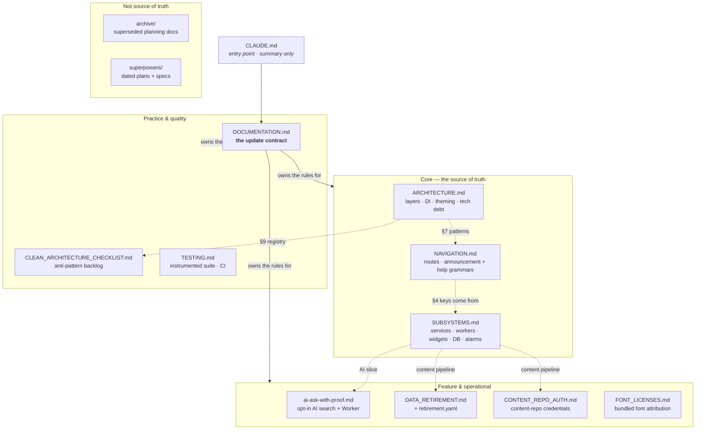

# Nimaz — Documentation

The `docs/` folder is the source of truth for how this app is built. Read the doc that owns the
area you are about to change **before** you change it, and update it **in the same commit** — the
rules for that are in [`DOCUMENTATION.md`](DOCUMENTATION.md), and 23 of them are enforced by
`python3 scripts/check_docs.py` on every PR.

---

## Start here

| I want to… | Read |
|---|---|
| understand how the app is layered, and add a feature the right way | [`ARCHITECTURE.md`](ARCHITECTURE.md) |
| find a screen, add a route, or wire a deep link | [`NAVIGATION.md`](NAVIGATION.md) |
| touch anything that runs outside a screen — alarms, workers, widgets, the DB | [`SUBSYSTEMS.md`](SUBSYSTEMS.md) |
| know what the docs owe you, and what you owe them | [`DOCUMENTATION.md`](DOCUMENTATION.md) |

New to the codebase: [`ARCHITECTURE.md`](ARCHITECTURE.md) §0–§3 → [`NAVIGATION.md`](NAVIGATION.md)
§1–§2 → the [`SUBSYSTEMS.md`](SUBSYSTEMS.md) §0 map. That is about an hour and covers most of what
a change will touch.

---

## The map



---

## Index

Everything in `docs/` that is current and maintained. Each doc states what it owns and when to
update it in its header block.

| Doc | Owns | Mechanically checked |
|---|---|---|
| [`DOCUMENTATION.md`](DOCUMENTATION.md) | the documentation contract: ownership matrix, house style, diagram standard, drift checks | `DOC-01` … `DOC-04` |
| [`ARCHITECTURE.md`](ARCHITECTURE.md) | layer patterns, DI, navigation and theming conventions, the design system, the new-feature recipe, and the tech-debt registry (§9) | review |
| [`NAVIGATION.md`](NAVIGATION.md) | the route graph, the full route reference, the announcement route grammar, the help deep-link grammar, screen tags | `NAV-01` … `NAV-10` |
| [`SUBSYSTEMS.md`](SUBSYSTEMS.md) | every cross-cutting runtime subsystem, plus the §0 inventory of services, workers, widgets, DataStore files and notification channels | `SUB-01` … `SUB-09` |
| [`CLEAN_ARCHITECTURE_CHECKLIST.md`](CLEAN_ARCHITECTURE_CHECKLIST.md) | the tick-box anti-pattern backlog, with a detection command per item | review |
| [`TESTING.md`](TESTING.md) | the instrumented suite, how it is wired, and what it covers | review |
| [`ai-ask-with-proof.md`](ai-ask-with-proof.md) | the opt-in "Ask with Proof" feature: the Cloudflare Worker, the `search-assist` capability contract, local proof resolution, consent, cost model, setup runbook | review |
| [`DATA_RETIREMENT.md`](DATA_RETIREMENT.md) | why and when shipped data, seeders and migration paths may be retired; the ledger's rules | review |
| [`retirement.yaml`](retirement.yaml) | the retirement ledger itself — one entry per retirement, with its gate | review |
| [`CONTENT_REPO_AUTH.md`](CONTENT_REPO_AUTH.md) | how CI and local builds authenticate to the private content repository | review |
| [`FONT_LICENSES.md`](FONT_LICENSES.md) | attribution and shipping sign-off for every bundled font | review |

### Not source of truth

| Location | What it is |
|---|---|
| [`archive/`](archive/) | superseded planning documents (the "Nimaz Pro" set). Kept because they explain why parts of the code look the way they do — never as a statement of how things work now |
| `superpowers/plans/`, `superpowers/specs/` | dated per-change design records. Written once, never updated |
| `design/`, `quran/` | design mockups and reference sheets for individual features |

---

## Verifying the docs

```bash
python3 scripts/check_docs.py            # all 23 checks — no dependencies, no toolchain
python3 scripts/check_docs.py --only NAV # one family: NAV | SUB | DOC
python3 scripts/check_docs.py --list     # what each check guards

npm install --no-save mermaid jsdom      # every diagram actually parses
node scripts/check_mermaid.mjs
```

Both run on every PR via `.github/workflows/docs_check.yml`. A failure names the check, what the
code says, what the doc says, and which file to edit. See
[`DOCUMENTATION.md` §4](DOCUMENTATION.md#4-the-drift-checks) for the full list and for how to add
a check when you introduce a new list-shaped claim.
