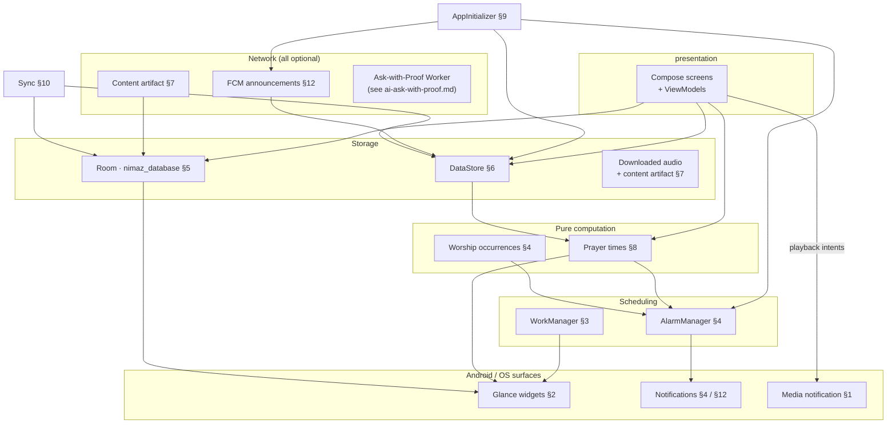
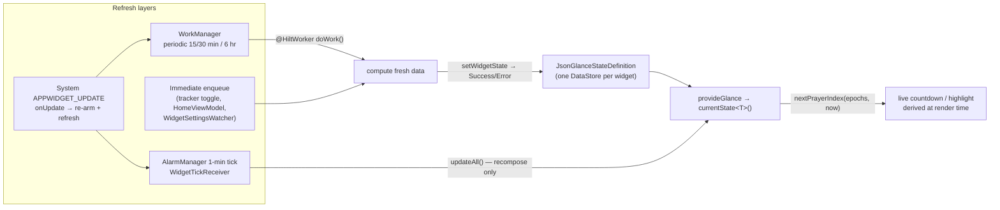
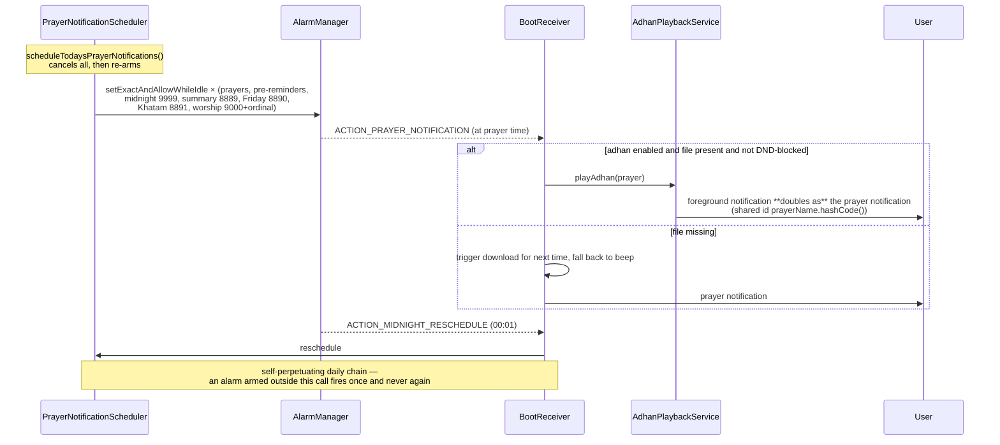
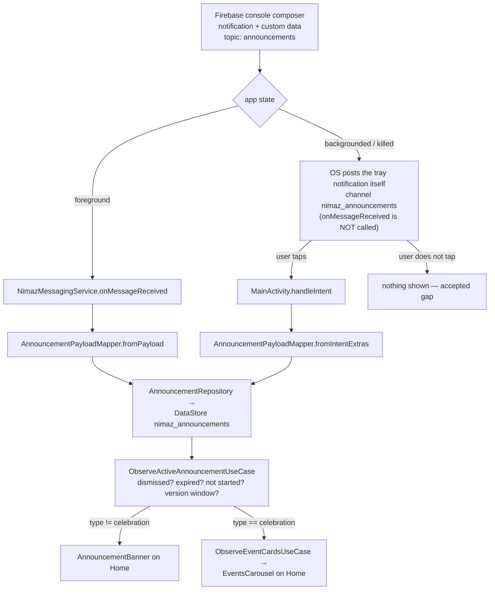

# Nimaz — Subsystems Guide

> **Owns:** every cross-cutting runtime subsystem — audio, widgets, background work,
> notifications and channels, the database and its migrations, preferences/DataStore, content
> delivery, prayer-time calculation, init & monitoring, sync, sharing, and FCM announcements.
> Also owns the **component inventory** in §0: every Service, Worker, widget, DataStore file and
> notification channel the app ships.
> **Update when:** you add/rename/remove a Service, Worker, widget, notification channel,
> DataStore file, Room migration (and `NIMAZ_DATABASE_VERSION`), content-version key, sync
> payload field, or FCM payload key — or change how any of those behave.
> **Verified by:** `python3 scripts/check_docs.py --only SUB` (checks `SUB-01` … `SUB-09`).
> **Related:** [`ARCHITECTURE.md`](ARCHITECTURE.md) for how features are *layered* (read it
> first — this doc assumes it), [`NAVIGATION.md`](NAVIGATION.md) for the route graph,
> [`DOCUMENTATION.md`](DOCUMENTATION.md) for the update contract.

App package root: `com.arshadshah.nimaz`
Source root: `app/src/main/java/com/arshadshah/nimaz/`

---

## Table of contents

0. [Subsystem map & component inventory](#0-subsystem-map--component-inventory)
1. [Audio playback](#1-audio-playback)
2. [Glance widgets](#2-glance-widgets)
3. [Background work (WorkManager)](#3-background-work-workmanager)
4. [Prayer-time / adhan notifications](#4-prayer-time--adhan-notifications)
5. [Database & migrations](#5-database--migrations)
6. [Preferences (DataStore)](#6-preferences-datastore)
7. [Content seeding & versioning](#7-content-seeding--versioning)
8. [Prayer-time calculation](#8-prayer-time-calculation)
9. [App initialization & monitoring](#9-app-initialization--monitoring)
10. [Device-to-device sync](#10-device-to-device-sync)
11. [Content sharing](#11-content-sharing)
12. [Engagement announcements (FCM)](#12-engagement-announcements-fcm)
13. [Keeping this doc updated](#keeping-this-doc-updated)

---

## 0. Subsystem map & component inventory

### 0.1 How the subsystems relate



Everything the app *needs* to work is inside `Storage` and `Pure computation`; every box under
`Network` is optional and degrades to "nothing happens" when absent. That is the offline-first
guarantee stated as a picture.

### 0.2 Services

Long-lived Android `Service`s. Adding one means a manifest entry, a notification channel, and a
row here.

| Service | Package | Kind | Section |
|---|---|---|---|
| `QuranAudioService` | `data/audio/` | foreground `mediaPlayback` — Quran recitation, owns the `MediaSession` | [§1](#1-audio-playback) |
| `AdhanPlaybackService` | `data/audio/` | foreground `mediaPlayback` — adhan playback when a prayer fires | [§1](#1-audio-playback) |
| `AdhanDownloadService` | `data/audio/` | foreground `dataSync` — adhan file download | [§1](#1-audio-playback), [§3](#3-background-work-workmanager) |
| `NimazMessagingService` | `data/announcement/` | `FirebaseMessagingService` — the app's only one | [§12](#12-engagement-announcements-fcm) |

### 0.3 Workers

Every `@HiltWorker CoroutineWorker` in the app. All widget workers are enqueued through
`widget/core/WidgetWork.kt`.

**A widget worker holds no logic.** Each `doWork()` is *get glance ids → `dataSource.load()` →
write state*, with the computation in an injectable `XxxWidgetDataSource` beside it. That split
is not cosmetic — it is the only way this code is testable at all. `doWork()` opens by asking
`GlanceAppWidgetManager` for the widget's glance ids and returns `Result.success()` when there
are none, and **a test device never has a widget placed**, so the entire body is unreachable from
an instrumented test. `WidgetWorkersTest` was green for a year while asserting nothing about what
any widget displays; it proves the `@AssistedInject` graph resolves, which is worth having and is
all it does. Anything that can be wrong belongs in the data source, where it has JVM tests.

A data source takes `TodayProvider` and `java.time.Clock` rather than calling `LocalDate.now()`
or `Clock.System.now()` — without that seam the rollover branches (tomorrow's Fajr, the date
label) cannot be tested, and those are the states the widgets sit in most of the time.

| Worker | Package | Trigger | Section |
|---|---|---|---|
| `NextPrayerWorker` | `widget/nextprayer/` | periodic 15 min + widget `onEnabled`/`onUpdate` + settings change | [§2](#2-glance-widgets) |
| `PrayerTimesWorker` | `widget/prayertimes/` | periodic 15 min + widget `onEnabled`/`onUpdate` + settings change | [§2](#2-glance-widgets) |
| `PrayerTrackerWorker` | `widget/prayertracker/` | periodic 30 min + immediate on toggle + settings change | [§2](#2-glance-widgets) |
| `HijriDateWorker` | `widget/hijridate/` | periodic 6 hr + widget `onEnabled`/`onUpdate` + settings change | [§2](#2-glance-widgets) |
| `HijriCalendarWorker` | `widget/hijricalendar/` | periodic 6 hr + widget `onEnabled`/`onUpdate` + settings change | [§2](#2-glance-widgets) |
| `KhatamWorker` | `widget/khatam/` | periodic 30 min + widget `onEnabled`/`onUpdate` + settings change | [§2](#2-glance-widgets) |
| `AdhanDownloadWorker` | `data/audio/` | one-shot fallback when a foreground service can't start | [§3](#3-background-work-workmanager) |

### 0.4 Widgets

| Widget | Package | Refresh | State type |
|---|---|---|---|
| Next Prayer | `widget/nextprayer/` | Worker 15 min + AlarmManager 1 min tick + `onUpdate` | `NextPrayerWidgetState` |
| Prayer Times | `widget/prayertimes/` | Worker 15 min + 1 min tick + `onUpdate` | `PrayerTimesWidgetState` |
| Prayer Tracker | `widget/prayertracker/` | Worker 30 min + immediate on toggle + `onUpdate` | `PrayerTrackerWidgetState` |
| Hijri Date | `widget/hijridate/` | Worker 6 hr + `onUpdate` | `HijriDateWidgetState` |
| Hijri Calendar | `widget/hijricalendar/` | Worker 6 hr + `onUpdate` | `HijriCalendarWidgetState` |
| Khatam | `widget/khatam/` | Worker 30 min + `onUpdate` | `KhatamWidgetState` |

Every widget also refreshes when a setting it is computed from changes, via
`WidgetSettingsWatcher` ([§2](#2-glance-widgets)).

### 0.5 DataStore files

Each is a separate file on disk; a new one is a new migration surface, so prefer adding keys to
`nimaz_preferences` unless the slice is genuinely self-contained.

Three are Preferences DataStores created with `preferencesDataStore(name = …)`. The fourth entry
is a **typed** DataStore built by hand with `DataStoreFactory.create`, which takes its file name
as a parameter rather than a literal — so it is listed by its owner.

| File name | Owner | Holds | Section |
|---|---|---|---|
| `nimaz_preferences` | `core/datastore/PreferencesDataStore.kt` | every user setting; the sync payload's `preferences` block | [§6](#6-preferences-datastore) |
| `nimaz_announcements` | `core/datastore/AnnouncementLocalDataSource.kt` | the current announcement (JSON) + permanently dismissed ids | [§12](#12-engagement-announcements-fcm) |
| `nimaz_ai_device` | `core/datastore/DeviceIdProvider.kt` | the rotating pseudonymous device id sent with Ask-with-Proof calls | [`ai-ask-with-proof.md`](ai-ask-with-proof.md) |
| `<widget>_widget` × 6 | `JsonGlanceStateDefinition` (`widget/core/`) | one JSON-serialized Glance state per widget: `next_prayer_widget`, `prayer_times_widget`, `prayer_tracker_widget`, `hijri_date_widget`, `hijri_calendar_widget`, `khatam_widget` | [§2](#2-glance-widgets) |

The widget stores hold **rendered state, never user data**: each is a cache a worker refills, and
a corrupt one is replaced with the default rather than migrated ([§2](#2-glance-widgets)). They
are deliberately outside the sync payload for that reason.

> Not a DataStore, and correctly outside this table: `SharedPreferencesContentArtifactStore`
> (`data/local/content/ContentArtifactStore.kt`, in `:core:database`) is a `SharedPreferences` file.

### 0.6 Notification channels

Channels are created eagerly (`PrayerNotificationScheduler.init`, `AnnouncementBootstrap`, or the
owning service's `onCreate`). **Android ignores property changes after a channel exists** — that
is why vibration is modelled as a *pair* of channels rather than a per-notification flag.

| Channel id | Constant | Importance | Created by | Section |
|---|---|---|---|---|
| `prayer_notifications` | `CHANNEL_ID_PRAYER` | HIGH | `PrayerNotificationScheduler` | [§4](#4-prayer-time--adhan-notifications) |
| `prayer_notifications_silent` | `CHANNEL_ID_PRAYER_SILENT` | HIGH, no vibration | `PrayerNotificationScheduler` | [§4](#4-prayer-time--adhan-notifications) |
| `prayer_notifications_muted` | `CHANNEL_ID_PRAYER_MUTED` | LOW, no sound, no vibration | `PrayerNotificationScheduler` | [§4](#4-prayer-time--adhan-notifications) |
| `adhan_notifications` | `CHANNEL_ID_ADHAN` | HIGH | `PrayerNotificationScheduler` | [§4](#4-prayer-time--adhan-notifications) |
| `adhan_notifications_silent` | `CHANNEL_ID_ADHAN_SILENT` | HIGH, no vibration | `PrayerNotificationScheduler` | [§4](#4-prayer-time--adhan-notifications) |
| `daily_summary_notifications` | `CHANNEL_ID_DAILY_SUMMARY` | DEFAULT | `PrayerNotificationScheduler` | [§4](#4-prayer-time--adhan-notifications) |
| `khatam_notifications` | `CHANNEL_ID_KHATAM` | DEFAULT | `PrayerNotificationScheduler` | [§4](#4-prayer-time--adhan-notifications) |
| `worship_reminders` | `CHANNEL_ID_WORSHIP` | DEFAULT | `PrayerNotificationScheduler` | [§4](#4-prayer-time--adhan-notifications) |
| `adhan_playback_channel` | `AdhanPlaybackService.CHANNEL_ID` | LOW | `AdhanPlaybackService` | [§1](#1-audio-playback) |
| `adhan_download_channel` | `AdhanDownloadService.CHANNEL_ID` | LOW | `AdhanDownloadService` | [§1](#1-audio-playback) |
| `quran_audio_channel` | `QuranAudioService.CHANNEL_ID` | LOW | `QuranAudioService` | [§1](#1-audio-playback) |
| `nimaz_announcements` | `AnnouncementBootstrap.CHANNEL_ID` | LOW | `AnnouncementBootstrap` | [§12](#12-engagement-announcements-fcm) |

> `adhan_playback_channel` is created but the visible notification is posted on
> `adhan_notifications` — see §4. It is kept because the foreground service must declare *some*
> channel at start.

---

## 1. Audio playback

All in `data/audio/`. There are **three independent playback engines** (Quran recitation,
Adhan, Qaida tap-to-hear) plus an Adhan **download** pipeline. They share no player instance.

**Manager / service split.** The *manager* owns the player + playback logic and exposes a
`StateFlow`; the *service* is a foreground `Service` that only owns the notification /
`MediaSession` lifecycle and routes control intents back into the manager.

| Class | Role |
|---|---|
| `data/audio/QuranAudioManager.kt` | `@Singleton`; one `ExoPlayer`, gapless ayah playlist, exposes `val audioState: StateFlow<AudioState>` |
| `data/audio/QuranAudioService.kt` | `@AndroidEntryPoint` foreground `mediaPlayback` service; `MediaStyle` notification (channel `quran_audio_channel`, id 1001) over the manager's `ForwardingPlayer` |
| `data/audio/AdhanAudioManager.kt` | `@Singleton`; legacy `MediaPlayer` for in-app `preview()`, plus adhan **download** logic; exposes `isPlaying`, `currentlyPlaying`, `downloadState` flows |
| `data/audio/AdhanPlaybackService.kt` | foreground `mediaPlayback` service; plays the adhan when a prayer fires (works app-closed) using `ExoPlayer` with `USAGE_ALARM` + wake lock + audio focus |
| `data/audio/AdhanDownloadService.kt` | foreground `dataSync` service that downloads both adhan variants with a progress notification (channel `adhan_download_channel`, id 7777) |
| `data/audio/AdhanDownloadWorker.kt` | `@HiltWorker` background fallback for the download (see §3) |
| `data/audio/QaidaAudioManager.kt` | `@Singleton`; stripped-down `ExoPlayer` for single Qaida tokens — **no service/notification/MediaSession/CDN**; exposes `val state: StateFlow<QaidaAudioState>` and `val completions: SharedFlow<String>` |
| `data/audio/AdhanSound.kt` | enum of adhans (MISHARY, ABDUL_BASIT, MAKKAH, SIMPLE_BEEP) with per-variant file names + download URLs |

**Wiring.** None of these have a DI module — the managers are `@Singleton @Inject constructor(@ApplicationContext …)` (Hilt provides them automatically) and the services are `@AndroidEntryPoint` field-injecting their manager. Services are declared in `AndroidManifest.xml` with `foregroundServiceType` `mediaPlayback`/`dataSync`; permissions `FOREGROUND_SERVICE`, `FOREGROUND_SERVICE_MEDIA_PLAYBACK`, `FOREGROUND_SERVICE_DATA_SYNC`.

**Media3/ExoPlayer specifics (Quran).** Ayahs are downloaded first then added as a `List<MediaItem>` for gapless sequential playback. ExoPlayer reports `0` duration for unloaded items, so durations are pre-extracted with `MediaMetadataRetriever`; a `ForwardingPlayer` (`getPlayer()`) translates per-item ExoPlayer position/duration into **whole-surah** ("total playlist") coordinates so the lock-screen scrubber reflects the surah, not one ayah. Recitations stream from `cdn.islamic.network`, cached under `filesDir/quran_audio/`. **Who** the reciters are is the `QuranReciter` catalogue in `domain/model/QuranReciter.kt` (frozen `id` + `aliases` for ids older builds persisted, display name, country, `RecitationStyle`); only the CDN wiring — which edition slug at which bitrate — stays in the data layer, as `RECITER_CDN_MAP`, now keyed by the enum. Before that the catalogue existed three times over (a `popularReciters` list in `SelectReciterScreen`, the map plus a `getReciterDisplayName` `when` in `QuranAudioManager`, and a third `when` in `QuranSettingsScreen`) and they disagreed: the settings row matched on ids the picker never writes, so eight of the ten reciters left it showing a raw id ("hussary") instead of a name. Three reciters that had working CDN editions and display names but were missing from the picker's hardcoded list — Muhammad Ayyoub, Muhammad Jibreel, Abdullah Basfar — are selectable now that one list drives everything. Adhan files cache under `filesDir/adhan/`, Qaida clips fall back to the bundled asset `file:///android_asset/qaida/audio/{key}.mp3`.

**How ViewModels consume it.** Playback ViewModels inject the manager and forward **its flow, never itself** — `QuranViewModel` holds `private val audioManager` and exposes only `audioState: StateFlow<AudioState>`; `QaidaReaderViewModel` and `SettingsViewModel` follow the same shape. Every command is a `QuranEvent` (`PlayAyahAudio`, `SeekAudioTo`, `NextAyahAudio`, `SetRecitationRepeat`, `SetPlaybackSpeed`, `SetFollowAlong`, `PauseAudio`, `StopAudio`), so no composable holds a handle on the engine. `ARCHITECTURE.md` §9 lists "the audio engines were handed to screens whole" under **resolved**, and forwarding the engine's `StateFlow` under **accepted patterns** — this paragraph used to claim the opposite, describing a public manager field that the code has not had for some time.

**The player.** `AudioState` carries `repeat: RecitationRepeat` (off / a verse N times / a range / the surah), `speed: RecitationSpeed` (0.75×–1.5×) and `followAlong: Boolean` alongside the position, duration and download counts it always had. `RecitationRepeat.Surah` maps to ExoPlayer's `REPEAT_MODE_ALL`; the other two are counted in the media-item transition listener, because both have to *stop* — an ayah repeat moves on after N, a range comes back to its start — and `REPEAT_MODE_ONE` can express neither. Repeat only acts on an **automatic** transition, so tapping next always wins. Speed is deliberately **not persisted**: it belongs to the sitting, not to the reader. Follow-along scrolls the verse list or turns the mushaf page to keep the recited verse on screen; it is off by default, because scrolling the page out from under someone who started audio and went to read elsewhere is the reader arguing with them. Its neighbour in reader settings, **Continuous playback** (`SettingsQuran.continuousReading` → `AudioManager.setContinuousPlayback`), is a different thing entirely — whether the recitation carries on past the end of a verse into the next verse and surah — and now says so: it was called "Continuous Reading", filed under *Reading behaviour*, and read as a twin of the player's "Follow along". It sits under **Audio** with the reciter.

**Past the end of a surah.** Continuous playback promised the next surah and delivered only the next verse: an ExoPlayer playlist is *one* surah's ayahs, so `STATE_ENDED` ended the sitting whatever the setting said, and finishing Al-Kahf never carried into Maryam. The player cannot fetch what it does not have, so the next surah's verses arrive through a seam — **`NextSurahPlaylistSource`** (`data/audio/`, bound in `RepositoryModule` to `QuranNextSurahPlaylistSource`, which reads `QuranRepository.getAyahsBySurah` **without** a translation, since a playlist needs ayah ids and nothing else). *Whether* to advance is `QuranAudioManager.nextSurahToPlay`, pure and unit-tested (`NextSurahToPlayTest`) because the alternative is arranging for a real ExoPlayer to reach `STATE_ENDED`: it declines when the setting is off, when any `RecitationRepeat` is set (a repeat is a request to stay), when a **single verse** was playing rather than a reading (`playAyah` clears the flag `playAyahsSequentially` sets, so tapping one verse's play button does not roll into a whole surah), and after An-Nas. The handover re-enters `playAyahsSequentially`, which now carries `speed` and `followAlong` across it — the same sitting, so dropping back to 1× at a surah boundary would be the app undoing what the reader set — and re-applies the speed to the freshly built player. `STATE_ENDED` only tears the session down when no advance has taken it over, which is what keeps the foreground service alive across the boundary (it stops itself 500 ms after `isActive` goes false).

**And the reader goes with it.** The recitation moved on and the *screen* did not: the roll into Maryam left `QuranReaderScreen` showing the whole of Al-Kahf, so anyone with the app actually open read verses nobody was reciting any more while the audio bar named a surah that was not on the page. `surahToFollowRecitationInto` (pure, `internal`, in `QuranReaderScreen.kt`, covered by `ReaderFollowsRecitationTest` — same reasoning as `nextSurahToPlay`: driving it the other way round means an instrumented reader with a real ExoPlayer reaching the end of a surah) decides, and a `LaunchedEffect` on `AudioState.currentSurahNumber` calls `onNavigateToNextSurah` — **the same hop the khatam "next surah" action takes**, a real navigation (`Route.QuranReader(n+1)`, `popUpTo<Route.QuranReader> { inclusive = true }`, and the equivalent detail-pane move in `AdaptiveQuranScreen`), so the route argument moves with the reader and a rotation restores the surah on screen rather than the one that finished. The rule is narrow on purpose: it fires only when the surah on screen is precisely the one that just ended **and** the recitation has gone to its immediate successor. Reading Al-Hijr with Al-Baqarah playing is a supported state — the bar below is written for it — and must not be thrown to Al-Imran when Al-Baqarah ends. It is **not** gated on follow-along, which governs scrolling *within* what the reader is showing and is off by default, whereas what the reader is showing here has finished. Surah mode only: a juz carries on inside content the reader already holds, and the mushaf pager is paginated rather than navigated, so moving it is a page turn — follow-along's job.

**The bar.** `AudioBottomBar` (`components/molecules/QuranAudioBottomBar.kt`) draws **nothing** unless audio is active or preparing — a permanent strip with a play button at the foot of the reader is furniture, and recitation starts from the ayah sheet's "Play here" or surah info's "Listen". When it does draw, it follows the design prototype (`docs/superpowers/prototypes/2026-08-13-quran-mushaf-and-player.html`): a full-bleed **violet** download strip across the top while files are being fetched (violet, `NimazPalette.Violet500`, because the accent already means progress *through* the recitation a few millimetres below), then now-playing on the left with previous / play / next / recitation-settings on the right, then the seek rail between elapsed and remaining, then reciter and speed on the left with the repeat mode in the accent on the right. **Stop is not on the bar** — it is the recitation sheet's secondary action, out of mis-tap range of next/previous, and the bar disappearing is its own confirmation.

**Qaida progress is credited by playback, not by intent.** `QaidaAudioManager.completions` emits an
`audio_key` only when its clip reached its **natural** end — a media-item transition with
`MEDIA_ITEM_TRANSITION_REASON_AUTO`, or `STATE_ENDED` with nothing queued after it. `stop()`, a
lesson change and a tap that replaces what is playing emit nothing. `state.currentKey` cannot answer
this question: it goes null in every one of those cases, and the difference is the whole point when
completion awards stars and unlocks the next lesson. `QaidaReaderViewModel` collects `completions`
and calls `markCellHeard` from there; `playLine` starts playback and writes no progress at all.
(Tapping a single cell still marks eagerly — one tap, one clip, one intent.)

**The download path is testable, and that is deliberate.** `QuranAudioManager` takes an
[`AyahAudioDownloader`] and an `@IoDispatcher` rather than reaching for `URL.openConnection()`
and `Dispatchers.IO` inline. The seam is narrow on purpose — de-duplication, concurrency, retry
and progress reporting all stay in the manager; the downloader is only the byte transfer, which
is the one thing that cannot run in a unit test. Without both, the cancellation contract below
cannot be asserted: the transfers run on a real thread pool that a test dispatcher cannot drive.
`QuranAudioManagerDownloadTest` fails if the sibling-launch defect is reintroduced, which is
checked rather than assumed.

**Download concurrency and cancellation.** `downloadAllAyahs` runs at most
`MAX_PARALLEL_DOWNLOADS` (5) at a time, held by a `Semaphore` inside a `coroutineScope`.
Both details are load-bearing and both replaced something broken:

- The per-file jobs were started on the manager's own `scope`, which made them **siblings**
  of `downloadJob` rather than children. `downloadJob.cancel()` therefore stopped the
  waiting and left every download running, still writing `downloadedCount` and
  `downloadProgress` into the shared `AudioState` — so switching surah mid-download let the
  old surah's progress overwrite the new one's and then jump backwards. Anything launched
  here must be a **child** of the download job.
- The old shape was `chunked(5)` followed by `jobs.forEach { it.join() }`, a barrier that
  waited for the slowest file in each group of five before starting the next, so one slow
  connection idled four others. The semaphore keeps five in flight throughout.

**Position tracking.** `startPositionTracking` republishes position every
`POSITION_TICK_MS` (400 ms) and **only while `_audioState` has collectors**. It previously
ticked every 100 ms unconditionally — ten wake-ups a second, forever, including with the
screen off during background playback and including while paused, since `isPlaying` guarded
only the state update and not the delay. Each tick recomputes `computeTotalPosition` and
`computeTotalDuration` across the whole playlist, which is not free on a 286-ayah surah.

**Gotchas.**
- Two player APIs: ExoPlayer everywhere **except** `AdhanAudioManager.preview()` (legacy `MediaPlayer`).
- `QuranAudioManager.stop()` deliberately does **not** send a stop intent to the service — it sets `isActive=false` and lets the service's state-observer self-stop after a 500 ms debounce, avoiding a start/stop race.
- Adhan downloads are heavily validated (MP3/WAV magic bytes, content-type, min size, URL-version invalidation via `ADHAN_URL_VERSION`) because the external CDNs sometimes serve HTML error pages; on corrupt/missing files playback falls back to the generated beep, **never** to the wrong adhan variant.
- `SIMPLE_BEEP` is **synthesized locally** (`generateBeepSound` → WAV), not downloaded.

---

## 2. Glance widgets

All in `widget/`. Six Jetpack **Glance** AppWidgets, each in its own subpackage, plus a shared
`widget/core/` package and two top-level helpers (`widget/WidgetEntryPoint.kt`,
`widget/WidgetUpdateScheduler.kt`). **The widget roster lives in [§0.4](#04-widgets)** — this
section documents how they work, not which ones exist.



The split matters: the **worker** stores absolute instants, the **tick** only recomposes, and the
countdown/highlight is derived at render time — so the display tracks the wall clock even when
Doze throttles the worker.

Each widget = a `GlanceAppWidget` subclass (`provideGlance` → `provideContent { GlanceTheme { … } }`, reads `currentState<T>()`) + a `GlanceAppWidgetReceiver` (the manifest-registered `BroadcastReceiver`; `onEnabled` starts refresh, `onUpdate` re-arms it, `onDisabled` cancels). State is a `@Serializable sealed interface` with `Loading`/`Success(data)`/`Error(message)`. Colors come from `res/color` via `ColorProvider(R.color.widget_*)` — no hardcoded colors.

**Data access — two patterns.**
1. **`@HiltWorker` injection (main path).** Workers inject an `XxxWidgetDataSource`, which injects the real deps (e.g. `NextPrayerWidgetDataSource` and `PrayerTimesWidgetDataSource` inject `PrayerRepository` + `SettingsRepository`; `PrayerTrackerWidgetDataSource` injects `PrayerDao`; the two Hijri sources inject `SettingsRepository` to read the `hijriDayOffset`). Each `doWork()` returns `Result.success()` early if no widgets are placed, computes fresh data, persists via `setWidgetState(...) → Success`, and on failure retries for the first 3 attempts — see **failure handling** below for what it does and does not publish. This only works because `NimazApp` provides the `HiltWorkerFactory` (§3).
2. **Hilt `@EntryPoint`** — `widget/WidgetEntryPoint.kt` exposes `prayerDao()` via `EntryPointAccessors.fromApplication(...)`. Used by the **only interactive widget** (Prayer Tracker): its checkbox click handler (`togglePrayerStatus` in `PrayerTrackerWidget.kt`) writes to Room from inside the composable click callback (not a Worker), then re-renders via `PrayerTrackerWorker.enqueueImmediateWork(context)`.

**Prayer times come from `PrayerRepository`, not `PrayerTimeCalculator`.** Both prayer widgets
used to call `getPrayerTimes(latitude, longitude)` and take all four calculation defaults —
Muslim World League, Shafi asr, no high-latitude rule, no per-prayer adjustments — so the times
on the home screen disagreed with the times in the app for every user who had changed any of
them, and the countdown and "next prayer" highlight were wrong by the same margin. They now go
through `PrayerRepository.getDaySchedule(date, settings)` with `observeCalculationSettings()`,
which is the same path the app itself uses (§8). This is the identical bug `FastingViewModel`
had, and the identical fix.

**Update mechanism — four layers.**
- **Periodic WorkManager** via `widget/core/WidgetWork.kt` (`enqueuePeriodic`/`enqueueImmediate`/`cancel`), enqueued in each receiver's `onEnabled` (with `CANCEL_AND_REENQUEUE`) and re-armed in `onUpdate` (with `KEEP`).
- **Per-minute AlarmManager tick** via `widget/WidgetUpdateScheduler.kt` (WorkManager's 15-min floor is too coarse for a live countdown). `setInexactRepeating(ELAPSED_REALTIME, …, 60_000)` fires `WidgetTickReceiver`, which just calls `updateAll(context)` on the two countdown widgets — it does **not** recompute prayer times; the composable recomputes the live values from the stored absolute prayer instants.
  - **"Next prayer" selection is render-time, not worker-time — on both prayer widgets.** The worker stores each prayer's absolute `…EpochMillis` (not pre-computed "passed" flags). Prayer Times picks which pill to highlight via `widget/core/PrayerHighlight.kt#nextPrayerIndex(epochs, now)` — the first prayer whose instant is still in the future, or `-1` (none) after Isha — and derives the header "X in Ym" from the same index. Next Prayer persists the day's whole schedule in `NextPrayerData.schedule` (today's prayers, closed by tomorrow's first) and selects from it through `nextEntry(now)`, which reuses the same helper. Before that it held one prayer only, so once that instant passed it kept naming a prayer that had already started, with an em dash where its countdown should be, until the next worker run. So every redraw tracks the wall clock on both widgets, whatever Doze is doing to the workers. (Pure functions, unit-tested in `PrayerHighlightTest` and `WidgetStateRetentionTest`.)
- **Immediate refresh** on prayer-status change, from the tracker toggle and from `HomeViewModel` (keeps the widget in sync with in-app tracking), and on a settings change via `WidgetSettingsWatcher` — see below.
- **`onUpdate` as the recovery channel.** `WidgetWorkReceiver.onUpdate` re-arms the periodic work (`KEEP`), re-arms the alarm and enqueues one immediate refresh. `onEnabled` fires once, when the *first* instance of a provider is placed, so it used to be the app's only chance to schedule correctly for the lifetime of the widget — and a force-stop drops the app's jobs while a reboot drops its alarms outright. `onUpdate` does not depend on anything the app persisted: the system broadcasts it on boot, after a package update and every `updatePeriodMillis`. Re-arming is idempotent, so an unnecessary call costs nothing and a missing one costs a dead widget.

**Failure handling — a failed refresh does not wipe the widget.** `refreshWidget` asks the
persisted state's `hasData` before publishing an error: a state carrying loaded values is left
alone (with a `updateAll` so its countdowns still advance), and only a widget with nothing to
show gets the "tap to set up" frame. It used to overwrite unconditionally, so one transient throw
— a DataStore read that lost a race, a database busy for a moment — turned a widget showing
correct prayer times into an error frame until a later run happened to succeed. `hasData` is a
member of each state interface (default `false`, overridden on `Success`) rather than "is it
`Success`", because the *default* state is `Success` with an empty payload. `getGlanceIds` is
inside its own `try` for the same reason: it reaches the AppWidget host, which can be busy right
after boot, and a throw there used to fail the worker with no retry.

**Refresh on settings change** — `data/widget/WidgetSettingsWatcher.kt`, a `@Singleton` started
from `AppInitializer`. It collects `observeCalculationSettings()` + `use24HourFormat` +
`hijriDayOffset`, drops the startup emission, and calls `WidgetRefresher.refreshAll()` on any
change. Only the tracker had a push before, so changing location or calculation method left the
home screen on the old answer for up to 15 minutes — 6 hours for the Hijri widgets. Watching the
resolved settings rather than hooking each setter is what makes it complete: those values are
written from four different ViewModels, and the next one that writes them gets this for free.

**Shared `widget/core/`.** `JsonGlanceStateDefinition.kt` (generic JSON-over-DataStore `GlanceStateDefinition`, one DataStore per file via a process-wide map; the `Json` is `ignoreUnknownKeys` and the store has a `ReplaceFileCorruptionHandler` that resets to the default — with the strict default a release that dropped or renamed a state field made the previous release's file unreadable, and with no handler DataStore rethrew that on every subsequent read, so the widget was stuck on its error frame until app data was cleared), `WidgetStateUpdater.kt` (`updateWidgetState(...)`, and `refreshWidget(...)` — the whole of a worker's `doWork`: find the placed widgets, return success early when there are none, load, publish, and on failure record the exception, keep or replace the state per `hasData`, and retry twice. All six workers wrote that out; they pass their widget, state definition and data source to it now), `WidgetScaffold.kt` (`WidgetLoading`/`WidgetError`, and `WidgetWorkReceiver` — the `onEnabled`/`onUpdate`/`onDisabled` lifecycle, all `final`), `WidgetFormatters.kt` (time/countdown), `WidgetUi.kt` (`WidgetPalette`, `WidgetMessageBox`, `WidgetLoadingBox`, plus the redesign atoms `WidgetCard`, `WidgetIcon`, `WidgetLabel`, `WidgetPill`, `prayerIconRes`), `WidgetWork.kt`.

**Widget UI design ("Refined Minimal").** Solid `widget_background` surface, `16dp`
corners, teal `widget_primary` accent. **No emoji/ASCII/unicode glyphs** — all icons
are monochrome vector drawables in `res/drawable/ic_widget_*.xml` drawn via `WidgetIcon`
(`Image` + `ColorFilter.tint`), so they follow light/dark + accent. The Next Prayer
widget picks a celestial icon per prayer via `prayerIconRes`; the Tracker uses a teal
disc + `ic_widget_check` when prayed and a two-disc outline ring when not (Glance has no
stroke modifier); Prayer Times is a clean 5-cell pill row with the next prayer filled
teal, past prayers tinted gold (`widget_gold_container` / `widget_on_gold_container`),
and upcoming ones plain; every state pairs an explicit container with an on-container
text colour so the text stays legible in both light and dark mode. The **Khatam**
widget is an editorial stat card: a name eyebrow, a gold **juz medallion** (a
`cornerRadius`-circled `Box` on `widget_gold_container` with the juz number in
`widget_on_gold_container`), an ayahs-remaining line and a "N/day · M-day streak"
pace line, closed by a progress rule with the percentage in `widget_gold`. Glance
cannot draw the app's serpentine juz trail (no canvas), so the medallion carries the
"where am I" glance and the numbers fill what used to be a near-empty card. The
`" · "` separator is a middot (U+00B7), which sits outside the guard's forbidden
range — emoji such as 🔥 are **not** allowed and would fail the build. A JVM
regression test (`WidgetGlyphGuardTest`) fails the build if any widget source
reintroduces a forbidden glyph. Widgets with a static `previewLayout` (Khatam) keep
a hand-authored XML mirror of the runtime layout in `res/layout/` for the picker.

**Localization.** Prayer names and weekday captions come from resources, resolved **at render
time** rather than baked into the persisted widget state — a language change then lands on the
next redraw instead of waiting up to 30 minutes for the worker. `WidgetUi.prayerShortNameRes` /
`Context.prayerShortName` map a name onto `widget_prayer_short_*` (returning null for anything
that is not one of the five daily prayers or Sunrise, so an unknown string is shown raw rather
than mislabelled as Dhuhr), and `weekdayInitials(locale)` derives the Hijri grid's Sunday-first
column captions from CLDR. `NextPrayerData.prayerName` deliberately stays the **canonical
English** name: it is the key both `prayerIconRes` and `prayerShortName` look up, so localizing
it in the worker would break the icon. `NextPrayerData.isTomorrow` replaces the literal
`"Tomorrow"` that used to be stored as display text. Guarded by `WidgetPrayerNameTest`, which
scans `widget/` for English prayer/weekday literals outside comments.

**Manifest/res.** Six `<receiver>`s + the non-exported `WidgetTickReceiver` in `AndroidManifest.xml`; provider-info XMLs in `res/xml/*_widget_info.xml`.

**Gotchas.**
- Default state is `Success(emptyData)`, not `Loading` → widgets show em-dash skeletons, not a spinner, before the first worker run. That is why retention asks `hasData` rather than "is it `Success`".
- The 1-min tick only recomposes. The *values* — prayer times, the Hijri date, the tracker's ticks — only refresh on the worker; what the tick advances is the selection and countdown derived from stored instants.
- NextPrayer and PrayerTimes share one AlarmManager request code (`9876`), so they share one alarm. `cancelIfUnused` is what keeps removing one from cancelling the other's tick: it checks `AppWidgetManager.getAppWidgetIds` for both providers and only cancels when neither is placed. `WidgetUpdateScheduler.schedule` is idempotent (`FLAG_UPDATE_CURRENT`), so the shared code is safe to re-arm from either side.
- The alarm does not survive a reboot. `BootReceiver` calls `WidgetUpdateScheduler.ensureScheduled` on `BOOT_COMPLETED`, and `onUpdate` re-arms it as well; periodic work needs neither, because WorkManager persists it itself.
- `togglePrayerStatus` writes a Room `PrayerRecordEntity` directly from the widget layer via the EntryPoint — a layering deviation, noted but intentional for interactivity.
- `PrayerTimesWidgetDataSource` still calls `HijriDateCalculator.today()` with **no** offset, so it ignores `hijriDayOffset` — the inverse of the Hijri-date widget, which applies it to too much (#509). Two widgets on one home screen can disagree about the Hijri date.

---

## 3. Background work (WorkManager)

`NimazApp` (`NimazApp.kt`) is `@HiltAndroidApp` **and** `Configuration.Provider`: it injects
`HiltWorkerFactory` and supplies it via `workManagerConfiguration`, which is what lets every
`@HiltWorker` be constructed with injected dependencies. Without this, worker injection fails
at runtime.

**The worker roster lives in [§0.3](#03-workers)** — six widget-refresh workers plus one
download fallback. What is worth knowing beyond the list:

- The six widget workers each return `Result.success()` early when no widget of their type is
  placed, so an unused widget costs nothing. On failure they `Result.retry()` for the first 3
  attempts, and publish an `Error` state only when the widget has no loaded data to keep
  ([§2](#2-glance-widgets)).
- `AdhanDownloadWorker` builds a `OneTimeWorkRequest` with a `CONNECTED` constraint,
  `ExistingWorkPolicy.KEEP` and the unique name `adhan_download_work`, retrying up to 3 times. It
  shares its download logic with `AdhanDownloadService` via `AdhanAudioManager`.

**Foreground-service-from-background gotcha.** On Android 12+ starting a foreground service from the background throws `ForegroundServiceStartNotAllowedException`. `AdhanDownloadService.startServiceWithFallback` gates on `ActivityManager` process importance: start the foreground service only if the app is foregrounded, otherwise **degrade to `AdhanDownloadWorker`**. The two share the same `AdhanAudioManager` download logic.

**Note: prayer notifications do NOT use WorkManager** — they use `AlarmManager` exact alarms (§4). WorkManager here is widgets + the adhan-download fallback.

**Boot.** `core/util/BootReceiver.kt` re-runs scheduling on `BOOT_COMPLETED` (§4); widget periodic work survives reboots via WorkManager's own persistence. The widgets' per-minute **AlarmManager** tick does not, so the same branch calls `WidgetUpdateScheduler.ensureScheduled` (§2).

---

## 4. Prayer-time / adhan notifications

Built on **`AlarmManager` exact alarms** (no WorkManager). Per-prayer notifications, optional
adhan playback, pre-prayer reminders, a nightly daily summary, a **Khatam daily reminder**,
and re-scheduling on midnight rollover and boot.

**Key files.**
- `core/util/PrayerNotificationScheduler.kt` — `@Singleton`; schedules/cancels alarms, owns the channels.
  Implements the domain port `PrayerAlarmScheduler` (`domain/repository/`), which is what
  `RescheduleNotificationsUseCase` injects — the use case must not name an Android class. The
  method's default argument values live on the interface (Kotlin forbids an override from
  restating them), so `AppInitializer`, `PrayerRescheduler` and the instrumented test, which all
  hold the concrete type, are unaffected.
- `core/util/BootReceiver.kt` — `@AndroidEntryPoint BroadcastReceiver`; fires for **all** alarms and actually posts notifications / triggers adhan.
- `core/util/NotificationContentHelper.kt` — pure title/message/summary text generator.
- `data/audio/AdhanPlaybackService.kt` — plays the adhan and posts the merged prayer+adhan notification (§1).

**Channels.** The full roster — ids, constants, importance and creator — is in
[§0.6](#06-notification-channels); seven of the eleven are created here in
`PrayerNotificationScheduler.init` (API 26+). Two behaviours are worth stating in full:

- **Vibration is a channel property.** Android ignores `enableVibration()` changes after a
  channel exists, so the `notificationVibration` preference is honoured by *posting on the
  matching channel* via `channelForPrayer(vibrate, muted)` / `channelForAdhan(vibrate)`, **not**
  by per-notification `setVibrate` (kept only as the pre-O fallback). That is why the silent
  siblings exist at all.
- **Silence is a third channel, not a flag.** The `*_SILENT` channels above are *no-vibration*
  siblings — both are `IMPORTANCE_HIGH` and still carry the channel sound. A prayer set to the
  `SILENT` alert style therefore posts on `prayer_notifications_muted` (`IMPORTANCE_LOW`,
  `setSound(null, null)`), because importance cannot be lowered on an existing channel either.
  `muted` wins over `vibrate` in `channelForPrayer`.
- **The Khatam and worship channels take their name/description from string resources** rather
  than English literals, because they are the ones a user is most likely to meet in a
  non-English locale from a cold alarm process.

`AdhanPlaybackService` also creates `adhan_playback_channel` but **posts on `CHANNEL_ID_ADHAN`**,
so the playback channel is effectively unused for the visible notification.



**Who calls it, and with what.** Every caller builds its arguments from **DataStore**, never from
ViewModel state: `BootReceiver` reads `PreferencesDataStore` directly, and the settings screens go
through `RescheduleNotificationsUseCase` (`domain/usecase/notification/`). That is a rule with a
scar behind it — `SettingsViewModel` used to build the alarm set from `_notificationState.value`,
a snapshot taken at construction, and since `hiltViewModel()` gives each settings screen its own
instance, a prayer switched off on the Notification screen was re-armed by an unrelated change on
the Prayer screen. The use case exists so there is no state to pass in. Reuse
`settingsRepository.enabledPrayerTypes()` and `preReminderMinutesByPrayer()`
(`domain/repository/PrayerNotificationPrefs.kt`) rather than re-deriving either.

**Scheduling.** `scheduleTodaysPrayerNotifications(...)` cancels everything then re-arms enabled prayers, using `setExactAndAllowWhileIdle(RTC_WAKEUP, …)` with `PendingIntent.getBroadcast` targeting `BootReceiver` (explicit intent). Request codes: prayer `1000 + ordinal`, pre-reminder `2000 + ordinal`, midnight reschedule `9999` (00:01), daily summary `8889` (23:00), Friday reminder `8890`, Khatam reminder `8891`. Pre-reminders fire at `prayerTime − preReminders[type]` (skipped for Sunrise) — see **per-prayer alert style and reminder** below. The **Friday (Jummah) reminder** (`scheduleFridayReminder`, gated on `fridayReminderEnabled`) is a one-shot at the upcoming Friday's Dhuhr − `fridayReminderMinutes`, re-armed on every reschedule so it always targets the next Friday.

**Firing.** `BootReceiver.onReceive` dispatches on action: boot → reschedule; `ACTION_MIDNIGHT_RESCHEDULE` → reschedule (self-perpetuating daily chain); `ACTION_PRAYER_NOTIFICATION` → post notification &/or play adhan; `ACTION_DAILY_SUMMARY` → summary; `ACTION_FRIDAY_REMINDER` → post the Jummah reminder; `ACTION_KHATAM_REMINDER` → post the Khatam nudge. The midnight chain used to also rewrite every unlogged past prayer to `missed`. It no longer does: a prayer nobody logged is not a prayer the user missed, and those rows fed the qada list. Confirming them is an explicit action in the prayer tracker. If adhan should play and the file exists, it calls `AdhanPlaybackService.playAdhan(...)` and the service's foreground notification **doubles as** the prayer notification (shared id `prayerName.hashCode()`); if the file is missing it triggers a download for next time and falls back to beep. **Do Not Disturb:** when `adhanRespectDnd` is on and the system is in a DND mode, `dndBlocksAdhan` gates only the **adhan audio** (`shouldPlayAdhan`/`shouldPlayBeep`) — the visual prayer notification is still posted, and the OS silences its channel sound under DND. The `SILENT` alert style is different in kind: it is the user's own choice, so it silences the visual notification too. The Friday reminder (no adhan audio) always posts and is likewise silenced by the OS under DND.

**Per-prayer alert style and reminder.** Each of the five prayers carries its own
`PrayerAlertStyle` (`ADHAN` | `NOTIFICATION` | `SILENT`, `domain/model/PrayerAlertStyle.kt`) and
its own reminder. Sunrise has neither — it is the end of Fajr's window, gets a beep, and never
gets the adhan.

The two are honoured at **different times**, which is the thing to keep straight:

| Setting | Stored as | Read at | Consequence |
|---|---|---|---|
| Alert style | `<prayer>_alert_style` (String) | **fire time**, `BootReceiver.handlePrayerNotification` | changing it needs no rescheduling |
| Reminder on/off | `<prayer>_reminder_enabled` (Boolean) | **schedule time** | changing it re-arms alarms |
| Reminder lead time | `<prayer>_reminder_minutes` (Int) | **schedule time**, and rides on the alarm intent as `EXTRA_REMINDER_MINUTES` | the fired notification states the right number |

`scheduleTodaysPrayerNotifications` takes `preReminders: Map<PrayerType, Int>` — a prayer absent
from the map gets no reminder, which is how "off" is expressed rather than a zero offset. The
three callers (`AppInitializer`, `BootReceiver`, `SettingsViewModel`) build it through
`SettingsRepository.preReminderMinutesByPrayer()` (`domain/repository/PrayerNotificationPrefs.kt`) so they
cannot drift. `PrayerAlertStyle.playsAdhan(globalAdhanEnabled, isSunrise)` and `.isMuted(isSunrise)`
state the fire-time rules once: the global adhan switch stays a **master gate** over the per-prayer
style, so turning the adhan off in Adhan & sound silences the call everywhere without rewriting
five styles.

**The app-wide pre-reminder pair is not a sixth setting.** `notification_reminder_minutes` and
`show_reminder_before` predate the split and are **not read when alarms are scheduled** — only
`BootReceiver` still reads the former, as the lead time a fired pre-reminder states when its alarm
carries no `EXTRA_REMINDER_MINUTES` (an alarm armed before the split). They survive as the
remembered bulk choice behind the **All prayers** group at the top of `PrayerNotificationsScreen`,
which writes them *and* fans the same value out to all five per-prayer settings. Writing only the
pair would change no notification, so a control that touches one must touch the other.

Wall-clock arithmetic lives in `core/util/PrayerAlarmTimes.kt`, apart from the scheduler so it can
be tested without an `AlarmManager`. A reminder before an early Fajr crosses back over midnight;
a time inside a spring-forward gap resolves **forward** (an alarm slightly late beats one that
never fires) and a time in an autumn overlap takes the **earlier** instant, so a reminder cannot
land after the prayer it precedes.

**Migration from the global settings.** These replaced one global adhan pair
(`adhan_enabled` + `<prayer>_adhan_enabled`) and one global pre-adhan reminder
(`show_reminder_before` + `notification_reminder_minutes`). `PrayerNotificationPrefsMigration`
plans the split as a pure function; `PreferencesDataStore.migratePrayerNotificationPreferences()`
applies it once, guarded by `notification_prefs_migration_version`, called from `AppInitializer`
before anything reads the new keys. A prayer that was calling the adhan keeps calling it; the
global lead time is copied onto all five; **nothing migrates to `SILENT`**, because the old model
had no way to ask for silence. The legacy keys are left in place — read-only — so the migration
has something to read on an install that has not run it yet.

**Diagnostics.** `core/util/NotificationDiagnostics.read(context)` reports the three device
prerequisites that can stop an alert arriving: the notification permission, exact-alarm
permission (always true below API 31, where it does not exist) and battery-optimisation
exemption. `hasProblem` drives the warning banner on the notifications hub and the badge on its
Diagnostics row; the Diagnostics screen lists each check with its real state. Nothing that
cannot be read from the OS is listed.

**Khatam daily reminder.** `scheduleKhatamReminder()` is a one-shot at the user's stored
`khatamReminderTime` ("HH:mm", default 06:00), gated on `khatamReminderEnabled`. Like every
other alarm here it is armed **inside `scheduleTodaysPrayerNotifications`**, which is what keeps
the midnight chain and the boot path re-arming it — a reminder scheduled outside that call would
fire once and never again. `BootReceiver.handleKhatamReminder` re-checks the preference at fire
time, **returns without posting when no khatam is active**, and derives the day's target from
`KhatamProgressCalculator`. It **re-applies the saved locale as its first statement**: below API
33 the per-app locale is process-local and applied asynchronously by `AppInitializer`, so an
alarm firing in a cold process would otherwise resolve strings in the *system* language. Settings
live in Notification settings (toggle + 24-hour time picker).

**App Bundle language splits are disabled** (`android { bundle { language { enableSplit = false } } }`
in `app/build.gradle.kts`). Settings lets the user pick an app language independently of the device
locale (`core/common/LocaleHelper.kt`, in `:core:common`), but Play's default language splitting only delivers the
resources matching the *device* locale — so on a Play install every other language would silently
fall back to English. Disabling the split ships all locales in the base APK. This never reproduces
on a locally built APK, only on an Play-installed build, so **do not re-enable it** without moving
to Play Core's on-demand language download.

**Extended worship reminders (epic #300).** Optional, **off-by-default** Sunnah/fasting nudges —
Tahajjud, Witr, Suhoor, Iftar, Taraweeh, Laylatul Qadr, morning/evening adhkar, Mon/Thu &
White-Days & Arafah/Ashura fasting. Data-driven off the `WorshipReminderType` enum
(`domain/model/WorshipReminder.kt`) — **not** added to `PrayerType` (derived times, not fard
prayers). The pure `WorshipReminderCalculator` (`core/util/`, JVM-tested) computes each type's
**next** occurrence from prayer times + adhan2 `SunnahTimes` (exposed via
`PrayerTimeCalculator.getSunnahTimes`) + the Hijri calendar; `PrayerNotificationScheduler`
`scheduleWorshipReminders(...)` loops all enabled types and arms one alarm each
(`ACTION_WORSHIP_REMINDER`, request-code block **9000+ordinal**), **inside
`scheduleTodaysPrayerNotifications`** so the midnight/boot chain re-arms them daily. They post on
the DEFAULT-importance `worship_reminders` channel (`CHANNEL_ID_WORSHIP`) via
`BootReceiver.handleWorshipReminder` (re-checks the per-type pref + re-applies the saved locale),
with copy from `WorshipReminderContent`. Prefs are generic dynamic keys
(`worship_<key>_enabled` / `_offset` / `_mode`) on `SettingsRepository`/`PreferencesDataStore`. The
notification settings screen is now a **hub** (`NotificationSettingsScreen`, #301) linking to focused
subscreens — `PrayerNotificationsScreen`, `WorshipRemindersScreen`, `NotificationWeeklyScreen`,
`NotificationSoundScreen`, `NotificationDiagnosticsScreen` (all new `Route`s), each rendering a
slice of `SettingsViewModel` state (its **own instance** of it — see "One `SettingsViewModel` per
screen" in §6). Settings live
on the dedicated `WorshipRemindersScreen` (`Route.SettingsWorshipReminders`), and the Home
"Next Worship" card (`WorshipEventCard`, fed by `NextWorshipResolver`) surfaces the nearest enabled
one. Ramadan-category reminders are Ramadan-gated and their settings group auto-hides outside
Ramadan.

> **Occurrences are windows, not instants.** `WorshipReminderOccurrence` carries an optional
> `[windowStart, windowEnd)` span; `isActiveAt(now)` is true while `eventAt ≤ now < windowEnd`, and
> `isLiveAt(now)` means *upcoming or active*. This closed a shipped bug: with the old
> `triggerAt.isAfter(now)` gate an occurrence became "spent" the instant its trigger passed, so its
> next occurrence jumped ~24 h out and fell off the resolver's 14 h near-window — leaving the
> **opposite** adhkar card on Home all day (and hiding Iftar at Maghrib, Tahajjud at the last third).
> `nextOccurrence` now accepts an occurrence that `isLiveAt(now)`, and `NextWorshipResolver.nearest()`
> keeps any *active* occurrence regardless of the near-window and ranks active above upcoming.
> Windows come straight from `DayWorshipTimes`: night types (Tahajjud, Taraweeh, Laylatul Qadr,
> eve-of fasts) close at the **next** day's Fajr (`timesFor(day.plusDays(1))?.fajr` — never
> `t.lastThirdOfNight`, which would zero-length Tahajjud's window); Iftar spans Asr→Isha; Suhoor is a
> hard stop at Fajr. **Adhkar close is a religious-content choice** — the accommodating view ships
> (morning→Dhuhr, evening→Isha); the strict sunrise/Maghrib bounds are a natural future
> `worshipReminderMode`. **Witr is deliberately left instantaneous**: its `eventAt` is the same
> morning's Fajr (a pre-existing eventAt/triggerAt inconsistency scoped out of this fix), so a night
> window would falsely mark a spent occurrence active. `timesFor` in `nearest()` is memoised per call
> (`mutableMapOf<LocalDate, DayWorshipTimes?>`) since each night type now also asks for the next day's
> Fajr. Covered by `WorshipDayWalkTest` (a zone-independent hour-by-hour walk of a synthetic day).

> **Scheduler must arm a *future* trigger only (`requireFutureTrigger`).** The `isLiveAt(now)`
> acceptance above is what the Home card wants, but the *scheduler* shares the same `nextOccurrence`
> — and `AlarmManager.setExactAndAllowWhileIdle` at a **past** instant fires *immediately*. So
> accepting an already-*active* occurrence (trigger passed, window still open) made
> `scheduleWorshipReminders` re-post the worship notification on **every** reschedule, i.e. every
> time the app was opened during the event's window. `nextOccurrence(requireFutureTrigger = true)`
> (passed only by the scheduler; the resolver keeps the default) demands `triggerAt.isAfter(now)`,
> skipping an active occurrence and rolling forward to the next future trigger. Regression-covered in
> `WorshipReminderCalculatorTest`.

> **Home refresh cadence — time is derived, not pushed.** ViewModels publish *facts* (prayer
> `Instant`s); everything clock-derived is computed in the composable from one shared ticker.
>
> `presentation/components/atoms/NimazClock.kt` installs that ticker (`ProvideNimazClock` in
> `MainActivity`, inside `NimazTheme`). `rememberNow(resolution)` reads it truncated to the caller's
> resolution, so a card counting whole minutes invalidates once a minute rather than 60×.
> `rememberCountdownTo` escalates to seconds only within `fineGrainedWithin` (default: the final
> quarter-hour).
>
> **Tick resolution must follow the *displayed* resolution.** These are two separate knobs and
> letting them disagree renders a digit the ticker never updates: the Home hero and `JumuahCard`
> showed seconds while ticking once a minute, so their seconds froze for 60 s and jumped — and
> because any unrelated recomposition refreshed them, the timers looked like they only moved when
> you navigated around the app. `NimazCountdownText` now derives `fineGrainedWithin` from its own
> `showSeconds` flag (`Duration.INFINITE` when true), so a seconds-showing countdown ticks at 1 Hz
> at any distance and a minute-granularity one stays cheap. Hand-rolled `rememberCountdownTo`
> callers must keep the two in step themselves.
>
> **The ticker is testable.** `ProvideNimazClock(timeSource = …)` takes the clock as a parameter
> (default `SystemTimeSource`), because with `Clock.System.now()` hardcoded nothing could assert
> that a timer ever advances — which is how a frozen countdown shipped unnoticed past a component
> suite that pins `mainClock.autoAdvance = false` and only ever checks the first frame.
> `NimazClockTest` drives a substituted source and covers: a countdown advancing with no external
> recomposition, seconds ticking hours from the target, minute-resolution readers *not* recomposing
> within a minute, one shared instant across consumers, and the no-provider fallback. Note the
> harness detail: under a manual clock you must `advanceTimeByFrame()` after `advanceTimeBy(…)`,
> since the `delay` resuming and writing state does not itself draw the frame that renders it.
>
> Removed by this migration: `HomeViewModel.startTimeUpdates()` (1s) and `startWorshipUpdates()`
> (60s), `PrayerTimesViewModel.applyTick()` (1s), the `HomeHero` 30s clock loop, the `WidgetsScreen`
> 1s preview loop, and all four `private var use24HourFormat` mirrors plus their `observeTimeFormat()`
> collectors (Home, PrayerTimes, MonthlyPrayerTimes, Fasting). Times format at the leaf from
> `LocalUse24HourFormat` (`clockTimeText`/`NimazClockText`), so the 12/24-hour toggle is a pure
> recomposition instead of two astronomical passes.
>
> `PrayerTimeDisplay` carries `timeAt: Instant`; `List<PrayerTimeDisplay>.withClockState(now)`
> re-derives `isPassed`/`isCurrent`/`isNext`, and `core/common/PrayerClock.kt` (in `:core:common`) holds the pure
> `nextPrayerIndexAt` / `currentPrayerIndexAt` / `prayerTimelineProgressAt`. This also fixed a real
> bug: the old derivation compared `LocalTime` (dropping the date), so after Isha no row highlighted
> and before Fajr today's Isha rendered as "current".
>
> **The worship card is a destination, not decoration.** It shipped inert — `WorshipEventCard`
> accepted an `onAction` that Home never passed, so the card counted down and then did nothing.
> The whole card surface is now the tap target (no CTA button: the carousel page is a fixed 170dp
> and a button would cost scarce height), with `onClickLabel` carrying the per-type action wording
> for screen readers. `core/navigation/WorshipDestinations.kt` maps type → route as a **pure
> function**, so every row is asserted in a JVM test rather than only through the UI; a new
> reminder type is a compile error rather than a silently inert card. Nine of the eleven types land
> on screens that already existed (dua categories, the fast tracker); Tahajjud and Witr open
> `Route.NightWorship`, built because those two had nowhere useful to go.
>
> Two things still need a schedule rather than a tick. **Date rollover** is watched by `HomeScreen`
> off the ticker's local date (which also covers timezone and manual time changes) and fires
> `HomeEvent.RefreshPrayerTimes`. **The worship card** re-resolves on an event-driven sleep until the
> current occurrence's window closes — one wake per transition instead of 1,440 polls a day, each
> costing ~30 DataStore reads — guarded end-to-end so nothing escapes to the uncaught handler.

**Wiring.** `PrayerNotificationScheduler` is constructor-injected (`@Singleton @Inject`, deps: `PrayerTimeCalculator`, `SettingsRepository`). Called by `AppInitializer` on startup and by `SettingsViewModel.rescheduleNotifications()` when prayer/notification settings change. Permissions in `AndroidManifest.xml`: `POST_NOTIFICATIONS`, `SCHEDULE_EXACT_ALARM`, `USE_EXACT_ALARM`, `RECEIVE_BOOT_COMPLETED`, `WAKE_LOCK`, `REQUEST_IGNORE_BATTERY_OPTIMIZATIONS`.

**Gotchas.**
- Uses `USE_EXACT_ALARM` (auto-granted, alarm-clock class app) and does **not** check `canScheduleExactAlarms()` or catch `SecurityException`.
- **Doze / battery optimization** is the main "fired late" failure mode; the code measures `deliveryLatencySeconds` for telemetry but doesn't request the battery exemption itself.
- `POST_NOTIFICATIONS` (API 33+) isn't checked before `notify()` — denied → silent no-op.
- Channels exist only once the scheduler singleton is first instantiated by DI.
- `BootReceiver` handles `LOCKED_BOOT_COMPLETED`/QUICKBOOT in code but only `BOOT_COMPLETED` has a manifest intent-filter.

---

## 5. Database & migrations

> **Current schema version:** `25` (`NIMAZ_DATABASE_VERSION` in
> `data/local/database/NimazDatabase.kt`). Bumping it without updating this section fails
> `SUB-01`. Every bump needs a `Migration` **and** a line in the migration history below.

> **Module:** everything in this section lives in **`:core:database`** since #558 — both
> `@Database` classes, all entities and DAOs, the migrations, the user-data slice, the
> content-artifact installer, and the exported `schemas/`. Package names are unchanged, so the
> paths below still read the same; the files are under `core/database/src/main/kotlin/`.
>
> Three things follow from that and are easy to get wrong:
>
> - **`room.schemaLocation` lives in `core/database/build.gradle.kts`** and writes to
>   `core/database/schemas`. On `:app` it would be inert, and an un-exported schema is not a build
>   failure — it is a missing file `MigrationTestHelper` discovers on a device.
> - **The migration and DAO instrumented tests stay in `app/src/androidTest`**, with `:app`'s
>   `assets.srcDir` repointed at `core/database/schemas`. `android_instrumented_tests.yml` runs
>   exactly one APK (`app-debug-androidTest.apk`), so instrumented tests in a library module are
>   not run by anything and the lane stays green having lost them.
> - **`ContentArtifactInstaller` takes the installed sha256 as a constructor parameter.** A
>   library's `BuildConfig` does not carry the application's fields, so it cannot read
>   `BuildConfig.CONTENT_ARTIFACT_SHA256` itself; `DatabaseModule` in `:app` supplies it.
>
> `ExportedSchemaIdentityTest` pins both identity hashes as plain JVM tests — the only per-PR
> evidence available, since every migration test is instrumented.

Two Room `@Database`es, both provided in `core/di/DatabaseModule.kt` (which stays in `:app`):

- `data/local/database/NimazDatabase.kt` (`nimaz_database`, `NIMAZ_DATABASE_VERSION`) — shipped
  content. Read-only in practice and disposable: it arrives as a fetched artifact (§7) and is
  replaced wholesale by a release.
- `data/local/user/NimazUserDatabase.kt` (`nimaz_user_database`, `NIMAZ_USER_DATABASE_VERSION`) —
  everything the user made. Created by Room on the device, never shipped. Split out at content
  `schemaVersion 23`; `MIGRATION_22_23` is deliberately empty, because the old tables are **left
  in place** rather than dropped so the original rows stay recoverable.

**One current location, and it is the newest.** `locations` lives in the *user* database, and
`LocationDao.saveCurrentLocation` is the only supported way to record a chosen place. It clears
`isCurrentLocation` everywhere, then inserts — or refreshes the row already within ~100 m
(`ROUND(lat, 3)`) — and flags it, **in one `@Transaction`**, so no reader can observe the table
with zero or two current locations. Before it, the screen composed a `Location(id = 0, …)` and
called `@Insert(onConflict = REPLACE)`, which on an autogenerate primary key always inserts: the
table grew one row per selection and both `WHERE isCurrentLocation = 1 LIMIT 1` reads returned the
**lowest rowid**, so widgets and workers saw the *first* place the user had ever picked. Recency
comes from `getRecentLocations(limit)` ordering by the `updatedAt` that has been on the table since
it was created — a "recent" row must never be built by taking the head of `getAllLocations()`,
which sorts `isFavorite DESC, name ASC`. No schema change was needed for any of this.

**Where a prayer time gets its location, and it is not that table.** There are two stores, and
only one of them is authoritative. **Preferences** (`LocationSettings.updateLocation` → latitude /
longitude / locationName) is what `observeCalculationSettings()` resolves and therefore what every
prayer-time surface computes from; it is written by *all four* ways in — onboarding's GPS detect,
the location screen's GPS detect, the location screen's search-and-pick, and the home screen's own
picker. The **`locations` table** is a saved-places list for the browser, and only
search-and-pick writes it. So a user who set their location by GPS has coordinates everywhere and
no row at all, and anything reading `getCurrentLocation()` for prayer times had nothing: the
prayer tracker showed no schedule (and, before its lede was fixed, announced "Day complete" at
breakfast over five rows correctly reading UPCOMING), and the settings screen's notification rows
showed no time. Both now take `getPrayerTimesForDate(date, settings)` — the
`PrayerCalculationSettings` overload — which also applies the method, school, high-latitude rule
and per-prayer adjustments that a `locations` row's own columns do not carry, and so ends a
quieter divergence in which the tracker could disagree with Home about when Asr was.
**Compute prayer times from `observeCalculationSettings()`, never from a `Location` row** — the
`Location` overload is for the location browser, which really is asking about one saved place.

**Legacy user-data import.** `LegacyUserDataImport` copies an existing install's rows out of the
content database into the user database the first time it is opened, driven by `UserDataMigrator`
from `AppInitializer` (§9) and awaited before the splash screen lifts. It is one transaction of
`INSERT OR IGNORE`s over two `ATTACH`ed files, so an interrupted copy leaves nothing half-written
and a second attempt is a no-op.

> **Never `ATTACH` on a connection Room owns.** This has now caused the same crash twice, by two
> different routes, and both are worth knowing:
>
> 1. Writing from a Room `Callback.onOpen` fires invalidation triggers before Room has created
>    `room_table_modification_log`. This is why `provideNimazUserDatabase` has no `addCallback`.
> 2. `SQLiteDatabase.execSQL` inspects every statement, and on the first `ATTACH` a connection
>    ever sees it clears `ENABLE_WRITE_AHEAD_LOGGING` and reconfigures the pool — which **closes
>    the primary connection and opens a new one**. Room builds its whole tracker in that
>    connection's temporary schema (`room_table_modification_log` is a `CREATE TEMP TABLE`, the
>    per-table triggers are `CREATE TEMP TRIGGER`) and only does so when *it* opens a connection,
>    so after the swap they are gone for the life of the process.
>
> Either way the next Flow to start observing a table dies in `syncTriggers` with
> `no such table: room_table_modification_log`. The import therefore attaches **both** files to a
> throwaway in-memory database it owns and closes: an in-memory `main` has no journal mode to be
> taken out of and is capped at one connection anyway, so the reconfigure is a no-op and both
> real files keep the journal mode Room gave them. The cost of the separate connection is that
> Room does not observe the copy — hence the ordering guarantee above.

**Prepopulated DB.** The app ships a prebuilt DB in `app/src/main/assets/database/nimaz_prepopulated.db`, wired via `.createFromAsset("database/nimaz_prepopulated.db", NimazDatabase.PREPACKAGED_CALLBACK)`. **Room copies this asset only when the database file is absent** — it is *not* re-copied on app update. That single fact drove both the migration discipline here and the entire content-seeding subsystem (§7). Since schemaVersion 24 it no longer decides whether a content release reaches an existing install: `ContentArtifactInstaller` (§7) deletes the stale database first when the APK ships a different artifact, so the copy happens after all. That is only safe because the content database stopped holding user data at schemaVersion 23.

**`PREPACKAGED_CALLBACK`** repairs the shipped asset right after copy and before Room validates its schema (the bundled asset was stamped at `user_version 12` while still missing the `updatedAt` columns and shipping tafseer indices under the wrong names). The same idempotent repair is also exposed as `MIGRATION_12_13`, because devices already sitting at v12 never re-run the copy callback.

**Tajweed data verification (issue #292).** The artifact's `ayahs.text_tajweed` column is built by the tajweed pipeline in **arshad-shah/nimaz-data** (`upstream/scripts/generate_database.py`), and verified there rather than here — `upstream/scripts/verify_tajweed.py` runs as a fail-the-build post-step, and the corpus rules engine (`data/rules/`) re-checks it on every `nz build`. The app-side `tajweed_data_checks.yml` was deleted at versionCode 385 (`docs/retirement.yaml`): it triggered on a `nimaz-pro-data/**` path that can no longer change in this repo. It asserts coverage, well-formedness (no leaked markup), the round-trip against `text_arabic`, the v3 code whitelist, character-coverage conservation, cross-source drift vs cpfair, and a golden-ayah fixture.

**Migration chain** (registered in `DatabaseModule.provideNimazDatabase`): `MIGRATION_7_8` (khatam) → `8_9` (asma/prophets) → `9_10` (a *missing* migration restored after the original release bumped the version without registering it) → `10_11` (`updatedAt` columns) → `11_12` (surah start_page fix) → `12_13` (legacy asset repair) → `13_14` (Help tables) → `14_15` (Qaida tables) → `15_16` (tasbih `category`) → `16_17` (hadith `narrator_chain`) → `17_18` (16-line IndoPak: `ayahs.text_indopak` column + `mushaf_layout_indopak16` table) → `18_19` (translations: dedupe + unique index on `(ayah_id, translator_id)`) → `19_20` (generalised mushaf storage: `mushaf_ayah_texts` + `mushaf_layout_lines`, drops `mushaf_layout_indopak16`) → `20_21` (tafseer range blocks: drops `tafseer_texts`, creates `tafseer_blocks`) → `21_22` (mushaf divisions as tables) → `22_23` (user data moves to `NimazUserDatabase`; deliberately empty) → `23_24` (the Qur'an's thematic layer: five content tables, created empty).

**The Qur'an's thematic layer (`v24`).** Five content tables of *apparatus* — the kind of thing
a printed mushaf carries in its margins and a reader app usually cannot answer at all:

- `surah_overviews(surah_number, summary)` and
  `surah_overview_sections(surah_number, position, heading, section_group, body)` — the long-form
  background to each surah, split at the source's own `<h2>` boundaries **at import**, because the
  source writes the same section under 65 different headings and folding those onto a handful of
  `section_group` buckets is data work rather than something to redo on a device per screen.
  Deliberately *not* `surah_info`, whose one-sentence `description` is first-party text written
  for a list cell: the surah list reads 114 short rows and must never touch the ~900 KB of prose.
- `ayah_themes(surah_number, ayah_from, ayah_to, theme, keywords, ayah_count)` — 1,049
  non-overlapping passages tiling all 114 surahs, so "what is this passage about" is one lookup
  wherever the reader happens to be. No second index: containment (`ayah_from <= ? AND ayah_to >= ?`)
  rides the primary key, and Room compares index *sets*.
- `quran_topics` and `quran_topic_ayahs(topic_id, ayah_id, surah_number, ayah_number)` — 2,512
  subjects in **three** hierarchies that do not agree (the subject index, the thematic outline, the
  ontology), and 30,687 citations. The citations are rows rather than the comma-separated string
  upstream keeps them in, because the question the app asks most is the reverse one — *which topics
  is this verse under* — which is an index lookup here and 2,512 `LIKE` scans there. `surah_number`
  riding along answers the same question a surah at a time (`getTopicsForSurah`, grouped and
  counted per topic); that one is unindexed and walks the 30,687 rows, which is once per surah off
  the main thread and cheaper than an index would be in artifact bytes.

`MIGRATION_23_24` creates all five **empty**: they are content, so the rows arrive the way every
other content row does (§7). A device that upgrades before the schemaVersion 24 artifact lands
therefore has the tables and no rows, and every read path treats that as "nothing to show" —
`QuranRepository.hasThematicContent()` is what a screen asks before offering an entry point, and
`DeviceStateCorpusTest.assertThematicLayerIsWholeOrAbsent` asserts the layer is whole *or* absent
rather than requiring it, so the app's own PR is not red on a fact about another repository.

**`ayah_with_text`, and the divisions it stopped computing (schemaVersion 25).** The Qur'an
reader's projection — a verse with both scripts, its prostration and the divisions it sits in —
was written out **eight times** in `QuranDao`, differing only in the `WHERE` clause. It is one
`@DatabaseView` now, `ayah_with_text`, declared on `AyahWithText`; the eight are one-line selects
over it. It is the project's first `@DatabaseView`.

What left the projection matters more than the deduplication. It carried five `LEFT JOIN`s, two of
them **range** joins (`a.id BETWEEN hq.start_ayah_id AND hq.end_ayah_id`, and the same for
`rukus`) which SQLite cannot serve from an index the way it serves an equality join, plus a
`(SELECT surah_id, MIN(number) … GROUP BY surah_id)` subquery that re-scanned and re-grouped the
whole `rukus` table on **every call** — including the single-verse lookup `getAyahWithTextById`.
That is shipped, read-only reference data whose answer never varies, so nimaz-data derives it at
build time (`data-v9`, its stage 4) and `ayahs` carries four columns: `ruku_number` (the rukūʿ's
index **within its surah**, which is what a Mushaf prints — `rukus.number` is 1..556 global),
`ruku_end_ayah_id`, `rub_number` and `rub_start_ayah_id`. Three equality joins remain. A blocking
rule in that repo re-derives all four from the range tables and fails its build on disagreement;
against the real corpus the two answers differ on 0 of 6,236 verses.

All four are nullable and read as absent rather than wrong: a device whose `rukus`/`hizb_quarters`
are unfilled renders no marker.

**A view is schema, and Room checks it harder than a table.** SQLite stores a view's defining
statement *verbatim*, and Room reads it back on open and compares the **whole string** — so the
artifact has to carry byte-identical SQL or the database will not open, on every device, at
launch. Three copies therefore have to agree: the `@DatabaseView` annotation, `MIGRATION_24_25`,
and `data/schema.sql` in nimaz-data. The app keeps its two honest by assembling both from one
`const` (`AYAH_WITH_TEXT_BODY` → `AYAH_WITH_TEXT_VIEW_SQL`), with `AyahWithTextViewTest` asserting
the assembled statement against the exported Room schema and against what Room actually created;
nimaz-data's stage-9 contract check compares the artifact's view SQL to the same export. This is
also why the view and the columns are **one** release: two would have meant two 180 MB artifacts,
the first carrying a view still full of the joins the second deletes.

`MIGRATION_24_25` adds the four columns, back-fills them with the same arithmetic the range joins
encoded, and drops-then-recreates the view. The back-fill is what keeps the rukūʿ and hizb markers
on screen between the app update and `ContentArtifactInstaller` replacing the database with the
`data-v9` artifact. It is `DROP VIEW IF EXISTS` then `CREATE VIEW` rather than
`CREATE VIEW IF NOT EXISTS`, because SQLite would store the `IF NOT EXISTS` too and that text is
itself the mismatch.

**One HTML dialect.** `surah_overview_sections.body` and `quran_topics.description` carry markup,
normalised at import onto four tags — `<p>`, `<strong>`, `<em>`, and `<a href="quran:2:153-251">` /
`<a href="topic:61">`. A build rule (`thematic.sections-dialect`) refuses to ship a fifth, so
`core/common/ThematicMarkup` (in `:core:common`) is a 130-line scanner rather than an HTML parser, and the two link
schemes address screens this app has: 446 cross-references the source writes as prose ("see
2:153-251") are taps into the reader, and 509 `topic:` links are taps into the subject browser.

**Where it surfaces.** Each of the three kinds of content has a screen the size of the content:

- **Surah info** is a *hub*. It carries the cartouche, the numbers, `surah_overviews.summary` as
  body prose, and a "Go deeper" group of three counted rows — sections, passages, and now subjects
  (`countTopicsForSurah`, the one integer the row needs rather than the few hundred topics behind
  it). It used to carry the background as accordions and the outline as up to 282 rows in the same
  list, which made it a document rather than an answer. Rows are drawn only where there is content
  behind them.
- **`Route.SurahBackground`** reads `surah_overview_sections` continuously under a sticky index of
  pills labelled from `section_group` — stable across all 114 surahs, which the source's own
  `heading` is not. Each section keeps that heading as its title. The longest background runs to
  47 KB of prose for one surah, which is the reason it is a destination. One pill per **run** of
  sections sharing a group, not one per section: a surah whose source prints two Background
  sections in a row would otherwise get two pills reading "Historical Background", and an index
  cannot say where you are with the same word twice. `NimazScrollSpyIndex` keys its lazy row on
  `"$index:$label"` for the same reason from the other side — it keyed on the label alone, so the
  repeat was a duplicate key and the screen crashed on open rather than merely reading oddly.
- **`Route.SurahPassages`** is the surah's table of contents over `ayah_themes`, filterable by
  subject *and* by verse number. Opened from the reader it is passed the verse being read and
  marks and scrolls to the passage containing it.
- The **reader** prints a passage heading where the outline starts a new subject (surah mode only
  — a juz spans a dozen surahs and would cost a query per surah per page turn), and its overflow
  reaches both the passage outline and the subjects of the surah on screen.
- **`Route.SurahSubjects`** is the **surah-scoped** answer: a flat list of the subjects this
  surah's verses are actually cited under, ordered by `verses_here` so a surah leads with what it
  is about rather than with whichever subject is busiest Qur'an-wide, and each row saying how far
  the subject reaches past these verses. It exists because "Subjects in this surah" and the
  reader's overflow both used to open `QuranTopics` at the roots of the thematic tree — the same
  twenty nouns whichever surah you came from, with the surah dropped on the way. A row opens the
  detail in `QuranTopic.homeTree`, the hierarchy that actually places that subject, since the
  thematic outline carries only 695 of the 2,512. The whole index stays one tap away at the
  bottom.
- **`Route.QuranTopics`** browses all three hierarchies as **one tree that opens in place**: a
  node's children insert beneath it, the breadcrumb is a bar of tappable crumbs rather than a
  truncating top-bar string, and past three levels of indent a row offers to re-root the tree on
  itself. `getBranchTopicIds(tree)` is one query per tree telling every row whether it is a branch,
  which is what lets a leaf carry no disclosure control and open on its label instead. Reachable
  from a labelled card on the Qur'an home (gated on `hasThematicContent()`), from `SurahSubjects`,
  and from the reader's overflow in page/juz mode before a surah has resolved.
- **`Route.QuranTopicDetail`** gives its four kinds of content four shapes: description as body
  prose, subtopics as tree rows, related subjects as chips, and the citations grouped by surah
  under sticky headers with a line of each verse — resolved for the whole list in one
  `getTranslationsForAyahs` call, so a subject citing 153 verses costs two reads. Its `fromSurah`
  argument is the surah the reader arrived from: it filters nothing, but that surah's group is
  lifted to the front of an otherwise Qur'anic ordering and badged as such, a badge beside the
  verse count gives its share, and the argument rides every lateral move — subtopic, related
  subject, `topic:` cross-link — so the context survives more than one hop.
- The **Tafseer** screen shows the verse's subjects as chips, capped at six.

Two new search kinds — `theme` and `topic` — ride the shipped FTS index, and topic search results
carry their ancestor path, resolved for the whole result set by
`QuranRepository.getTopicBreadcrumbs` at one query per level of depth rather than one per result.

**Tafseer range blocks (`v21`, #329).** Tafseer is range-based, not ayah-based — a single commentary passage (e.g. Ibn Kathir discussing 43:81-89) is one block, not nine identical rows. `tafseer_texts` (one row per ayah, `ayah_id`/`surah_number`/`ayah_number`) is replaced by `tafseer_blocks` (`tafseer_id`, `surah_number`, `ayah_start`, `ayah_end`, `text`), indexed on `(tafseer_id, surah_number, ayah_start, ayah_end)`. `MIGRATION_20_21` drops the old table outright — it is shipped content, not user data, replaced wholesale by the schemaVersion 21 artifact (`nimaz-data` issue #1) — and creates the new one empty; the block rows arrive with that artifact. `TafseerDao.getTafseerForAyah(surahNumber, ayahNumber, tafseerId)` now matches by containment (`ayah_start <= ? AND ayah_end >= ?`) instead of equality. `tafseer_highlights`/`tafseer_notes` (user data) are untouched: they stay keyed by the single `ayah_id` they were made on — the offsets they store index into the block text, which is unchanged for that ayah — but the reader now gathers every highlight/note whose ayah falls inside the *displayed block's* range (`TafseerDao.getHighlightsForRange`/`getNotesForRange`, joined against `ayahs`) so an annotation shows whenever its block is on screen, not only on the exact ayah it was created on. `TafseerPageContent` renders a "Commentary on 43:81-89" header from the block's own range, and `TafseerViewModel` hoists the reader's content-page index into `TafseerUiState.currentTafseerPage` so swiping to the next ayah of the same block holds reading position instead of reopening the block from page 1.

**16-line IndoPak layout (`v18`, sub-task 2/7 of #263).** `MIGRATION_17_18` adds the nullable `ayahs.text_indopak` column and creates the `mushaf_layout_indopak16` table (columns `page`, `line`, `line_type` ∈ {`ayah`, `surah_header`, `basmalah`}, `surah_id`, `ayah_id` = global 1–6236 or null, `first_word_position`/`last_word_position`; indexed on `(page, line)`). The table stores the layout as **line segments** (one row per contiguous run of an ayah's words on a printed line, ~13,970 rows), not one row per word — the glyph text is reconstructed by slicing `text_indopak` (split on space) with the stored positions. The migration only creates the empty column/table (for both fresh installs and upgraders). At the time the data was **not** baked into the prepackaged DB — it shipped as bundled JSON and was seeded at runtime, because regenerating the then ~147 MB Git-LFS asset would have bloated it *and* never reached existing installs. That trade-off ended when the DB became a fetched artifact: the layouts ride in it, and the seeder retired at versionCode 385 (§7). See `docs/ARCHITECTURE.md` §9.

**Generalised mushaf storage (`v20`).** `v18`'s shape could only ever hold one edition — the table name and the `ayahs.text_indopak` column both hardcoded the 16-line IndoPak. `MIGRATION_19_20` replaces it with two script-keyed tables so **an edition is data, not schema**:
- `mushaf_ayah_texts(text_source, ayah_id, text)` — glyph text, PK `(text_source, ayah_id)`. A *text source* is the script an edition sets its words in, and editions that set identical glyphs **share** one: `INDOPAK_16` and `INDOPAK_15` are verified byte-identical across all 6,236 ayahs and both read `INDOPAK`, so the 15-line edition costs only its layout file. `INDOPAK_13` differs in the vowel marks of 28 ayahs and carries its own `INDOPAK_13`.
- `mushaf_layout_lines(script, page, line, line_type, surah_id, ayah_id, first_word_position, last_word_position)` — the same line-segment encoding as before, now with a `script` column; indexed on `(script, page, line)` and `(script)`.

The old table is dropped and `ayahs.text_indopak` is set to `NULL` (kept as an inert column — dropping one in SQLite means rebuilding a 6,236-row table for no functional gain). Nothing is lost: the dropped table held only derived content, which the artifact carries (it was repopulated by `MushafLayoutSeeder` from bundled assets until versionCode 385). `MigrationTest.migrate18To20_...` runs the real 18 → 20 path and validates the result against the exported v20 schema.

**Translation uniqueness (`v19`).** `translations.id` is auto-generated and had no uniqueness constraint, so a re-seed that inserted without deleting first would silently double every verse and the reader would pick an arbitrary copy. `MIGRATION_18_19` collapses any existing duplicates (keeping the lowest `id` per `(ayah_id, translator_id)`) and adds the unique index that makes the class of bug impossible.

**Mushaf divisions as ranges (`juzs`, `hizb_quarters`, `manzils`, `rukus`, `pages`, `sajdas`, `surah_structure`).** The divisions are stored as one row per division with an inclusive global-ayah-id span, not as columns on all 6,236 verses — the data console asserts each set tiles 1..6236 exactly once. Until schemaVersion 25 `QuranDao`'s `AyahWithText` projection resolved the ones a verse needs in the same join that fetched its text, with two range joins and a `MIN(number)`/`GROUP BY` subquery. It no longer computes them at all: they are four columns on `ayahs`, derived by nimaz-data at build time, and the projection is the `ayah_with_text` view (see "**`ayah_with_text`, and the divisions it stopped computing**" above). The values are the same ones, under the same names:

- `rub_number` — the **global** quarter (1..240) the verse falls in, plus `rub_start_ayah_id`.
- `ruku_number` — the rukūʿ, numbered **within its surah** the way a printed Mushaf numbers them (`rukus.number` is global 1..556, which no Mushaf prints), plus `ruku_end_ayah_id`.

The two `*_start_ayah_id`/`*_end_ayah_id` columns are what let the reader tell a division a verse *falls inside* from one it *begins* or *ends*, which is what a printed Mushaf marks. `QuranRepositoryImpl.AyahWithText.toDomain` compares them to `ayahs.id` and publishes `Ayah.rukuNumber`, `isRukuEnd` and `isRubStart` — opposite conventions, because the ʿayn closes a rukūʿ while the ۞ opens a quarter; `Ayah.quarterInHizb` / `hizbOfQuarter` derive the 1..4 position and its hizb from `rubNumber`. `QuranAyahItem` renders both as `NimazBadge` markers in its indicators row — the hizb quarter in `SUCCESS`, the rukūʿ in `ACCENT` — only on the opening verse. Before this, the quarter badge rendered on *every* verse and matched `rubNumber` against 1..4 as though it were the position within a hizb, so the four quarters at the very start of the Quran produced a label and the other 236 produced an empty string, i.e. no marker anywhere else in the book. All four division columns are nullable and null on a device whose `rukus`/`hizb_quarters` have not been filled, so the markers simply do not render rather than rendering wrongly — and that is not a hypothetical state. `MIGRATION_21_22` creates those two tables (and `manzils`) empty, and nothing in the app has ever filled them: the `QuranStructureSeeder` its comment named as the upgrade path does not exist, and `QuranDao.insertRukus`/`insertSurahStructure` have no callers. Until `ContentArtifactInstaller` (§7) began replacing the content database on a release, they therefore reached fresh installs only and stayed empty for good on every upgrade. Replacing the file is what makes these markers reachable on an install that predates them. `surah_structure.ruku_count` surfaces through `QuranRepository.getSurahRukuCounts()` → `GetSurahRukuCountsUseCase` → `QuranHomeUiState.rukuCounts` as a badge on `SurahListItem`, beside the verse count and page span.

**16-line IndoPak read path (sub-task 4/7 of #263).** The renderer needs a page grouped **by printed line**, not by ayah. `QuranDao.getMushafLayoutByPage(script, textSource, page)` LEFT-JOINs `mushaf_layout_lines` onto `mushaf_ayah_texts` (for the glyph text) and `ayahs` (for `number_in_surah`) and returns ordered `MushafLayoutLineRow` segments; `MushafLayoutMapper` (data layer, pure/Android-free) groups them by `line` and reconstructs each segment's glyph words by slicing that text with the stored `first/last_word_position`, yielding the domain model `MushafPageLayout(page, lines: List<MushafLine>)` where each `MushafLine` carries typed segments (`AYAH` words, or a word-less `SURAH_HEADER`/`BASMALAH` line + `surahId`). Ayah segments on one `line_number` concatenate into a single `AYAH` line, but each **structural** row (`SURAH_HEADER`/`BASMALAH`) maps 1:1 to its own `MushafLine` — even when the source data places a header and its basmalah on the *same* `line_number` (81 of the 112 basmalah-bearing surahs do; see the 7/7 verification note below). It surfaces through `QuranRepository.getMushafPageLayout` → `GetMushafPageLayoutUseCase` → `QuranViewModel` (`QuranEvent.LoadMushafPageLayout`, `QuranReaderUiState.mushafPageLayout` + the per-page `mushafPageLayoutCache`). Page-count totals are script-aware via `MushafScript` (`MADANI` = 604, `INDOPAK_16` = 548, `INDOPAK_15` = 610, `INDOPAK_13` = 847); `ReadingProgressCalculator.TOTAL_QURAN_PAGES` is single-sourced from `MushafScript.MADANI`.

**16-line IndoPak renderer (sub-task 5/7 of #263).** The line-accurate view is drawn by two Compose components, the counterparts to the default Uthmani `MushafContinuousText`/`MushafPage`:
- `presentation/components/molecules/MushafLineLayout.kt` (molecule) — draws **exactly the lines** of a `MushafPageLayout`, one row per printed line in `line_number` order, RTL. `AYAH` lines are justified to full width (`Arrangement.SpaceBetween`) except the page's last ayah line and a surah's last line (the one before a `SURAH_HEADER`), which sit at natural width; `SURAH_HEADER` lines render a bismillah-suppressed `SurahHeaderCartouche`; `BASMALAH` lines render a centred basmalah. Highlight and tap resolve **per word** (`MushafWord.ayahId`) because one printed line can span multiple ayahs. Tajweed colouring is *not* applied here (the layout carries only IndoPak glyphs, which have no per-letter tajweed spans — that path stays on `MushafContinuousText`). Because of this, the "Show Tajweed Colors" toggle in `QuranSettingsScreen` is **disabled with a reason** ("Available in the Madani layout") for any edition other than `MADANI`, rather than silently doing nothing (#293).

**Line-accurate page sizing.** Every line of a page is drawn at **one** size, and the Arabic font-size preference genuinely moves it. Each line used to auto-fit its *own* font down from the requested size until it fit the width — the "fixed-fit" half of #269's fixed-fit-vs-reflow trade-off — which had two consequences on a real page: lines on the same page rendered at different sizes (a printed Mushaf has one), and, because the densest line of a 16-line page does not fit at *any* value the 18–42sp slider offers, every value collapsed onto the same width-determined size. The preference therefore worked on Madani (`MushafContinuousText` uses it raw) and did nothing at all on the IndoPak editions. `MushafLineLayout` now measures the page's densest line **once** at a reference size (`REFERENCE_FONT_SIZE = 28f`, the `arabicFontSize` default) — text width scales linearly with font size, so every size below is arithmetic on that one number instead of a measure-and-shrink loop per line. `pageFitFontSize` (pure, `internal`, covered by `MushafLinePageFitTest`) derives the size at which that line exactly fills the width and scales it by `requested / REFERENCE_FONT_SIZE`, floored at 10sp. Leaving the preference at its default reproduces the old fit-to-width rendering exactly; below it the page shrinks proportionally; above it the lines are wider than the viewport and the page **pans horizontally** (`Modifier.horizontalScroll`, active only when the content is actually wider) rather than silently shrinking back — line accuracy is the one thing this renderer exists to preserve and is never traded for fit. The basmalah line scales with the page instead of staying at the `ArabicText` atom's fixed size.

**Tajweed rendering (Uthmani path, #293).** `MushafContinuousText` and `QuranAyahItem` colour `text_tajweed` via `TajweedParser.parse`. Parsing is **hoisted out of the per-highlight/selection recomposition**: the continuous renderer parses each ayah once into a `Map<ayahId, AnnotatedString>` keyed only on `(ayahs, showTajweed, isDarkTheme, textColor)`, then the cheap assembly re-applies highlight/selection spans on top. The bismillah header is stripped from the parsed **segments** (`TajweedParser.stripLeadingPrefix`, matching on the canonical text since #290) so surah-opening ayahs don't render it twice. `TajweedParser` reports a malformed ayah to `CrashReporter` at most once per process (not once per recomposition × ayahs-on-page).

**Tap-to-explain + legend (#294).** Both Uthmani renderers pass `annotateRules = true` to `TajweedParser.parse`, which tags each coloured span with `RULE_TAG`; a `detectTapGestures` handler maps the tap offset to the rule code and opens `TajweedRuleSheet`. This is wired in **both** readers — the continuous `MushafPage` and the verse-list `QuranAyahItem` (the latter renders its own `TajweedRuleSheet` self-contained, so no callback threads through `QuranReaderScreen`). The full `TajweedLegendSheet` is reachable from `QuranSettingsScreen` **and** from the reader's own overflow menu (`QuranReaderScreen`, shown only when `showTajweed` is on). Rule **display names and explanations are localized**: `tajweedRuleName`/`tajweedRuleExplanation` (in `TajweedLegendSheet.kt`) resolve `R.string.tajweed_rule_<code>_name|_desc` per app language, falling back to the English baked into `TajweedParser.rules`. All 24 rules are translated into the 5 shipped locales (de/fr/id/ms/tr); the transliterated technical terms (Ghunnah, Idgham, Madd…) are shared, and only the plain-word names (Silent, Waqf sign) plus every explanation differ per locale.
- `presentation/components/organisms/MushafLinePage.kt` (organism) — hosts `MushafLineLayout` in the shared `QuranFrame` and layers on the identical interactions as `MushafPage` (tap → highlight + `AyahTooltip` → play/bookmark/favorite/copy/share/tafseer/khatam + `AyahTranslationBottomSheet`). Ayah *content* for the translation sheet / copy / share is resolved via an `ayahLookup(ayahId)` seam; when the host can't supply a full `Ayah`, the page reconstructs a minimal one from the layout so every id-only action still works.

The reader pager (`QuranReaderScreen`) selects the renderer per page through the private `ReaderMushafPage` helper: it draws `MushafLinePage` when `QuranReaderUiState.useLineAccurateLayout` is set (lazily loading each visible page's layout into `mushafPageLayoutCache`), otherwise `MushafPage` (lazily loading the page's ayahs into `pageCache`). Either way the helper owns the fetch and the loading state for the page it draws — see "How the reader fetches pages" below.

**Settings toggle & script-aware pagination (sub-task 6/7 of #263, #270).** The renderer choice is now user-selectable and persisted. `QuranReaderUiState.mushafScript: MushafScript` is the single seam: `useLineAccurateLayout` and `totalPages` are computed from it (`useLineAccurateLayout = mushafScript.isLineAccurate`; `totalPages = mushafScript.totalPages`). The old `use16LineLayout` boolean tested for one specific entry and stopped being equivalent the moment a second line-accurate edition existed. `QuranViewModel.observeQuranSettings` folds `SettingsRepository.quranMushafScript` (a `MushafScript`-name string, key `quran_mushaf_script`, default `MADANI`) into both `readerState` and `homeState`, so switching the setting reflows the reader live. `QuranReaderScreen`'s pager page-count and dual-page spread count derive from `state.mushafScript.totalPages`; the Quran-home "jump to page" validates against the same total. The control is a "Mushaf Script" dropdown in `QuranSettingsScreen`, driven from `MushafScript.entries` (so a new edition needs no screen change) via `SettingsEvent.SetMushafScript` → `SettingsRepository.setQuranMushafScript`. It stays **off by default** so the Uthmani/604 view is unchanged unless the user opts in. Deep-link page bounds (`announcementRoute`, `quran/page/N`) validate against `MushafScript.MAX_TOTAL_PAGES` (the largest edition) and the reader clamps to the active edition.

**Script-aware page↔ayah mapping (#325).** 6/7 made the page *count* script-aware but left every page→*content* mapping Madani-only, so selecting the 16-line layout still listed 604 tiles on the Page tab and pointed khatam page progress at the wrong ayahs. `MushafPagination` (domain, pure) is now the single source of truth: built from one ordered `List<PageAyahRange>` per edition, it answers `totalPages`, `rangeFor(page)`, `pageForAyah(id)`, `juzStartPage/juzEndPage/juzPages` and `juzForPage`. The ranges come from `QuranRepository.getPageAyahRanges(script)` — `ayahs.page` grouped for Madani, and `QuranDao.getLayoutPageAyahRanges(script)` (grouped over `mushaf_layout_lines`, header/basmalah rows excluded) for any line-accurate edition, seeded on demand and memoised per edition in the repository. `GetMushafPaginationUseCase` wraps it; `QuranViewModel.observeMushafPagination` re-derives it whenever `quranMushafScript` changes and publishes it as `QuranHomeUiState.pagination`, so the Page tab's tiles, its juz sections and header indices, the surah→page badges/ranges, the Juz tab's page badges, the surah list's juz badge and the Continue-Reading percentage all reflow live. Before an edition's ranges load, `MushafPagination.fallback(script)` serves the printed Madani juz table for `MADANI` and reports `isReady = false` for any other edition (the Page tab shows a spinner rather than printing wrong page numbers). Reader page *content* is script-aware too: `getAyahsByPage(page, translatorId, script)` resolves an IndoPak page through that edition's span and fetches it via `getAyahsByIdRange`, which fixes the page info bar, the ayah-action lookups and "mark this page read" for khatam — all of which previously read the unrelated Madani page. The per-page caches (`pageCache`, `mushafPageLayoutCache`) are cleared on a script change, since page *N* no longer holds the same ayahs.

**How the reader fetches pages.** The pager keeps the settled page *and* its neighbours composed (`beyondViewportPageCount = 1`, plus both halves of a dual-page spread), so several pages ask for content at once. Two rules follow, and both had to be fixed after the reader's blank-page reports:

- **One collector per page, not one per reader.** `QuranViewModel` keeps `pageJobs: Map<Int, Job>` for page loads, separate from the `contentJob` that surah/juz mode cancels on every load. When page loads shared `contentJob`, each pager page cancelled its neighbour's fetch and only the last page requested in a frame reached `pageCache`; the rest rendered an empty `MushafPage` — a blank Mushaf frame. It only showed on the ayah-flow editions (Madani), because the line-accurate ones render from `mushafPageLayoutCache`, whose loader never shared a job. A page already in flight is not re-requested, and `pageJobs` is cancelled wholesale when the pages stop being valid — a script or translation change (whose queries capture those as *parameters* at subscription, so a live collector would keep serving the old edition and re-populate the cache that was just cleared) or a switch back to surah/juz mode. A script change also re-issues the current page, so switching edition in the reader repaints instead of emptying it.
- **Composed ≠ current.** `QuranEvent.LoadPage` makes a page the one the reader is *on* (title, `ayahs`, the saved reading position, the target a settings change re-issues); `QuranEvent.PrefetchPage` only fills the cache. The pager's settle handler sends `LoadPage`; `ReaderMushafPage` sends `PrefetchPage` for whichever page it is drawing. Both renderers show a spinner while their page's content is missing from the cache, so an unfetched page reads as *loading* rather than as a blank page — an empty page that has actually been fetched still renders, framed and empty.

**Quran translations.** The app ships a catalogue of **15 translations across 11 languages**, defined once in `domain/model/QuranTranslation.kt` — the single source of truth, in the same spirit as `QuranArabicFont` for fonts. Each entry carries a frozen `id`, the translator's name and a `TranslationLanguage` (code, English + native name, `isRtl`).

- **Storage.** `translations(ayah_id, text, translator_id)`, with a unique index on `(ayah_id, translator_id)` since `v19`.
- **Delivery.** All 15 arrive in the content artifact as `tr.<id>` collections, 6,236 rows each, imported in **arshad-shah/nimaz-data** by `upstream/scripts/download_translations.py` from the Al Quran Cloud API; the importer hard-fails unless the upstream edition aligns with the corpus verse for verse, and each collection carries a `rows_min: 6236` floor. They used to ship as ~18 MB of bundled JSON seeded per translation on first read — that went with `QuranTranslationSeeder` at versionCode 385 (`docs/retirement.yaml`).
- **Seeding.** Lazy and per translation (§7): a translation's 6,236 rows are written the first time it is *selected*, not all 15 up front.
- **Selection.** `SettingsRepository.quranTranslatorId` (key `quran_translator_id`, default `sahih_international`). `QuranSettingsScreen` shows a single `NimazSettingsItem` row carrying the current translator; it navigates to **`Route.SelectTranslation`** → `SelectTranslationScreen`, built in the shape of `SelectReciterScreen` (search bar, "currently selected" hero card, grouped list). 15 translations across 11 languages therefore cost one row on the settings screen rather than ~23 inlined items, and the dedicated screen has room for the live preview below. Each list row passes `selected =` to `NimazMenuItem`, so the active translation is filled + checked in place — before that the list gave no indication of which of the fifteen you were on, and the only feedback for a tap was the hero card updating off-screen at the top.
- **Size.** `SettingsRepository.quranTranslationFontSize` (key `quran_translation_font_size`, default 16f). The Quran reader has always read it (`QuranViewModel` → `AyahItem.fontSize`) and `SettingsEvent.SetTranslationFontSize` has always persisted it, but until the settings screen was regrouped **no screen ever raised that event** — unlike the Dua and Hadith settings screens, which both had the slider — so Quran translation size was stuck at 16f for every user. It now sits in the Translation section, disabled while "Show Translation" is off.
- **Live preview.** Both the settings preview card and `SelectTranslationScreen`'s hero card render the *selected translation's actual text* for the same sample ayah (`SettingsViewModel.PREVIEW_AYAH_ID` = 1, the Bismillah, shared with the renderers via the `BISMILLAH_TEXT` constant). On the selection screen it updates as you tap down the list, so a translation can be judged by reading it rather than by its translator's name. `observeQuranPreviewTranslation()` watches the persisted preference and resolves it through `GetAyahTranslationUseCase`; `flatMapLatest` keeps a slow earlier load from overwriting a newer pick, which matters because the first read of a translation also seeds its 6,236 rows. A null result keeps the previous text rather than blanking the card.
- **RTL + script.** The catalogue includes Urdu, which needs two things the default body text does not give it:
  - *Direction* — `QuranAyahItem`, `AyahTranslationBottomSheet`, the settings preview and the selection screen all set `textDirection = TextDirection.Content`, resolving direction from the text rather than the app locale.
  - *Face* — the app's Latin body fonts (Outfit / Plus Jakarta) carry **no Arabic-script glyphs**, so an Urdu translation would fall back to whatever Naskh face the system happens to have. `res/font/noto_nastaliq_urdu.ttf` (Noto Nastaliq Urdu, variable weight) ships for this, exposed as `NotoNastaliqUrduFontFamily` and selected by `translationFontFamily(language)` in `presentation/theme/Type.kt` — keyed on `TranslationLanguage`, so a second Urdu translation needs no change. It only ever styles translation *prose*; the Quran's own Arabic keeps using the selected `QuranArabicFont`.
  - *One helper, not four copies.* Direction, face and leading are resolved together by
    `TextStyle.asTranslationText(language, fontSize = …)` (`theme/Type.kt`), and short **endonym
    labels** ("اردو" beside "Urdu" in the picker) by `TextStyle.asLanguageLabel(language)`. The
    renderers take a `translationLanguage: TranslationLanguage` rather than a bare
    `FontFamily?`, so a call site cannot pass the face and forget the leading — which is how the
    reader (2.1×/1.5× of font size) and the settings preview (a fixed 34sp/22sp) came to disagree.
    `QuranReaderUiState.translationLanguage` derives it once from the selected translator id.
    The endonyms were the last Arabic-script text still drawn in a Latin body font.
- **Adding one** is two steps — an entry in the Python `CATALOGUE` (then run the script) and a matching enum entry. `download_translations.py --check` fails the pair if they drift.

**Go-to-page and the reader pager now read the derived count (#325 follow-up).** `MushafPagination`'s
own KDoc names *the jump-to-page validation* and *the reader's pager bounds* as the two places
`MushafScript` was consulted for a raw page count — and those were the two the pass missed. The
Page tab's grid, juz sections and surah badges all read `state.pagination.totalPages` (derived
from the edition's real page ranges) while the jump field validated against
`state.mushafScript.totalPages` (the constant declared on the enum) and `QuranReaderUiState.totalPages`
bounded the pager the same way. The two disagree whenever an edition's data paginates differently
from its declaration, and always for a non-Madani edition before its ranges load — the window in
which the grid shows a spinner while the field happily accepted page numbers. `MushafPagination`
now owns `contains(page)` and `pageFromInput(text)` (trim → `toIntOrNull` → range check, so blank,
non-numeric, overflowing and out-of-range input all resolve to null), `QuranReaderUiState` carries
the same `pagination` object the home state does, and `totalPages` reads off it. The field also
shows the valid range and disables its go button instead of silently ignoring a bad number — the
old `if (page in 1..total) navigate(page)` did nothing at all outside the range, which is what made
a stale bound invisible. Pinned by `MushafPageInputTest`, whose last case scans the sources so no
consumer outside the domain layer can take a page bound from the enum constant again.

**Switching edition keeps the reader's place, not their page number (#325 follow-up).**
`reloadReaderContent` re-issued `loadPage(target.number)` after a script change — the same
integer against a repaginated Quran. Madani page 500 and 13-line IndoPak page 500 are hundreds of
ayahs apart, and Madani page 600 does not exist in the 548-page edition at all, so changing the
layout mid-read threw the reader onto unrelated text or onto a page that loads nothing and renders
blank. `MushafPagination.pageMatching(page, other)` resolves the page to an ayah in the old
edition and asks the new one which page carries it; surah and juz targets are still re-issued
as-is, since those numbers mean the same thing in every edition. Both mappings are resolved
inside `repaginate` rather than read off `QuranReaderUiState.pagination`: `observeMushafPagination`
writes that same field from a **separate collector** on the same preference, and the two are not
ordered against each other, so the "previous" mapping on state may already have been replaced —
which silently turned the remap into a no-op the first time it was wired that way. The repository
memoises a line-accurate edition's ranges, so resolving both is cheap. Pinned by
`MushafPageRemapTest` (the landed page must actually carry the ayah the source page opened with,
plus monotonicity across all 604 pages) and by `QuranViewModelPageLoadTest`.

**Juz ayah boundaries corrected (#325).** `KhatamConstants.JUZ_AYAH_RANGES` — the hand-maintained juz→global-ayah-id table the Juz tab's khatam rings read — had drifted: juz 7 was off by one and juz 15-30 were wrong by hundreds of ayahs (juz 30 started at 4090 rather than 5673 = An-Naba 78:1, claiming a third of the Quran). The Khatam detail screen was unaffected because `KhatamDao.observeJuzProgress` groups by the database's own `ayahs.juz` column, so the two surfaces disagreed. `KhatamJuzBoundariesTest` now re-derives every boundary from the 114 surah ayah counts and the classical juz start references, so the table cannot silently drift again.

**Khatam streak derived from read stamps, not the daily-log table.** `khatam_daily_log` is
written by exactly one function, `KhatamRepositoryImpl.logDailyProgress`, reached only through
`LogDailyProgressUseCase` — whose sole reference in the whole codebase is its own DI
construction in `RepositoryModule`. **Nothing ever called it**, so the table was empty on every
install, `KhatamProgressCalculator.currentStreak/longestStreak` always ran on an empty list, and
the "streak" stat on the Khatam detail screen and in `KhatamStats` was permanently 0. The data
was on disk the whole time: `khatam_ayahs.read_at` is stamped on every mark, is indexed, and
travels over sync as `SyncKhatamAyah.readAt` — but no query read the column.
`KhatamProgressCalculator.dailyLogsFrom(readAt, syncedLogs)` (pure domain) now buckets those
stamps by local start-of-day and unions them with whatever the table holds, taking `maxOf` per
day so a day present in both sources is not double-counted. `KhatamDao.observeReadTimestamps` /
`observeAllReadTimestamps` feed it from `observeDailyLogs` and `observeKhatamStats`. Deriving
rather than back-filling means the streak works for reading already done, not just for reading
done after the fix ships; the table is still read because a peer's daily-log rows can arrive
over sync without its ayah rows. Pinned by `KhatamProgressCalculatorTest`.

**Fidelity verification, tests & the basmalah fix (sub-task 7/7 of #263, #271).** The 7/7 pass validated the shipped layout line-for-line against the invariants any faithful 16-line IndoPak edition must satisfy and fixed one defect it surfaced:

- **Defect fixed — dropped basmalah on shared header lines.** The renderer's contract is that the header cartouche is drawn with its bismillah *suppressed* and the basmalah is its own centred line. But **81 of the 112** basmalah-bearing surahs ship the `surah_header` and `basmalah` on the *same* `line_number` (QUL folds the bismillah band onto the name banner; the remaining 31 give it a dedicated line). The old `MushafLayoutMapper` grouped strictly by `line` and kept only the first row's type, so those 81 pages rendered **header-only — the basmalah vanished**. `MushafLayoutMapper.toPageLayout` now emits every structural row as its own `MushafLine` (header then basmalah), so all 112 basmalahs render regardless of how the source packs them onto a line.
- **Data-fidelity suite** — `MushafLayoutFidelityTest` (unit, reads the shipped `assets/quran/*.json` directly) pins: 548 contiguous pages, 6,236 ayahs each laid out with **every word covered exactly once, in order, with no gaps/duplicates/reorders** (the core "no wrong line break loses text" guarantee), 114 headers, 112 basmalahs (all surahs except 1 and 9), ≤16 lines/page, and the 81-surah shared-line count; it also round-trips the real data through `MushafLayoutMapper` and asserts all 112 basmalah lines survive. `MushafLayoutMapperTest` adds the shared-header/basmalah regression cases; `MushafLinePageTest` (Robolectric) renders the organism and asserts the header, the standalone basmalah line, per-word ayah lines, and lines spanning two ayahs all draw.
- **Edge cases verified** — Al-Fātiḥah (p.1) and At-Tawbah (surah 9) carry no basmalah line; the decorative **opening two-page spread** (p.1 top-half, p.2 offset to line 10) is faithful, not a gap; short closing surahs (108/112/114) open with their header; RTL and font-down auto-fit hold; dual-page spread parity follows the script-aware 548-page count.
- **Known limitation** — the shipped glyph text and layouts carry **no sajda (۩) or rukūʿ (۞) glyphs or line types**, so the line-accurate views render the printed word glyphs faithfully but overlays no sajda/rukūʿ medallions (sajda metadata still lives on the ayah entity for the ayah-keyed reader). Tracked in `ARCHITECTURE.md` §9 Open.

The full per-page pass/fail sheet is generated at [`docs/quran/16-line-fidelity-sheet.md`](quran/16-line-fidelity-sheet.md).

**Ayah-number ornament (Uthmani/Madani path).** On the default (non-16-line) layouts the ayah number is *appended* by the renderer as an ornamental end-marker `﴿n﴾` (open bracket U+FD3F + Arabic-Indic digits + close bracket U+FD3E), built once in `presentation/components/atoms/QuranTextFormat.kt` (`appendAyahEndMarker`/`annotatedAyahEndMarker`) and reused by all three Madani render paths (`ArabicText.QuranVerseText`, the tajweed branch of `QuranAyahItem`, and `MushafContinuousText`). Those bracket glyphs exist only in the naskh faces (Amiri/Scheherazade); the IndoPak Nastaʿlīq font (`QuranArabicFont.INDOPAK`) has **no** glyphs for them — its own ayah numbers are Private-Use-Area ornaments baked into the IndoPak glyph text, which the Madani/Uthmani text never carries. So the marker span is **pinned to `AmiriFontFamily`** (the `markerFontFamily` default) instead of inheriting the selected verse font; without this pin, choosing the IndoPak font on the Madani layout dropped the marker to a missing glyph and the ayah number rendered as nothing. The 16-line renderer (`MushafLineLayout`) is unaffected — there the number is part of the word glyph text and `appendAyahEndMarker` is never called.

**Full-text search, shipped inside the artifact (#330, `nimaz-data`#7).** Arabic search returned
**zero results for every query**, always: `LIKE '%الله%'` matched nothing while الله is in 1,746
verses. The stored text is fully vocalised (`ٱلرَّحْمَٰنِ` is twelve codepoints where a keyboard
gives six) and the first letter of 77% of ayahs is U+0671 ALEF WASLA — a different *letter* from
U+0627, so stripping marks was never enough on its own. Nothing looked broken, because an empty
result list reads as "no results".

The index is **compiled into the content artifact** by `nimaz-data`'s build, never on the device:

- **Three tables, none of them Room entities.** `search_index` (contentless FTS4 over a folded
  `body`), `search_docs(docid, kind, ref, source)` — the join key, which a contentless FTS table
  cannot hold itself — and `search_meta`. `createFromAsset` passes tables Room does not declare
  straight through, so they arrive already built, change **no identity hash** and need **no
  migration**. That is what makes this affordable: the previous attempt built the index on-device
  over 200,000 rows at first launch.
- **FTS4, not FTS5.** FTS5 is an optional compile-time module AOSP has never enabled — `USING
  fts5` fails with *"no such module: fts5"* on a stock device. `SqliteFtsSupportTest`
  (instrumentation) records what each device actually supports; flipping the data repo's
  `search.flavour` would need that evidence.
- **One folding, two implementations.** `domain/search/ArabicSearchNormaliser` folds a typed
  query; `nimaz_data/normalise/arabic.py` folded the indexed text. They must agree exactly or
  every query matches nothing *and no test fails*, so both are held to the generated
  `core/domain/src/test/resources/search/fold-fixtures.json` (`nz search fixtures`, exported by `nz app
  sync`). `search_meta.fold_version` is checked at runtime; a mismatch makes the app refuse the
  index rather than under-match silently.
- **Reading it.** `data/local/search/ContentSearchIndex` is the only reader, via `@RawQuery`. The
  query shape matters: `WHERE d.docid IN (SELECT docid FROM search_index WHERE … MATCH ?)` takes
  0.6 ms where the equivalent `JOIN` takes 595 ms, because the join lets SQLite drive from
  `search_docs` and interrogate a contentless index one docid at a time.
- **The `LIKE` queries stay, and are not dead code.** `createFromAsset` copies the artifact
  **once**, so an install made before the index shipped has no index and cannot get one without a
  reinstall. `QuranRepositoryImpl`, `HadithRepositoryImpl` and `DuaRepositoryImpl` ask
  `searchIndex.isAvailable()` and fall back to exactly the search those installs already had.
  `LocationDao`'s `LIKE` is untouched — a small user-facing table with no Arabic in it.

**Rules / patterns.**
- **A schema change requires a migration.** Bump `@Database(version = …)` and add a `MIGRATION_x_y`. Room runs migrations **even after `createFromAsset`**, so every migration must work for both fresh installs (asset already has newer tables → `CREATE TABLE IF NOT EXISTS` is a no-op) and upgraders (tables created empty / columns added).
- **Migrations must be idempotent.** SQLite has no `ADD COLUMN IF NOT EXISTS`, so column adds go through the `SupportSQLiteDatabase.addColumnIfMissing(...)` helper at the bottom of the file; table creates use `CREATE TABLE IF NOT EXISTS`.
- **Content tables vs user-data tables.** Content tables (help/qaida/dua) are seeded; user-progress tables (`*_progress`, bookmarks) are always created empty.

**One version constant.** The schema version lives in a single top-level `const val
NIMAZ_DATABASE_VERSION` (in `NimazDatabase.kt`). It drives **both** the Room
`@Database(version = …)` annotation and `NimazDatabase.SCHEMA_VERSION` (the latter only tags crash
reports via `NimazApp`'s `db_schema_version` key). **Bump `NIMAZ_DATABASE_VERSION` in that one
place** whenever you add a migration — the two can no longer drift.

---

## 6. Preferences (DataStore)

The app has **three** Preferences DataStore files plus the per-widget Glance state stores, all
listed in [§0.5](#05-datastore-files). This section is about the main one; the others are
self-contained slices documented where they are used.

`core/datastore/PreferencesDataStore.kt` (in `:core:datastore`) — the app's **single central settings store**,
backed by a Jetpack Preferences DataStore (`preferencesDataStore(name = "nimaz_preferences")`).

> **Adding another DataStore file is a decision, not a detail.** Each one is an independent
> migration and export surface: the sync payload (§10) carries `nimaz_preferences` only, so a
> setting that lives anywhere else silently does not sync. Add keys to `nimaz_preferences`
> unless the slice is genuinely not user settings (as announcements and the AI device id are).

**It implements the `domain/repository/SettingsRepository` interface.** Presentation code
(ViewModels, `MainActivity`) injects **`SettingsRepository`**, not the concrete class (bound via
`@Binds` in `RepositoryModule`); the combined snapshot model `UserPreferences` lives in
`domain/model`. Data-layer consumers (both sync classes, all content seeders, `AppInitializer`,
`BootReceiver`) inject the concrete `PreferencesDataStore` directly — that's fine,
they're in the data layer. When you add a new setting, add it to **both** the class and the
`SettingsRepository` interface.

**API shape — Flow getter + `suspend` setter per setting:**
```kotlin
val calculationMethod: Flow<String> = preference(PreferencesKeys.CALCULATION_METHOD, "MUSLIM_WORLD_LEAGUE")
suspend fun setCalculationMethod(method: String) = put(PreferencesKeys.CALCULATION_METHOD, method)
```
Getters expose `Flow<…>` only (never `MutableStateFlow`/`LiveData`); writes are `suspend`. Internal helpers `preference(key, default)` / `preference(key)` / `put(key, value)` keep the surface uniform. `private object PreferencesKeys` holds all typed keys and is private to the class — consumers never touch raw keys.

**Hijri date offset.** `hijri_day_offset: Int` (range −2 to +2, default 0) allows users to adjust the displayed Hijri date relative to the system calculation. Stored in `PreferencesDataStore`, read by both Hijri widgets (`HijriDateWidgetDataSource`, `HijriCalendarWidgetDataSource`) and passed to `HijriDateCalculator.today(offsetDays)` to compute today's Hijri date for event matching and display. Wired via the "Adjust Hijri date" stepper in `AppearanceSettingsScreen`.

**Zakat basis.** `zakat_gold_price_per_gram: Double` (default 65.0),
`zakat_silver_price_per_gram: Double` (default 0.80), `zakat_currency: String` (default `USD`) and
`zakat_nisab_type: String` (a `NisabType` enum name, default `GOLD`), with the defaults themselves
in `domain/model/ZakatDefaults` and `NisabType.DEFAULT`. The three prices were previously literals
on `ZakatCalculatorUiState` that **no screen could change** — the events existed but nothing
emitted them — so every zakat figure the app produced was wrong by however stale they had become.
It was not only the amount: `ZakatCalculator` derives the **nisab threshold** from the basis and
the gold price as well as the metal valuation, so a stale price changes whether any zakat is owed
at all.

The basis is the newest of the four and the one that was not a preference before: it lived in
`ZakatViewModel`'s `SavedStateHandle`, which survives process death but not a cold start — so the
ruling a user follows was forgotten every time the app was killed, and the silver nisab works out
roughly an order of magnitude below the gold one. Stored as a raw enum name and mapped at the
boundary by `NisabType.fromName` (mirrors `quran_mushaf_script`), so an unknown name from an older
build's sync payload falls back to the default rather than throwing mid-calculation.

All four are edited on **`ZakatSettingsScreen`** (`Route.SettingsZakat`) via
`ZakatSettingsViewModel`, which injects the `ZakatSettings` seam — the eight members this screen
touches, not the 179 of `SettingsRepository`. They used to sit in an accordion in the middle of
`ZakatCalculatorScreen`'s form; the calculator now *reports* the basis in a row that navigates
here and observes all four itself, so a change made on the settings screen recalculates an open
calculator through DataStore with no shared state between the two ViewModels. The price fields are
labelled as estimates so a default is never read as a market rate. Being `nimaz_preferences` keys
they ride the sync payload (§10), and they are declared in `PreferenceCodec.TYPES` like every
other key.

**Pinned shortcuts on More.** `more_pinned_shortcuts: String` — the `PinnedShortcut.key` values of
the pill row above More's first section, joined with `|`, capped at `PinnedShortcut.MAX_PINS` (5),
defaulting to Tasbih / Prayer tracker / Khatam / Zakat when unset. Deliberately **not** a
`stringSetPreferencesKey`: the row's order is what the user arranged, and a `Set` discards it. The
encode/decode pair, the cap and the unknown-key handling live on `PinnedShortcut` in the domain
layer rather than in `PreferencesDataStore`, because the same rule has to hold for a value that
arrived off the device-sync wire (§10) as for one this store wrote — an unrecognised key from a
newer build is **dropped**, so a future pin cannot crash an older install's More screen. An
explicitly saved empty value means *no pins* and is honoured rather than reset to the defaults,
or unpinning the last shortcut would not stick. Read through the `MoreSettings` seam.

**Local search behaviour.** `search_results_per_source: Int` (default 60, clamped to 10–200),
`search_sources: String` (comma-separated `LibrarySource` names, **empty = every source**),
`search_strictness: String` (a `MatchStrictness` name, default `BALANCED`) and
`search_default_scope: String` (a `LibrarySource` name, empty = no scope). All four were
compile-time constants in `SearchLibraryUseCase` until a search for الله returned exactly 180
results — three sources each capped at a hidden 60 — and was reported as a defect.

Read through the **`SearchSettings`** seam (four flows and four setters, not the 179 members of
`SettingsRepository`) and turned into the typed `SearchPreferences` by
`ObserveSearchPreferencesUseCase`, which is where a value this build cannot parse degrades to
the default instead of throwing on the first search anyone runs. Stored as raw names for the
usual reason — a payload from a newer build's sync (§10) must not crash an older install — and
`search_sources` is a delimited string rather than a `stringSetPreferencesKey` because *empty*
is meaningful here: it means "every source, including any added later", so a build that adds a
source starts searching it for existing users rather than silently leaving it out. Written from
`SearchSettingsScreen`; the invariants (a non-empty source set, a scope that points at a source
still being searched) are applied in `SearchPreferences.sanitised` on every read. See
[`docs/ai-ask-with-proof.md`](ai-ask-with-proof.md#smart-local-search-searchlibraryusecase).

**Mushaf script / layout.** `quran_mushaf_script: String` (a `MushafScript` enum name, default `MADANI`) selects the Mushaf edition the page reader renders — ayah-flow Uthmani/Madani (604 pages) vs a line-accurate IndoPak edition (16-line/548, 15-line/610 or 13-line/847; #270). Stored raw and mapped to the domain enum at the boundary (mirrors `quran_arabic_font`/`pattern_style`); read by `QuranViewModel` (drives `useLineAccurateLayout` + script-aware page counts) and written from the "Mushaf Script" dropdown in `QuranSettingsScreen`. Off by default. See §5 (16-line renderer).

**One `SettingsViewModel` per screen — so settings state must be *collected*, not snapshotted.**
`hiltViewModel()` scopes a ViewModel to the **nav back-stack entry**, so a settings hub and every
subscreen it opens run their own `SettingsViewModel`. A screen that snapshots DataStore once (a
`.first()` read in `loadSettings()`) therefore keeps showing what was true when it was
constructed, however many other screens have written since. That is not theoretical: the reciter
and translation pickers wrote the new value and updated **their own** `_quranState`, and returning
to `QuranSettingsScreen` showed the old reciter and the old translator until that screen was
destroyed and rebuilt.

DataStore is a singleton, so the fix is always the same — collect it for the lifetime of the
ViewModel and let every instance see the same live value:

- `observeQuranSettings()` folds all twelve Quran preferences into `quranState` (three grouped
  `combine`s, because `combine` takes at most five typed flows).
- `notificationSummary` does the same for the notification rollup other screens show as subtitles.

The optimistic `_quranState.update` in `onEvent` stays: it paints the change on the frame of the
tap, and the observer reconciles right behind it. **When you add a Quran/notification preference,
add it to the observer** — `loadSettings()` no longer reads the Quran block at all. (The Dua,
Hadith, general and prayer blocks are still one-shot; they have no cross-screen picker today, but
the same trap applies the moment one is added.)

**Aggregate.** `val userPreferences: Flow<UserPreferences>` maps a curated subset of keys into a top-level `data class UserPreferences(...)` for one-shot reads of the common cross-cutting settings (used by `SettingsViewModel`, `LocationViewModel`, `AppInitializer`, `BootReceiver`, `WidgetsScreen`).

**Bulk ops.** `clearAllData()`, `exportAllPreferences(): Map<String,String>`, `importPreferences(map)` — used by the sync subsystem (§10).

**The wire loses the type, so the type is declared.** The export flattens every value with `toString()`, so the payload is `Map<String,String>`. The import used to *guess* the type back from the shape of the value and substrings of the key name; DataStore keys are typed and reading one at the wrong type throws, so the six keys the heuristic missed — `tasbih_preset_seed_version`, `content_patch_version`, `ai_consent_timestamp`, `tasbih_selected_preset`, `current_location_id` (Long guessed as Int) and `tasbih_favorites` — did not merely import wrong, they **crashed on next read after any sync**. `tasbih_preset_seed_version` is read with `.first()` in `TasbihViewModel`'s init and `current_location_id` resolves the active location for prayer times.

`core/datastore/PreferenceCodec.kt` now holds the declared type of every named key plus shape patterns for the runtime-composed ones — `worship_<type>_{enabled,offset,mode}` and the per-prayer `<prayer>_{alert_style,reminder_enabled,reminder_minutes}` ([§4](#4-prayer-time--adhan-notifications)). Sets are joined on the ASCII unit separator rather than `Set.toString()` (`[a, b]` cannot be split back safely), with the bracket form still accepted so payloads from older builds land. An unknown key from a newer sender is kept as a string rather than dropped. `onboarding_completed` is never imported. `PreferenceCodecTest` reads the key declarations straight out of `PreferencesDataStore.kt` and fails if the registry drifts from them, so a new preference cannot be added without registering its type.

**A renamed key is silent, permanent data loss**, and `PreferenceCodecTest` alone does not catch it: it asserts that two files in this repo agree with each other, and an IDE "rename symbol" updates both in lockstep. Two files agreeing is not evidence that either agrees with what is on a device. So `:core:datastore` also carries **`src/test/resources/preference-keys.golden`** — 106 `name<TAB>type` lines, a third copy that nothing automatic updates — and `PreferenceKeyGoldenTest` compares the whole list rather than checking containment, so a rename surfaces as one removal plus one addition.

The asymmetry is what makes it reviewable: **additions regenerate freely, removals require an entry in `retired-preference-keys.txt`** with a versionCode and a reason. A new key is harmless because nothing has it stored yet; a removed one resets that setting for every existing user on their next launch.

The six runtime-composed keys are stored in their literal `${'$'}{key}` template form, exactly as they appear in source — which is why `PreferencesDataStore.kt` preserves that shape rather than building the strings elsewhere. A golden built from *resolved* keys would churn whenever a worship type was added and would miss a template rename entirely.

**Wiring.** Provided in `core/di/DataStoreModule.kt` via `@Provides @Singleton`. (Minor: it already has an `@Inject constructor(context)`, so the explicit provider is redundant with constructor injection.)

It also stores the **content-version flags** that drive seeding — see §7.

---

## 7. Content seeding & versioning

**Why this exists.** `createFromAsset` copies the prepopulated DB (§5) **only when the file is
absent**, and schema migrations only create empty tables. So without help, content that changes in
a release would never reach anyone who already has the app. There is now exactly **one** mechanism
for that: `ContentArtifactInstaller` replaces the database.

> **The six per-feature content seeders are gone.** `DuaContentSeeder`, `HelpContentSeeder`,
> `QaidaContentSeeder`, `HadithBackfillSeeder`, `MushafLayoutSeeder` and
> `QuranTranslationSeeder` — with about 31 MB of bundled JSON assets — were retired at
> **versionCode 385**. Each existed to carry content the prepopulated asset lacked; the fetched
> artifact (§5) now carries all of it at `schemaVersion 23`, so they had become no-ops.
> `app/src/main/assets/` is down to an empty `adhan/.gitkeep` as a result — no bundled content
> assets remain. See
> [`DATA_RETIREMENT.md`](DATA_RETIREMENT.md) and [`retirement.yaml`](retirement.yaml) for what
> was checked before each deletion.

**How content reaches a device now.**

| Path | Reaches | Mechanism |
|---|---|---|
| Fresh install | new users | `createFromAsset` copies the fetched, sha256-pinned artifact (§5) |
| Update | existing installs | `ContentArtifactInstaller` replaces the database when the APK ships a different artifact, and `createFromAsset` copies the new one |

**`ContentArtifactInstaller` is the primary path, and it is new.** For years the answer to "how
does a content release reach someone who already has the app" was "it does not — `createFromAsset`
only copies when the file is absent". That rule was load-bearing for exactly one reason: the
content database also held the user's bookmarks, progress and khatams, so re-copying would have
destroyed them. **At schemaVersion 23 that stopped being true** — all 22 user tables moved to
`NimazUserDatabase`, which is what `provideNimazUserDatabase` means by *"Two files makes that
structural."* The installer is the other half of that split: it compares
`BuildConfig.CONTENT_ARTIFACT_SHA256` (read from `data.lock.json` at build time) against the
artifact the on-disk database was created from, and deletes the file when they differ so Room
copies the new one.

It runs inside `DatabaseModule.provideNimazDatabase`, before Room opens the file — not from
`AppInitializer`, because by the time an initializer runs Room may already hold the database open
and deleting it underneath a live connection is a worse bug than the one being fixed.

Three things make deleting it safe, and the third is the one that bites on a real device:

1. The artifact carries no user tables — `artifact.content-only` fails the data build if one
   reappears, and `DeviceStateCorpusTest` asserts each is absent.
2. Nothing writes to this database at runtime; the `@Insert`/`DELETE FROM` methods still on its
   DAOs are leftovers of the six retired seeders.
3. **A device that upgraded from schemaVersion ≤22 still physically holds the old user tables in
   this file**, kept so `LegacyUserDataImport` can copy them out. The installer refuses while any
   of them still holds rows, and reports `DeferredForLegacyData`; `UserDataMigrator` runs on every
   launch, so the copy completes during that session and the next launch replaces. One launch of
   delay, against destroying the only copy of somebody's data. The check reads the *file*, not a
   "migration done" flag, because what is in the file is what a delete would destroy.

**When the deferral does not end.** One deferral is the design. Repeated ones are not — and the
failure is silent in a way that matters: an install whose `UserDataMigrator` keeps failing, or
whose content database cannot be read at all (`legacyDataBlocking` treats *any* read failure as
"something is there", which is the safe answer but an indefinitely sticky one), simply stops
receiving content releases. It also never receives an **FTS index**, because the index ships
inside the artifact; `ContentSearchIndex.status()` returns `Absent` and search falls back to
`LIKE`, which matches no Arabic at all. الله appears in 1,746 verses and returns nothing, and an
empty result list reads as "no results", so nobody reports it.

`ContentArtifactStore` therefore counts consecutive deferrals, cleared by any outcome that is not
one. At `ContentArtifactInstaller.STUCK_AFTER_DEFERRALS` (3 — one is designed, two can happen if a
launch was killed mid-migration, three is a migration that is not completing) the installer
reports **once**, so a stuck device does not become a repeating report for the rest of its life.
The threshold is reported through an injectable `reportStuck` lambda rather than calling
`CrashReporter` directly, because `CrashReporter` is an `object` with a static `Context` and no
seam — this is the local version of the injectable `Telemetry` seam that #359 introduces generally.

`DatabaseModule` additionally publishes `content_artifact_outcome` and
`content_artifact_deferrals` as Crashlytics custom keys on every launch. Before this the outcome
was computed and thrown away at a `Log.i`, so "did this release actually reach the device" had no
answer in production — which is the first question to ask about both stale content and empty
Arabic search.

**What this retired.** `ContentPatchSeeder` existed because content had to reach existing installs
*without* replacing the file, and it had a hard limit: `nz patch emit` cannot express a table the
baseline lacks — it files those under `out_of_scope` and emits nothing. So a newly added table
reached a fresh install and **nobody else**; the Qur'an's thematic layer (schemaVersion 24) was the
first feature to hit it, and its five tables sat empty on every existing install.

Replacing the file has no such limit, so the seeder was **deleted** at schemaVersion 24 along with
its patch asset, its `content_patch_version` preference, its DI bindings and the `patch` entry in
`data.lock.json`.

**This costs no extra bandwidth, and saves a little.** The artifact is fetched at *build* time and
registered as a generated assets source root, so every APK already carries the artifact its
`data.lock.json` pins — the device downloads it as part of the app update either way. The patch was
an *additional* ~2.7 MB asset on top of that, so dropping it makes the APK slightly smaller. What
the replace costs is a one-time local copy of the artifact (~176 MB, disk to disk, no network) on
the first launch after a content change — the same copy a fresh install has always paid.

`nz patch emit` / `nz patch verify` remain in the data console and are now unused by the app. They
are the fallback if a cheaper delivery path is ever needed again; nothing in this repository reads
a patch.

> **IndoPak font (issue #267, 3/7).** The IndoPak glyph text embeds per-ayah number ornaments as
> Private Use Area glyphs (U+F500…U+F6FF) that only render in the matching face. That face is bundled
> at `app/src/main/res/font/indopak_nastaleeq.ttf` (*AlQuran IndoPak by QuranWBW* v2.100) and exposed
> as `QuranArabicFont.INDOPAK` in `presentation/theme/Type.kt`. Licence/attribution + release sign-off
> flag: `docs/FONT_LICENSES.md`.

**Adding or correcting content** is now a change in **arshad-shah/nimaz-data**, not here: edit
the collection, `nz build`, publish, then `nz app sync` updates `data.lock.json`. Nothing in
this repo carries content any more, so there is no `contentVersion` to bump and no asset to
regenerate. Adding a Quran translation additionally needs a matching `QuranTranslation` enum
entry with the same id — `nz import --check` fails if the two catalogues drift.

**Gotchas.**
- **Editing the artifact alone no longer reaches fresh installs only** — that was true until
  `ContentArtifactInstaller` shipped. A published artifact reaches everyone on their next app
  update, provided `data.lock.json` is re-pinned to it (`nz app sync`). An artifact that is
  published but not pinned reaches nobody: the APK still bundles and verifies the old one.
- **The first launch after a content change copies ~176 MB** from the bundled asset. It is disk to
  disk, not a download, but it is not free — which is why the installer compares hashes rather than
  replacing unconditionally.
- Content tables carry no FK from user tables, and cannot: they are in a different database.
- Qaida `conceptTags` are stored JSON-encoded-as-string, a convention inherited from the
  prepopulated DB.
- `DeviceStateCorpusTest` is the standing guard that the artifact actually carries everything
  (§ "Verifying a retirement was safe" in `DATA_RETIREMENT.md`). It needs the fetched artifact,
  so it needs a data-repo credential; `compileDebugKotlin` does not.

---

## 8. Prayer-time calculation

`domain/prayer/PrayerTimeCalculator.kt` in `:core:domain` — `@Singleton @Inject constructor()` (pure compute,
no deps). All third-party usage is isolated here.

**Library.** **Adhan2** by Batoul Apps (`com.batoulapps.adhan:adhan2:0.0.6`, `libs.adhan`). Adhan2 types are import-aliased (e.g. `CalculationMethod as AdhanMethod`) to avoid colliding with the app's own domain enums.

**Integration.** The calculator maps domain enums → Adhan2 `CalculationParameters`:
- **Method** — `adhanMethodFor(method)` maps 11 domain `CalculationMethod`s to `AdhanMethod` (MWL, Egyptian, Karachi, Umm al-Qura, Dubai, MoonSighting, North America, Kuwait, Qatar, Singapore, Turkey).
- **Madhab / Asr** — `AsrCalculation.STANDARD → SHAFI`, `HANAFI → HANAFI`.
- **High-latitude rule** — optional; maps MIDDLE_OF_THE_NIGHT / SEVENTH_OF_THE_NIGHT / TWILIGHT_ANGLE, else library default.

**Inputs/outputs.** `getPrayerTimes(lat, lon, date, method, asr, highLat, adjustments)` → `List<PrayerTime>` (raw `Instant`s; supports per-prayer minute `adjustments`). `calculatePrayerTimes(date, location)` / `…ForRange(...)` take a domain `Location` and return `PrayerTimes`/`List<PrayerTimes>` (Adhan `Instant`s converted to `LocalDateTime` in the location's zone). Returns **domain models** (`domain/model/PrayerModels.kt`), never Adhan types. Settings come from `PreferencesDataStore` (string prefs parsed to enums by the caller).

**Hijri conversion** — `domain/calendar/HijriDateCalculator.kt` in `:core:domain`, a stateless Kotlin `object` (no Hilt). It does **not** use `ummalqura`; it delegates to the platform `java.time.chrono.HijrahChronology.INSTANCE` (OS-updated Umm al-Qura). Provides `toHijri`/`toGregorian`, Ramadan helpers, validity checks, and a hardcoded Islamic-events calendar (`getIslamicEvents`/`getUpcomingEvents`). **Day-offset support:** `today(offsetDays = 0)` returns today's Hijri date adjusted by the user's `hijriDayOffset` preference (§6), used for local event matching and both Hijri widgets. Other `now()` helpers (`isTodayRamadan`, `daysUntilNextRamadan`, …) currently ignore the offset — see deferred follow-up in §9.

**Wiring.** No module — both are constructor-injected / static. `PrayerTimeCalculator` is injected into `PrayerRepositoryImpl`, into `PrayerNotificationScheduler`, and (a deviation from the use-case rule) into `WidgetsScreen`. The widget data sources used to take it too and are the one place that has been closed: they go through `PrayerRepository` now, so they honour the user's calculation settings ([§2](#2-glance-widgets)).

**Display formatting.** Wall-clock times are rendered through `core/common/TimeFormatting.kt` (in `:core:common`)
(`formatClockTime(hour, minute, use24Hour)` + `LocalTime`/`LocalDateTime.formatClock(...)`),
never via ad-hoc `String.format("%d:%02d %s", …, "AM"/"PM")` or `Locale.US`-pinned formatters.
It uses the **default locale** (localized am/pm marker and digits — Nimaz is worldwide) and
honors the user's `use24HourFormat` preference. In composables read the preference from
`LocalUse24HourFormat.current`; in ViewModels collect `settingsRepository.use24HourFormat`
(see `HomeViewModel.observeTimeFormat`) and recompute. Durations (e.g. fasting length) use
`formatFastLength(minutes)` and are computed from **raw** times — never by re-parsing already
formatted strings.

---

## 9. App initialization & monitoring

**`NimazApp.kt`** (`@HiltAndroidApp`, `Configuration.Provider`). `onCreate` calls
`AppAnalytics.init(this)`, logs a crash breadcrumb, tags the crash DB-schema key, and runs
`appInitializer.initialize()`. It also supplies the `HiltWorkerFactory` (§3).

**`core/init/AppInitializer.kt`** — `@Singleton`. `initialize()` launches an IO coroutine that runs four tasks **in parallel under a 5 s `withTimeout`** (then proceeds to UI regardless): apply saved locale, schedule today's prayer notifications (§4), download the default adhan/beep if missing (§1), and bootstrap FCM announcements (§12 — create the Updates channel + topic subscribe). It exposes `val isReady: StateFlow<Boolean>` (the splash gate). Failures are reported to monitoring but never block startup.

**`core/monitoring/`** (in `:core:common`) — three thin Kotlin `object` wrappers over Firebase, each guarded so **every call is wrapped in `runCatching` and no-ops if Firebase isn't initialized** (debug/PR-check builds without `google-services.json` run unchanged). They are static singletons, never Hilt-injected.
- `AppAnalytics.kt` → Firebase **Analytics**. The only one with `init(context)` (called from `NimazApp`) — it caches `applicationContext` so any caller can log without a `Context`. Provides semantic helpers + name catalogs (`Event`/`Param`/`UserProperty`), notably the notification pipeline (`notification_scheduled`/`_displayed`/`_suppressed`/`_opened`) and `logDiagnostics()` (records OS-level notification/exact-alarm/battery state as durable user properties).
- `CrashReporter.kt` → Firebase **Crashlytics**. `recordException`, `log` (breadcrumb), `setCustomKey`. Pairs with `AppAnalytics.logError` (frequency) for the stack trace.
- `PerfMonitor.kt` → Firebase **Performance**. Custom traces via `newTrace`/`stop` + inline `trace { }` / `traceSuspend { }`; catalog `Traces` (`app_initialize`, `notification_schedule`).

**Instrumentation conventions (apply these as you write code):**
- **Error-swallowing `catch`/`runCatching`** that hides a real failure (data load, IO, parse,
  audio, network, background work) should report through **`telemetry.failure(feature, type, e)`**,
  which reaches both channels and ignores `CancellationException` — rename `catch (_: …)` to
  `catch (e: …)`. Skip *expected* control-flow catches (permission probes, optional system
  services, "no data yet"). All monitoring calls are safe no-ops when Firebase is absent.
- **Significant user actions** (open a reader/detail, toggle favorite/bookmark, create/complete/delete,
  play audio, run a search) get one `telemetry.featureUsed("<feature>", "<action>")` in the
  relevant `onEvent` branch — never log trivial state churn (text edits, scroll).
- **Use the purpose-built helper, not the generic one.** `featureUsed` is the fallback; a
  tracked prayer is `prayerTracked`, a completed search is `search`, a persisted preference is
  `settingChanged`, an AI answer is `aiAnswered`. The generic call throws away the very field
  the specific one exists to carry — which prayer, how long the query was, what the setting
  landed on — and those are not recoverable afterwards.
- **Rate matters as much as coverage.** Anything driven by a text field, a slider or a sensor
  fires far faster than a user acts: log **post-debounce** (search boxes), on the **transition**
  (compass accuracy, which `SensorManager` re-delivers per reading), or at the **unit of
  meaning** (a completed tasbih lap rather than each tap, one filled-in zakat form rather than
  each digit). A per-keystroke event is not better coverage, it is a firehose that costs money
  and answers nothing.
- **Settings report from one table.** `SettingsEvent` is 78 branches; per-branch logging left 56
  of them silent. `presentation/viewmodel/settings/SettingsTelemetry.kt` maps every
  settings-shaped event to its name and value, exhaustively, so a new event cannot compile
  without a decision. A location event never carries the place name or its coordinates.

---

## 10. Device-to-device sync

`data/sync/` — offline peer-to-peer transfer of a user's app data directly between two phones
over Google's **Nearby Connections** API. No server, no account: one device sends, the other
receives.

**Progress totals come from one source each, and logging carries no payload.**
`SyncDataExporter.export` reports `(step, total, label)` with the total from
`SyncDataExporter.STEP_COUNT`, which `SyncDataExporterStepsTest` pins by counting the real
callbacks; the import side derives its total from the step list it iterates. Both used to be
hand-maintained constants that had drifted — the send bar filled to 120% and rewound to 80%, and
the receive caption read "Step 13 of 10".

`SyncViewModel` is the only ViewModel using `android.util.Log`, and the app ships **no proguard
rule stripping it**, so anything logged there reaches release logcat. Its verbose tracing is
therefore behind a `BuildConfig.DEBUG` helper, and **payload content is never logged at all** —
a call printing the first 200 characters of a decoded `SyncPayload` (bookmark ids, prayer
records) was deleted rather than guarded. `NearbyConnectionsManager` is a `@Singleton`, so its
two callbacks are nullable and cleared in `SyncViewModel.onCleared()`; leaving them set kept a
destroyed ViewModel and its dead scope reachable for the life of the process.

| File | Role |
|---|---|
| `data/sync/NearbyConnectionsManager.kt` | `@Singleton`; transport (advertise/discover/connect/payload) |
| `data/sync/SyncDataExporter.kt` | `@Singleton`; DB + DataStore → `SyncPayload` |
| `data/sync/SyncDataImporter.kt` | `@Singleton`; `SyncPayload` → DB + DataStore (last-write-wins merge) |
| `data/sync/SyncData.kt` | `SyncPayload` + per-table DTOs + `categories()` |
| `data/sync/SyncSignal.kt` | control-message protocol |
| `presentation/viewmodel/SyncViewModel.kt` | orchestrator (`@HiltViewModel`, proper UDF) |

**What syncs.** `SyncDataExporter.export()` pulls 14 DAOs + the full DataStore dump (`exportAllPreferences()`) into one `SyncPayload`: Quran bookmarks/favorites/progress, prayer/fast/makeup records, tasbih, khatam, tafseer highlights/notes, zakat, name/prophet favorites, hadith/dua bookmarks + dua progress, qaida progress, and **favorite locations only** (the active-location flag is deliberately never carried, so a sync never changes the receiver's prayer times). `SyncData.categories()` is the single source of truth for the UI summary; a reflection-based test fails the build if a `SyncPayload` field is added without a matching category.

**Transport.** `kotlinx.serialization` JSON, GZIP-compressed, over `Strategy.P2P_POINT_TO_POINT` (`SERVICE_ID = "com.arshadshah.nimaz.sync"`). Handshake: sender advertises, receiver discovers → auto `requestConnection` → user confirms via `authenticationDigits`. State is `StateFlow<ConnectionState>` (sealed). Payloads multiplex over one channel: a `0x1F` prefix (GZIP magic byte) distinguishes compressed **data** from `SyncSignal` JSON; **BYTES** is used when ≤ 31 KB, else a **FILE** payload (`cacheDir/sync_export.gz`). `SyncSignal` (sealed) carries control messages (`Ready`/`Cancel`/`ImportStarted`/`ImportProgress`/`ImportComplete`/`Ack`) so the sender mirrors the receiver's import progress.

**Conflict handling.** `SyncDataImporter` does a per-table **last-write-wins** merge on `updatedAt`. `Json { ignoreUnknownKeys = true }` tolerates app-version skew.

**Merge keys are natural, never the row id.** Every table below has an `autoGenerate` primary key, so two phones that have both been used each hold a row with id 1 — a collision is the ordinary case, not an edge case. Seven importers merged on that id, which silently **overwrote** an unrelated local record when the incoming one was newer, and silently **dropped** the incoming one when it was older. Each now matches on what actually identifies the record across devices, and anything genuinely new is inserted with `id = 0` so Room assigns a fresh local id rather than the sender's:

| table | merge key |
|---|---|
| khatams | `createdAt` (when the user started it) |
| khatam ayahs / daily logs | the parent's **remapped** local id — see below |
| tafseer highlights | `(ayahId, tafseerId, startOffset, endOffset)` — the span highlighted |
| tafseer notes | `(ayahId, tafseerId, createdAt)` |
| zakat history | `calculatedAt` |
| tasbih presets | `name` |
| tasbih sessions | `startedAt` |
| makeup fasts | `originalDate` (the missed day) |
| prayer records | `(date, prayerName)` — was already correct |
| fast records | `date` — was already correct |
| locations | `(latitude, longitude)` — was already correct |

`importKhatams` returns a **sender-id → local-id map**, and `importKhatamAyahs` /
`importKhatamDailyLogs` take it: without the remap those children were written with the
sender's `khatamId` verbatim, so another device's read ayahs attached to whichever local khatam
held that id and inflated its progress. A child whose parent is not in the map is dropped.

**Bookmarks and favourites are a union, not a race.** `bookmarks` holds one row per
(kind, target) with **two** independent flags (`bookmarked`, `favourite`) and a single
`updatedAt`. Gating the whole write on that one timestamp dropped whichever act happened
earlier — favourite on Monday, bookmark on Tuesday, sync, and the favourite is gone. The
payload carries no tombstones (it lists what the sender *has*), so a flag set on either side
stays set; the timestamp decides only whose note and colour win. The three name catalogues
(Asma ul Husna, Asma un Nabi, Prophets) share one `importNameBookmarks` helper and union the
same way — `SyncNameBookmark` has no `updatedAt` at all, so a union is the only merge
available. All of this is pinned by `SyncDataImporterBookmarkMergeTest` and
`SyncDataImporterIdentityTest`.

**Wiring.** No DI module — all three classes are `@Singleton @Inject constructor`; the Nearby client is `by lazy { Nearby.getConnectionsClient(context) }`. Reached from `SyncScreen.kt`.

**Gotchas.**
- Runtime permissions required (`AndroidManifest.xml`): `ACCESS_FINE_LOCATION`, the `BLUETOOTH_*` set, `ACCESS_WIFI_STATE`, `NEARBY_WIFI_DEVICES` — without them advertising/discovery fails as `ConnectionState.Error`.
- `P2P_POINT_TO_POINT` is strictly one-to-one; the manager's single-slot callbacks assume one sync at a time.
- The 31 KB BYTES threshold and the `0x1F` data/signal prefix are load-bearing — changing compression breaks disambiguation.
- `appVersion = 11` is hardcoded in the exporter and not validated on import (skew tolerated via `ignoreUnknownKeys` + field-level merge).

---

## 11. Content sharing

`core/share/` — the **single, branded path** every feature uses to share content through the
system share sheet. Before this existed, ~13 call sites each hand-rolled their own
`Intent(ACTION_SEND)`, rebuilt the share-body string, and passed a hardcoded chooser title;
now no screen constructs a share `Intent` directly (enforceable: `grep -rn "ACTION_SEND\|createChooser\|ACTION_SENDTO" app/src/main/java` should only hit `core/share/`).

| File | Role |
|---|---|
| `core/share/Shareable.kt` | `data class Shareable(plainText, subject?, card?)` — domain-agnostic description of something to share. `ShareCard` is the structured payload for the branded image, and carries **two shapes**: scripture fills `arabic` / `transliteration` / `body`, a figure fills `headline: ShareCardFigure` (label, value, caption, badge, muted) and `rows: List<ShareCardRow>` (label, value, `ShareCardRowTone` = NEUTRAL/POSITIVE/NEGATIVE/TOTAL). Both sit under a shared `eyebrow` + `attribution`. |
| `core/share/Shareables.kt` | `object` factory — the **one** place each content type's share-body string is built (`ayah`, `favorite`, `hadith`, `dua`, `bookmark`, `appInvite`, `zakat`, `text`). Takes `Context` so bodies/attribution stay localized. |
| `core/share/ContentShareManager.kt` | `object` entry point. `shareText` (text/plain), `shareFile` (FileProvider + grant flag; PDFs & images), `sendEmail` (`ACTION_SENDTO` `mailto:`), and `shareBranded` (suspend — render card → PNG → `shareFile`, text fallback). Owns MIME, `EXTRA_SUBJECT/TEXT`, and the localized chooser title (`R.string.share_chooser_title`). |
| `core/share/ShareCardRenderer.kt` | Draws a `ShareCard` into a teal/gold **Nimaz-branded PNG** (Amiri Arabic, wordmark, app-icon monogram) via `Canvas`, written to the `exports/` cache dir. Deliberately mirrors the PDF exporters' visual language. Scripture blocks are centred `StaticLayout`s; the figure plinth and the ledger are `drawText` (a ledger row needs its label flush left and its value flush right on one baseline, which a `StaticLayout` cannot promise). |

**The zakat card.** The one `ShareCard` that is a figure rather than scripture, and the reason
the headline/ledger fields exist. It used to newline-join all five amounts into `body`, which the
renderer drew centred at prose size — five numbers in a column with nothing saying which was the
answer and which the working. It now sets `arabic = body = null` and fills `headline` (the due
figure, its rate line, and an above/below-nisab pill) plus four `rows` toned by what each figure
does to the total: assets teal, deductions red, the net a ruled TOTAL, the nisab named with its
basis. The `plainText` fallback keeps the flat five-line shape — a text target has no rules, no
colour and no plinth to carry that structure.

**Branded image path.** `ayah`, `favorite`, `hadith`, `dua` and `zakat` carry a `ShareCard`, so their
share button calls `ContentShareManager.shareBranded(...)` from a `rememberCoroutineScope()` —
the bitmap is rendered on `Dispatchers.Default`, then shared as `image/png` with `plainText` as
the caption/fallback; if rendering fails it degrades to `shareText`. Bookmarks, the app-invite and
the contact-us email are text/`mailto:` only.

**File sharing.** `shareFile` centralizes the `FileProvider.getUriForFile(context, "${packageName}.fileprovider", file)` + `FLAG_GRANT_READ_URI_PERMISSION` wiring that
`TafseerPdfExporter` and `PrayerTimesPdfExporter` used to each duplicate in their own
`buildShareIntent`. Those exporters now only *produce the `File`*; the caller passes it to
`ContentShareManager.shareFile(context, file, "application/pdf")`. All shared files (PDF + share
PNGs) live under the `exports/` cache dir exposed by `res/xml/file_paths.xml`.

**Wiring.** Plain `object`s (no DI), matching the existing `core/util` exporters — call sites use
`LocalContext.current`. `shareBranded` is `suspend`; every branded call site launches it from a
composable coroutine scope.

**Gotchas.**
- `ShareCardRenderer` measures then draws in one `draw(canvas)` walk (null canvas = measure pass) so the bitmap height can't drift from the content; Arabic/body text is length-capped for the card, but the full text always survives in the `plainText` fallback. `ShareCardRendererTest` renders with Robolectric's **native** graphics for exactly this reason — a legacy no-op canvas would let the two walks disagree and crop the last rows silently.
- The cache filename is hashed over **everything drawn**, headline and rows included. Built from the eyebrow and attribution alone it would give every zakat calculation made in the same lunar year the same path, and a share hands that file to another app by URI.
- Chooser title is a single shared `R.string.share_chooser_title` — the old per-feature titles (`share_hadith`, `dua_reader_share`, `tafseer_share_chooser`) are no longer wired to the chooser.

---

## 12. Engagement announcements (FCM)

**Pure FCM, no backend.** Announcements (feature nudges, changelog items, privacy/T&C notices,
celebration cards) are sent from the **Firebase console Notifications composer** as
notification+data messages, broadcast to the topic **`announcements`**. No server, no Remote
Config, no token storage. With no message ever sent there is zero behaviour change — the feature
is inert by default.

### 12.1 Delivery model



*Accepted gap:* when the app was backgrounded, opening it **without** tapping the notification
shows no banner — the payload only reaches the app through the tap intent. The console can only
send notification-bearing messages, so the foreground banner and the background tray are mutually
exclusive surfaces per delivery.

### 12.2 Key files

| File | Role |
|---|---|
| `data/announcement/NimazMessagingService.kt` | the app's **only** `FirebaseMessagingService` (`@AndroidEntryPoint`; parse-and-write only; `onNewToken` logs only) |
| `data/announcement/AnnouncementPayloadMapper.kt` | `Map<String,String>` / intent extras → `Announcement?`; returns null, never throws |
| `data/announcement/AnnouncementBootstrap.kt` | per-launch channel create + idempotent `subscribeToTopic("announcements")`, called from `AppInitializer` (§9); no-ops when Firebase isn't initialized (no `google-services.json`) |
| `data/local/datastore/AnnouncementLocalDataSource.kt` | the `nimaz_announcements` DataStore, plus the `@Serializable AnnouncementEntity` JSON DTO it stores (a DataStore DTO — **not** a Room entity) and its `toDomain()`/`toEntity()` mapping |
| `data/repository/AnnouncementRepositoryImpl.kt` | implements `domain/repository/AnnouncementRepository` |
| `domain/model/Announcement.kt` | `Announcement`, `AnnouncementType`, `CelebrationEvent`, `AnnouncementAction`, and `isActiveFor()` |
| `domain/usecase/AnnouncementUseCases.kt` | `ObserveActiveAnnouncementUseCase` (applies `isActiveFor` — start, expiry, version window; **dismissal is filtered one layer down**, by `AnnouncementRepositoryImpl`), `SetAnnouncementUseCase`, `DismissAnnouncementUseCase`, `ResolveAnnouncementRouteUseCase` |
| `domain/usecase/ObserveEventCardsUseCase.kt` | merges local calendar occasions with a pushed celebration |
| `core/navigation/AnnouncementRoutes.kt` | `announcementRoute(key)` — the route allowlist and grammar |
| `core/di/AnnouncementModule.kt` | the DI wiring |
| `presentation/components/molecules/AnnouncementBanner.kt` | the banner; state in `HomeViewModel.announcement` (`StateFlow<AnnouncementUiState>`) |
| `presentation/components/organisms/HomeBannerSlot.kt` | the **attention slot** an announcement shares with the permission/update warnings — see below |

**The attention slot.** Everything that interrupts the home screen — a pushed announcement, a
missing notification or location permission, battery optimisation, an available update — is one
list, drawn by `HomeBannerSlot`. It shows **one** banner and, when there are more, a
"N more to deal with" button that opens **a sheet** (`NimazBottomSheet`) listing all of them,
ranked. It used to expand the overflow *in place*, so a run of queued interruptions grew the home
screen and pushed the prayer card below the fold; a queue of interruptions is something you open
and close, not something that grows the page you were reading, and a sheet is also where an
unbounded list can afford to be tall. Inside the sheet **acting closes it and dismissing does
not** — an action sends you somewhere (a permission dialog, a settings screen, an announcement's
destination) and a modal left over the top of that is covering the thing it just sent you to,
while a dismissal is housekeeping and the queue stays open. Shrinking to one item closes the
sheet, because the single remaining banner is already on the screen behind it.

### 12.3 Payload contract

Console → *Additional options* → *Custom data*. Every key below is a string; the mapper's
`PAYLOAD_KEYS` list is what gets copied off the tap intent, so **a key missing from that list is
invisible in the background path** even if `fromPayload` would read it.

| Key | Required | Format | On malformed |
|---|---|---|---|
| `id` | ✅ | non-blank; stable and unique | payload rejected |
| `type` | ✅ | one of the types in §12.4 | payload rejected |
| `title` | ✅ | non-blank | payload rejected |
| `body` | ✅ | non-blank | payload rejected |
| `cta_label` | — | button text; no CTA rendered when absent | blank → treated as absent |
| `route` | — | an allowlisted key or `https://…` — see [`NAVIGATION.md` §4](NAVIGATION.md#4-announcement-route-grammar) | unresolvable → CTA hidden, announcement still shown |
| `min_version_code` | — | integer; banner suppressed below it | payload rejected |
| `max_version_code` | — | integer; banner suppressed above it | payload rejected |
| `expires_at` | — | **ISO-8601 instant, UTC** (`2026-08-04T12:00:00Z`); suppressed once `now >= expires_at` | payload rejected |
| `starts_at` | — | **ISO-8601 instant, UTC**; suppressed until `now >= starts_at`. *Only* ISO-8601 — an epoch-millis number is malformed | payload rejected |
| `dismissable` | — | `true` / `false`, default `true` | payload rejected |
| `event` | — | a celebration key from §12.5; only read when `type = celebration` | unknown/blank → `generic` |
| `arabic` | — | the occasion's name in Arabic | blank → treated as absent |
| `transliteration` | — | the romanized name | blank → treated as absent |
| `proof_ref` | — | a Qur'an/Hadith reference | see the pairing rule below |
| `proof_text` | — | the proof snippet | see the pairing rule below |
| `cta2_label` | — | secondary CTA text | blank → treated as absent |
| `route2` | — | secondary destination, same grammar as `route` | unresolvable → second CTA hidden |

**Validation rules.**

- **Malformed beats partial.** Any present-but-unparseable optional field (`min_version_code`,
  `max_version_code`, `expires_at`, `starts_at`, `dismissable`) rejects the **entire** payload —
  `fromPayload` returns null and nothing is stored. A bad console send is silently ignored rather
  than half-applied.
- **Proof is all-or-nothing.** `proof_ref` and `proof_text` are dropped together unless both are
  present, so a card can never render a citation with no text or text with no citation.
- **Never use reserved keys** — `from`, `message_type`, `google.*`, `gcm.*` are FCM's own.
- **FCM is not end-to-end encrypted.** Public content only.

### 12.4 Announcement types (`AnnouncementType`)

The type selects the banner's icon and accent, and — for `celebration` — the surface entirely.

| Key | Renders as |
|---|---|
| `feature` | banner — a feature nudge |
| `privacy` | banner — a privacy notice |
| `tos` | banner — a terms notice |
| `changelog` | banner — a "what's new" item |
| `celebration` | **not a banner** — an `EventCard` in Home's `EventsCarousel` (§12.6) |

### 12.5 Celebration events (`CelebrationEvent`)

Keys match the ids in the static `IslamicEvents.events` calendar, which is what lets a pushed
celebration *merge with* rather than duplicate the locally-computed card.

| Key | Occasion |
|---|---|
| `eid_al_fitr` | Eid al-Fitr |
| `eid_al_adha` | Eid al-Adha |
| `ramadan_start` | first of Ramadan |
| `ramadan_end` | end of Ramadan |
| `laylat_al_qadr` | Laylat al-Qadr |
| `day_of_arafah` | Day of Arafah |
| `ashura` | Ashura |
| `mawlid` | Mawlid |
| `islamic_new_year` | Hijri new year |
| `jumuah` | Jumu'ah |
| `generic` | fallback — also what an unknown or missing `event` key resolves to |

### 12.6 Home surfaces — banner vs event cards

A stored announcement reaches Home through **exactly one** of two paths, decided by `type`:

- **Banner.** `HomeViewModel` filters `type == CELEBRATION` **out** of the banner stream, so
  non-celebration announcements render as the dismissable `AnnouncementBanner`.
- **Event cards.** `ObserveEventCardsUseCase` combines `ObserveLocalEventsUseCase` (the static
  `IslamicEvents.events` calendar matched against today's Hijri date via
  `HijriDateCalculator.today(hijriDayOffset)`) with any pushed celebration. On a **same-event
  match** the pushed fields win field-by-field, with the local card filling only where the pushed
  value is null or blank; otherwise both render. Pushed outranks local on a priority tie. The
  merged list is **capped at 2 cards**.

Splitting them this way is what stops the same occasion appearing twice — once as a banner and
once as a card.

### 12.7 Storage & dismissal

`nimaz_announcements` (its own Preferences DataStore, see [§0.5](#05-datastore-files)) holds the
JSON-serialized current announcement plus a `dismissed_announcement_ids` string set. **Dismissal
is permanent**: re-sending the same `id` never resurfaces it. Only one announcement is retained —
a newer send replaces the current one.

### 12.8 Channel

`nimaz_announcements` ("Updates & Announcements"), **IMPORTANCE_LOW** — visible, silent, and
strictly separate from the prayer/adhan channels (§4), which are never touched. Wired as the
default via the manifest meta-data `default_notification_channel_id` / `_icon` / `_color`.

### 12.9 Analytics

`announcement_shown` / `announcement_cta_clicked` / `announcement_dismissed` (helpers in
`AppAnalytics`), on top of FCM's own delivery/open reports. `announcement_route_rejected`
(params: `announcement_id`, `route`) is logged from `HomeViewModel` when a non-empty route
resolves to null — an unparseable key or an out-of-range integer. That event is the drift alarm
for this subsystem: a spike means a console typo or an allowlist that never shipped.

### 12.10 Gotchas

- `POST_NOTIFICATIONS` denied → no tray in the background; the banner still works for foreground
  receipt and the notification-tap entry is simply never exercised.
- Old app versions ignore route keys they don't know — **never serialize `Route` objects into
  payloads**; extend the allowlist instead, and use `min_version_code` to gate a key that only
  newer builds understand.
- `khatam/{id}` route keys reference a **local** row id, so a broadcast using one resolves on
  essentially no device but the author's. Prefer feature-level keys for broadcasts.
- Adding a payload key means adding it to `PAYLOAD_KEYS` too, or the background tap path will
  silently drop it.


---

## Keeping this doc updated

This file is a **living map of the subsystems**, not a one-time snapshot. When you change a
subsystem — add/rename a Worker or Service, change a notification channel or alarm scheme, add a
migration (and bump `NIMAZ_DATABASE_VERSION`), change the content-delivery pipeline or a
content-version key, add a DataStore file or key surface, alter the sync payload/protocol, or
swap a monitoring backend — **update the corresponding section here in the same change**, and add
a row to the relevant [§0](#0-subsystem-map--component-inventory) inventory table.

Nine of those obligations are **mechanically enforced**:

```bash
python3 scripts/check_docs.py --only SUB
```

`SUB-01` schema version · `SUB-02` Workers · `SUB-03` Services · `SUB-04` widgets ·
`SUB-05` notification channels · `SUB-06` DataStore files · `SUB-07` FCM payload keys ·
`SUB-08` announcement types · `SUB-09` celebration events.

The rest is on you: keep claims grounded in the code (read the file, cite the path in backticks),
and prefer one inventory table that several sections link to over the same table written twice.
If a subsystem grows large enough to warrant its own doc, link it from here rather than letting
this overview drift — and register the new doc in [`README.md`](README.md) and
[`DOCUMENTATION.md`](DOCUMENTATION.md).
