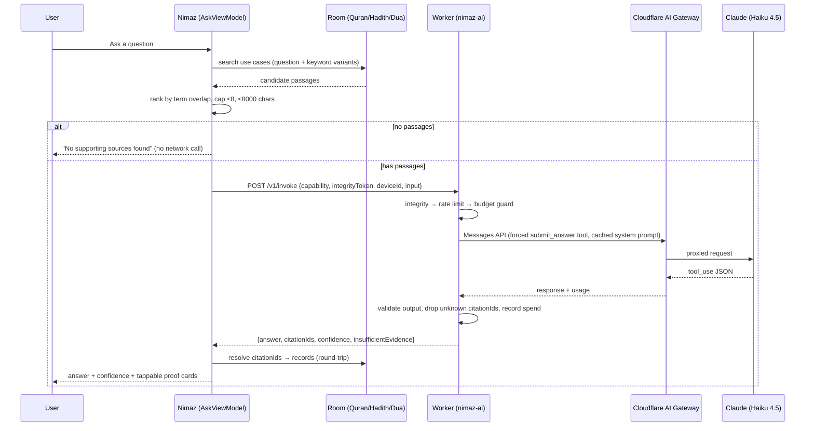

# Ask with Proof — grounded AI Q&A

An **opt-in**, privacy-disclosed, proof-driven question-answering feature. The
user asks a question in Global Search; the app retrieves matching Quran/Hadith/Dua
passages **locally** from Room, sends the question + those passages to a
Cloudflare Worker, which asks Claude to answer **only from the supplied passages**
and return strict JSON. The app resolves the cited passages back to real records
and shows them as tappable "proof" cards that deep-link into the reader screens.

AI is **off by default**. A user who never opens Search Settings sees no
behaviour change and nothing leaves their device.

## Architecture



Layers (Android):

```
presentation/screens/search/AskComponents.kt        UI for the ask/answer/proofs
presentation/screens/settings/SearchSettingsScreen  consent + toggles + privacy
presentation/viewmodel/AskViewModel                 ask state machine
presentation/viewmodel/SearchSettingsViewModel      settings + consent state
domain/usecase/ai/AskWithProofUseCase               retrieval → call → resolve
domain/model/{AiModels,CitationId}                  ProofPassage/GroundedAnswer/Proof/AiError
domain/repository/AiRepository                      gateway interface
data/ai/{AiApiClient,IntegrityTokenProvider,DeviceIdProvider}
data/ai/dto/AiDtos                                  wire DTOs (mirror the Worker)
data/repository/AiRepositoryImpl                    error-envelope → AiError mapping
core/di/AiModule                                    Ktor client + wiring
```

## Capability contract

`POST /v1/invoke`:

```json
{
  "capability": "ask-with-proof",
  "integrityToken": "<play-integrity-token | debug-skip>",
  "deviceId": "<random per-install UUID>",
  "input": {
    "question": "3..500 chars",
    "passages": [
      { "id": "quran:2:153", "source": "quran|hadith|dua", "text": "≤1200 chars", "meta": "Surah Al-Baqarah 153" }
    ]
  }
}
```

Response (validated against a Zod schema before returning):

```json
{ "answer": "…", "citationIds": ["quran:2:153"], "confidence": "high|medium|low", "insufficientEvidence": false }
```

Error envelope (HTTP 400/401/429/502/503):

```json
{ "error": { "code": "RATE_LIMITED|BUDGET_EXCEEDED|ATTESTATION_FAILED|INVALID_INPUT|UPSTREAM_ERROR", "message": "…", "retryAfterSeconds": 3600 } }
```

### Citation ID grammar (`domain/model/CitationId.kt`)

Round-trips cleanly so a citation resolves back to a local record and a deep link:

| source | id form                | resolves to                    | Route                       |
| ------ | ---------------------- | ------------------------------ | --------------------------- |
| quran  | `quran:{surah}:{ayah}` | `getAyahsBySurah` → `ayahNumber` | `Route.QuranReader(surah, ayah)` |
| hadith | `hadith:{hadithId}`    | `getHadithById`                | `Route.HadithReader(hadithId)`   |
| dua    | `dua:{duaId}`          | `getDuaById`                   | `Route.DuaReader(duaId)`         |

Unparseable or unresolvable IDs are dropped silently.

## Settings & consent behaviour

Search Settings (`Route.SearchSettings`, reachable from the Global Search top-bar
action and the Settings hub):

- **AI answers** — master toggle. Turning it **on** first opens a consent
  `ModalBottomSheet` stating exactly what is shared (question + matched excerpts →
  Nimaz server on Cloudflare → Anthropic Claude), that nothing else leaves the
  device, that questions are never used for analytics, that answers can be wrong
  and must be verified against the cited sources, and that it is not a fatwa.
  "Enable" sets `aiAskEnabled=true` + `aiConsentTimestamp`. Turning it **off** is
  instant, no sheet.
- **Sources** — Quran / Hadith / Dua toggles + a proofs-count slider (3–8).
- **Privacy** — an expandable "What gets shared" repeating the disclosure; an "AI
  question history" toggle (off = recent questions kept in memory only; on =
  persisted to DataStore as a JSON list); and "Clear AI history".

DataStore keys (in `PreferencesDataStore`, declared on `SettingsRepository`):
`aiAskEnabled` (false), `aiConsentTimestamp` (0), `aiSourcesQuran/Hadith/Dua`
(true), `aiMaxProofs` (5), `aiHistoryEnabled` (false), `aiAskHintDismissed`
(false), `aiQuestionHistory` (JSON list).

### Privacy / analytics

The question text is **never** sent to Firebase. `AskViewModel` logs only event
names via `AppAnalytics.logEvent`: `ai_ask_submitted`, `ai_ask_answered`,
`ai_ask_error_{slug}` — no content payloads. The Worker stores nothing.

## Cost model

- Model: `claude-haiku-4-5`. Pricing: **$1 / MTok input**, **$5 / MTok output**;
  cached input reads billed at **10%** of the input rate.
- The system prompt is marked `cache_control: ephemeral`, so after the first call
  it is read from cache at ~10% cost.
- `max_tokens` = 600, temperature 0.2.
- Guards (KV-backed, per UTC period): per-device daily cap (`DAILY_DEVICE_LIMIT`,
  20), global daily cap (`DAILY_GLOBAL_LIMIT`, 500), monthly USD budget
  (`MONTHLY_BUDGET_USD`, 10). Spend is tallied in integer microdollars after each
  call; when the month meets the cap the Worker returns `BUDGET_EXCEEDED` (503).

## Adding a new capability

**Worker** (`worker/`):
1. Add Zod input/output schemas in `src/schemas/<id>.ts`.
2. Create `src/capabilities/<id>.ts` exporting a `Capability<I, O>` (build the
   request, force a structured-output tool, parse/validate the response).
3. Register it in `src/registry.ts`. It is immediately reachable at
   `POST /v1/invoke` with `"capability": "<id>"`. Nothing in the middleware chain
   changes. Add tests in `worker/test/`.

**Android**: add DTOs mirroring the new input/output, a `domain/usecase/…`
orchestrator, and wire it in `core/di/AiModule.kt` (reuse `AiApiClient`).

## Runbook — manual setup (one-time)

These are required to make the feature actually work end-to-end. Nothing here is
committed to the repo.

### 1. Cloudflare (Worker)

1. `cd worker && npm ci`
2. The KV namespace id is already committed in `worker/wrangler.jsonc` (a
   resource id, not a secret). To recreate it in a different account:
   `npx wrangler kv namespace create NIMAZ_AI_KV` and paste the returned id.
3. Set secrets:
   `npx wrangler secret put ANTHROPIC_API_KEY`
   `npx wrangler secret put GOOGLE_SERVICE_ACCOUNT_JSON`
4. (Optional) Create an AI Gateway named `nimaz` and set the var
   `AI_GATEWAY_BASE_URL` to
   `https://gateway.ai.cloudflare.com/v1/<account_id>/nimaz/anthropic`.
5. Deploy: push to `dev` (CI) or `npx wrangler deploy`. The Worker is served at
   the custom domain **`https://ai.arshadshah.com`** (configured via the
   `routes` block in `wrangler.jsonc`; `wrangler deploy` provisions the domain +
   certificate, provided the `arshadshah.com` zone is on the same account). It is
   also reachable at its `*.workers.dev` URL.
6. Keep `SKIP_ATTESTATION=false` in production. Use `--var SKIP_ATTESTATION:true`
   only for local `wrangler dev` testing.

### 2. Google Cloud / Play Console (Play Integrity)

1. In the Play Console, link/create a Google Cloud project and note its **project
   number**.
2. Enable the **Play Integrity API** in that Cloud project.
3. Create a **service account** with access to the Play Integrity API; download
   its JSON key — this is `GOOGLE_SERVICE_ACCOUNT_JSON` (step 1.3). Never commit it.
4. Put the project number into `gradle.properties` as
   `playIntegrityCloudProjectNumber` (or pass `-PplayIntegrityCloudProjectNumber=…`).

### 3. GitHub secrets (for `worker_deploy.yml`)

- `CLOUDFLARE_API_TOKEN` — token with Workers + KV edit permission.
- `CLOUDFLARE_ACCOUNT_ID` — the Cloudflare account id.

(The Android/deploy secrets — `FIREBASE_CONFIG`, `PLAY_STORE_CONFIG_JSON`,
`KEYSTORE_*`, `BUMP_APP_*` — are unchanged.)

### 4. gradle.properties (per environment)

```properties
nimazAiWorkerUrlDebug=https://ai.arshadshah.com
nimazAiWorkerUrl=https://ai.arshadshah.com
playIntegrityCloudProjectNumber=<google-cloud-project-number>
```

These committed defaults point at the production custom domain. Until the Worker
is deployed and the domain resolves, the app still builds and runs — asking
simply shows the network-error state (it never crashes).

## Testing

- Worker: `cd worker && npm ci && npm test && npx tsc --noEmit`.
- Android: `./gradlew lint testDebugUnitTest` (unit tests cover the citation
  grammar, retrieval/resolution, repository error mapping, and the ViewModel
  state machine).
- End-to-end smoke test against `wrangler dev` with `SKIP_ATTESTATION=true` — see
  the `curl` example in `worker/README.md`.
```
