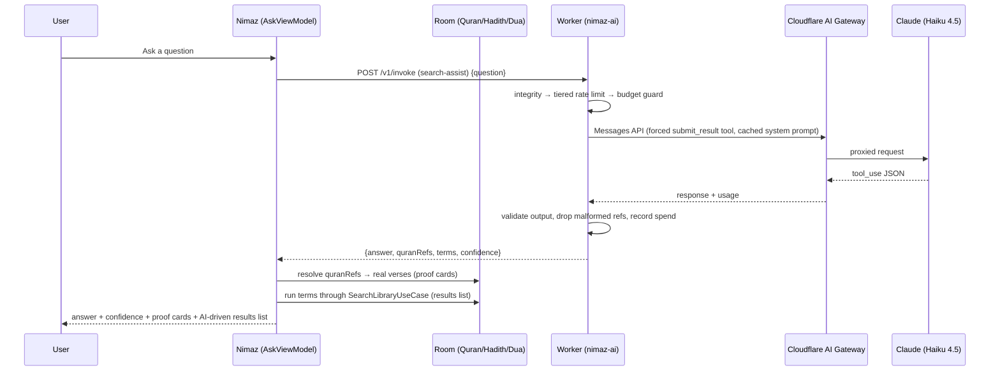

# Ask with Proof — AI-assisted search with local proof

An **opt-in**, privacy-disclosed AI layer over Global Search. The user types
into Global Search's **single search bar** — the same text drives both keyword
search and, on submit, the AI ask (there is no separate "ask" field).

When AI is enabled, each submit makes **one** Worker call (`search-assist`):

1. **Ask** — the app sends ONLY the question text. Claude answers from
   mainstream Islamic knowledge and returns (a) the **Quran references** that
   support the answer and (b) related **search terms** for the local library.
2. **Prove (local)** — the app resolves each returned reference against the
   LOCAL Quran database. Every reference that resolves becomes a tappable
   "proof" card showing the **real verse text** with a deep link into the
   reader; anything that doesn't resolve is dropped silently, so a proof card
   can never show a verse that doesn't exist.
3. **Enhance (local)** — the AI's terms run through the smart local search
   (`SearchLibraryUseCase`) and replace the results list, so the list
   dynamically shows the Quran/Hadith/Dua records the AI judged relevant.

There is **no "no supporting sources found" dead end**: the answer stands on
its own, proof cards show whatever resolved, and the related results are always
explorable. When AI is **off**, only local keyword search runs (no network, no
behaviour change). AI is **off by default** — a user who never opens Search
Settings sees nothing leave their device.

## Architecture



One Worker call per submit; everything else is local.

### Why attestation never blocks

Play Integrity used to hard-fail requests (ATTESTATION_FAILED) whenever the
token couldn't be fetched or Google's API hiccuped — bricking the feature for
legitimate users. The Worker now **classifies** each request into a trust tier
instead of gating on it:

| Tier         | When                                                                | Per-device daily cap              |
| ------------ | ------------------------------------------------------------------- | --------------------------------- |
| `verified`   | Token decodes with `PLAY_RECOGNIZED` + device/basic integrity        | `DAILY_DEVICE_LIMIT` (20)         |
| `unverified` | Missing token, Integrity API unreachable/unconfigured, failed verdict | `UNVERIFIED_DAILY_DEVICE_LIMIT` (5) |

Every failure path degrades to `unverified` — a smaller cap, never an error.
The monthly budget guard remains the hard backstop against abuse.

Layers (Android):

```
presentation/screens/search/SearchScreen.kt         shared search+ask input bar; bridges AI terms → list
presentation/screens/search/AskComponents.kt        AI answer card / proof rows / loading / error+retry
presentation/screens/settings/SearchSettingsScreen  consent + toggles + privacy
presentation/viewmodel/AskViewModel                 ask state machine (exposes relatedTerms)
presentation/viewmodel/SearchViewModel              results list (+ ApplyAiTerms event)
presentation/viewmodel/SearchSettingsViewModel      settings + consent state
domain/usecase/ai/AskWithProofUseCase               ask → resolve refs → proofs (+ related terms)
domain/usecase/SearchLibraryUseCase                 smart multi-word local search (also non-AI path)
domain/model/{AiModels,CitationId,LibrarySearch}    SearchAssist/Proof/AiError/LibrarySearchResults
domain/repository/AiRepository                      gateway interface (assist)
data/ai/{AiApiClient,IntegrityTokenProvider,DeviceIdProvider}
data/ai/dto/AiDtos                                  wire DTOs (mirror the Worker)
data/repository/AiRepositoryImpl                    error-envelope → AiError mapping
core/di/AiModule                                    Ktor client + wiring
worker/src/capabilities/search-assist               the single AI capability
```

## Capability contract

Everything goes through the same `POST /v1/invoke` envelope and middleware
(integrity tier → rate limit → budget). The Android `input` is sent as a raw
JSON object so one envelope serves every capability.

### `search-assist` (the single call)

```json
{ "capability": "search-assist", "integrityToken": "<token or empty>", "deviceId": "…",
  "input": { "question": "3..500 chars" } }
```

Response (validated against a Zod schema before returning):

```json
{
  "answer": "≤120 words, descriptive, never a fatwa",
  "quranRefs": ["2:153", "39:10"],
  "terms": ["patience", "sabr", "hardship"],
  "confidence": "high|medium|low"
}
```

`quranRefs` are `surah:ayah` (standard mushaf numbering); the Worker drops
malformed/impossible refs (surah 1–114) and the app only surfaces refs that
resolve against its local database. Hadith/Dua use opaque local IDs the model
can't know, so they are reached only through `terms` in the results list.

Error envelope (HTTP 400/429/502/503):

```json
{ "error": { "code": "RATE_LIMITED|BUDGET_EXCEEDED|INVALID_INPUT|UPSTREAM_ERROR", "message": "…", "retryAfterSeconds": 3600 } }
```

(There is no ATTESTATION_FAILED anymore — see the tier table above.)

### Citation ID grammar (`domain/model/CitationId.kt`)

Round-trips cleanly so a citation resolves back to a local record and a deep link:

| source | id form                | resolves to                    | Route                       |
| ------ | ---------------------- | ------------------------------ | --------------------------- |
| quran  | `quran:{surah}:{ayah}` | `getAyahsBySurah` → `ayahNumber` | `Route.QuranReader(surah, ayah)` |
| hadith | `hadith:{hadithId}`    | `getHadithById`                | `Route.HadithReader(hadithId)`   |
| dua    | `dua:{duaId}`          | `getDuaById`                   | `Route.DuaReader(duaId)`         |

Unparseable or unresolvable IDs are dropped silently. (The current AI flow
only produces `quran:` citations; the grammar keeps hadith/dua for future use.)

## Smart local search (`SearchLibraryUseCase`)

The non-AI search got better too. The DAO queries match one contiguous
substring (`LIKE '%q%'`), so multi-word queries used to return nothing. The
use case now:

- always searches the whole phrase (exact hits score highest),
- additionally tokenizes multi-word queries into significant words (stopwords
  dropped) and searches each word, ranking records by how many words they
  match,
- exposes `byTerms(terms)` — the same union+rank over the AI's related terms,
- dedupes per source, caps results, and keeps the UI responsive.

`SearchViewModel` uses it for search-as-you-type, submits, and `ApplyAiTerms`.

## Settings & consent behaviour

Search Settings (`Route.SearchSettings`, reachable from the Global Search top-bar
action and the Settings hub):

- **AI answers** — master toggle. Turning it **on** first opens a consent
  `ModalBottomSheet` stating exactly what is shared (**only the question text**
  → Nimaz server on Cloudflare → Anthropic Claude), that the cited verses and
  results are looked up locally, that questions are never used for analytics,
  that answers can be wrong and must be verified against the cited sources,
  and that it is not a fatwa. "Enable" sets `aiAskEnabled=true` +
  `aiConsentTimestamp`. Turning it **off** is instant, no sheet.
- **Privacy** — an expandable "What gets shared" repeating the disclosure; an
  "AI question history" toggle (off = recent questions kept in memory only;
  on = persisted to DataStore as a JSON list); and "Clear AI history".

DataStore keys (in `PreferencesDataStore`, declared on `SettingsRepository`):
`aiAskEnabled` (false), `aiConsentTimestamp` (0), `aiHistoryEnabled` (false),
`aiAskHintDismissed` (false), `aiQuestionHistory` (JSON list). (The old
per-source toggles and proofs-count slider were removed with the single-call
rebuild — sources are no longer uploaded, so there is nothing to configure.)

### Privacy / analytics

Only the question text ever leaves the device. It is **never** sent to
Firebase. `AskViewModel` logs only event names via `AppAnalytics.logEvent`:
`ai_ask_submitted`, `ai_ask_answered`, `ai_ask_error_{slug}` — no content
payloads. The Worker stores nothing.

## Cost model

- Model: `claude-haiku-4-5`. Pricing: **$1 / MTok input**, **$5 / MTok output**;
  cached input reads billed at **10%** of the input rate.
- Each submit is **one** call: `search-assist` (`max_tokens` 700,
  temperature 0.2). The system prompt is marked `cache_control: ephemeral`,
  so after the first call it is read from cache at ~10% cost. One question
  consumes one invocation of the per-device daily cap (the old design burned
  two).
- Guards (KV-backed, per UTC period): tiered per-device daily cap
  (`DAILY_DEVICE_LIMIT` 20 verified / `UNVERIFIED_DAILY_DEVICE_LIMIT` 5),
  global daily cap (`DAILY_GLOBAL_LIMIT`, 500), monthly USD budget
  (`MONTHLY_BUDGET_USD`, 10). Spend is tallied in integer microdollars after
  each call; when the month meets the cap the Worker returns `BUDGET_EXCEEDED`
  (503).

## Adding a new capability

**Worker** (`worker/`):
1. Add Zod input/output schemas in `src/schemas/<id>.ts`.
2. Create `src/capabilities/<id>.ts` exporting a `Capability<I, O>` (build the
   request, force a structured-output tool, parse/validate the response).
3. Register it in `src/registry.ts`. It is immediately reachable at
   `POST /v1/invoke` with `"capability": "<id>"`. Nothing in the middleware chain
   changes. Add tests in `worker/test/`.

**Android**: add DTOs mirroring the new input/output, a `domain/usecase/…`
orchestrator, and wire it in `core/di/AiModule.kt` (reuse `AiApiClient`).

## Runbook — manual setup (one-time)

These are required to make the feature actually work end-to-end. Nothing here is
committed to the repo.

### 1. Cloudflare (Worker)

1. `cd worker && npm ci`
2. The KV namespace id is already committed in `worker/wrangler.jsonc` (a
   resource id, not a secret). To recreate it in a different account:
   `npx wrangler kv namespace create NIMAZ_AI_KV` and paste the returned id.
3. Set secrets:
   `npx wrangler secret put ANTHROPIC_API_KEY`
   `npx wrangler secret put GOOGLE_SERVICE_ACCOUNT_JSON`
   (If `GOOGLE_SERVICE_ACCOUNT_JSON` is absent the Worker still works — every
   request simply runs at the smaller unverified rate-limit tier.)
4. (Optional) Create an AI Gateway named `nimaz` and set the var
   `AI_GATEWAY_BASE_URL` to
   `https://gateway.ai.cloudflare.com/v1/<account_id>/nimaz/anthropic`.
5. Deploy: push to `dev` (CI) or `npx wrangler deploy`. The Worker is served at
   the custom domain **`https://ai.arshadshah.com`** (configured via the
   `routes` block in `wrangler.jsonc`; `wrangler deploy` provisions the domain +
   certificate, provided the `arshadshah.com` zone is on the same account). It is
   also reachable at its `*.workers.dev` URL.
6. Keep `SKIP_ATTESTATION=false` in production. Use `--var SKIP_ATTESTATION:true`
   only for local `wrangler dev` testing (it forces the verified tier).

### 2. Google Cloud / Play Console (Play Integrity)

1. In the Play Console, link/create a Google Cloud project and note its **project
   number**.
2. Enable the **Play Integrity API** in that Cloud project.
3. Create a **service account** with access to the Play Integrity API; download
   its JSON key — this is `GOOGLE_SERVICE_ACCOUNT_JSON` (step 1.3). Never commit it.
4. Put the project number into `gradle.properties` as
   `playIntegrityCloudProjectNumber` (or pass `-PplayIntegrityCloudProjectNumber=…`).

Note: even with none of this configured, AI answers work — devices just get the
unverified daily cap.

### 3. GitHub secrets (for `worker_deploy.yml`)

- `CLOUDFLARE_API_TOKEN` — token with Workers + KV edit permission.
- `CLOUDFLARE_ACCOUNT_ID` — the Cloudflare account id.

(The Android/deploy secrets — `FIREBASE_CONFIG`, `PLAY_STORE_CONFIG_JSON`,
`KEYSTORE_*`, `BUMP_APP_*` — are unchanged.)

### 4. gradle.properties (per environment)

```properties
nimazAiWorkerUrlDebug=https://ai.arshadshah.com
nimazAiWorkerUrl=https://ai.arshadshah.com
playIntegrityCloudProjectNumber=<google-cloud-project-number>
```

These committed defaults point at the production custom domain. Until the Worker
is deployed and the domain resolves, the app still builds and runs — asking
simply shows the network-error state with a retry button (it never crashes).

## Testing

- Worker: `cd worker && npm ci && npm test && npx tsc --noEmit`.
- Android: `./gradlew lint testDebugUnitTest` (unit tests cover the citation
  grammar, ref resolution, repository error mapping, the smart local search,
  and the ViewModel state machines).
- End-to-end smoke test against `wrangler dev` with `SKIP_ATTESTATION=true` — see
  the `curl` example in `worker/README.md`.
