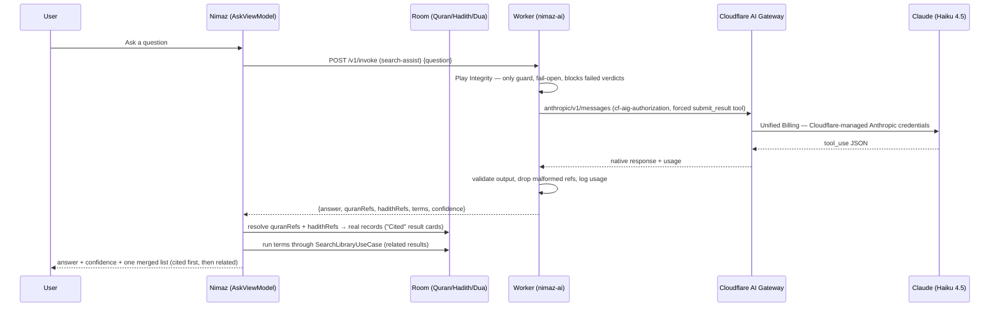

# Ask with Proof — AI-assisted search with local proof

> **Owns:** the opt-in AI search feature end to end — the Cloudflare Worker in `worker/`, the
> `search-assist` capability contract, local proof resolution, the smart local search, the
> settings/consent surface, the cost model, and the manual setup runbook.
> **Update when:** you change the Worker, the capability contract or its schema, the proof
> resolution, the consent/settings flow, the analytics, or the deployment/secret setup.
> **Verified by:** review only — plus the Worker's own tests and `SearchLibraryUseCaseTest`.
> `SUB-06` guards the `nimaz_ai_device` DataStore this feature owns.
> **Related:** [`SUBSYSTEMS.md` §0.5](SUBSYSTEMS.md#05-datastore-files) for its DataStore,
> [`NAVIGATION.md` §3.14](NAVIGATION.md#314-search-bookmarks--onboarding) for its routes,
> [`DOCUMENTATION.md`](DOCUMENTATION.md) for the update contract.

An **opt-in**, privacy-disclosed AI layer over Global Search. The user types
into Global Search's **single search bar** — the same text drives both keyword
search (as-you-type) and the AI ask (there is no separate "ask" field). While
AI is enabled and there is text, the shared `NimazSearchBar` shows a trailing
**Ask** pill; tapping it — or pressing Enter — submits the question. The
source filter (All / Qur'an / Hadith / Duas / Names) is **pinned under the
search bar** and scopes everything below it.

When AI is enabled, each submit makes **one** Worker call (`search-assist`):

1. **Ask** — the app sends ONLY the question text. Claude answers from
   mainstream Islamic knowledge and returns (a) the **Quran references** and
   **Hadith references** that support the answer and (b) related **search
   terms** for the local library.
2. **Prove (local)** — the app resolves each returned reference against the
   LOCAL database: Quran refs against the Quran tables (joining the same
   default translator the keyword search uses, so the card shows the English
   translation), hadith refs against the six shipped collections (by their
   canonical `collection:number` reference). `Proof` is a sealed interface
   (`Proof.Quran` / `Proof.Hadith`) carrying the same structured fields the
   keyword search returns — surah:ayah numbers + English surah name, or hadith
   number + book name — so a cited card renders **identically** to its keyword
   equivalent (same title, subtitle, source tag, English snippet), marked
   **"Cited"** (accent left edge + solid chip), sorted to the top, and
   deep-linking into its reader like any other result; anything that doesn't
   resolve is dropped silently, so a cited card can never show a verse or
   hadith that doesn't exist.
3. **Enhance (local)** — the AI's terms run through the smart local search
   (`SearchLibraryUseCase`) and fill the rest of the same list, so it
   dynamically shows the Quran/Hadith/Dua records the AI judged relevant.

The answer card itself is deliberately slim — badge, confidence chip, the
answer text and a trust note. Its grounding lives in the **one merged,
filterable results list** below it: cited verses and hadiths first, then
related results (any related result that duplicates a cited record is
dropped). The pinned filter scopes the whole merged list, cited cards
included. The list never blanks into a separate loading stage: while the
AI-terms lookup runs, the keyword results the user was already looking at
stay on screen below the cited rows and are swapped in place when it lands.
Ask failures render as design-system `NimazBanner`s — expected pauses (daily
limit, shared budget) as the amber WARNING variant, transient failures as the
ERROR variant with a retry action.

There is **no "no supporting sources found" dead end**: the answer stands on
its own, cited cards show whatever resolved, and the related results are always
explorable. When AI is **off**, only local keyword search runs (no network, no
behaviour change). AI is **off by default** — a user who never opens Search
Settings sees nothing leave their device.

---

## Contents

1. [Architecture](#architecture)
2. [Capability contract](#capability-contract)
3. [Smart local search (`SearchLibraryUseCase`)](#smart-local-search-searchlibraryusecase)
4. [Settings & consent behaviour](#settings--consent-behaviour)
5. [Cost model](#cost-model)
6. [Adding a new capability](#adding-a-new-capability)
7. [Runbook — manual setup (one-time)](#runbook--manual-setup-one-time)
8. [Testing](#testing)

---

## Architecture



One Worker call per submit; everything else is local. On the `W → GW → Claude`
leg the Worker calls the `nimaz` AI Gateway's Anthropic provider-native
endpoint with **Unified Billing**: no provider key is attached, so Cloudflare
injects its managed Anthropic credentials and bills the account's AI credits.
The Worker's only credential is `CLOUDFLARE_AI_TOKEN` — the gateway's
authentication token (`cf-aig-authorization`) — never an Anthropic key.

### Play Integrity is the only Worker guard — and it fails open

The Worker keeps no rate-limit counters (no KV): request throttling is the AI
Gateway's **Rate Limiting rule** and the monthly cost cap is its **Spend
Limit**. The one check the Worker performs is Play Integrity:

| Outcome       | When                                                            | Effect                        |
| ------------- | ---------------------------------------------------------------- | ----------------------------- |
| `verified`    | Token decodes with `PLAY_RECOGNIZED` + device/basic integrity    | proceeds                      |
| `unavailable` | Missing token, Integrity API unreachable/unconfigured            | proceeds (fail-open)          |
| `failed`      | Google decoded the token and the verdict failed                  | `ATTESTATION_FAILED` (403)    |

Fail-open matters: hard-failing the unavailable paths bricked the feature for
legitimate users whenever Play services hiccuped or Google's API was
unreachable. Only an explicit failed verdict (unrecognized app, tampered
device, package mismatch) is rejected; the gateway's rate/spend limits bound
whatever slips through.

The app fetches tokens with the **standard** Play Integrity API (warm up a
`StandardIntegrityTokenProvider` once, then a cheap `request()` per question),
not the classic one. Classic requests are throttled per app-instance by Play
services after a few calls in a short window, so fetching one per question
meant legitimate installs "worked for a while" and then every token fetch
failed → empty token → verification skipped for every request. The standard API is
designed for frequent per-action checks; if the warmed-up provider goes stale,
`IntegrityTokenProvider` re-prepares it once before falling back. The Worker is
unaffected: `decodeIntegrityToken` decodes classic and standard tokens alike,
and the verdict fields it checks are identical.

Layers (Android):

```
presentation/components/organisms/NimazSearchBar.kt shared bar; optional trailing Ask pill (showAskButton/askEnabled/onAsk; IME action routes to onAsk while live)
presentation/screens/search/SearchScreen.kt         pinned bar+filter; merges cited proofs + related results into ONE list (dedup, "Cited" cards)
presentation/screens/search/AskComponents.kt        answer card (no proof list) / loading / error banner (NimazBanner) / AI-off discovery card
presentation/screens/settings/SearchSettingsScreen  consent + toggles + privacy; clear-history opens a destructive NimazDialog listing the saved questions
presentation/viewmodel/AskViewModel                 ask state machine (exposes relatedTerms)
presentation/viewmodel/SearchViewModel              results list (+ ApplyAiTerms event)
presentation/viewmodel/SearchSettingsViewModel      settings + consent state
domain/usecase/ai/AskWithProofUseCase               ask → resolve refs → proofs (+ related terms)
domain/usecase/SearchLibraryUseCase                 smart multi-word local search (also non-AI path)
domain/model/{AiModels,CitationId,LibrarySearch}    SearchAssist/HadithRef/Proof/AiError/LibrarySearchResults
domain/repository/AiRepository                      gateway interface (assist)
data/ai/{AiApiClient,IntegrityTokenProvider,DeviceIdProvider}
data/ai/dto/AiDtos                                  wire DTOs (mirror the Worker)
data/repository/AiRepositoryImpl                    error-envelope → AiError mapping
core/di/AiModule                                    Ktor client + wiring
worker/src/capabilities/search-assist               the single AI capability
```

## Capability contract

Everything goes through the same `POST /v1/invoke` envelope and middleware
(Play Integrity only). The Android `input` is sent as a raw
JSON object so one envelope serves every capability.

### `search-assist` (the single call)

```json
{ "capability": "search-assist", "integrityToken": "<token or empty>", "deviceId": "…",
  "input": { "question": "3..500 chars" } }
```

Response (validated against a Zod schema before returning):

```json
{
  "answer": "≤120 words, descriptive, never a fatwa",
  "quranRefs": ["2:153", "39:10"],
  "hadithRefs": ["bukhari:6018", "muslim:2564"],
  "terms": ["patience", "sabr", "hardship"],
  "confidence": "high|medium|low"
}
```

`quranRefs` are `surah:ayah` (standard mushaf numbering); the Worker drops
malformed/impossible refs (surah 1–114). `hadithRefs` are
`collection:number`, where collection is one of the six canonical collections
the app ships — `bukhari`, `muslim`, `abudawud`, `tirmidhi`, `nasai`,
`ibnmajah` — and number is the hadith's standard reference number in that
collection (the `reference` value on every local hadith row); the Worker
drops refs outside those collections. Either way the app only surfaces refs
that resolve against its local database. Duas use opaque local IDs the model
can't know, so they are reached only through `terms` in the results list.

Error envelope (HTTP 400/403/429/502/503):

```json
{ "error": { "code": "RATE_LIMITED|ATTESTATION_FAILED|BUDGET_EXCEEDED|INVALID_INPUT|UPSTREAM_ERROR", "message": "…", "retryAfterSeconds": 3600 } }
```

(`RATE_LIMITED` is a pass-through of the gateway's Rate Limiting rule;
`ATTESTATION_FAILED` is an explicit failed Play Integrity verdict — see the
table above.)

### Citation ID grammar (`domain/model/CitationId.kt`)

Round-trips cleanly so a citation resolves back to a local record and a deep link:

| source | id form                | resolves to                    | Route                       |
| ------ | ---------------------- | ------------------------------ | --------------------------- |
| quran  | `quran:{surah}:{ayah}` | `getAyahsBySurah` → `ayahNumber` | `Route.QuranReader(surah, ayah)` |
| hadith | `hadith:{hadithId}`    | `getHadithById`                | `Route.HadithReader(hadithId)`   |
| dua    | `dua:{duaId}`          | `getDuaById`                   | `Route.DuaReader(duaId)`         |

Unparseable or unresolvable IDs are dropped silently. The AI flow produces
`quran:` citations directly and `hadith:` citations indirectly: the model
cites a hadith as `collection:number` (`domain/model/HadithRef`), the app
resolves it via the hadiths table's `reference` column, and the resulting
proof carries the local `hadith:{hadithId}` citation id — the same key the
results list derives, so cited hadiths dedupe like verses. `dua:` remains
reserved for future use.

## Smart local search (`SearchLibraryUseCase`)

The non-AI search got better too. The DAO queries match one contiguous
substring (`LIKE '%q%'`), so multi-word queries used to return nothing. The
use case now:

- always searches the whole phrase (exact hits score highest),
- additionally tokenizes multi-word queries into significant words (stopwords
  dropped) and searches each word, ranking records by how many words they
  match,
- exposes `byTerms(terms)` — the same union+rank over the AI's related terms,
- dedupes per source, caps results, and keeps the UI responsive.

`SearchViewModel` uses it for search-as-you-type, submits, and `ApplyAiTerms`.

### What the user controls (`SearchPreferences`)

Four numbers in that description used to be compile-time constants, and one of them was
reported as a bug: a search for الله returned exactly 180 results, which is three sources
each returning a hidden cap of 60. A cap you cannot see and cannot change reads as a defect
every time someone hits it.

They are now `domain/model/SearchPreferences`, read once per search from
`ObserveSearchPreferencesUseCase` (reading once, rather than collecting, so a preference
changed mid-query cannot leave half the passes on the old settings):

| Preference | Was | Now |
| --- | --- | --- |
| `resultsPerSource` | `MAX_PER_SOURCE = 60` | 10–200, stepped by 10 |
| `sources` | all, always | any non-empty subset of `LibrarySource`; a source that is off is **not queried**, so narrowing is faster as well as narrower |
| `strictness` | `MAX_WORD_QUERIES = 8` | `MatchStrictness` — `EXACT` (0 word passes), `BALANCED` (8, the old behaviour), `BROAD` (20) |
| `defaultScope` | always "All" | which filter chip `SearchScreen` opens on; `null` is everything |

`LibrarySource` is `QURAN` (ayat, translations **and** surah names), `HADITH`, `DUAS` and
`NAMES`. Surah names are not a separate source — "search the Qur'an but not its surah names" is
not a distinction anyone wants — and for the same reason `NAMES` is one source covering all
three name catalogues rather than three: they are one destination (`Route.Names`), one search
box and one favourites area, so they are one switch and one filter chip too.

`NAMES` is the one source that is **not** a database query. `SearchNamesUseCase` filters the
catalogues in memory: they are 99 + 99 + 25 rows, already loaded by whatever screen is showing
them, and none of the three repositories has a search method — a `LIKE` round trip would be
slower than the filter *and* would need three new DAO queries to exist first. It matches the
same fields the Names screen's own filter does, so a query typed into either box finds the same
names. Hits arrive as `NameSearchResult`, flattened out of the three catalogue models, which is
why `LibrarySearchResults` carries one `names` list rather than three.

Two invariants are enforced in `SearchPreferences.sanitised` rather than trusted, because a
preferences file outlives the build that wrote it (a downgrade, a restore from a device on a
newer version, a hand-edit):

- an **empty** source set means everything, since honouring it literally is a search that
  returns nothing for every query;
- a `defaultScope` pointing at a source that is switched off is dropped, since it would open
  the results list filtered to a source that is never queried — an empty list that reads as
  "nothing matched".

The source set is stored as a comma-separated list of names with **empty meaning "all"**, so
a build that adds a source picks it up for existing users instead of silently leaving it
unsearched. Names this build does not recognise are dropped rather than fatal.

## Settings & consent behaviour

Search Settings (`Route.SearchSettings`, reachable from the Global Search top-bar
action and the Settings hub):

- **Results** — "Results per source" (a `NimazNumberStepper`, 10–200 by 10, with the resulting
  total across the selected sources shown underneath so the number is not a mystery),
  "How closely to match" (`MatchStrictness`) and "Start search in" (`defaultScope`). The scope
  picker only offers sources that are switched on, plus "Everything".
- **Where to search** — one switch per `LibrarySource`. The **last** switch left on is
  disabled and says so: obeying it would store an empty set, which `sanitised` reads straight
  back as "everything", so the switch would appear to turn itself on again. Switching off the
  source the default scope points at clears the scope in the same write.
- **AI answers** — master toggle. Turning it **on** first opens a consent
  `ModalBottomSheet` stating exactly what is shared (**only the question text**
  → Nimaz server on Cloudflare → Anthropic Claude), that the cited verses and
  results are looked up locally, that questions are never used for analytics,
  that answers can be wrong and must be verified against the cited sources,
  and that it is not a fatwa. "Enable" sets `aiAskEnabled=true` +
  `aiConsentTimestamp`. Turning it **off** is instant, no sheet.

  The sheet closes **after** those two writes commit, not before. Closing it first —
  which is what shipped — meant a failed write left the user having consented, the sheet
  gone, and the toggle re-emitting `false`: a switch that flips itself back with no
  explanation. A write that fails now keeps the sheet up and says so
  (`SearchSettingsUiState.consentFailed`).
- **Privacy** — an expandable "What gets shared" repeating the disclosure; an
  "AI question history" toggle (off = recent questions kept in memory only;
  on = persisted to DataStore as a JSON list); and "Clear AI history".

### Where consent is enforced

**In `AskWithProofUseCase`, before anything is sent.** It reads
`settingsRepository.aiAskEnabled.first()` and returns
`Outcome.Failed(AiError.ConsentRequired)` if the feature is off, so no caller can reach the
Worker without consent. `AskViewModel.submit()` also returns early when `aiEnabled` is
false, but only to keep the UI out of a `Loading` phase it would never leave — the
guarantee lives in the use case.

Before that, `aiAskEnabled` was checked in exactly one place: a visibility condition in
`SearchScreen`. Nothing in the ViewModel, the use case, `AiRepository` or the Worker client
re-checked it, so any second caller of `AskEvent.Submit` would have sent the question off
the device with the feature switched off.

**One Worker call per question is enforced too.** `submit()` returns early while
`phase == AskPhase.Loading`. Without that guard, tapping "Ask" twice on a slow network —
or tapping the error card's retry twice — billed two Worker invocations for one question.

DataStore keys (in `PreferencesDataStore`, declared on `SettingsRepository`):
`aiAskEnabled` (false), `aiConsentTimestamp` (0), `aiHistoryEnabled` (false),
`aiAskHintDismissed` (false), `aiQuestionHistory` (JSON list). (The old
per-source toggles and proofs-count slider were removed with the single-call
rebuild — sources are no longer uploaded, so there is nothing to configure.)

### Privacy / analytics

Only the question text ever leaves the device. It is **never** sent to
Firebase. `AskViewModel` reports through the injected `Telemetry` seam and logs only
actions, never content: `featureUsed("ai_ask", "submitted")`,
`featureUsed("ai_ask", "answered")` and `error("ai_ask", "ask_{slug}")`. The Worker stores
nothing.

Turning "AI question history" **off** clears the stored list *and* what is on screen. The
recent questions are derived from `aiQuestionHistory` on every emission rather than loaded
once into a mutable list, so the two cannot drift — previously the loaded questions stayed
visible for the rest of the session after the toggle went off.

## Cost model

- **Billing: Cloudflare AI Gateway Unified Billing.** The Worker calls
  `claude-haiku-4-5` through the `nimaz` gateway's Anthropic provider-native
  endpoint (auth: the `CLOUDFLARE_AI_TOKEN` gateway authentication token);
  Cloudflare holds the Anthropic credentials and draws spend from the
  account's **AI credits** — one Cloudflare invoice, no Anthropic account/key. Provider
  per-token rates pass through with **no markup**; the one cost on top is a
  **5% fee on credit purchases** (a $100 top-up costs $105). Auto top-up keeps
  answers from stalling when credits run low.
- Model: `claude-haiku-4-5` (the provider-native endpoint takes the plain
  Anthropic model name). Pricing: **$1 / MTok input**, **$5 / MTok output**;
  cached input reads billed at **10%** of the input rate.
- Each submit is **one** call: `search-assist` (`max_tokens` 700,
  temperature 0.2). The gateway's provider-native endpoint uses the
  Anthropic-native schema, so the forced `submit_result` tool and the
  `cache_control` marker both survive the gateway. Caching caveat: Haiku 4.5 only caches prompt prefixes ≥ **4096
  tokens**, and this capability's system prompt + tool schema is well below
  that — so the marker is currently inert (no cache entry, full input price,
  ~$0.002/question either way). It engages automatically if the prompt grows.
- Guards: all on the **AI Gateway** (the Worker keeps no counters and has no
  KV). Its **Rate Limiting rule** throttles request volume — the Worker passes
  a gateway 429 through as `RATE_LIMITED` (with `retryAfterSeconds` from the
  `retry-after` header when present). The monthly USD ceiling is the
  gateway's **Spend Limit** — when it trips (or credits run out) the Worker
  maps the gateway error to `BUDGET_EXCEEDED` (503). The Worker's own guard is
  Play Integrity only (fail-open; explicit failed verdicts get
  `ATTESTATION_FAILED`/403).
- Observability: every call attaches a `cf-aig-metadata: {"capability": …}`
  header (spend per feature in the dashboard; never the question text), logs
  an `ai_usage` line (token counts only), and echoes usage in the
  `x-nimaz-usage` response header.

## Adding a new capability

**Worker** (`worker/`):
1. Add Zod input/output schemas in `src/schemas/<id>.ts`.
2. Create `src/capabilities/<id>.ts` exporting a `Capability<I, O>` (build the
   request, force a structured-output tool, parse/validate the response).
3. Register it in `src/registry.ts`. It is immediately reachable at
   `POST /v1/invoke` with `"capability": "<id>"`. Nothing in the middleware chain
   changes. Add tests in `worker/test/`.

**Android**: add DTOs mirroring the new input/output, a `domain/usecase/…`
orchestrator, and wire it in `core/di/AiModule.kt` (reuse `AiApiClient`).

## Runbook — manual setup (one-time)

These are required to make the feature actually work end-to-end. Nothing here is
committed to the repo.

### 1. Cloudflare (Worker + Unified Billing)

1. `cd worker && npm ci`
2. Set the secrets:
   `CLOUDFLARE_AI_TOKEN` — the `nimaz` gateway's authentication token
   (gateway → Settings → **Authenticated Gateway** → create token). Store it
   as the GitHub Actions secret of the same name; CI pushes it into the
   Worker on every deploy (manual alternative:
   `npx wrangler secret put CLOUDFLARE_AI_TOKEN`). This is the Worker's only
   Claude credential.
   `npx wrangler secret put GOOGLE_SERVICE_ACCOUNT_JSON`
   (If the Google one is absent the Worker still works — verification is
   "unavailable" and every request passes, fail-open.) There is **no
   `ANTHROPIC_API_KEY`**: Unified Billing injects the Anthropic credentials.
3. **Unified Billing (dashboard, cannot be scripted):** AI → AI Gateway →
   confirm the `nimaz` gateway exists → *Credits Available* → **Manage** →
   add a payment method, **purchase credits**, and set **auto top-up**
   (threshold + recharge amount) so answers don't stall when credits run low.
   Until credits exist, every ask returns `BUDGET_EXCEEDED`/`UPSTREAM_ERROR`.
4. **Rate Limiting rule (required):** on the `nimaz` gateway settings, set a
   request rate limit — this replaced the Worker's KV per-device/global daily
   caps as the only throttle. The Worker passes the gateway's 429 through to
   the app as `RATE_LIMITED`.
5. **Spend limit (recommended):** on the `nimaz` gateway settings, set a
   monthly USD Spend Limit — this replaced the Worker's old KV
   `MONTHLY_BUDGET_USD` tally as the hard cost backstop.
6. **ZDR (recommended):** enable the gateway's Zero-Data-Retention setting so
   Unified-Billing requests route through ZDR provider endpoints — it matches
   the app's "only the question is sent" promise. (Separate from the
   gateway's own logging toggle, which you can also turn off.)
7. Deploy: push to `dev` (CI) or `npx wrangler deploy`. The Worker is served at
   the custom domain **`https://ai.arshadshah.com`** (configured via the
   `routes` block in `wrangler.jsonc`; `wrangler deploy` provisions the domain +
   certificate, provided the `arshadshah.com` zone is on the same account). It is
   also reachable at its `*.workers.dev` URL.
8. Keep `SKIP_ATTESTATION=false` in production. Use `--var SKIP_ATTESTATION:true`
   only for local `wrangler dev` testing (it bypasses Play Integrity).
9. Smoke test (post-deploy): CI runs one automatically (`smoke-test` job in
   `worker_deploy.yml`) — it asks the same question twice and asserts a valid
   `{answer, quranRefs, terms, confidence}` body (forced `submit_result` tool
   survives the gateway) and prints the `x-nimaz-usage` headers.
   `cache_read_input_tokens` is expected to be 0 (prompt below Haiku 4.5's
   4096-token cacheable minimum). Manually, confirm in the AI Gateway
   dashboard that the request is logged with a cost and credits were deducted.
10. One-time cleanup once the switch is verified in production:
    `npx wrangler secret delete ANTHROPIC_API_KEY` — the old direct-Anthropic
    secret is no longer read by any code.

### 2. Google Cloud / Play Console (Play Integrity)

1. In the Play Console, link/create a Google Cloud project and note its **project
   number**.
2. Enable the **Play Integrity API** in that Cloud project.
3. Create a **service account** with access to the Play Integrity API; download
   its JSON key — this is `GOOGLE_SERVICE_ACCOUNT_JSON` (step 1.2). Never commit it.
4. Put the project number into `gradle.properties` as
   `playIntegrityCloudProjectNumber` (or pass `-PplayIntegrityCloudProjectNumber=…`).

Note: even with none of this configured, AI answers work — verification is
"unavailable" and requests pass unverified (fail-open); the gateway's rate and
spend limits are the backstop.

### 3. GitHub secrets (for `worker_deploy.yml`)

- `CLOUDFLARE_API_TOKEN` — token with Workers + KV edit permission (deploys).
- `CLOUDFLARE_ACCOUNT_ID` — the Cloudflare account id.
- `CLOUDFLARE_AI_TOKEN` — the gateway's authentication token. CI pushes it as
  a Worker secret on every deploy (`secrets:` input of wrangler-action), so it
  never needs a manual `wrangler secret put`.

(The Android/deploy secrets — `FIREBASE_CONFIG`, `PLAY_STORE_CONFIG_JSON`,
`KEYSTORE_*`, `BUMP_APP_*` — are unchanged.)

### 4. gradle.properties (per environment)

```properties
nimazAiWorkerUrlDebug=https://ai.arshadshah.com
nimazAiWorkerUrl=https://ai.arshadshah.com
playIntegrityCloudProjectNumber=<google-cloud-project-number>
```

These committed defaults point at the production custom domain. Until the Worker
is deployed and the domain resolves, the app still builds and runs — asking
simply shows the network-error state with a retry button (it never crashes).

## Testing

- Worker: `cd worker && npm ci && npm test && npx tsc --noEmit`.
- Android: `./gradlew lint testDebugUnitTest` (unit tests cover the citation
  grammar, ref resolution, repository error mapping, the smart local search,
  and the ViewModel state machines).
- End-to-end smoke test against `wrangler dev` with `SKIP_ATTESTATION=true` — see
  the `curl` example in `worker/README.md`.
