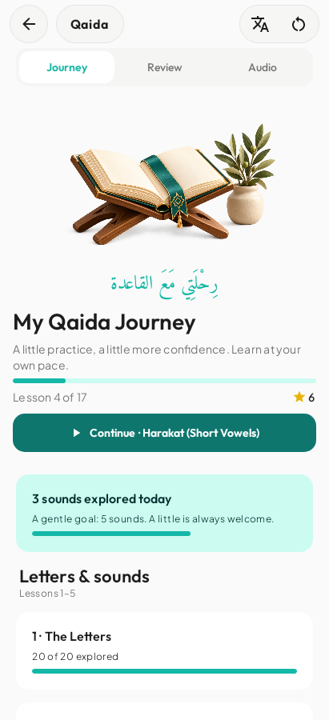
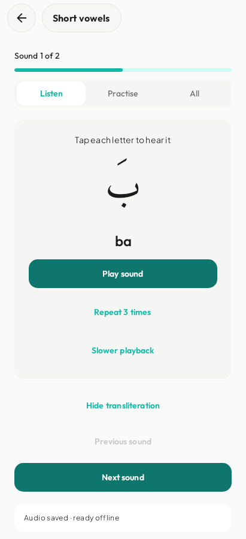
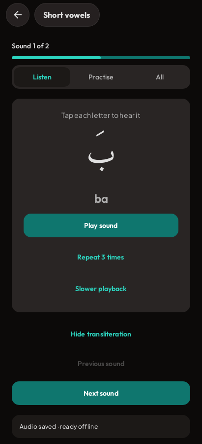
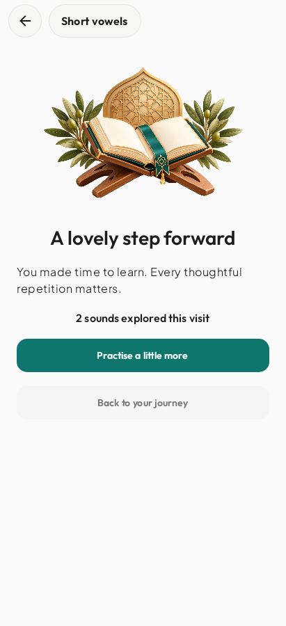

# Qaida screen previews

These are native Robolectric renders of the actual Compose screens at 411 × 900 dp,
using the Nimaz light/dark themes and sample progress. They are not image-generated mockups.
The recording-ready state is simulated for this preview; no recordings ship with this branch.

## Journey

## Focused learning

## Dark theme

## Completion

